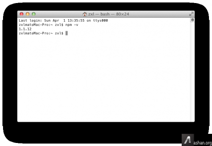

# Mac下安装Node.js

> 来源：http://ashan.org/post-288.html

一直以来都没有深入接触过服务器技术，毕竟前端开发是我都工作，最近了解到一些关于`Node.js`的知识。感觉这东西不错，于是开始尝试一下。下面来说说在Mac中安装`Node.js`的方法吧。

平常都是习惯使用windows的可视化操作，突然换了Mac终端，全部是命令，难免有些不习惯。这里只是简单介绍一下安装过程。

第一步，从`nodejs.org` 中下载`Node.js for Mac` 安装包，也就是一个6M多的pkg文件，下载之后点击安装即可。


安装完成之后我们关闭窗口，接下来我们打开“终端”，并且输入命令：

```shell
$ curl http://npmjs.org/install.sh | sh
```

或

```shell
$ curl https://npmjs.org/install.sh | sh
```

这个`npm.js`实际上是`Node.js`的套件管理工具，执行完成之后我们继续执行下面都命令：

```shell
$ sudo npm update npm -g
```

这一步是更新npm，全部完成之后我们使用打印版本命令来看一下npm是否安装成功，如果不行大家就多试几次。我的版本输出结果：



我当前版本为1.1.12

最后，还是为大家写一个helloword吧！复制下面代码到记事本。

```javascript
var http = require(http);
http.createServer(function (req, res) {
  res.writeHead(200, {Content-Type: text/plain});
  res.end(Hello World
hahah);
}).listen(1337, "127.0.0.1");
console.log(Server running at http://127.0.0.1:1337/);
```

然后在终端里面敲入命令 `node he.js` 这里都`he.js`是你javascript文件都路径回车就OK了！终端会显示如图：


在浏览器中输入网址与端口并访问，你就可以看到效果了！


