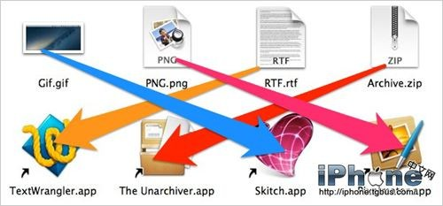
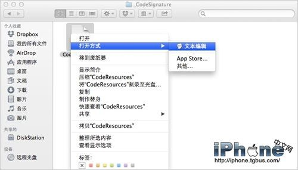
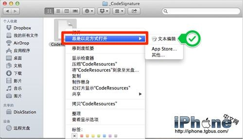
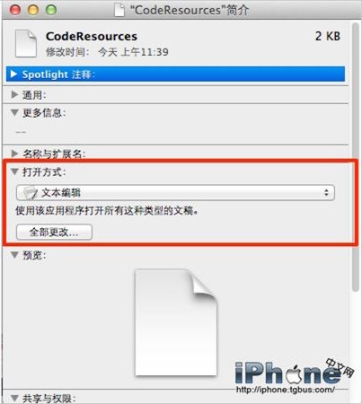

# OSX更改默认打开文件应用程序的两种方法

> 来源：http://apple.tgbus.com/tutorial/soft/201308/20130809114747.shtml

虽然 OSX 强大的系统内置应用可以解决大多数问题，但是有些时候我们确实还可以在 Mac App Store 里找到更好的解决方案，打开文件也不例外。比如我们可以选择使用Skitch（也就是印象笔记的圈点应用）来打开gif文件、可以用Pixelmator来打开png图片、可以用The Unarchiver来解压zip文件压缩包，还可以用TextWrangle来编辑rtf文件。

下面我们就来列举两种更改打开文件默认程序的方法：

1. 为单个文件设置默认打开时使用的程序，方法如下：

    - 在Finder里的文件上使用右键（或Control＋左键）点击后，按住Alt，这时修你会看到原来的打开方式会变成总是以此方式打开。

    

    - 不要松Alt，然后在右边选择你想要选择的默认程序就好了。

    

1. 为打开同一种文件类型设置默认应用。

    - 从Mac系统中选择一个想要更改文件类型。

    - 点击Conmmand+i来查看文件信息。

    - 点击打开方式并选择相应的程序然后按下全部更改（如果发现全部更新是灰的，说明你修改后的和之前的一样）并确认。

    
