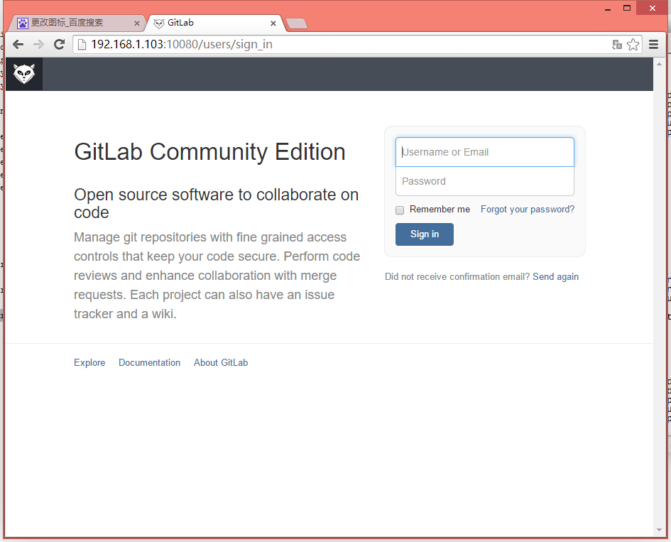
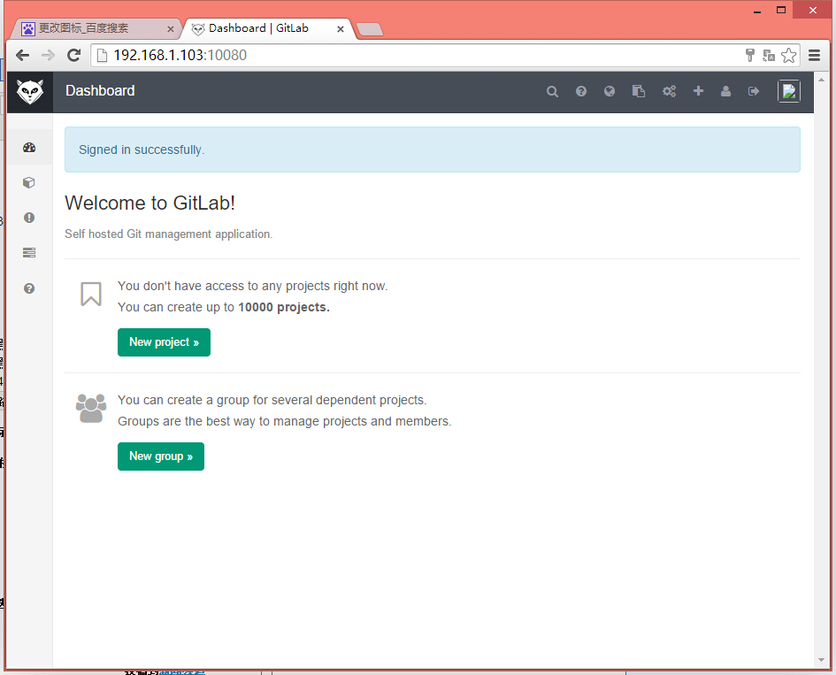

# 基于docker部署gitlab

> 来源：http://wiselyman.iteye.com/blog/2179651

## 1 部署redis

```shell
docker run --name=redis -d sameersbn/redis
```

## 2 部署postgresql

```shell
mkdir -p /opt/postgresql/data

docker run --name=postgresql -d -e 'DB_USER=gitlab' -e 'DB_PASS=password' -e 'DB_NAME=gitlabhq_production' -v /opt/postgresql/data:/var/lib/postgresql sameersbn/postgresql
```

## 3 部署gitlab

```shell
mkdir -p /opt/gitlab/data

docker run --name=gitlab -d -it  -e 'GITLAB_HOST=192.168.1.103:10080' --link redis:redisio --link postgresql:postgresql -v /opt/gitlab/data:/home/git/data -p 10022:22 -p 10080:80 sameersbn/gitlab
```

* 默认账号: root
* 默认密码: 5iveL!fe

## 4 效果



---


