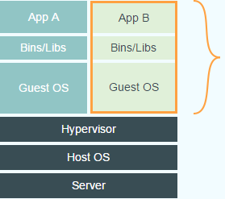
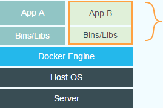
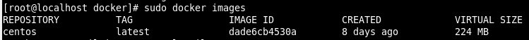

# Docker Architecture、Differences Between Virtual Machine(VM) And LXC Container Technology

> 来源：http://www.cnblogs.com/LittleHann/p/4083943.html

* 0.引言 - 为什么要有Docker技术
  * 0x1: 虚拟机技术和LXC容器技术的差别
  * 0x2: LXC容器技术的优势
  * 0x3: LXC容器技术的优势
* 1.Docker简介
  * 0x1: Docker的特性
  * 0x2: Docker和Virtual Machines(VM)的区别
    * 1.Virtual Machines
    * 2.Docker
  * 0x3: Docker技术的核心竞争优势
  * 0x4: Docker在线入门教程
* 2.Docker技术架构
  * 0x1: the open-source application container engine
  * 0x2: Docker的架构
  * 0x3: Docker源码学习
* 3.Docker部署技术
  * 0x1: Docker镜像
  * 0x2: Docker容器
  * 0x3: Docker仓库
  * 0x4: 成功使用案例
* 4.安装、部署、使用Docker
  * 0x1: Docker Installation Based On Red Hat (64 bit)
  * 0x2: Docker Installation Based On ubntu 12.04 (64 bit)
  * 0x3: Docker Installation Based On ubntu 13.04 (64 bit)
  * 0x4: Docker简单命令使用
  * 0x5: Hello word Docker使用
  * 0x6: JAVA Tomcat Running Environment Installation
* 5.Docker安全
  * 0x1: 内核名字空间(namespace)

---

## 0. 引言 - 为什么要有Docker技术

### 0x1: 虚拟机技术和LXC容器技术的差别

1. 虚拟机VM(Virtual Machine)技术

    每个虚拟机都有自己独享的内核, 能运行完整的不作修改的操作系统

1. 容器技术LXC(Linux Container)技术

    容器(container)是一种轻量级的虚拟化技术, 用于生成一个独立的标准运行环境而不需要多个内核实例，例如Docker就是一种典型的LXC容器技术的实现

### 0x2: LXC容器技术的优势

1. 快速部署(秒级)

    启动一个容器只需要派生一个进程并完成OS启动的用户态部分，而启动一个虚拟机需要执行额外的 BIOS 和内核代码

1. 容器几乎没有额外的 IO 性能开销

    如果没有完善的硬件虚拟化支持，虚拟机会引入显著的 IO 性能开销

1. 容器的内存开销较小:

    启动一个没有任何负载的容器仅需要几十 MB 的内存，而虚拟机由于包含完整的内核，内存开销要大得多。另外如果使用 Union FS 来构造容器的文件系统，能减少 page cache 带来的内存开销

1. 较小的磁盘空间占用:

    构造容器的文件系统时，静态文件可以使用 bind-mount 或者Union FS 方式从宿主机加载，可以节省大量磁盘空间

### 0x3: LXC容器技术的优势

1. 资源隔离效果逊于虚拟机

    对于虚拟机技术，由于有 Hypervisor 的存在，资源的隔离实现非常完整。而容器技术还处于开发阶段，资源隔离的效果要逊于虚拟机

1. 内核的修改会影响所有的容器

    虚拟机因为 Hypervisor 的存在，内核的更新只会影响一个应用

1. 缺少动态迁移的支持

    目前 OpenVZ 的 CRIU 项目提供了初步的 checkpointing 和 restore支持，但完整的动态迁移仍需时日。虚拟机的动态迁移方案相对比较完整

## 1. Docker简介

Docker基于Go语言开发，代码托管在 Github上，并遵循Apache 2.0开源协议

> Build, Ship and Run Any App, Anywhere

> Docker - An open platform for distributed applications for developers and sysadmins.

Docker项目的目标是实现轻量级的操作系统虚拟化解决方案。Docker的基础是Linux容器(LXC)等技术

在LXC的基础上Docker进行了进一步的封装，让用户不需要去关心容器的管理，使得操作更为简便。用户操作Docker的容器就像操作一个快速轻量级的虚拟机一样简单

### 0x1: Docker的特性

1. Build

    Develop an app using Docker containers with any language and any toolchain.

1. Ship

    Ship the "Dockerized" app and dependencies anywhere - to QA, teammates, or the cloud - without breaking anything.

1. Run

    Scale to 1000s of nodes, move between data centers and clouds, update with zero downtime and more.

### 0x2: Docker和Virtual Machines(VM)的区别

下面的图片比较了Docker和传统虚拟化方式的不同之处，可见容器是在操作系统层面上实现虚拟化，直接复用本地主机的操作系统，而传统方式则是在硬件层面实现

#### 1. Virtual Machines



Each virtualized application includes

1. the application: which may be only 10s of MB
1. the necessary binaries and libraries
1. an entire guest operating system - which may weigh 10s of GB

#### 2. Docker



The Docker Engine container

1. the application
1. its dependencies(Bins/Libs)

It runs as an isolated process in userspace on the host operating system, sharing the kernel with other containers. Thus, it enjoys the resource isolation and allocation benefits of VMs but is much more portable and efficient.


1. 一个Container通常包含应用及应用依赖项，Container用来隔离进程，这些进程主要运行在主机操作系统上的隔离区和用户空间。

    这个是明显不同于传统的VMs

1. 传统的硬件虚拟化(例如VMWare、KVM、Xen、EC2)旨在创造一个完整虚拟机。每个虚拟化应用不仅包含应用的二进制文件，还需运行该应用程序所需的库、一个完整的Guest操作系统

1. 由于所有的容器共享同一个操作系统(以及二进制文件和库)，所以，他们明显要比VM小的多，这样，就完全可以在一个物理主机上托管100个VMs(一般VM数量会受到严格限制)。此外，因为它们使用主机操作系统，重启一个VM并不意味着要重启操作系统，因此，容器更加轻便、高效

1. Docker中的容器效率会更高。因为一个传统的VM、应用、每个应用副本以及每个应用微小的变更都需要重新创建一个完整的VM

    一个新的应用在主机上仅仅包含应用及其二进制文件/库，这样就无需创建一个新的客户机操作系统。

1. 如果想在主机上运行该应用的几个副本，你甚至无需复制共享的二进制文件，即使你对应用进行了变更，你也无需拷贝变更内容

### 0x3: Docker技术的核心竞争优势

1. Docker简单来说就是一个Container的管理工具。而Container就是一个更轻量级的虚拟机，但是这个虚拟机没有操作系统和设备(操作系统是共享的)，container技术目前解决了软件行业的最大的几个问题

    1) 应用的共享

    2) 配置管理和维护(还有应用的隔离，效率等等)

    3) 不管是在物理机环境还是云环境和虚拟机相比，container不仅更轻量，而且配置简化了很多(不用考虑操作系统和设备的配置)

1. 写应用的人不用考虑操作系统的配置，应用都在container里面

1. Docker 容器几乎可以在任意的平台上运行，包括物理机、虚拟机、公有云、私有云、个人电脑、服务器等。 这种兼容性可以让用户把一个应用程序从一个平台直接迁移到另外一个。

1. Docker容器的运行不需要额外的hypervisor支持，它是内核级的虚拟化，因此可以实现更高的性能和效率。事实上，Linux的内核已经在很多方面(例如命名空间)对虚拟化进行了支持

Relevant Link:

```url
http://blog.csdn.net/u012601664/article/details/39547319
http://special.csdncms.csdn.net/BeDocker/
http://www.csdn.net/article/2014-02-01/2818306-Docker-Story
http://www.csdn.net/article/2014-06-20/2820325-cloud-Docker
http://www.csdn.net/article/2014-07-02/2820497-what's-docker
http://dockerpool.com/static/books/docker_practice/introduction/why.html
```

### 0x4: Docker在线入门教程

```url
https://www.docker.com/tryit
```

## 2. Docker技术架构

### 0x1: the open-source application container engine

```url
https://github.com/docker/docker
```

### 0x2: Docker的架构


Docker架构下的三种运行方式

1. 作为守护进程，在Linux主机上管理LXC容器

    1) 使用namespaces来做权限的控制和隔离

    2) 使用cgroups来进行资源的配置

    3) 通过aufs来提高文件系统的资源利用率

    aufs是UnionFS的一种，它可以把对文件系统的改动当成一次commit一层层的叠加。这样的话多个容器之间就可以共享他们的文件系统层次。这样的话极大的节省了对存储的需求，并且也能加速容器的启动

1. 作为一个CLI，与守护进程的REST API进行对话(docker run ...)

1. 作为仓库的客户端，分享你所构建的内容(docker pull, docker commit)

### 0x3: Docker源码学习

```url
http://www.infoq.com/cn/articles/docker-source-code-analysis-part1
http://www.infoq.com/cn/articles/docker-source-code-analysis-part2
http://www.infoq.com/cn/articles/docker-source-code-analysis-part3
```

Relevant Link:

```url
http://www.csdn.net/article/2014-06-20/2820325-cloud-Docker
http://www.infoq.com/cn/dockers/
http://yeasy.gitbooks.io/docker_practice/
https://docker.cn/p/
http://www.csdn.net/article/a/2014-06-18/15819053
```

## 3. Docker部署技术

### 0x1: Docker镜像

1. Docker镜像就是一个只读的模板

1. 一个镜像可以包含一个完整的ubuntu操作系统环境，里面仅安装了Apache或用户需要的其它应用程序

1. 镜像可以用来创建Docker容器

1. Docker提供了一个很简单的机制来创建镜像或者更新现有的镜像，用户甚至可以直接从其他人那里下载一个已经做好的镜像来直接使用

镜像的实现原理

Docker镜像是怎么实现增量的修改和维护的呢？每个镜像都由很多层次构成，Docker使用Union FS将这些不同的"层"结合到一个镜像中去 ，通常Union FS有两个用途

1. 一方面可以实现不借助LVM、RAID将多个disk挂到同一个目录下

1. 另一个更常用的就是将一个只读的分支和一个可写的分支联合在一起，Live CD 正是基于此方法可以允许在镜像不变的基础上允许用户在其上进行一些写操作。Docker在AUFS上构建的容器也是利用了类似的原理

### 0x2: Docker容器

1. Docker 利用容器来运行应用

1. 容器是从镜像创建的"运行实例"。它可以被启动、开始、停止、删除。每个容器都是相互隔离的(isolation)、保证安全的平台

1. 可以把容器看做是一个简易版的Linux环境(包括root用户权限、进程空间、用户空间和网络空间等)和运行在其中的应用程序

1. 镜像是只读的，容器在启动的时候创建一层可写层作为最上层

### 0x3: Docker仓库

1. 仓库是集中存放镜像文件的场所。有时候会把"仓库"和"仓库注册服务器"(Registry)混为一谈，并不严格区分。实际上，仓库注册服务器上往往存放着多个仓库，每个仓库中又包含了多个镜像，每个镜像有不同的标签(tag)

1. 仓库分为

    1) 公开仓库(Public): 最大的公开仓库是Docker Hub，存放了数量庞大的镜像供用户下载。国内的公开仓库包括Docker Pool等，可以提供大陆用户更稳定快速的访问

    2) 私有仓库(Private): 用户也可以在本地网络内创建一个私有仓库
当用户创建了自己的镜像之后就可以使用push命令将它上传到公有或者私有仓库，这样下次在另外一台机器上使用这个镜像时候，只需要从仓库上pull下来就可以了

1. Docker仓库的概念跟Git类似，"仓库注册服务器"可以理解为GitHub这样的托管服务

### 0x4: 成功使用案例

1. Gilt: Distributed applications to scale

    Gilt Groupe, Inc., a leading online shopping company, operates an online flash sale site for men, women, girls, boys, and unisex in the United States.

1. Yelp: Continuous Integration

    Yelp (NYSE: YELP) connects people with great local businesses. Yelp had a monthly average of 120 million unique visitors in Q4 2013

1. Spotify: Continuous Delivery

    Spotify streams music to more than 40 million users in 57 countries around the world.

1. Baidu: Platform-as-a-Service (PaaS)

    Baidu, Inc. is the number one Chinese-language Internet search provider that has a broad portfolio of products including social-networking products, music products, mobile related products and other products and services.

1. New Relic: Distributed Applications Composition

    New Relic is a Software Analytics company that makes sense of billions of metrics across millions of apps.

1. Rackspace: Continuous Integration

    Rackspace's email service (MailGun) that allows you to send, receive and track emails effortlessly. Mailgun has made significant investments in building a Docker-centric continuous integration system for this service where high-availability is a requirement.

1. Yandex: Platform-as-a-Service (PaaS)

    Yandex is an European Internet company and the largest search provider in Russia.
Yandex’s Platform-as-a-Service (PaaS) is using Docker for infrastructure virtualization and application isolation.

1. Cambridge: Continuous Delivery

    Cambridge Healthcare provides online access to health records and analytics for both patients and clinicians. They replaced several AWS AMIs with a single bare metal host running Docker to speed up their Jenkins-based continuous delivery pipeline.

1. eBay: Easy Application Deployment

    eBay Now is eBay's local, same day delivery service. In this use case, Senior Architect Ted Dziuba discusses his use of Docker in a continuous integration process. He uses Docker to implement an efficient, automated path from the developer's laptop through test and QA.

Relevant Link:

```url
https://www.docker.com/resources/usecases/
https://www.docker.com/
```

## 4. 安装、部署、使用Docker

### 0x1: Docker Installation Based On Red Hat (64 bit)

```url
https://docs.docker.com/installation/rhel/
https://fedoraproject.org/wiki/EPEL#How_can_I_use_these_extra_packages.3F
https://code.csdn.net/u010702509/docker_redhat
```

对于CentOS6，可以使用EPEL库安装Docker，命令如下

```shell
# 1. 安装Docker支持
$ sudo yum install http://mirrors.yun-idc.com/epel/6/i386/epel-release-6-8.noarch.rpm
$ sudo yum install docker-io
# 2. 登录Docker镜像仓库
$ docker login
# 3. 下载最新镜像
$ sudo docker pull centos:latest
```

### 0x2: Docker Installation Based On ubntu 12.04 (64 bit)

* 安装、升级内核

```shell
# Docker的运行需要Linux内核提供相应的支持
$ sudo apt-get update
$ sudo apt-get install linux-image-generic-lts-raring linux-headers-generic-lts-raring
$ sudo reboot
```

* 第一次添加Docker的repository到你的本地秘钥库

```shell
$ sudo apt-key adv --keyserver keyserver.ubuntu.com --recv-keys 36A1D7869245C8950F966E92D8576A8BA88D21E9
$ sudo apt-get update
$ sudo apt-get install lxc-docker
# 期间会遇到一个警告，说这个包不可靠，你只需要回复yes然后继续安装就可以了
```

* 官方也提供了一个简单脚本帮助你安装，你可以用curl来获取这个脚本然后执行安装

```shell
$ curl -s https://get.docker.io/ubuntu/ | sudo sh
```

* 下载安装ubuntu的镜像封装到一个沙箱中

```shell
$ sudo docker run -i -t ubuntu /bin/bash
```

### 0x3: Docker Installation Based On ubntu 13.04 (64 bit)

* 确认是否安装了AUFS

```shell
$ sudo apt-get update
$ sudo apt-get install linux-image-extra-`uname -r`
```

* 之后的步骤同ubntu 12.04 (64 bit)

Relevant Link:

```url
https://code.csdn.net/u010702509/docker_ubntu
```

### 0x4: Docker简单命令使用

关于Docker的使用，最好的方法还是去官方提供的在线模拟运行网站，看再多的理论都不如亲自动手搭建部署实践

```url
https://www.docker.com/tryit
```

Relevant Link:

```url
https://code.csdn.net/u010702509/docker_puppet
https://code.csdn.net/u010702509/docker_shareimage
https://code.csdn.net/u010702509/docker_buildimage
https://code.csdn.net/u010702509/docker_basic
https://code.csdn.net/u010702509/docker/file/Docker.md
```

### 0x5: Hello word Docker使用

使用docker images显示本地已有的镜像

```shell
$ sudo docker images
```



启动容器有以下几种方式

* 基于镜像新建一个容器并启动

1) 输出一个"Hello World"，之后终止容器

```shell
$ sudo docker run centos:latest /bin/echo 'Hello world'
```

2) 启动一个 bash 终端，允许用户进行交互，用户可以通过所创建的终端来输入命令

```shell
$ sudo docker run -t -i centos:latest /bin/bash
# -t 选项让Docker分配一个伪终端(pseudo-tty)并绑定到容器的标准输入上， -i 则让容器的标准输入保持打开
```

* 将在终止状态(stopped)的容器重新启动

可以利用docker start -a containerID命令，直接将一个已经终止的容器启动运行，容器的核心为所执行的应用程序，所需要的资源都是应用程序运行所必需的。除此之外，并没有其它的资源

* 让Docker容器在后台以守护态(Daemonized)形式运行

```shell
$ sudo docker run -d centos:latest /bin/sh -c "while true; do echo hello world; sleep 1; done"
0e5719fb43aecf87f27d18089aac5034532d08a764ee5bce794192ca5b134404
```

容器启动后会返回一个唯一的id，也可以通过`docker ps`命令来查看容器信息要获取容器的输出信息，可以通过`docker logs`命令

```shell
$ docker logs 0e5719fb43ae
```

终止一个容器有2种方法

1. 使用`docker stop`来终止一个运行中的容器
1. 当Docker容器中指定的应用终结时，容器也自动终止

终止状态的容器可以用`docker ps -a`命令看到，处于终止状态的容器，可以通过`docker start`命令来重新启动

在使用 `-d` 参数时，容器启动后会进入后台。 某些时候需要进入容器进行操作

```shell
$ docker ps
CONTAINER ID        IMAGE               COMMAND                CREATED             STATUS                      PORTS               NAMES
0e5719fb43ae        centos:latest       "/bin/sh -c 'while t"   6 minutes ago       Up 6 minutes                                    loving_wright
$ docker attach loving_wright
# 可以使用docker kill loving_wright来杀死后台运行中的容器
```

可以使用`docker rm`来删除一个处于终止状态的容器

```shell
$ docker ps
CONTAINER ID        IMAGE               COMMAND                CREATED             STATUS                      PORTS               NAMES
0e5719fb43ae        centos:latest       "/bin/sh -c 'while t"   6 minutes ago       Exited (-1) 2 seconds ago                                    loving_wright
$ docker rm  loving_wright
# 要注意的是，只有处于停止状态的容器才能删除
```

当利用docker run来创建容器时，Docker在后台运行的标准操作包括

1. 检查本地是否存在指定的镜像，不存在就从公有仓库下载
1. 利用镜像创建并启动一个容器
1. 分配一个文件系统，并在只读的镜像层外面挂载一层可读写层
1. 从宿主主机配置的网桥接口中桥接一个虚拟接口到容器中去
1. 从地址池配置一个ip地址给容器
1. 执行用户指定的应用程序
1. 执行完毕后容器被终止

我们在使用Docker的使用，离程序员最近的就是Image，也就是一个个封装好的应用环境

* 所有的实例你都需要在你的机器中运行docker进程，后台运行docker进程，简单演示

```shell
$ sudo docker -d &
```

* 现在你可以运行Docker客户端，默认情况下所有的命令都会经过一个受保护的Unix socket转发给docker进程,所以我们必须运行root或者通过sudo授权

```shell
$ sudo docker help
```

* 下载ubuntu base镜像

```shell
# Download an ubuntu image
$ sudo docker pull ubuntu
```

* 执行一个进程

```shell
$ CONTAINER_ID=$(sudo docker run -d ubuntu /bin/sh -c "while true; do echo hello world; sleep 1; done")
$ sudo docker logs $CONTAINER_ID
```

* 查看日志文件来确认它是否正常工作

```shell
$ sudo docker attach -sig-proxy=false $CONTAINER_ID
```

* 连接到容器实时查看结果

```shell
$ sudo docker ps
```

* 查看正在运行的进程

```shell
$ sudo docker stop $CONTAINER_ID
```

* 当我们不需要时停止容器

```shell
$ sudo docker ps
```

Relevant Link:

```url
https://code.csdn.net/u010702509/docker_helloword
```

### 0x6: JAVA Tomcat Running Environment Installation

```url
http://blog.csdn.net/junjun16818/article/details/34845613#comments
```

## 5. Docker安全

评估Docker的安全性时，主要考虑三个方面

1. 由内核的"名字空间(namespace)"和"控制组机制"提供的容器内在安全
1. Docker程序(特别是服务端)本身的抗攻击性
1. 内核安全性的加强机制对容器安全性的影响

### 0x1: 内核名字空间(namespace)

Docker容器和LXC容器很相似，所提供的安全特性也是类似的。当用docker run启动一个容器时，在后台Docker为容器创建了一个独立的名字空间和控制组集合

1. 名字空间提供了最基础也是最直接的隔离，在容器中运行的进程不会被运行在主机上的进程和其它容器发现和作用

    1) 父命名空间的进程"不能"被子命名空间看到

    2) 子命名空间的进程"可以"被父命名空间看到

    3) 同级之间的命名空间之间的进程"不可见"

1. 每个容器都有自己独有的网络栈，意味着它们不能访问其他容器的sockets或接口。但是，如果主机系统上做了相应的设置，容器可以像跟主机交互一样的和其他容器交互。当指定公共端口或使用links来连接2个容器时，容器就可以相互通信了(可以根据配置来限制通信的策略)

    从网络架构的角度来看，所有的容器通过本地主机的网桥接口相互通信，就像物理机器通过物理交换机通信一样

    Docker的名字空间是基于Linux内核的命名空间架构实现的，关于Linux内核命名空间的相关知识，请参阅另一篇文章

```url
http://www.cnblogs.com/LittleHann/p/4026781.html
搜索：2. Linux命名空间
```
