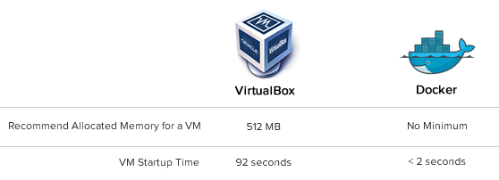
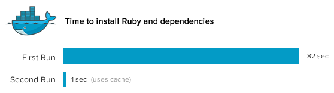
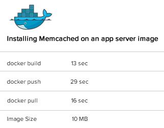

# Docker —— Git 部署

> 来源：http://www.oschina.net/translate/docker-git-for-deployment

> 英文原文：Docker: Git for deployment(http://blog.scoutapp.com/articles/2013/08/28/docker-git-for-deployment)

我一直听说Docker是个很棒的新事物，但是我一直提不起兴趣，直到我遇到一个切实的问题： 如果通过Docker来部署 Scout ，这么做会轻松一些吗？

下面我将分三部分来阐述。

## 哇哦, 有效的模拟生产环境的方法



真实生产环境中有16台服务器。如果我尝试用虚拟机去模拟的话，每个VirtualBox实例最好能有512MB内存。这样的内存需求是我笔记本内存的两倍大。此外VirtualBox还有许多限制，比如使用单独的系统内核和文件系统。但是这些限制对于Docker都不算个事，Docker的containers是共享一个宿主机器的系统的，甚至可能是同一个程序和库。一台Docker宿主机器上运行数百个containers也不是什么问题。

### 老办法

我实在没办法在本地模拟一个完全真实的环境，但是我们只要看一下启动一台虚拟机使用的时间：

```shell
$ time vagrant up
Bringing machine 'default' up with 'virtualbox' provider...
[default] Importing base box 'squeeze64-ruby193'...
...
[default] Booting VM...
[default] Waiting for VM to boot. This can take a few minutes.
...

real  1m32.052s
```

启动一个镜像超过了一分半钟。那我要简单修改下配置怎么办啊？那我要验证下可行性呢，那是不是又得重启？又是一分半钟了啊。

这分明就是个残酷的惩罚嘛。

### 使用Docker

Docker到底有多么轻量级? 当你在Docker container中运行个进程时，你甚至都可能忘记这个进程竟然不是直接运行在主机上的。在下面的例子中，我运行一个叫“rails”的镜像在Docker container中，那里是个Rails App (Dockerfile):

```shell
root@precise64:~# docker run rails
2013-08-26 20:21:14,600 CRIT Supervisor running as root (no user in config file)
2013-08-26 20:21:14,603 WARN Included extra file "/srv/docker-rails/Supervisorfile" during parsing
2013-08-26 20:21:14,736 INFO RPC interface 'supervisor' initialized
2013-08-26 20:21:14,740 CRIT Server 'unix_http_server' running without any HTTP authentication checking
2013-08-26 20:21:14,754 INFO supervisord started with pid 1
2013-08-26 20:21:15,783 INFO spawned: 'rails' with pid 10
2013-08-26 20:21:16,841 INFO success: rails entered RUNNING state, process has stayed up for > than 1 seconds (startsecs)
```

开始container和启动supervisor (这是负责开始Rails app的)一个只用了2秒

简而言之，Docker绝对胜任在你的开发电脑上虚拟出一个完整的生产环境，而且很快。既然这么简单，来，开动起来吧：我要彻底测试一下

## 构建镜像如此方便快捷 - 缓存万岁！



### 老方法

如果你想把从空镜像到一个功能镜像的构建过程脚本化（例如：在Ubuntu上怎么安装一个Rails stack），要是你不是经常干这事，那么正确获得所有的流，这绝对会是个痛苦的活儿。看看为Ruby安装依赖吧:

```shell
$ time apt-get install -y -q ruby1.9.1 ruby1.9.1-dev rubygems1.9.1 irb1.9.1 build-essential libopenssl-ruby1.9.1 libssl-dev zlib1g-dev
Reading package lists...
Building dependency tree...
The following extra packages will be installed:
....
Setting up libalgorithm-merge-perl (0.08-2) ...
Processing triggers for libc-bin ...
ldconfig deferred processing now taking place

real 1m22.470s
```

然后，你想装了NodeJS的依赖，但是忘了给apt添加源了：

```shell
$ apt-get install -y nodejs
...
E: Unable to locate package nodejs
```

解决了源的问题后，你得确认你的脚本在新镜像中会不会有问题。那么你需要重装Ruby，好吧，又要浪费82秒了。正是神烦。

### 使用Docker

在Docker中，是把构建镜像的步骤放到Dockerfile. Dockerfiles是非常容易阅读的，因为你根本不需要学习DSL - 这就是些你输入时记录下来的基本命令。第一次安装Ruby会有点麻烦，但是让我们看看，通过Dockerfile来构建余下的镜像会发生什么:

```dockerfile
FROM ubuntu:12.04
RUN apt-get update

## MYSQL
RUN apt-get install -y -q mysql-client libmysqlclient-dev

## RUBY
RUN apt-get install -y -q ruby1.9.1 ruby1.9.1-dev rubygems1.9.1 irb1.9.1 build-essential libopenssl-ruby1.9.1 libssl-dev zlib1g-dev
```

```shell
root@precise64:/# time docker build -t="dlite/appserver" .
Uploading context 92160 bytes
Step 1 : FROM ubuntu:12.04
 ---> 8dbd9e392a96
Step 2 : RUN apt-get update
 ---> Using cache
 ---> b55e9ee7b959
Step 3 : RUN apt-get install -y -q mysql-client libmysqlclient-dev
 ---> Using cache
 ---> dc92be6158b0
Step 4 : RUN apt-get install -y -q ruby1.9.1 ruby1.9.1-dev rubygems1.9.1 irb1.9.1 build-essential libopenssl-ruby1.9.1 libssl-dev zlib1g-dev
 ---> Using cache
 ---> 7038022227c0
Successfully built 7038022227c0

real    0m0.848s
```

哇哦 - 太不可思议了，怎么可能不到一秒钟就安装好了啊？看到这些缓存的keys(ex:dc92be6158b0)了吗? 其实根本没有重新逐条执行`Dockerfile`中命令, Docker认为这些命令已经执行过了，就不再执行，只是从缓存区中得到文件系统上的变化，通过这些变化可以组合出完整的文件系统。Docker之所以能可以这样神奇，关键在于AuFS file system，这是一个联合文件系统（类似于记录变化，然后通过变化来组合出原貌）。

总而言之， Docker可以轻松地反复构建镜像，而且之后的构建过程，你几乎无需等待。人无完人，我时常犯错，但是Docker却从不惩罚我的过失。

## 部署镜像, 别更新基础环境

### 老办法

像许多其他部署一样，Scout也使用长期运行的虚拟机。我们通过Puppet来更新基础环境，但是, 这经常比我们想象得要痛苦：

* 如果我们要更新stack, Puppet将运行虚拟机然后更新。这将花费很长时间-即使只是一小部分的stack需要更新，但是Puppet仍然会检查全部。
* 部署过程中也可能有问题。如果我们正在安装Memcached，突然网络中断了一小下，那么apt-get install memcached的指令可能就会无效了。
* 回滚主要变化，这也时常不是想象中那么顺利(像更新Ruby版本).

这些都是Puppet's的毛病 - 像Puppet或者Chef这样的工具是非常重要，特别当你有着一些长时间运行的虚拟机，这些虚拟机可能随着时间的推移出现不一致的情况，那么这些工具就更重要了。

### 使用Docker

部署镜像 - 不用修改存在的虚拟机。你可以100%确保，本地运行什么，相应的生产环境就会运行什么。

但是镜像很大，对吗？不要整个Docker-记住containers不是运行在自己的操作系统上的，还有我们使用的是联合文件系统。当我们对于镜像做出改变时，我们只需要在上面添加新的层。

例如，我们安装Memcached在app服务器上。我们构建了一个新的镜像。我会标注asdlite/appserver-memcached，dliteis是我的index.docker.io用户名，这是基于dite/appserver镜像的。

```shell
root@precise64:/# time docker build -t="dlite/appserver-memcached" .
Uploading context 92160 bytes
Step 1 : FROM appserver
 ---> 8dbd9e392a96
Step 2 : RUN apt-get update
 ---> Using cache
 ---> b55e9ee7b959
Step 3 : RUN apt-get install -y -q memcached
 ---> Running in 2a2a689daee3
Reading package lists...
Building dependency tree...
...
Starting memcached: memcached.
Processing triggers for libc-bin ...
ldconfig deferred processing now taking place
 ---> 2a2a689daee3
Successfully built 2a2a689daee3

real    0m13.289s
user    0m0.132s
sys 0m0.376s
```

只要13秒就能安装好Memcached，这是因为之前的Dockerfile被缓存了，我爱这种速度的感觉。

我会上传和提交这些:

```shell
root@precise64:/# time docker push dlite/appserver-memcached
The push refers to a repository [dlite/appserver-memcached] (len: 1)
Processing checksums
Sending image list
Pushing repository dlite/appserver-memcached (1 tags)
Pushing 8dbd9e392a964056420e5d58ca5cc376ef18e2de93b5cc90e868a1bbc8318c1c
Image 8dbd9e392a964056420e5d58ca5cc376ef18e2de93b5cc90e868a1bbc8318c1c already pushed, skipping
...
Pushing tags for rev [ad8f8a3809afcf0e2cff1af93a8c29275a847609b05b20f7b6d2a5cbd32ff0d8] on {https://registry-1.docker.io/v1/repositories/dlite/appserver-memcached/tags/latest}

real    0m28.710s
```

在生产环境中的机器上，我把镜像下载下来:

```shell
root@prod:/# time docker pull dlite/appserver-memcached
Pulling repository dlite/appserver-memcached
Pulling image ad8f8a3809afcf0e2cff1af93a8c29275a847609b05b20f7b6d2a5cbd32ff0d8 (latest) from dlite/appserver-memcached

real    0m15.749s
```

只用了15秒就获得了dlite/appserver-memachedimage。注意那个镜像只有10MB大小，使用app服务器镜像作为基础镜像:

```shell
root@precise64:~# docker images
REPOSITORY            TAG                 ID                  CREATED             SIZE
appserver             latest              7038022227c0        3 days ago          78.66 MB (virtual 427.9 MB)
appserver-memcached   latest              77dc850dcccc        16 minutes ago      10.19 MB (virtual 438.1 MB)
```

我们没有必要将整个Memcached镜像都下载下来, 只要将Memcached镜像中的改变添加到dlite/appserver镜像中。

绝大多数时间，我们做出的改变会小得多。所以下载一个新镜像会更快。

这些会有很大的作用:

* 开始新的Docker containers是非常快的
* 上传+下载新的Docker镜像要轻量级的
* 并非要改变现在运行的虚拟机，我们只是开始新的containers，停止旧的containers.



的确震惊! 这意味着我不需要担心一致性问题 - 我们不会修改运行的虚拟机，只是开始新的containers。这意味着可以轻松回滚！Memcached失败了？停止运行dlite/appserver-memcached的container，开始一个新container运行dlite/appserver镜像。

## 不足之处

在短暂的containers上工作，这会导致一系列新问题- 分布式配置 / 协调和服务发现:

* 当一个新的app服务器containers开始后，我们改如何更新HAProxy配置?
* 当一个新的数据库container开始后，app服务器应该如何与数据container来通信?
* 如何跨越Docker宿主机器通信?

即将发布的Flynn.io，那会使用etcd，将会有帮助。但是，在小规模部署的时候没必要担心这些。

## 总结一下: Docker来部署 Git来开发

当开发应用的时候，开发者可以利用Git的性能和灵活性。Git鼓励尝试，不会因为你出错而惩罚你：在一个分支开始试验，如果失败了，只要git rebase或者git reset回复一下。开始一个分支非常简单，上传也很快速。

Docker鼓励对于操作的试验。Containers的启动非常快速。 构建镜像简简单单，使用另一个镜像作为基础镜像也非常容易。部署整个镜像非常快速。最后，回滚轻轻松松。

快速+灵活= 部署即将成为令人愉快的事。
