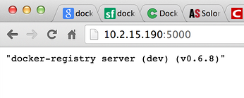

# Docker 使用教程

## 目录

* Docker 1 -- 开始
* Docker 2 -- 关于Dockerfile
* Docker 3 -- 自建Docker Registry
* Docker 4 -- 总结

---

# Docker 1 -- 开始

> 来源：http://blog.tankywoo.com/docker/2014/05/08/docker-1-start.html

## 目录

* 几个概念:
	* IAAS (Infrastructure As A Service) :
	* PAAS (Platform As A Service) :
	* SAAS (Software As A Service) :
	* LXC -- LinuX Container
	* Docker的常见使用场景
	* Interactive commandline tutorial

* Getting Started
	* 查看docker 版本:
	* Searching for images
	* Downloading container images
	* Hello world from a container
	* Installing things in the container
	* Save your changes
	* Run your new image
	* Check your running image
	* Push your image to the index

* 安装
	* 查看本地的镜像:
	* 查看相关的信息:

---

                        ##        .
                  ## ## ##       ==
               ## ## ## ##      ===
           /""""""""""""""""\___/ ===
      ~~~ {~~ ~~~~ ~~~ ~~~~ ~~ ~ /  ===- ~~~
           \______ o          __/
             \    \        __/
              \____\______/

              |          |
           __ |  __   __ | _  __   _
          /  \| /  \ /   |/  / _\ |
          \__/| \__/ \__ |\_ \__  |

## 几个概念

### IAAS (Infrastructure As A Service)

>The base layer Deals with Virtual Machines, Storage (Hard Disks), Servers, Network, Load Balancers etc

### PAAS (Platform As A Service)

>A layer on top of IAAS Runtimes (like java runtimes), Databases (like mySql, Oracle), Web Servers (tomcat etc)

### SAAS (Software As A Service)

>A layer on top on PAAS Applications like email (Gmail, Yahoo mail etc), Social Networking sites (Facebook etc)

正好在微博上看到 @老刀IBM 分享的一个三者关系图：


### LXC -- LinuX Container

借用网上的解释:

>Docker 提供了一个可以运行你的应用程序的封套(envelope)，或者说容器。它原本是 dotCloud 启动的一个业余项目，并在前些时候开源了。它吸引了大量的关注和讨论，导致 dotCloud 把它重命名到 Docker Inc。它最初是用 Go 语言编写的，它就相当于是加在 LXC（LinuX Containers，linux 容器）上的管道，允许开发者在更高层次的概念上工作。

>Docker 扩展了 Linux 容器（Linux Containers），或着说 LXC，通过一个高层次的 API 为进程单独提供了一个轻量级的虚拟环境。Docker 利用了 LXC， cgroups 和 Linux 自己的内核。和传统的虚拟机不同的是，一个 Docker 容器并不包含一个单独的操作系统，而是基于已有的基础设施中操作系统提供的功能来运行的。这里有一个 Stackoverflow 的答案，里面非常详细清晰地描述了所有 Docker 不同于纯粹的 LXC 的功能特性

>Docker 会像一个可移植的容器引擎那样工作。它把应用程序及所有程序的依赖环境打包到一个虚拟容器中，这个虚拟容器可以运行在任何一种 Linux 服务器上。这大大地提高了程序运行的灵活性和可移植性，无论需不需要许可、是在公共云还是私密云、是不是裸机环境等等。

更多关于Docker，看看官方的Learn More(https://www.docker.io/learn_more/)

### Docker的常见使用场景

* Automating the packaging and deployment of applications
* Creation of lightweight, private PAAS environments
* Automated testing and continuous integration/deployment
* Deploying and scaling web apps, databases and backend services

>Please note Docker is currently under heavy development. It should not be used in production (yet).

如上提到，Docker还在开发中，暂时还不应该用于线上产品中。

### Interactive commandline tutorial

使用Interactive commandline tutorial(https://www.docker.io/gettingstarted/#)入门，点击Start进入交互式命令行教程，直接在线交互，不需要本地安装Docker。

这个教程非常好，一定要在线使用一遍。且Docker的官方源在国内偶尔被墙，折腾起来很麻烦，所以在线学习就没这些麻烦的事情了。

## Getting Started

Docker包含两个程序，一个服务端，一个客户端，服务端用来管理所有容器，客户端用来控制服务端守护进程。在大部分系统，服务端和守护端都运行在同一台机器上。

### 查看docker 版本

```shell
you@tutorial:~$ docker version
Docker Emulator version 0.1.3

Emulating:
Client version: 0.5.3
Server version: 0.5.3
Go version: go1.1
```

线上的显示比较简单，且版本较老(0.5.3)，本地(Ubuntu12.04)下安装的，版本较新(0.10.0)。可以看到这里有 Client version 和 Server version。

```shell
root@tankywoo-docker:~# docker version
Client version: 0.10.0
Client API version: 1.10
Go version (client): go1.2.1
Git commit (client): dc9c28f
Server version: 0.10.0
Server API version: 1.10
Git commit (server): dc9c28f
Go version (server): go1.2.1

Last stable version: 0.10.0
```

思考下这里为何会显示 Git commit 和 Go version ?

这里的Git commit是0.10.0这个release的commit id: docker releases

因为docker是Go写的，这里应该是开发Docker使用的Go版本 **TODO**

### Searching for images

最简单的方式就是通过其它地方获取容器镜像(container image)来使用。Docker index 是一个存放镜像的地方，可以在 https://index.docker.io 上看到已经有的镜像，且可以通过命令行来获取。

这里搜索一个叫 tutorial的镜像:

```shell
you@tutorial:~$ docker search tutorial
Found 1 results matching your query ("tutorial")
NAME                      DESCRIPTION
learn/tutorial            An image for the interactive tutorial
```

再比如本地搜索 ubuntu 镜像:

```shell
you@tutorial:~$ docker search ubuntu
Found 22 results matching your query ("ubuntu")
NAME                DESCRIPTION
shykes/ubuntu
base                Another general use Ubuntu base image. Tag...
ubuntu              General use Ubuntu base image. Tags availa...
boxcar/raring       Ubuntu Raring 13.04 suitable for testing v...
dhrp/ubuntu
creack/ubuntu       Tags:
12.04-ssh,
12.10-ssh,
12.10-ssh-l...
crohr/ubuntu              Ubuntu base images. Only lucid (10.04) for...
knewton/ubuntu
pallet/ubuntu2
erikh/ubuntu
samalba/wget              Test container inherited from ubuntu with ...
creack/ubuntu-12-10-ssh
knewton/ubuntu-12.04
tithonium/rvm-ubuntu      The base 'ubuntu' image, with rvm installe...
dekz/build                13.04 ubuntu with build
ooyala/test-ubuntu
ooyala/test-my-ubuntu
ooyala/test-ubuntu2
ooyala/test-ubuntu3
ooyala/test-ubuntu4
ooyala/test-ubuntu5
surma/go                  Simple augmentation of the standard Ubuntu...
```

### Downloading container images

容器镜像可以通过docker pull命令来下载，来自docker index的镜像，可以通过指定 `<username>/<repository>` 的方式来下载镜像。如果是官方信任的镜像，例如ubuntu，可以不用指定username，直接指定仓库名下载。

可以看出来，docker的方式和git非常像。

```shell
you@tutorial:~$ docker pull learn/tutorial
Pulling repository learn/tutorial from https://index.docker.io/v1
Pulling image 8dbd9e392a964056420e5d58ca5cc376ef18e2de93b5cc90e868a1bbc8318c1c (precise) from ubuntu
Pulling image b750fe79269d2ec9a3c593ef05b4332b1d1a02a62b4accb2c21d589ff2f5f2dc (12.10) from ubuntu
Pulling image 27cf784147099545 () from tutorial
```

### Hello world from a container

>You can think about containers as a process in a box. The box contains everything the process might need, so it has the filesystem, system libraries, shell and such, but by default none of it is started or run. You 'start' a container by running a process in it. This process is the only process run, so when it completes the container is fully stopped.

使用docker run来在容器中执行命令，它最少有两个参数，一个是容器名，一个是要执行的操作。

```shell
you@tutorial:~$ docker run learn/tutorial echo 'hello world'
'hello world'
```

### Installing things in the container

下面来测试安装ping工具。

因为这里是非交互模式 指定命令，所以要带上参数-y表示确认(yes)，否则会在等待accept (y/n) 时就退出了。

```shell
you@tutorial:~$ docker run learn/tutorial apt-get install -y ping
Reading package lists...
Building dependency tree...
The following NEW packages will be installed:
  iputils-ping
0 upgraded, 1 newly installed, 0 to remove and 0 not upgraded.
Need to get 56.1 kB of archives.
After this operation, 143 kB of additional disk space will be used.
Get:1 http://archive.ubuntu.com/ubuntu/ precise/main iputils-ping amd64 3:20101006-1ubuntu1 [56.1 kB]
debconf: delaying package configuration, since apt-utils is not installed
Fetched 56.1 kB in 1s (50.3 kB/s)
Selecting previously unselected package iputils-ping.
(Reading database ... 7545 files and directories currently installed.)
Unpacking iputils-ping (from .../iputils-ping_3%3a20101006-1ubuntu1_amd64.deb) ...
Setting up iputils-ping (3:20101006-1ubuntu1) ...
```

### Save your changes

当作了一些操作/改动(如在container里执行命令)，可以保存这次的状态。这个称为committing(提交)。提交会保存和老镜像的差异以及新的状态。

先使用 docker ps -l 来找到 container id，然后可以通过这个container id和仓库名来保存(commit)

```shell
you@tutorial:~$ docker ps -l
ID                  IMAGE               COMMAND                CREATED             STATUS              PORTS
6982a9948422        ubuntu:12.04        apt-get install ping   1 minute ago        Exit 0
```

直接执行 `docker commit` 可以看到有哪些参数

```shell
you@tutorial:~$ docker commit
Usage: Docker commit [OPTIONS] CONTAINER [REPOSITORY [TAG]]

Create a new image from a container's changes

  -author="": Author (eg. "John Hannibal Smith <hannibal@a-team.com>"
  -m="": Commit message
  -run="": Config automatically applied when the image is run. (ex: {"Cmd": ["cat", "/world"], "PortSpecs": ["22"
]}')
```

不需要写出全部的id, 一般只需要前三位或前四位就行

这里的 learn/ping 就是commit新建的image name:

```shell
you@tutorial:~$ docker commit 698 learn/ping
effb66b31edb
```

### Run your new image

现在可以在新的仓库里执行ping命令:

```shell
you@tutorial:~$ docker run learn/ping ping www.google.com
PING www.google.com (74.125.239.129) 56(84) bytes of data.
64 bytes from nuq05s02-in-f20.1e100.net (74.125.239.148): icmp_req=1 ttl=55 time=2.23 ms
64 bytes from nuq05s02-in-f20.1e100.net (74.125.239.148): icmp_req=2 ttl=55 time=2.30 ms
64 bytes from nuq05s02-in-f20.1e100.net (74.125.239.148): icmp_req=3 ttl=55 time=2.27 ms
64 bytes from nuq05s02-in-f20.1e100.net (74.125.239.148): icmp_req=4 ttl=55 time=2.30 ms
64 bytes from nuq05s02-in-f20.1e100.net (74.125.239.148): icmp_req=5 ttl=55 time=2.25 ms
64 bytes from nuq05s02-in-f20.1e100.net (74.125.239.148): icmp_req=6 ttl=55 time=2.29 ms
64 bytes from nuq05s02-in-f20.1e100.net (74.125.239.148): icmp_req=7 ttl=55 time=2.23 ms
64 bytes from nuq05s02-in-f20.1e100.net (74.125.239.148): icmp_req=8 ttl=55 time=2.30 ms
64 bytes from nuq05s02-in-f20.1e100.net (74.125.239.148): icmp_req=9 ttl=55 time=2.35 ms
-> This would normally just keep going. However, this emulator does not support Ctrl-C, so we quit here.
```

### Check your running image

现在有一个正在运行的容器，可以通过 docker ps 看到所有运行中的容器:

```shell
you@tutorial:~$ docker ps
ID                  IMAGE               COMMAND               CREATED             STATUS              PORTS
efefdc74a1d5        learn/ping:latest   ping www.google.com   37 seconds ago      Up 36 seconds
```

可以通过 docker inspect 指定container id来查看相应容器的信息:

```shell
you@tutorial:~$ docker inspect efe
[2013/07/30 01:52:26 GET /v1.3/containers/efef/json
{
  "ID": "efefdc74a1d5900d7d7a74740e5261c09f5f42b6dae58ded6a1fde1cde7f4ac5",
  "Created": "2013-07-30T00:54:12.417119736Z",
  "Path": "ping",
  "Args": [
      "www.google.com"
  ],
  "Config": {
      "Hostname": "efefdc74a1d5",
      "User": "",
      "Memory": 0,
      "MemorySwap": 0,
      "CpuShares": 0,
      "AttachStdin": false,
      "AttachStdout": true,
      "AttachStderr": true,
      "PortSpecs": null,
      "Tty": false,
      "OpenStdin": false,
      "StdinOnce": false,
      "Env": null,
      "Cmd": [
          "ping",
          "www.google.com"
      ],
      "Dns": null,
      "Image": "learn/ping",
      "Volumes": null,
      "VolumesFrom": "",
      "Entrypoint": null
  },
  "State": {
      "Running": true,
      "Pid": 22249,
      "ExitCode": 0,
      "StartedAt": "2013-07-30T00:54:12.424817715Z",
      "Ghost": false
  },
  "Image": "a1dbb48ce764c6651f5af98b46ed052a5f751233d731b645a6c57f91a4cb7158",
  "NetworkSettings": {
      "IPAddress": "172.16.42.6",
      "IPPrefixLen": 24,
      "Gateway": "172.16.42.1",
      "Bridge": "docker0",
      "PortMapping": {
          "Tcp": {},
          "Udp": {}
      }
  },
  "SysInitPath": "/usr/bin/docker",
  "ResolvConfPath": "/etc/resolv.conf",
  "Volumes": {},
  "VolumesRW": {}
```

### Push your image to the index

把容器推送到远端:

```shell
you@tutorial:~$ docker push learn/ping
```

## 安装

Docker的安装很简单，直接阅读官方的安装文档(https://www.docker.io/gettingstarted/#h_installation)。

>Our recommended installation path is for Ubuntu linux, because we develop Docker on Ubuntu and our installation package will do most of the work for you.

官方的Docker开发都是在Ubuntu下进行的，所以也推荐使用Ubuntu。

另外Docker要求的内核最低是3.8，所以最好高于这个版本，安装完可以用官网的一个脚本检测下看内核配置是否都开启了:

https://raw.githubusercontent.com/dotcloud/docker/master/contrib/check-config.sh

之前在Gentoo 3.7内核下安装，然后Docker就使用不了，这是他们的解释

直接执行进入ubuntu的交互模式，会查看本地是否有镜像，如果没有会自动下载。

```shell
root@tankywoo-docker:~# docker run -i -t ubuntu /bin/bash
Unable to find image 'ubuntu' locally
Pulling repository ubuntu
316b678ddf48: Download complete
99ec81b80c55: Download complete
3db9c44f4520: Download complete
5e019ab7bf6d: Download complete
a7cf8ae4e998: Download complete
74fe38d11401: Download complete
511136ea3c5a: Download complete
6cfa4d1f33fb: Download complete
f10ebce2c0e1: Download complete
ef519c9ee91a: Download complete
e2aa6665d371: Download complete
02dae1c13f51: Download complete
5e66087f3ffe: Download complete
82cdea7ab5b5: Download complete
5dbd9cb5a02f: Download complete
f0ee64c4df74: Download complete
2209cbf9dcd3: Download complete
e7206bfc66aa: Download complete
cb12405ee8fa: Download complete
07302703becc: Download complete
cf8dc907452c: Download complete
4d26dd3ebc1c: Download complete
d4010efcfd86: Download complete
```

也可以使用 docker pull ubuntu 来下载

### 查看本地的镜像

```shell
root@tankywoo-docker:~# docker images
REPOSITORY          TAG                 IMAGE ID            CREATED             VIRTUAL SIZE
ubuntu              13.10               5e019ab7bf6d        11 days ago         180 MB
ubuntu              saucy               5e019ab7bf6d        11 days ago         180 MB
ubuntu              12.04               74fe38d11401        11 days ago         209.6 MB
ubuntu              precise             74fe38d11401        11 days ago         209.6 MB
ubuntu              12.10               a7cf8ae4e998        11 days ago         171.3 MB
ubuntu              quantal             a7cf8ae4e998        11 days ago         171.3 MB
ubuntu              14.04               99ec81b80c55        11 days ago         266 MB
ubuntu              latest              99ec81b80c55        11 days ago         266 MB
ubuntu              trusty              99ec81b80c55        11 days ago         266 MB
ubuntu              13.04               316b678ddf48        11 days ago         169.4 MB
ubuntu              raring              316b678ddf48        11 days ago         169.4 MB
<none>              <none>              7fe668a14603        11 days ago         447.7 MB
ubuntu              10.04               3db9c44f4520        2 weeks ago         183 MB
ubuntu              lucid               3db9c44f4520        2 weeks ago         183 MB
<none>              <none>              fd31b814cbc1        4 weeks ago         166.6 MB
<none>              <none>              1c7f181e78b9        3 months ago        0 B
<none>              <none>              0b520d776e7d        3 months ago        466.5 MB
<none>              <none>              873f518b98ef        3 months ago        466.4 MB
<none>              <none>              e8e5377f8307        3 months ago        466.2 MB
<none>              <none>              fd1184b81ee4        3 months ago        400.2 MB
```

### 查看相关的信息

```shell
root@tankywoo-docker:~# docker info
Containers: 1
Images: 23
Storage Driver: aufs
 Root Dir: /var/lib/docker/aufs
  Dirs: 25
  Execution Driver: native-0.1
  Kernel Version: 3.8.0-25-generic
  WARNING: No swap limit support
```

---

# Docker 2 -- 关于Dockerfile

> 来源：http://blog.tankywoo.com/docker/2014/05/08/docker-2-dockerfile.html

## 目录

* FROM 命令
* RUN 命令
* 注释
* MAINTAINER 命令
* ENTRYPOINT 命令
* USER 命令
* EXPOSE 命令
* ENV 命令
* ADD 命令
* VOLUME 命令
* WORKDIR 命令
* CMD 命令
* ONBUILD
* 总结一下
* 一些例子
* 参考

---

Dockerfile是一个镜像的表示，可以通过Dockerfile来描述构建镜像的步骤，并自动构建一个容器

所有的 Dockerfile 命令格式都是:

```dockerfile
INSTRUCTION arguments
```

虽然指令忽略大小写，但是建议使用大写。

## FROM 命令

```dockerfile
FROM <image>
```

或

```dockerfile
FROM <image>:<tag>
```

这个设置基本的镜像，为后续的命令使用，所以应该作为Dockerfile的第一条指令。

比如:

```dockerfile
FROM ubuntu
```

如果没有指定 tag ，则默认tag是latest，如果都没有则会报错。

## RUN 命令

RUN命令会在上面FROM指定的镜像里执行任何命令，然后提交(commit)结果，提交的镜像会在后面继续用到。

两种格式:

```dockerfile
RUN <command> (the command is run in a shell - `/bin/sh -c`)
```

或:

```dockerfile
RUN ["executable", "param1", "param2" ... ]  (exec form)
```

RUN命令等价于:

```shell
docker run image command
docker commit container_id
```

## 注释

使用 # 作为注释

如:

```dockerfile
# Memcached
#
# VERSION       1.0

# use the ubuntu base image provided by dotCloud
FROM ubuntu

# make sure the package repository is up to date
RUN echo "deb http://archive.ubuntu.com/ubuntu precise main universe" > /etc/apt/sources.list
RUN apt-get update

# install memcached
RUN apt-get install -y memcached
```

## MAINTAINER 命令

```dockerfile
MAINTAINER <name>
```

MAINTAINER命令用来指定维护者的姓名和联系方式

如:

```dockerfile
MAINTAINER Guillaume J. Charmes, guillaume@dotcloud.com
```

## ENTRYPOINT 命令

有两种语法格式，一种就是上面的(shell方式):

```dockerfile
ENTRYPOINT cmd param1 param2 ...
```

第二种是 exec 格式:

```dockerfile
ENTRYPOINT ["cmd", "param1", "param2"...]
```

如:

```dockerfile
ENTRYPOINT ["echo", "Whale you be my container"]
```

ENTRYPOINT 命令设置在容器启动时执行命令

```shell
root@tankywoo-docker:~# cat Dockerfile
FROM ubuntu
ENTRYPOINT echo "Welcome!"

root@tankywoo-docker:~# docker run 62fda5e450d5
Welcome!
```

## USER 命令

比如指定 memcached 的运行用户，可以使用上面的 ENTRYPOINT 来实现:

```dockerfile
ENTRYPOINT ["memcached", "-u", "daemon"]
```

更好的方式是：

```dockerfile
ENTRYPOINT ["memcached"]
USER daemon
```

## EXPOSE 命令

EXPOSE 命令可以设置一个端口在运行的镜像中暴露在外

```dockerfile
EXPOSE <port> [<port>...]
```

比如memcached使用端口 11211，可以把这个端口暴露在外，这样容器外可以看到这个端口并与其通信。

```dockerfile
EXPOSE 11211
```

一个完整的例子

```dockerfile
# Memcached
#
# VERSION       2.2

# use the ubuntu base image provided by dotCloud
FROM ubuntu

MAINTAINER Victor Coisne victor.coisne@dotcloud.com

# make sure the package repository is up to date
RUN echo "deb http://archive.ubuntu.com/ubuntu precise main universe" > /etc/apt/sources.list
RUN apt-get update

# install memcached
RUN apt-get install -y memcached

# Launch memcached when launching the container
ENTRYPOINT ["memcached"]

# run memcached as the daemon user
USER daemon

# expose memcached port
EXPOSE 11211
```

上面是官方例子，国内建议换成163或sohu的源，不然太慢了。

```shell
root@tankywoo-docker:~# docker build -t tankywoo  - < dck                       [38/480]
Uploading context  2.56 kB
Uploading context
Step 0 : FROM ubuntu
 ---> 99ec81b80c55
Step 1 : MAINTAINER Victor Coisne victor.coisne@dotcloud.com
 ---> Using cache
 ---> 2b58110877f6
Step 2 : RUN echo "deb http://mirrors.163.com/ubuntu/ precise main restricted universe multiverse" > /etc/apt/sources.list
 ---> Running in f55a4a8bb069
 ---> d48c6a965398
Step 3 : RUN apt-get update
 ---> Running in da091a1dd6e7
Ign http://mirrors.163.com precise InRelease
Get:1 http://mirrors.163.com precise Release.gpg [198 B]

....

Processing triggers for libc-bin (2.19-0ubuntu6) ...
Processing triggers for ureadahead (0.100.0-16) ...
 ---> 2886671b5b86
Step 5 : ENTRYPOINT ["memcached"]
 ---> Running in e8aeeab92cb6
 ---> 7148293a4053
Step 6 : USER daemon
 ---> Running in 288766b19606
 ---> 235e7f630ffa
Step 7 : EXPOSE 11211
 ---> Running in c6f881b9d51f
 ---> 666c5d65f396
Successfully built 666c5d65f396
Removing intermediate container f55a4a8bb069
Removing intermediate container da091a1dd6e7
Removing intermediate container f23631d3d45a
Removing intermediate container e8aeeab92cb6
Removing intermediate container 288766b19606
Removing intermediate container c6f881b9d51f
```

## ENV 命令

用于设置环境变量

```dockerfile
ENV <key> <value>
```

设置了后，后续的RUN命令都可以使用

使用此dockerfile生成的image新建container，可以通过 docker inspect 看到这个环境变量:

```shell
root@tankywoo-docker:~# docker inspect 49bfc7a9817f
    ...
    "Env": [
        "name=tanky",
        "HOME=/",
        "PATH=/usr/local/sbin:/usr/local/bin:/usr/sbin:/usr/bin:/sbin:/bin"
    ],
    ...
```

里面的name=tanky就是设置的。

也可以通过在docker run时设置或修改环境变量:

```shell
docker run -i -t --env name="tanky" ubuntu:newtest /bin/bash
```

## ADD 命令

从src复制文件到container的dest路径:

```dockerfile
ADD <src> <dest>
```

* `<src>` 是相对被构建的源目录的相对路径，可以是文件或目录的路径，也可以是一个远程的文件url
* `<dest>` 是container中的绝对路径

## VOLUME 命令

```dockerfile
VOLUME ["<mountpoint>"]
```

如:

```dockerfile
VOLUME ["/data"]
```

创建一个挂载点用于共享目录

## WORKDIR 命令

```dockerfile
WORKDIR /path/to/workdir
```

配置RUN, CMD, ENTRYPOINT 命令设置当前工作路径

可以设置多次，如果是相对路径，则相对前一个 WORKDIR 命令

比如:

```dockerfile
WORKDIR /a WORKDIR b WORKDIR c RUN pwd
```

其实是在 /a/b/c 下执行 pwd

## CMD 命令

有三种格式:

* CMD ["executable","param1","param2"] (like an exec, preferred form)
* CMD ["param1","param2"] (as default parameters to ENTRYPOINT)
* CMD command param1 param2 (as a shell)

一个Dockerfile里只能有一个CMD，如果有多个，只有最后一个生效。

>The main purpose of a CMD is to provide defaults for an executing container. These defaults can include an executable, or they can omit the executable, in which case you must specify an ENTRYPOINT as well.

TODO 还没搞清楚这个的作用

## ONBUILD

TODO

## 总结一下

基本常用的命令是: FROM, MAINTAINER, RUN, ENTRYPOINT, USER, PORT, ADD

## 一些例子

* docker-wordpress-nginx

https://github.com/eugeneware/docker-wordpress-nginx

A Dockerfile that installs the latest wordpress, nginx and php-fpm.

* rails-meets-docker

https://github.com/gemnasium/rails-meets-docker

## 参考

* Dockerfile tutorial

https://www.docker.io/learn/dockerfile/

* Docker - Reference - Dockerfile

http://docs.docker.io/reference/builder/

---

# Docker 3 -- 自建Docker Registry

> 来源：http://blog.tankywoo.com/docker/2014/05/08/docker-3-docker-registry.html

官方在Github上有一个项目 docker-registry(https://github.com/dotcloud/docker-registry), 专门用于自建Docker的Registry。

上面的README讲得很详细

简单的在dev模式下跑起来:

首先将项目clone下来，然后进入docker-registry，复制一份配置文件出来:

```shell
cp config/config_sample.yml config/config.yml
```

修改dev:字段下的配置，主要是配置 storage_path ，此为docker images等存放路径。

运行 Registry:

在Ubuntu下老的方式是:

先安装一些依赖

```shell
sudo apt-get install build-essential python-dev libevent-dev python-pip libssl-dev liblzma-dev libffi-dev
sudo pip install .
```

然后运行

```shell
gunicorn --access-logfile - --debug -k gevent -b 0.0.0.0:5000 -w 1 docker_registry.wsgi:application
```

新的运行方式:

后者我至今还没成功，一直卡着：

```shell
root@tankywoo-docker:~/docker-registry-master# docker run -p 5000:5000 registry
Unable to find image 'registry' locally
Pulling repository registry
e260f5a77e52: Pulling dependent layers
873f518b98ef: Pulling dependent layers
0b520d776e7d: Pulling dependent layers
e8e5377f8307: Pulling dependent layers
b04ace768d59: Pulling dependent layers
1f7bbd131cd8: Pulling dependent layers
7fe668a14603: Pulling dependent layers
2930bc3d8f1e: Pulling image (latest) from registry, endpoint: https://cdn-registry-1.docker.io/v1/
9f98cb899f46: Pulling dependent layers
e7bac0a3804b: Pulling dependent layers
511136ea3c5a: Download complete
46e4dee27895: Download complete
0e5997dad26c: Pulling metadata
```

使用前者，会在本地打开5000端口监听，访问可以看到:



```shell
root@tankywoo-docker:~/docker-registry-master# docker images
REPOSITORY          TAG                 IMAGE ID            CREATED             VIRTUAL SIZE
ubuntu              newtest             276cc641e40e        23 hours ago        388.3 MB
```

Tag to create a repository with the full registry location.

```shell
root@tankywoo-docker:~/docker-registry-master# docker tag 276cc641e40e 10.2.15.190:5000/tankywoo
root@tankywoo-docker:~/docker-registry-master# docker images
REPOSITORY              TAG                 IMAGE ID            CREATED             VIRTUAL SIZE
ubuntu                  newtest             276cc641e40e        23 hours ago        388.3 MB
10.2.15.190:5000/tankywoo   latest              276cc641e40e        23 hours ago        388.3 MB
```

然后push上去:

```shell
root@tankywoo-docker:~/docker-registry-master# docker push 10.2.15.190:5000/tankywoo
The push refers to a repository [10.2.15.190:5000/tankywoo] (len: 1)
    Sending image list
    Pushing repository 10.2.15.190:5000/tankywoo (1 tags)
    Image 511136ea3c5a already pushed, skipping
    Image f10ebce2c0e1 already pushed, skipping
    Image 82cdea7ab5b5 already pushed, skipping
    Image 5dbd9cb5a02f already pushed, skipping
    Image 74fe38d11401 already pushed, skipping
    Image fe65a2781dae already pushed, skipping
    Image 276cc641e40e already pushed, skipping
    Pushing tag for rev [276cc641e40e] on {http://10.2.15.190:5000/v1/repositories/tankywoo/tags/latest}
```

然后看看 mydocker目录下:

```shell
root@tankywoo-docker:~/mydocker# find .                               [11/112]
.
./images
./images/82cdea7ab5b555f53c2adf8df75b0d2ad1e49dbfc11da50df3e7ea38454ed606
./images/82cdea7ab5b555f53c2adf8df75b0d2ad1e49dbfc11da50df3e7ea38454ed606/ancestry
./images/82cdea7ab5b555f53c2adf8df75b0d2ad1e49dbfc11da50df3e7ea38454ed606/_checksum
./images/82cdea7ab5b555f53c2adf8df75b0d2ad1e49dbfc11da50df3e7ea38454ed606/layer
./images/82cdea7ab5b555f53c2adf8df75b0d2ad1e49dbfc11da50df3e7ea38454ed606/json
./images/fe65a2781daea01c67c33f11868abe6d510833bca07b90fc681cdfe98a9196ac
./images/fe65a2781daea01c67c33f11868abe6d510833bca07b90fc681cdfe98a9196ac/ancestry
./images/fe65a2781daea01c67c33f11868abe6d510833bca07b90fc681cdfe98a9196ac/_checksum
./images/fe65a2781daea01c67c33f11868abe6d510833bca07b90fc681cdfe98a9196ac/layer
./images/fe65a2781daea01c67c33f11868abe6d510833bca07b90fc681cdfe98a9196ac/json
...
./repositories
./repositories/library
./repositories/library/tankywoo
./repositories/library/tankywoo/_index_images
./repositories/library/tankywoo/taglatest_json
./repositories/library/tankywoo/json
./repositories/library/tankywoo/tag_latest
```

已经有相关文件了

TODO 剩下的还得继续研究

* HOW TO USE YOUR OWN REGISTRY 官方博客

	http://blog.docker.io/2013/07/how-to-use-your-own-registry/

* Deploying your own Private Docker Registry

	http://www.activestate.com/blog/2014/01/deploying-your-own-private-docker-registry

---

# Docker 4 -- 总结

> 来源：http://blog.tankywoo.com/docker/2014/05/08/docker-4-summary.html

目录

* 常用命令
* 使用images新建一个container并登录
* 使用commit将一个container固化为一个image
* attach一个运行中的容器
* docker build 构建
* 使用 docker run -p 的例子
* 查看映射的端口
* 删除image/container遇到的依赖关系
* containers之间共享数据
* 退出container但是保持运行
* Docker被墙
* 遗留的问题
* 什么是Layer
* 参考:
* 一些不错的文章

---

查看docker的子命令，直接敲docker或完整的docker help就可以了:

```bash
root@tankywoo-docker:~# docker                                         [1/1617]
Usage: docker [OPTIONS] COMMAND [arg...]
 -H=[unix:///var/run/docker.sock]: tcp://host:port to bind/connect to or unix://path/to/socket to use

A self-sufficient runtime for linux containers.

Commands:
    attach    Attach to a running container
    build     Build a container from a Dockerfile
    commit    Create a new image from a container's changes
    cp        Copy files/folders from the containers filesystem to the host path
    diff      Inspect changes on a container's filesystem
    events    Get real time events from the server
    export    Stream the contents of a container as a tar archive
    history   Show the history of an image
    images    List images
    import    Create a new filesystem image from the contents of a tarball
    info      Display system-wide information
    inspect   Return low-level information on a container
    kill      Kill a running container
    load      Load an image from a tar archive
    login     Register or Login to the docker registry server
    logs      Fetch the logs of a container
    port      Lookup the public-facing port which is NAT-ed to PRIVATE_PORT
    ps        List containers
    pull      Pull an image or a repository from the docker registry server
    push      Push an image or a repository to the docker registry server
    restart   Restart a running container
    rm        Remove one or more containers
    rmi       Remove one or more images
    run       Run a command in a new container
    save      Save an image to a tar archive
    search    Search for an image in the docker index
    start     Start a stopped container
    stop      Stop a running container
    tag       Tag an image into a repository
    top       Lookup the running processes of a container
    version   Show the docker version information
    wait      Block until a container stops, then print its exit code
```

查看docker支持的选项:

```bash
docker --help
```

## 常用命令

总结一下常用命令:

其中`<>`阔起来的参数为必选，`[]`阔起来为可选

* `docker version` 查看docker的版本号，包括客户端、服务端、依赖的Go等
* `docker info` 查看系统(docker)层面信息，包括管理的images, containers数等
* `docker search <image>` 在docker index中搜索image
* `docker pull <image>` 从docker registry server 中下拉image
* `docker push <image|repository>` 推送一个image或repository到registry
* `docker push <image|repository>:TAG` 同上，指定tag
* `docker inspect <image|container>` 查看image或container的底层信息
* `docker images` TODO filter out the intermediate image layers (intermediate image layers 是什么)
* `docker images -a` 列出所有的images
* `docker ps` 默认显示正在运行中的container
* `docker ps -l` 显示最后一次创建的container，包括未运行的
* `docker ps -a` 显示所有的container，包括未运行的
* `docker logs <container>` 查看container的日志，也就是执行命令的一些输出
* `docker rm <container...>` 删除一个或多个container
* docker rm `docker ps -a -q` 删除所有的container
* `docker ps -a -q | xargs docker rm` 同上, 删除所有的container
* `docker rmi <image...>` 删除一个或多个image
* `docker start/stop/restart <container>` 开启/停止/重启container
* `docker start -i <container>` 启动一个container并进入交互模式
* `docker attach <container>` attach一个运行中的container
* `docker run <image> <command>` 使用image创建container并执行相应命令，然后停止
* `docker run -i -t <image> /bin/bash` 使用image创建container并进入交互模式, login shell是/bin/bash
* `docker run -i -t -p <host_port:contain_port>` 将container的端口映射到宿主机的端口
* `docker commit <container> [repo:tag]` 将一个container固化为一个新的image，后面的repo:tag可选
* `docker build <path>` 寻找path路径下名为的Dockerfile的配置文件，使用此配置生成新的image
* `docker build -t repo[:tag]` 同上，可以指定repo和可选的tag
* `docker build - < <dockerfile>` 使用指定的dockerfile配置文件，docker以stdin方式获取内容，使用此配置生成新的image
* `docker port <container> <container port>` 查看本地哪个端口映射到container的指定端口，其实用docker ps 也可以看到

## 使用images新建一个container并登录

使用image来创建container:

```shell
root@tankywoo-docker:~# docker images
REPOSITORY          TAG                 IMAGE ID            CREATED             VIRTUAL SIZE
ubuntu              13.10               5e019ab7bf6d        12 days ago         180 MB
ubuntu              saucy               5e019ab7bf6d        12 days ago         180 MB
ubuntu              12.04               74fe38d11401        12 days ago         209.6 MB
ubuntu              precise             74fe38d11401        12 days ago         209.6 MB

root@tankywoo-docker:~# docker run -i -t 74fe38d11401 /bin/bash

root@80c761d06a87:/# cat /etc/issue
Ubuntu 12.04.4 LTS \n \l
```

使用repository来创建container, 这时默认使用tag为lastest的image:

```shell
root@tankywoo-docker:~# docker run -i -t ubuntu /bin/bash
root@442e1cc85a8d:/# uname -a
Linux 442e1cc85a8d 3.8.0-25-generic #37~precise1-Ubuntu SMP Fri Jun 7 16:27:35 UTC 2013 x86_64 x86_64 x86_64 GNU/Linux
root@442e1cc85a8d:/# cat /etc/issue
Ubuntu 14.04 LTS \n \l

root@442e1cc85a8d:/# exit
```

## 使用commit将一个container固化为一个image

```shell
root@tankywoo-docker:~# docker ps -l
CONTAINER ID        IMAGE               COMMAND             CREATED             STATUS                        PORTS               NAMES
f1fd375204af        ubuntu:12.04        /bin/bash           10 minutes ago      Exited (127) 48 seconds ago                       lonely_colden

root@tankywoo-docker:~# docker images
REPOSITORY          TAG                 IMAGE ID            CREATED             VIRTUAL SIZE
ubuntu              13.10               5e019ab7bf6d        12 days ago         180 MB
ubuntu              saucy               5e019ab7bf6d        12 days ago         180 MB
ubuntu              12.04               74fe38d11401        12 days ago         209.6 MB
```

提交当前container为一个image，顺便带上作者信息，并指定repository 和 tag

```shell
root@tankywoo-docker:~# docker commit -a "Tanky Woo <me@tankywoo.com>" f1fd375204af ubuntu:test
fe65a2781daea01c67c33f11868abe6d510833bca07b90fc681cdfe98a9196ac

root@tankywoo-docker:~# docker images
REPOSITORY          TAG                 IMAGE ID            CREATED             VIRTUAL SIZE
ubuntu              test                fe65a2781dae        6 seconds ago       209.6 MB
ubuntu              13.10               5e019ab7bf6d        12 days ago         180 MB
ubuntu              saucy               5e019ab7bf6d        12 days ago         180 MB
```

## attach一个运行中的容器

```shell
root@tankywoo-docker:~# docker ps -l
CONTAINER ID        IMAGE               COMMAND             CREATED             STATUS                      PORTS               NAMES
e2e6c95f0bf5        ubuntu:test         /bin/bash           11 minutes ago      Exited (0) 11 minutes ago                       suspicious_mccarthy
```

启动一个container:

```shell
root@tankywoo-docker:~# docker start e2e6c95f0bf5
e2e6c95f0bf5
```

可以看此container到正在运行中:

```shell
root@tankywoo-docker:~# docker ps
CONTAINER ID        IMAGE               COMMAND             CREATED             STATUS              PORTS               NAMES
e2e6c95f0bf5        ubuntu:test         /bin/bash           11 minutes ago      Up 2 seconds                            suspicious_mccarthy
```

attach这个container:

```shell
root@tankywoo-docker:~# docker attach e2e6c95f0bf5
```

进入container:

```shell
root@e2e6c95f0bf5:/#
```

## docker build 构建

```shell
root@tankywoo-docker:~# cat Dockerfile
FROM ubuntu:test
ENTRYPOINT echo "Welcome!"

root@tankywoo-docker:~# docker build -t ubuntu:newtest - < Dockerfile
Uploading context 2.048 kB
Uploading context
Step 0 : FROM ubuntu:test
 ---> fe65a2781dae
Step 1 : ENTRYPOINT echo "Welcome!"
 ---> Running in 09a062a296c5
 ---> f8104f05df90
Successfully built f8104f05df90
Removing intermediate container 09a062a296c5
root@tankywoo-docker:~# docker images
REPOSITORY          TAG                 IMAGE ID            CREATED             VIRTUAL SIZE
ubuntu              newtest             f8104f05df90        8 seconds ago       209.6 MB
ubuntu              test                fe65a2781dae        23 minutes ago      209.6 MB
ubuntu              13.10               5e019ab7bf6d        12 days ago         180 MB
ubuntu              saucy               5e019ab7bf6d        12 days ago         180 MB
ubuntu              precise             74fe38d11401        12 days ago         209.6 MB
ubuntu              12.04               74fe38d11401        12 days ago         209.6 MB
ubuntu              12.10               a7cf8ae4e998        12 days ago         171.3 MB
ubuntu              quantal             a7cf8ae4e998        12 days ago         171.3 MB
ubuntu              14.04               99ec81b80c55        12 days ago         266 MB
ubuntu              trusty              99ec81b80c55        12 days ago         266 MB
ubuntu              latest              99ec81b80c55        12 days ago         266 MB
ubuntu              13.04               316b678ddf48        12 days ago         169.4 MB
ubuntu              raring              316b678ddf48        12 days ago         169.4 MB
ubuntu              10.04               3db9c44f4520        2 weeks ago         183 MB
ubuntu              lucid               3db9c44f4520        2 weeks ago         183 MB

root@tankywoo-docker:~# docker run ubuntu:newtest
2014/05/07 17:30:34 Unrecognized input header
root@tankywoo-docker:~# docker run -i -t ubuntu:newtest /bin/bash
Welcome!
```

TODO: 为何要使用 -i 和 -t

## 使用 docker run -p 的例子

镜像ubuntu:12.04没有vi，没法编辑/etc/apt/sources.list

现在本地有一份，想上传上去

首先映射端口(宿主的2222端口和container的33333端口映射):

```shell
docker run -i -t -p 22222:33333 fe65a2781dae /bin/bash
```

container上监听33333：

```shell
nc -l -p 33333 > /etc/apt/sources.list
```

本地使用22222端口传输:

```shell
nc localhost 22222 < sources.list
```

## 查看映射的端口

```shell
root@tankywoo-docker:~# docker ps
CONTAINER ID        IMAGE               COMMAND             CREATED             STATUS              PORTS                      NAMES
7abe8e31ac8b        ubuntu:test         /bin/bash           15 minutes ago      Up 15 minutes       0.0.0.0:22222->33333/tcp   hungry_carson

root@tankywoo-docker:~# docker port 7abe8e31ac8b 33333
0.0.0.0:22222

root@tankywoo-docker:~# netstat -tlnp
Active Internet connections (only servers)
Proto Recv-Q Send-Q Local Address           Foreign Address         State       PID/Program name
tcp        0      0 0.0.0.0:22              0.0.0.0:*               LISTEN      528/sshd
tcp6       0      0 :::22222                :::*                    LISTEN      12946/docker
tcp6       0      0 :::22                   :::*                    LISTEN      528/sshd
```

但是这里很好奇为啥是监听在ipv4的地址上?

## 删除image/container遇到的依赖关系

关于删除时的依赖关系，按照提示删除就行了

比如删除images时，需要先删除通过它创建的所有containers:

```shell
root@tankywoo-docker:~# docker rmi 666c5d65f396 3494872e31a4 62fda5e450d5 5e1829f90d6e 89554a25c998
Error: Conflict, cannot delete 666c5d65f396 because the container 43a7072bac7a is using it
Error: Conflict, cannot delete 3494872e31a4 because the container 40b3cd8b2e42 is using it
Error: Conflict, cannot delete 62fda5e450d5 because the container 5142a3d092a6 is using it
Untagged: test:latest
Deleted: 5e1829f90d6e9ac09645841fe6ab85a0b0f9b28f008a571299a624e566684afe
Deleted: ae5ae236a8e1d946963a7c2c142cc892b1979cb9458e0ecac4d33d2283ace567
Untagged: memchaced:latest
Deleted: 89554a25c998d14c76ff885ddac7cc1a47ae4caf9edcddaa43408b402a1684fb
2014/05/07 15:44:41 Error: failed to remove one or more images

root@tankywoo-docker:~# docker rm 43a7072bac7a 40b3cd8b2e42 5142a3d092a6
43a7072bac7a
40b3cd8b2e42
5142a3d092a6
```

且删除images时也可能会遇到依赖其它的images，比如直接删除父镜像时，就会提示需要先删除子镜像。

可以通过:

```shell
docker images --tree
```

来查看，不过官方提示 --tree 已经弃用了，会在以后的版本去掉.

首先清空所有containers:

```shell
root@tankywoo-docker:~# docker ps -a
CONTAINER ID        IMAGE               COMMAND             CREATED             STATUS              PORTS               NAMES
```

然后以树形结构查看依赖关系:

```shell
root@tankywoo-docker:~# docker images --tree
Warning: '--tree' is deprecated, it will be removed soon. See usage.
└─511136ea3c5a Virtual Size: 0 B
  ├─e2aa6665d371 Virtual Size: 106.1 MB
  │ └─f0ee64c4df74 Virtual Size: 106.3 MB
  │   └─2209cbf9dcd3 Virtual Size: 106.3 MB
  │     └─5e019ab7bf6d Virtual Size: 180 MB Tags: ubuntu:13.10, ubuntu:saucy
  ├─f10ebce2c0e1 Virtual Size: 103.7 MB
  │ └─82cdea7ab5b5 Virtual Size: 103.9 MB
  │   └─5dbd9cb5a02f Virtual Size: 103.9 MB
  │     └─74fe38d11401 Virtual Size: 209.6 MB Tags: ubuntu:precise, ubuntu:12.04
  │       └─fe65a2781dae Virtual Size: 209.6 MB Tags: ubuntu:test
  │         └─276cc641e40e Virtual Size: 388.3 MB Tags: ubuntu:newtest
  ├─ef519c9ee91a Virtual Size: 100.9 MB
  │ └─07302703becc Virtual Size: 101.2 MB
  │   └─cf8dc907452c Virtual Size: 101.2 MB
  │     └─a7cf8ae4e998 Virtual Size: 171.3 MB Tags: ubuntu:12.10, ubuntu:quantal
  ├─5e66087f3ffe Virtual Size: 192.5 MB
  │ └─4d26dd3ebc1c Virtual Size: 192.7 MB
  │   └─d4010efcfd86 Virtual Size: 192.7 MB
  │     └─99ec81b80c55 Virtual Size: 266 MB Tags: ubuntu:14.04, ubuntu:latest, ubuntu:trusty
  ├─02dae1c13f51 Virtual Size: 98.35 MB
  │ └─e7206bfc66aa Virtual Size: 98.54 MB
  │   └─cb12405ee8fa Virtual Size: 98.54 MB
  │     └─316b678ddf48 Virtual Size: 169.4 MB Tags: ubuntu:raring, ubuntu:13.04
  └─6cfa4d1f33fb Virtual Size: 0 B
    └─3db9c44f4520 Virtual Size: 183 MB Tags: ubuntu:10.04, ubuntu:lucid
```

现在准备删除12.10版本的父镜像 cf8dc907452c, 会提示有冲突，删不掉:

```shell
root@tankywoo-docker:~# docker rmi cf8dc907452c
Error: Conflict, cf8dc907452c wasn't deleted
2014/05/07 18:49:35 Error: failed to remove one or more images
```

但是可以删除叶子节点 a7cf8ae4e998:

```shell
root@tankywoo-docker:~# docker rmi a7cf8ae4e998
Untagged: ubuntu:12.10
Untagged: ubuntu:quantal
Deleted: a7cf8ae4e998c5339e769d6cc466f9133bd4d330a549bb846cb1641cd638247c
Deleted: cf8dc907452c970224551599da573c9e32897fc65286d942625c4c86dabd680d
Deleted: 07302703beccc2ea25f34333decad32ed06446e8a14c020ffbd0be017364b9fe
Deleted: ef519c9ee91a06fc33cefbda1bce27686617761700252dff0397f2c0e269f3c5
```

## containers之间共享数据

docker 的 containers之间共享目录是通过 volume 。

docker run 命令使用 -v 可以绑定一个volume, -v 可以使用多次，创建多个volume:

```shell
root@tankywoo-docker:~# docker run -i -t -v /tmp/tankywoo --name data ubuntu:newtest /bin/bash                         [6/3516]
```

使用 mount 看到 /tmp/tankywoo 已经被mount了:

```shell
root@fec65f523cef:/# mount
none on / type aufs (rw,relatime,si=f7ac8b1595d13ed9)
...
/dev/disk/by-uuid/b77aed99-bb9b-4881-9702-4ed204fe5d46 on /tmp/tankywoo type ext3 (rw,relatime,errors=remount-ro,user_xattr,acl,barrier=1,data=ordered)
```

查看 /tmp/tankywoo 目录下，是空的:

```shell
root@fec65f523cef:/tmp/tankywoo# ls
root@fec65f523cef:/tmp/tankywoo#
```

然后在宿主机新建一个container，来绑定这个volume:

按照 docker run 的命令行参数:

```shell
  --volumes-from=[]: Mount volumes from the specified container(s)
```

有问题:

```shell
root@tankywoo-docker:/tmp/tankywoo# docker run -i -t --volumes-from=["data"] ubuntu:newtest /bin/bash                       [21/158]
2014/05/08 15:58:19 Error: Cannot start container 5d83dcaf8f0220024e0403a362c0512a8218cfcb45dc911df5d2cd37f9a4e8a4: Container [data] not found. Impossible to mount its volumes
```

必须像short option的方式使用:

```shell
root@tankywoo-docker:/tmp/tankywoo# docker run -i -t --volumes-from data ubuntu:newtest /bin/bash

root@d100d9604b4b:/# mount
none on / type aufs (rw,relatime,si=f7ac8b15b25036d9)
...
/dev/disk/by-uuid/b77aed99-bb9b-4881-9702-4ed204fe5d46 on /tmp/tankywoo type ext3 (rw,relatime,errors=remount-ro,user_xattr,acl,barrier=1,data=ordered)
```

也可以看到 /tmp/tankywoo 目录，并且是空的，然后新建一个文件:

```shell
root@d100d9604b4b:/tmp/tankywoo# ls
root@d100d9604b4b:/tmp/tankywoo# touch file
root@d100d9604b4b:/tmp/tankywoo# ls
file
```

再看看之前那个container:

```shell
root@fec65f523cef:/tmp/tankywoo# ls
file
```

也有这个文件了

参考

## 退出container但是保持运行

默认情况下，如果使用ctrl-c退出container,那么container也会stop

按ctrl-p ctrl-q可以退出到宿主机，而保持container仍然在运行

## Docker被墙

关于 Docker 被墙，老甘的文章里提到的修改hosts文件，先mark，未验证:

```shell
# /etc/hosts
54.234.135.251 get.docker.io
54.234.135.251 cdn-registry-1.docker.io
```

## 遗留的问题

有时docker执行不了任何命令(会卡住)，包括重启docker server，在日志里看到这些:

```shell
May  5 17:41:48 tpl-ubuntu12-04 kernel: [99589.489241] unregister_netdevice: waiting for lo to become free. Usage count = 3
May  5 17:41:58 tpl-ubuntu12-04 kernel: [99599.708117] unregister_netdevice: waiting for lo to become free. Usage count = 3
May  5 17:42:08 tpl-ubuntu12-04 kernel: [99609.927057] unregister_netdevice: waiting for lo to become free. Usage count = 3
May  5 17:42:18 tpl-ubuntu12-04 kernel: [99620.145993] unregister_netdevice: waiting for lo to become free. Usage count = 3
May  5 17:42:29 tpl-ubuntu12-04 kernel: [99630.364922] unregister_netdevice: waiting for lo to become free. Usage count = 3
May  5 17:42:39 tpl-ubuntu12-04 kernel: [99640.583850] unregister_netdevice: waiting for lo to become free. Usage count = 3
May  5 17:42:49 tpl-ubuntu12-04 kernel: [99650.802794] unregister_netdevice: waiting for lo to become free. Usage count = 3
May  5 17:42:59 tpl-ubuntu12-04 kernel: [99661.021726] unregister_netdevice: waiting for lo to become free. Usage count = 3
May  5 17:43:10 tpl-ubuntu12-04 kernel: [99671.240662] unregister_netdevice: waiting for lo to become free. Usage count = 3
May  5 17:43:20 tpl-ubuntu12-04 kernel: [99681.459572] unregister_netdevice: waiting for lo to become free. Usage count = 3
May  5 17:43:30 tpl-ubuntu12-04 kernel: [99691.678530] unregister_netdevice: waiting for lo to become free. Usage count = 3
May  5 17:43:40 tpl-ubuntu12-04 kernel: [99701.897432] unregister_netdevice: waiting for lo to become free. Usage count = 3
May  5 17:43:51 tpl-ubuntu12-04 kernel: [99712.128370] unregister_netdevice: waiting for lo to become free. Usage count = 3
May  5 17:44:01 tpl-ubuntu12-04 kernel: [99722.347289] unregister_netdevice: waiting for lo to become free. Usage count = 3
May  5 17:44:11 tpl-ubuntu12-04 kernel: [99732.566226] unregister_netdevice: waiting for lo to become free. Usage count = 3
May  5 17:44:21 tpl-ubuntu12-04 kernel: [99742.785141] unregister_netdevice: waiting for lo to become free. Usage count = 3
```

## 什么是Layer

Docker images are built up in layers. So, for instance, if you need to run WordPress, you would build the Ubuntu layer, add a layer for Apache2 web server, add a PHP layer and then a layer for the WordPress files. Lower layers can be re-used. We might take the PHP layer and layer on Drupal instead of WordPress, or update our WordPress layer with a newer version or Wordpress.

Because we can re-use layers, we can make new docker images very cheaply. We can create a new docker image by changing just a single line of one file and we do not have to rebuild the whole stack.

The beauty of docker images being “just files” means that the difference between two docker images is just a diff of the files they contain.

Hykes Explains Docker(http://www.activestate.com/blog/2013/06/solomon-hykes-explains-docker)

概念上的问题

The Docker Guidebook(http://kencochrane.net/blog/2013/08/the-docker-guidebook/) 的简单对比:

* Image :

	An image is a read only layer used to build a container. They do not change.

* Container :

	Is basically a self contained runtime environment that is built using one or more images. You can commit your changes to a container and create an image.

* index / registry :

	These are public or private servers where people can upload their repositories so they can easily share what they made.

* Repository :

	A repository is a group of images located in the docker registry. There are two types of repositories, Top level and user repositories. Top level repositories don't have a '/' in the name and they are usually reserved for base images. These Top level repositories is what most people build their repositories on top of. They are controlled by the maintainers of Docker. User repositories are repositories that anyone can upload into the registry and share with other people.

说直接点，Image和Container最容易理解和对比，它俩的关系就像类与类的实例这两的关系一样。

其实Index和Registry也有区别，主要就是Index存储的是用户信息、images的checksum；而Registry存储的是images。具体见官方文档Registry & Index Spec。

另外，关于Repository与Registry和Image又是什么关系?

```shell
root@tankywoo-docker:~/docker-registry-master# docker images
REPOSITORY              TAG                 IMAGE ID            CREATED             VIRTUAL SIZE
10.2.15.190/tankywoo        latest              276cc641e40e        4 days ago          388.3 MB
10.2.15.190:5000/tankywoo   latest              276cc641e40e        4 days ago          388.3 MB
ubuntu                  newtest             276cc641e40e        4 days ago          388.3 MB
ubuntu                  test                fe65a2781dae        4 days ago          209.6 MB
ubuntu                  13.10               5e019ab7bf6d        2 weeks ago         180 MB
ubuntu                  saucy               5e019ab7bf6d        2 weeks ago         180 MB
ubuntu                  12.04               74fe38d11401        2 weeks ago         209.6 MB
ubuntu                  precise             74fe38d11401        2 weeks ago         209.6 MB
ubuntu                  14.04               99ec81b80c55        2 weeks ago         266 MB
ubuntu                  latest              99ec81b80c55        2 weeks ago         266 MB
ubuntu                  trusty              99ec81b80c55        2 weeks ago         266 MB
ubuntu                  13.04               316b678ddf48        2 weeks ago         169.4 MB
ubuntu                  raring              316b678ddf48        2 weeks ago         169.4 MB
busybox                 latest              2d8e5b282c81        2 weeks ago         2.489 MB
ubuntu                  10.04               3db9c44f4520        2 weeks ago         183 MB
ubuntu                  lucid               3db9c44f4520        2 weeks ago         183 MB
```

以这个为例

这里的ubuntu是image名称吗？(后面解答)

一个image完整的名称是:

```shell
username/image_name:tag
```

docker整体和Github非常像，image管理也不例外。

其中，如果username没有写，则被认为是官方认证过的image。如前面提到，如果tag没有写，则被认为tag是lastest。

另外，如果username写了，如 tankywoo/ubuntu，则会在官方index中查找username为tankywoo的ubuntu仓库；如果写的如上10.2.15.190:5000/tankywoo，则10.2.15.190:5000则被认为是第三方registry的地址。

所以如上所说，ubuntu并不是image的名称，而是repository的名称。

再看看/var/lib/docker/ 下的 repositories-aufs，这是一个repositories的json列表:

```shell
root@tankywoo-docker:~/docker-registry-master# cat /var/lib/docker/repositories-aufs | python -m json.tool
{
    "Repositories": {
        "10.2.15.190/tankywoo": {
            "latest": "276cc641e40e01a18f6bee9e81a576adb7090d3fbae098f809857e0696ccbc87"
        },
        "10.2.15.190:5000/tankywoo": {
            "latest": "276cc641e40e01a18f6bee9e81a576adb7090d3fbae098f809857e0696ccbc87"
        },
        "busybox": {
            "latest": "2d8e5b282c81244037eb15b2068e1c46319c1a42b80493acb128da24b2090739"
        },
        "ubuntu": {
            "10.04": "3db9c44f45209632d6050b35958829c3a2aa256d81b9a7be45b362ff85c54710",
            "12.04": "74fe38d114018aac73c5997b95263090048ec9a1f58f33a1b53f55e92156d53b",
            "13.04": "316b678ddf487a37012630ae3219c8bb78c1f4b58d31c9513c3ea6b88f9e5635",
            "13.10": "5e019ab7bf6deb75b211411ef7257d1e76bf7edee31d9da62a392df98d0529d6",
            "14.04": "99ec81b80c55d906afd8179560fdab0ee93e32c52053816ca1d531597c1ff48f",
            "latest": "99ec81b80c55d906afd8179560fdab0ee93e32c52053816ca1d531597c1ff48f",
            "lucid": "3db9c44f45209632d6050b35958829c3a2aa256d81b9a7be45b362ff85c54710",
            "newtest": "276cc641e40e01a18f6bee9e81a576adb7090d3fbae098f809857e0696ccbc87",
            "precise": "74fe38d114018aac73c5997b95263090048ec9a1f58f33a1b53f55e92156d53b",
            "raring": "316b678ddf487a37012630ae3219c8bb78c1f4b58d31c9513c3ea6b88f9e5635",
            "saucy": "5e019ab7bf6deb75b211411ef7257d1e76bf7edee31d9da62a392df98d0529d6",
            "test": "fe65a2781daea01c67c33f11868abe6d510833bca07b90fc681cdfe98a9196ac",
            "trusty": "99ec81b80c55d906afd8179560fdab0ee93e32c52053816ca1d531597c1ff48f"
        }
    }
}
```

可以看到 10.2.15.190/tankywoo, 10.2.15.190:5000/tankywoo, busybox, ubuntu 等都是repository名，里面包含了一个或多个images。

* registry是repositories的集合

* repositry是images的集合

## 参考

* Where are Docker images stored?

http://blog.thoward37.me/articles/where-are-docker-images-stored/

* The Docker Guidebook

http://kencochrane.net/blog/2013/08/the-docker-guidebook/#terminology

## 一些不错的文章

* The Docker Guidebook

http://kencochrane.net/blog/2013/08/the-docker-guidebook/

* The Docker Book

http://dockerbook.com/

* An introduction to Docker: images, containers, links and names

http://paynedigital.com/articles/2013/11/introduction-to-docker

* Day 21：Docker 入门教程

http://segmentfault.com/a/1190000000366923

* Docker入门 @ 于明哲

http://www.mingzhe.org/?p=104

* Docker 初探 @ 青云志

https://log.qingcloud.com/?p=129

* Docker 快速入门 @ 灵魂机器

http://cn.soulmachine.me/blog/20131026/

* Docker入门实战 @ 老甘

http://www.cngump.com/blog/2013/12/29/docker/

* Docker 笔记 @ fannheyward

http://fann.im/blog/2014/02/11/docker-notes/

* 搭建自己的 Docker 私有仓库服务

http://www.vpsee.com/2013/11/build-your-own-docker-private-regsitry-service/

* 具有中国特色的docker折腾记(上)

http://blog.csdn.net/raptor/article/details/18305299

* 具有中国特色的docker折腾记(上)

http://blog.csdn.net/raptor/article/details/18405569

* Linux容器运行时Docker开源

http://www.csdn.net/article/2013-03-28/2814679-Linux-Container-Runtime-Docker

* Docker镜像文件（images）的存储结构

中文：http://liubin.org/2014/03/10/about-docker-images-storage/

英文： http://blog.thoward37.me/articles/where-are-docker-images-stored/
