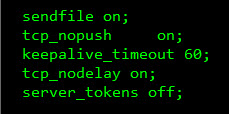
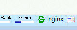

# 彻底隐藏Nginx版本号的安全性与方法

> http://www.ha97.com/1095.html

Nginx默认是显示版本号的，如：

```shell
[root@bkjz ~]# curl -I www.nginx.org
HTTP/1.1 200 OK
Server: nginx/0.8.44
Date: Tue, 13 Jul 2010 14:05:11 GMT
Content-Type: text/html
Content-Length: 8284
Last-Modified: Tue, 13 Jul 2010 12:00:13 GMT
Connection: keep-alive
Keep-Alive: timeout=15
Accept-Ranges: bytes
```

这样就给人家看到你的服务器nginx版本是0.8.44，前些时间暴出了一些Nginx版本漏洞，就是说有些版本有漏洞，而有些版本没有。这样暴露出来的版本号就容易变成攻击者可利用的信息。所以，从安全的角度来说，隐藏版本号会相对安全些！

那nginx版本号可以隐藏不？其实可以的，看下面我的步骤：

1、进入nginx配置文件的目录（此目录根据安装时决定），用vim编辑打开

```shell
# vim nginx.conf
```

在`http {—}`里加上`server_tokens off;` 如：

```shell
    http {
    ……省略
    sendfile on;
    tcp_nopush on;
    keepalive_timeout 60;
    tcp_nodelay on;
    server_tokens off;
    …….省略
    }
```



2、编辑php-fpm配置文件，如fastcgi.conf或fcgi.conf（这个配置文件名也可以自定义的，根据具体文件名修改）：

找到：

```shell
fastcgi_param SERVER_SOFTWARE nginx/$nginx_version;
```

改为：

```shell
fastcgi_param SERVER_SOFTWARE nginx;
```

3、重新加载nginx配置：

```shell
# /etc/init.d/nginx reload
```

这样就完全对外隐藏了nginx版本号了，就是出现404、501等页面也不会显示nginx版本。

下面测试一下：

```shell
    [root@bkjz ~]# curl -I www.ha97.com
    HTTP/1.1 200 OK
    Server: nginx
    Date: Tue, 13 Jul 2010 14:26:56 GMT
    Content-Type: text/html; charset=UTF-8
    Connection: keep-alive
    Vary: Accept-Encoding
    ……
```

Firefox里的服务器信息显示工具也不能显示出nginx版本号（其实这个工具也是利用curl 命令侦查的）如图：



OK，完毕。