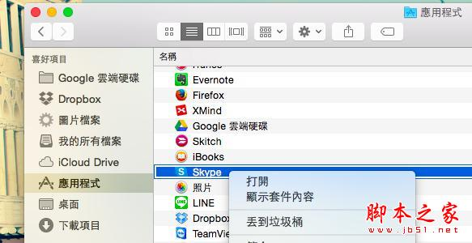

# 10个Mac 用戶一定要知道的Finder独特档案整理技巧

> 来源：http://www.bnext.com.tw/ext_rss/view/id/680924

> 来源：http://www.jb51.net/os/MAC/339813.html

去年我開始使用 Macbook Air 後，就對如何在 Apple 的 Mac 系統上更有效率工作充滿興趣，除了自己在電腦玩物撰寫了一系列的 Mac 使用心得外，我也私心用自己工作之便，邀請台灣知名蘋果工具教學網站 AppleUser 來撰寫了一本《Apple會怎麼做？100個讓蘋果店員也想學的Mac OS X工作方法》新書，從製作那本書的經驗裡，我獲得的最大收穫之一就是改變之前的Windows 檔案整理方法，學會 Mac OS X 上更有效率的獨特檔案整理技巧。

而最近，在國外的知名 Mac 教學網站 Cult of Mac 中看到這篇文章：「 10 essential Finder tricks every Mac user should know」，這個題目我覺得很棒：「每個 Mac 用戶都應該知道的 10 個必備 Finder 技巧」，帶大家徹底了解 Mac 專用檔案管理工具： Finder 的活用方法。

但是，根據我自己這一年多來的使用經驗，以及從 AppleUser 上偷學到的技巧，我感覺 Cult of Mac 那篇文章寫到的技巧比較隨意，沒有真正聚焦在我最感興趣的「更有效率的檔案管理」上，所以我決定自己來寫一篇同樣主題的文章，但這一次，讓我們聚焦在怎麼成為 Apple Mac OS X 上活用 Finder 的檔案管理高手？

## 1.快速預覽所有圖片文件內容

有時候在 Finder 中瀏覽檔案，想要快速預覽圖片、文件等檔案的內容，但是使用 Cover Flow 或縮圖方式又覺得預覽圖太小，看不清楚時怎麼辦？

這時候也不用耗費軟體開啟時間去一個一個開啟檔案和應用程式，只要在 Finder 選擇檔案的狀態下，按下［ Space 空白鍵］，那麼就會快速（而且真的非常迅速）彈出完整、大型預覽圖視窗。

只要再按一次［ Space 空白鍵］，這個預覽視窗就會消失，所以操作上非常便利，不浪費時間，不用額外開啟軟體，就能預覽各種檔案內容。

尤其是當我只是想要參考某一份文件裡面某一個欄位的數值內容，如果要大費周章去開啟軟體、打開檔案，就花掉很多時間。

這時候，即使像是 Word、 簡報、 PDF 這樣的檔案，都能在 Finder 裡按下［ Space 空白鍵］，就能立即的看到文件內容預覽，找到自己需要的數值，再按下［ Space 空白鍵］就能回到 Finder 。

## 2.標籤頁分頁瀏覽

瀏覽器裡的分頁，已經是現在我們習慣的工作切換方式之一。在檔案管理時，有時候多視窗方便、有時候分頁切換方便，而如果需要分頁切換，在 Mac Finder 中只要在檔案夾上點擊右鍵選擇【以新標籤頁開啟】，就能啟動 Finder 的分頁瀏覽。

## 3.快速找回檔案夾層層路徑

在 Mac 中雖然可以用 Mac 快捷鍵「Command 鍵」 ＋「上（箭頭）」來回到上一層檔案夾，但是如果路徑比較複雜時，要快速回到更前面的檔案夾怎麼做？

你可以在 Finder 上方功能列中的【顯示方式】裡，勾選啟動【顯示路徑列】，這樣就能在 Finder 下方顯示每個畫面的完整檔案夾路徑，方便快速切換不同層級的資料夾。

延伸閱讀，更多的 Mac 快捷鍵技巧：[Mac 新手日記] Apple Mac OS X 截圖文書必備快捷鍵教學

或者另外一個技巧是，在 Finder 上方的檔案夾名稱標題列，直接點擊滑鼠右鍵，就會出現彈出選單，裡面有這個檔案夾的各層級分類，我們也能在這裡快速切換。

## 4.預設打開 Finder 後首先開啟的檔案夾

一般來說，打開 Finder 時通常會設定在打開我的所有檔案，但是如果說你有獨特個人化的檔案管理方式，或者我最近有一個「最重要的檔案夾」，我希望自己每次打開 Finder 時可以優先進入這個檔案夾。

那麼這時候我們也能自己設定，進入上方【 Finder 】選單的【偏好設定】。

在偏好設定的「一般」中，找到「開啟新 Finder 視窗時顯示」，這裡就能自由的設定所有 Mac 上的檔案夾，例如我設定成一打開 Finder 就進入「 Google 雲端硬碟」資料夾，因為那就是我最主要的工作平台。

我在 Mac 上使用 Google 雲端硬碟的使用經驗，可以延伸參考：[雲端工作]無痛轉換 Mac：不只 Apple 好用更是 Google 實用

## 5.隨意調整自己需要的檔案夾清單

這個功能在 Windows 中也有，叫做我的最愛，可以把常用的、最近需要的資料夾設定到我的最愛中，這樣打開檔案總管就能快速使用。

而在 Mac Finder 左方的側邊攔裡，「喜好項目」就是一個可以讓我們隨意設定常用檔案夾的清單，我會取消那些預設的但是我用不到的檔案夾，並且把自己需要的檔案夾加入。

加入方法很簡單，例如最近我的工作都在某一個特定資料夾裡，我只要把這個資料夾拖曳移動到喜好項目清單，就能拖曳排序，自訂出讓我工作效率更快的檔案夾流程了。

## 6.一次重新命名多個檔案

這是我製作了 AppleUser 的《Apple會怎麼做？100個讓蘋果店員也想學的Mac OS X工作方法》一書後，才從裡面學到的檔案管理技巧。

我們都知道在 Mac Finder 中如果要變更單一檔案的名稱，只要選擇檔案後按下［ Enter ］，就能重新命名。

但是如果想要一次重新命名大量的檔案呢？也不用另外安裝軟體， AppleUser 那時候常常提醒我：「可以善用 Mac 內建功能就應該善用。」而重新命名大量檔案正是 Finder 已經內建的功能。

只要圈選需要重新命名的多個檔案，然後按下右鍵選擇【重新命名】。

這時候就會彈出檔案命名規則自訂選單，我可以替換檔名中特定的文字，我也可以重新決定檔案的新名稱，以及排序編號的規則。

## 7.直覺的移除應用程式

我要老實承認，在一開始使用 Mac OS X 時，對於習慣 Windows 「移除應用程式」方法的我來說確實一時之間有點無所適從。

原來在 Mac 中要移除一個已經安裝的應用程式其實很直覺簡單，只要在 Finder 中找到「應用程式」的檔案夾清單，找到不想要的應用程式，直接丟進垃圾桶即可！快速又方便。

或許，有些朋友會說這可能不是完全移除乾淨，還要用「清理軟體」來清除殘餘檔案。但是回顧我這一年多使用 Macbook Air 的經驗裡，從來沒有用清理軟體清理過 Mac ，但現在也不覺得 Mac 有變慢。

（其實， Windows 或 Android 上也都是一樣，我也幾乎都一年以上沒有特別用清理軟體清理，但現代裝置其實都不會因此受到明顯影響，這部分經驗可以參考：手機空間不足正確清理法！ iPhone Android 免App教學）

## 8.深入檔案內容的搜尋

雖然數位世界有「搜尋」功能，但真正記得去「充分利用」的人不多，但這是一個我們應該要養成的好習慣。

在 Mac 中一旦我想開啟什麼檔案，即使我知道那個檔案在哪一個檔案夾中，但是除非我現在就在那個檔案夾的視窗裡，要不然我一定是用「搜尋」的方式來開啟這個檔案。

因為搜尋一定會比我自己一層一層檔案夾翻找還要快。

延伸教學，這裡還可以善用 Mac Spotlight 的搜尋技巧：必學Mac專家工作捷徑！ Spotlight 12招加速完成任務。

而且在 Mac Finder 右上方的這個搜尋列，它不只可以搜尋檔案名稱，還可以進入 Word、 PDF 等文件的內容進行搜尋，所以可以找到擁有關鍵字的檔案內容。

另外在搜尋時， Mac Finder 也能讓我們決定是要搜尋整台 Mac ，還是搜尋目前所在檔案夾的內容。

搜尋是數位工作最重要的一個技巧，而且是簡單卻容易被忽略的技巧，我們一定要養成善用搜尋的好習慣，無論任何服務中，搜尋都是加快效率的不二法門，例如：Google Drive 雲端硬碟 12 招祕密搜尋技巧教學大公開。

## 9.活用檔案顏色標記， GTD 檔案管理方法

在之前電腦玩物的這篇：「Mac內建 GTD 檔案任務化秘笈：跳脫分類的專案管理」中，我提到了活用 Mac Finder 顏色標記，來跳脫分類，進行檔案的專案管理流程，這當然也是 Mac 用戶必學的 Finder 使用技巧，歡迎到之前那篇文章裡參考。

## 10.新增智慧型檔案夾

最後， Mac Finder 中可以自訂【智慧型檔案夾】的功能也值得好好活用，它可以讓我們不用移動檔案位置去做分類，而可以彈性的歸類出我們工作需要的各種範圍的檔案。

在新增智慧型檔案夾時，我們可以用關鍵字搜尋來建立智慧型檔案夾，例如用前述的搜尋技巧搜尋「電腦玩物」，然後儲存這個搜尋結果，就會變成一個「包含所有有電腦玩物關鍵字的文件檔案」的智慧型檔案夾。

或者我們可以用 Mac Finder 的智慧型檔案夾規則來自定規則，例如設定「上次開啟日期」是「在過去」「兩天」以內的檔案，也就是自動過濾出這兩天開啟過的所有檔案與資料夾。

接著，儲存這個規則，就會產生一個新的智慧型檔案夾，以後我只要進入這個檔案夾，就會看到「我最近工作常常會用到的檔案」了！

這樣是不是不用自己分類，卻又能更有效率的加快工作呢？

相信這些技巧對於 Mac 老手來說應該駕輕就熟，而如果你是 Mac 新用戶，或是上述技巧還有你不知道的方法，那麼記得學起來，下次在 Mac Finder 中比別人更有效率管理自己的檔案工作流程，更快找到需要的檔案。
