# Mac OS X 进阶技巧 像专家一样用好你的 Finder 12个窍门

> 来源：http://www.macx.cn/thread-2079204-1-1.html

自从iPhone发布以来更多的用户从知道苹果是个手机公司后, 慢慢的了解到苹果公司还有一个 Mac 的电脑操作系统. 也陆陆续续看到很多"勇敢"的同学开始尝试这个全新的操作系统.

虽然Mac在国外很普遍, 但因为国内的很多行业发展的滞后性给Mac平台在国内的使用带来了很多的不便.但是好东西依然可以发光发热的. 在您给MacBook Pro 安装Windows的时候也希望有更多的朋友能使用好 Mac OS X .

在日常使用中我们最经常使用到的就是 Finder  (类似于Windows内的资源管理器) . 其实在使用中也有很多小技巧.
下面就给总结了12点能让你事半功倍的小窍门.

当然在这之前你还可以浏览 6个你可能不知道的 Mac OS X 10.8的小技巧 . 了解更多其他的小技巧.

说个题外话, 因为现在国内的各种苹果网站几年前大不一样. 不说iphone的网站了, 这介绍mac的网站也开始纷纷出现, 当您希望搬迁本文的时候, 请留下一个出处即可, 不用为小弟署名, 目的只是尽量避免日后有用户再转载回来的情况发生. 实在让很多原创作者哭笑不得.

本文所介绍的一些小技巧可能您已经知道, 小弟对于您热爱学习与研究精神表示无比的赞许. 希望已经修成正果的高手能与大家分享您的经验与技巧 ~~~~~ 毕竟乐于助人胜造七级浮屠...

其实还有很多 OS X 的使用上的教学贴请同学们留意 OS X 分区的分类贴与精华帖.

## 1. 选中文件后创建文件夹

当你要把一些文件放到一个新的文件夹内. 一般情况下, 需要先创新新的文件夹然后再将文件拖拽到新文件夹内.

其实在苹果系统内你可以直接选择文件然后右键单击选择用所选项目创建新文件夹.

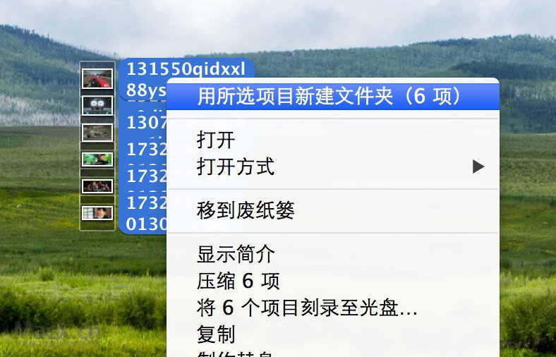

## 2. 记住栏列表宽度

当修改横向栏方式显示文件的时候, 当修改栏宽度的时候按住 即可使之固定.


## 3. 用好我的所有文件

我的所有文件, 有些朋友很不喜欢经常把它隐藏了, 可能是因为怕新女朋友看到不该看到的吧.

其实 "我的所有文件" 功能很好用. 比如可以将最新生成的文件显示出来, 显示你刚下载的或者刚修改过的文件.
不需要你去一层一层目录去寻找这些文件.

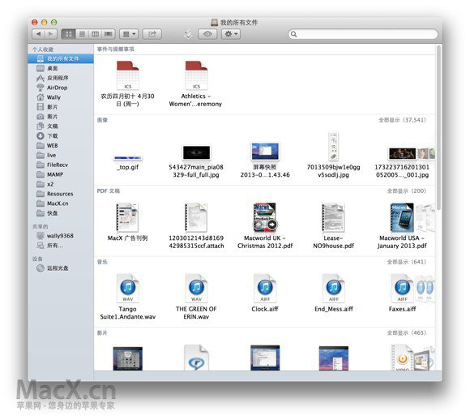

可以同样使用分类方式显示与分类文件.

* 特别注意, Finder中的我的所有文件显示的不仅仅是搜索结果也是真正的文件.

如果你不需要看到这个功能可以通过右键单击将其移除. 千万不要直接删除右侧搜索出来的文件.

因为当你删除的时候, 文件本身也被删除了.

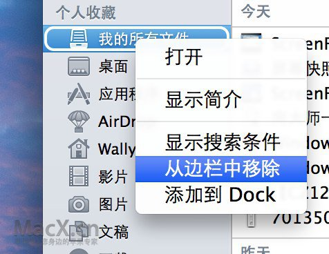

## 4. 使用 Airdrop 分享文件

如果在公司内或者家庭中都使用苹果的话, 那使用Airdrop来传送文件会非常方便.

这样不管是是否有无线网络, 只要打开Airport Wifi 就可以发送与接收文件.

不需要连接网络不需要U盘.. 速度一般为 3-5MB/s ..

使用方法很简单, 你只需要将两个要通过Airdrop传递文件的电脑都打开 Finder 并且激活Airdrop选项卡.

等待找到对方即可. 拖拽文件到用户头像上即可.

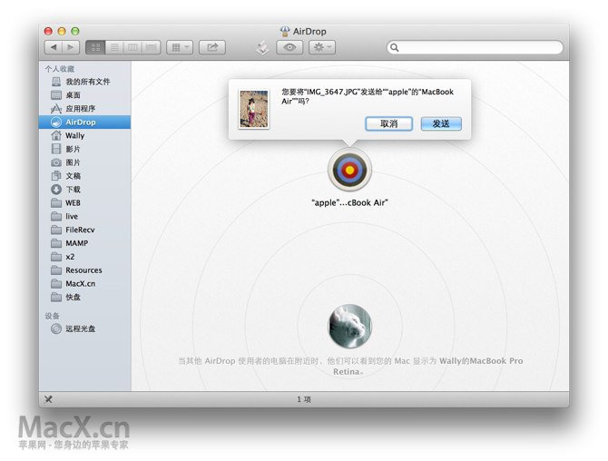

自然通过 WIFI 传输的速度没有U盘速度快, 对于同在一个内网环境下的小文件的传输Airdrop很有帮助.

但是对于大型的文件还是建议大家用U盘来传输.

> 小提示:

> Airdrop 只需要你两台电脑在同一个网络内或者都打开 WIFI .

> 如果你身边没有 WIFI 路由器也是可以通过 AIrdrop 找到对方并且传输文件的.

## 5. 图片与影音直接进入全屏查看模式

普通情况下如果在查看图片与视频的时候可以按空格键直接预览图片与视频.

如果想立刻进入全屏模式预览只需要按住  再按Finder菜单栏上的预览键即可进入全屏预览状态.

如果想浏览多张或者多个视频请先选中图片后再预览或者打开.

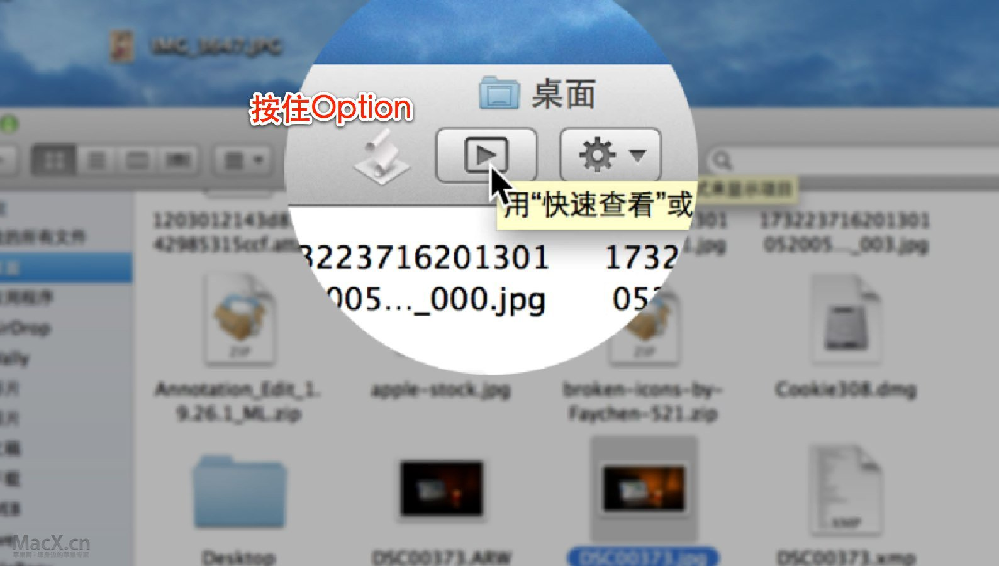

## 6. 切换列表分类方式

列表分类方式更有助于帮你找到文件. 除了按照传统的文件名 日期 大小排序外.

mac还提供按照文件类型分类  修改时间分类等等方式...

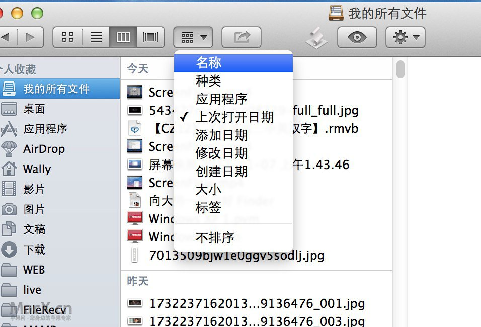

刚开始使用 Mac OS X的时候可能会遇到文件排列方式与windows不同而遇到的混乱.
其实Mac上文件排列方式当您知道如何操作的时候其实方便程度还是很高的.

不管你在任何浏览方式都是可以按照不同的分类方式查看的.

如下在图标方式也可以按照应用程序类别分类图片.

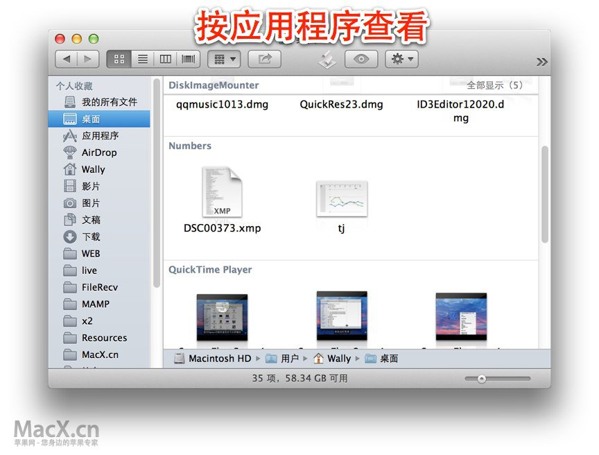

而对于下载目录其实我们更喜欢的方式是按照最后的修改或者创建时间

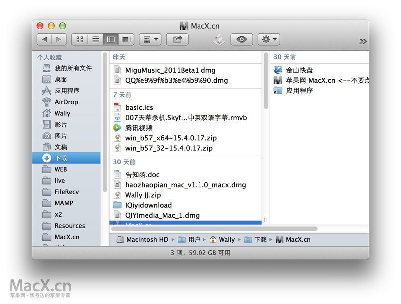

Mac OS X 会记录不同目录你采用的文件夹排列方式.
所以更好的利用文件夹排列方式会让你的日常工作更有序的进行, 帮你更快速的找到你需要的文件.

## 7. 使用快捷键去相应的目录

-Shift-A 打开应用程序

-Shift-U 实用工具

-Shift-G 直接去到某个目录

大多时候我们可能习惯于通过鼠标点击找到某个目录. 如果你想连接打开应用程序 或者使用工具. 可以通过如上两个快捷键实现.

当有时我们遇到问题需要进入到一些系统目录的时候我们需要通过 G 这个快捷键找到目标目录

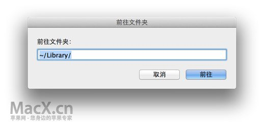

## 8. 剪切功能的快捷键

传统下 x 是剪切但是在mac下需要按 --v 才是剪切.

同时还有一个引申的用法就是

精确复制文件. 就是创建一个任何属性都一样的文件副本.

Shift---V

通过这个按键, OS X 会在直接创建一个文件的副本.

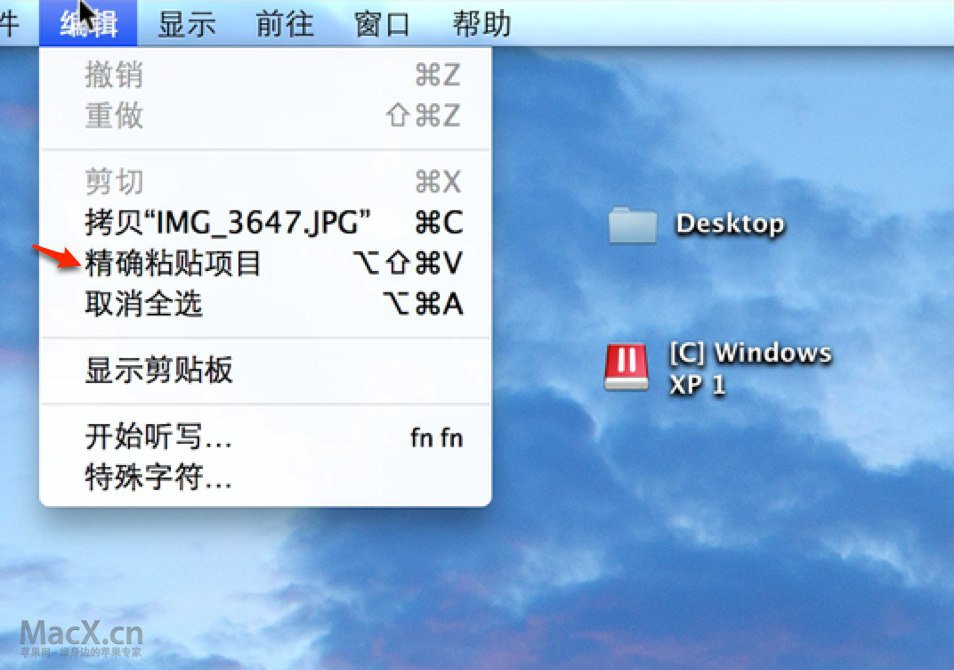

## 9. 合并文件夹的时候选择保留项

Mac OS X 下将相同名字的文件夹覆盖的时候默认不是将文件夹内补全, 而是直接替换.

这个刚转换到mac平台上的用户会很纠结.

一定记得如果文件夹相同的复制一定要选择保留两项这个选项.

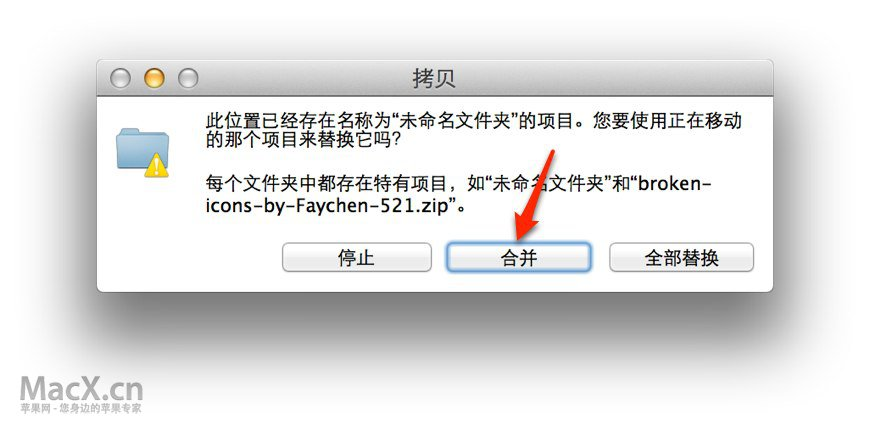

## 10. 显示状态栏

显示状态栏能帮你了解现在处于的目录文件容量等信息 , 是Finder高手不必可少的一个功能哦.

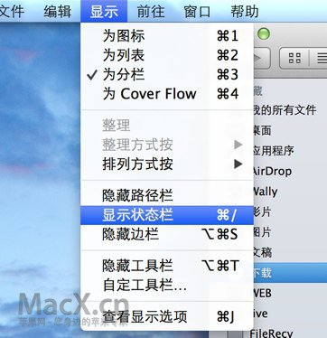

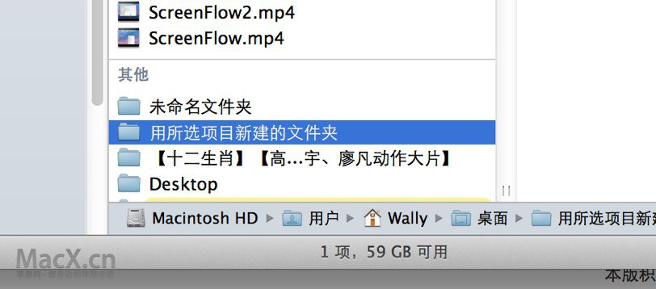

> 前面10个是 针对于 Finder 的一些进阶技巧. 后面是两个关于 Spotlight . 其实也很是好用.就当是看10送2年底大奉送吧.

## 11. 使用Spotlight 所有与启动程序

除了在 Dock中放置常用的程序, 其实还可以通过 Spotlight 搜索启动应用程序.

一些不经常是使用的程序只要你记得它们的名字就可以快速的找到并且启动.

不需要打开应用程序目录或者 Launchpad 查找..

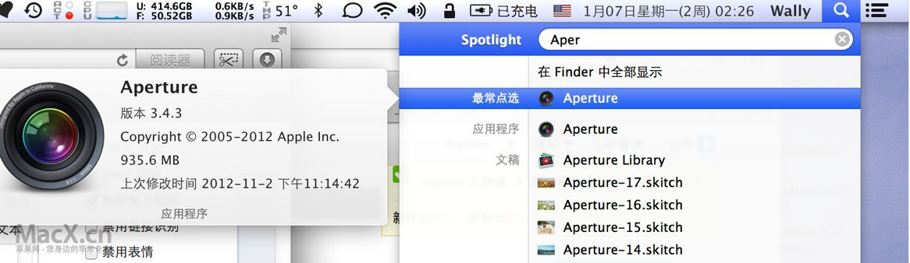

## 12. 更会搜索 会用标签如 KIND:  FROM: 等

在Spotlight  搜索中还可以自定义标签.

比如你需要找电话的时候: 你可以输入 种类:联系人

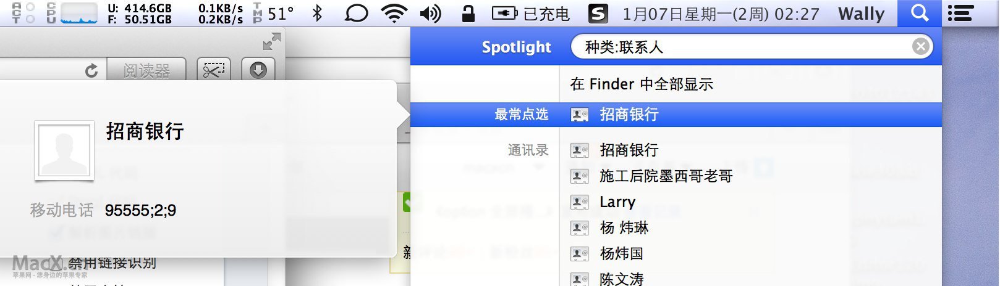

比如我要撸管的时候 只要输入 KIND:MOVIE

对于中文用户就输入 种类:影片

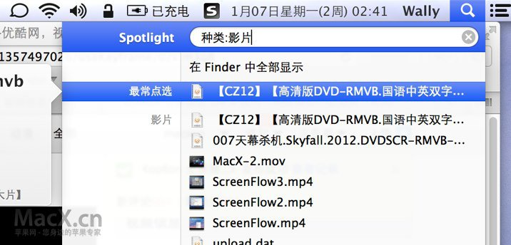

就可以啦.

还支持的种类还有

```text
程序 , app , 联系人 , 文件夹 , 邮件 , 事件 , 待办事项 , 图片 , 音乐 , pdf , 书签 ,字体
```

还有就是date: 日期 标签.

日期标签支持有

```text
昨日, 今日,本月, 明日, 本周, 今年 .
```

如果你习惯使用英文还可以

```text
*Applications
kind:application, kind:applications, kind:app
*Contacts
kind:contact, kind:contacts
*Folders
kind:folder, kind:folders
*Email
kind:email, kind:emails, kind:mail message, kind:mail messages
*iCal Events
kind:event, kind:events
*iCal To Dos
kind:todo, kind:todos, kind:to do, kind:to dos
*Images
kind:image, kind:images
*Movies
kind:movie, kind:movies
*Music
kind:music
*Audio
kind:audio
*PDF
kind:pdf, kind:pdfs
*Preferences
kind:system preferences, kind:preferences
*Bookmarks
kind:bookmark, kind:bookmarks
*Fonts
kind:font, kind:fonts
*Presentations
kind:presentations, kind:presentation
```

```text
date:this month
date:this week
date:this year
date:today
date:yesterday
date:tomorrow*
date:next month*
date:next week*
date:next year*
```

最后感谢大家的观看. 希望更多的朋友能加入到帮助新朋友的行列中来..
文中如有不对请多多指正..
