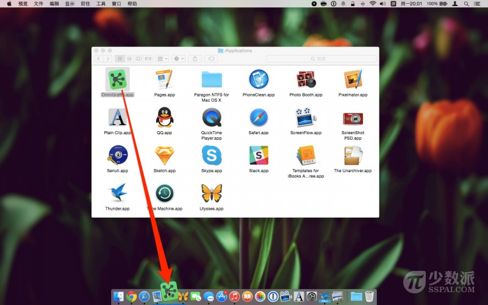
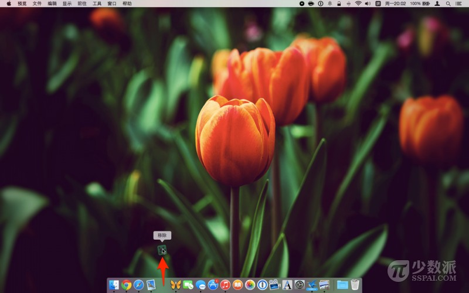
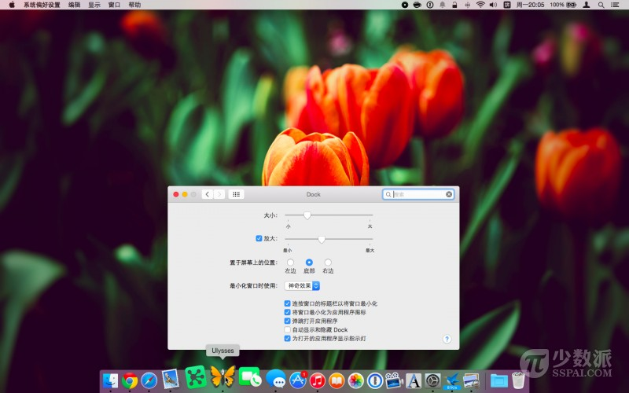
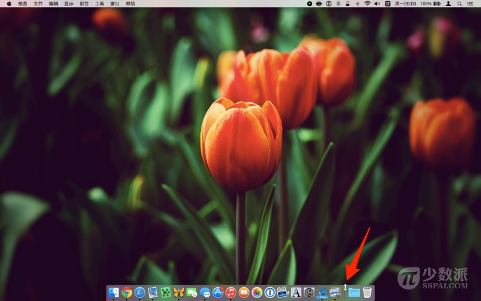
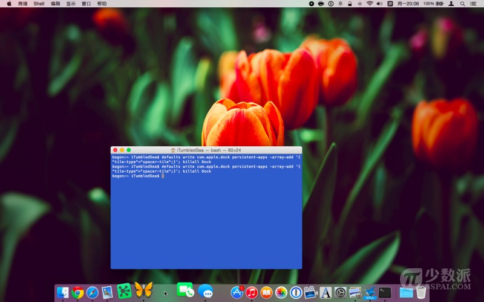
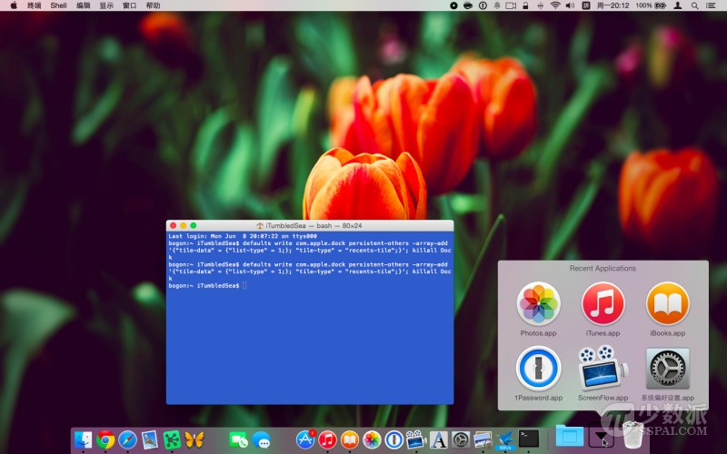

# 玩转 OS X Dock 的 6 个小技巧

> 来源：http://sspai.com/29161

Mac OS X 的 Dock 为你启动应用程序、访问最用的文件和文件夹提供了非常方便的入口，默认情况下，OS X 的 Dock 置于屏幕的底部。

当你第一次进入 OS X Yosemite 的桌面，Dock 中内置了许多应用程序，怎么用好它？其实，你不仅可以自定义 Dock 中显示的内容，而且你还可以调整 Dock 的大小、位置，以及一些其他「好玩」的东西。

## 1. 添加应用程序，文件夹和文件到 Dock



1. 打开你的应用程序文件夹。
1. 找到你想添加的应用程序。
1. 点击按住该应用程序图标并将其拖到 Dock 中（当移动图标到 Dock 时，Dock 中的已有应用程序图标将向两侧移动来腾出空间）。
1. 松手即可将应用程序将留在 Dock。
1. 重复上述步骤来添加更多的应用程序到 Dock。

注：你还可以添加文件夹或单个的文件（文件夹和文件会被添加到 Dock 分割线的右侧）。

## 2. 从 Dock 移除应用程序，文件夹和文件



在你尝试从 Dock 中移除应用程序之前，请先退出该应用程序，因为打开的应用程序图标将始终显示在 Dock 上。

1. 点击按住 Dock 上的应用程序图标。
1. 将其向外拖动离开 Dock。
1. 片刻后 OS X 将弹出说「移除」字样，松手即可将其删除。
1. 重复以上步骤来删除文件或已经添加到 Dock 中的文件夹和文件。

## 3. 改变 Dock 的大小和位置



你可以调整 Dock 大小，调整图标的缩放效果（当你鼠标指针移到 Dock 的时候），调整 Dock 的位置（左边，屏幕下方或右边），调整最小化窗口的动画效果等。

1. 打开系统偏好设置。
1. 点击 Dock 选项图标。
1. 滑动滑块即可调整 Dock 大小和调整鼠标悬停在其上的放大比例。
1. 点击选中你想要 Dock 显示的位置。
1. 点击选择最小化窗口动画效果。

## 4. 额外小技巧



1. 你可以将鼠标指针移动至 Dock 右侧的分割线处（此时鼠标光会变成双向箭头，点击并拖动剪头即可调整 Dock 大小。
1. 你还可以按住 Shift 键的同时，点击按住分割线，然后自由拖动 Dock 使其停靠在屏幕不同边缘。

## 5. 添加空白分割区域到 Dock



* 打开终端应用程序，并输入如下命令：

```shell
defaults write com.apple.dock persistent-apps -array-add '{"tile-type"="spacer-tile";}'; killall Dock
```

* 按下 return 键。
* 重复以上步骤添加多个空白区域到 Dock。
* 关闭终端应用程序。

> 注：空白区域就像一个透明图标，你可以点击按住它来拖动到你喜欢的位置；你如果不喜欢它，将其拖动至 Dock 外面片刻松手即可删除（就像从 Dock 删除一个应用程序图标一样）。

## 6. 添加「最近使用」堆栈到 Dock



* 打开终端应用程序，输入如下命令：

```shell
defaults write com.apple.dock persistent-others -array-add '{"tile-data" = {"list-type" = 1;}; "tile-type" = "recents-tile";}'; killall Dock
```

* 按下 return 键。
* 关闭终端。

> 注：最近使用的堆栈将出现在 Dock 的分割线右侧，靠近废纸篓。你可以进一步对其进行视图显示的选择（列表，网格等）。如果你不再需要它，简单将其拖拽出 Dock 来删除即可。

关于 OS X 的 Dock，你还有什么好玩的使用姿势？欢迎在文末留言分享。
