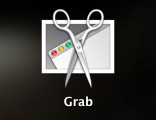
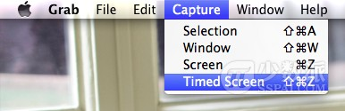
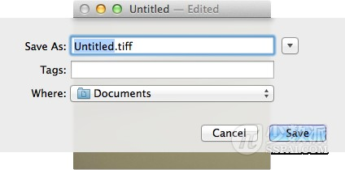
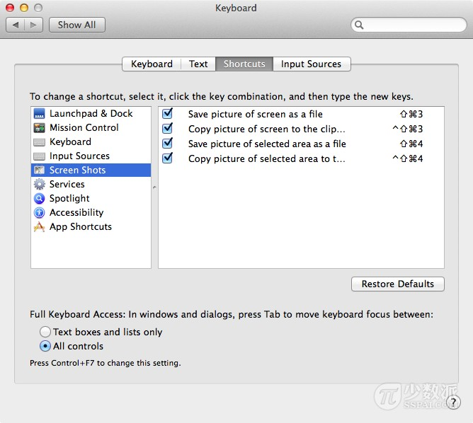
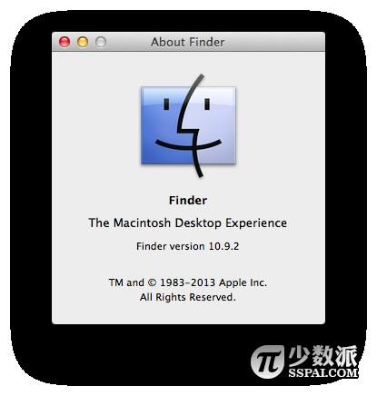
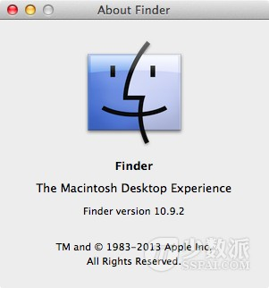

# Mac 基础教程：如何玩转 Mac 截图

今天一大早就收到国外友人隔着时差发来的问候，其实是问 Mac 截图相关问题，在顺利解决了这个问题之后，我便打算把自己会的都写出来分享，看完这篇文章，我觉得足以让 Mac 用户对于截图问题不再陌生。

本文提供两种方案。下面就开始进入正题。

## 方案一：使用自带的「截图」程序

第一步：找到并打开「截图」程序。（转到「 LaunchPad 」－「实用工具」－「截图」，老版本 Mac 用户善用右上角任务栏的 Spotlight 搜索）



第二步：认识「截图」的菜单栏。



此时你可以看见有 4 种截图选项：区域、窗口、全屏、定时。我们本次选择「区域」就好。

第三步：鼠标点击并按住拖动，选择需截图的区域，然后释放手指，便可以得到预览好的截图画面。

第四步：编辑并保存这个图像。P.S. 直接点击菜单栏即可迅速编辑名称、标签、存储路径等信息。（更详细的选择可以点击「另存为」右边的倒三角图标）



笔者比较喜欢第四个选项，有时候在菜单栏截图时，会发生快捷键冲突的现象，于是我就使用定时截图来准备好图像，静候截图。

## 方案二：使用快捷键

我是 Mac 快捷键的狂热粉丝。下面来谈一谈 Mac 上面的截图快捷键。

我们还是先来查看一下 Mac 的快捷键设置吧。转到「设置」－「键盘」，然后选择「快捷键」选项卡，接着在左栏选择「截图」。



我们整理一下：

* Shift + Command + 3 ：截取全屏幕至桌面（我用来截取屏保）
* Shift + Command + 4 ：截取区域至桌面
* Shift + Command + 4 + 空格：截取窗口至桌面（我的最爱）

等等，还有呢！

若是你不要生成桌面文件的话，那就加上 Control 键保存到剪贴板吧：

* Shift + Command + Control + 3 ：截取全屏幕至剪贴板
* Shift + Command + Control + 4 ：截取区域至剪贴板
* Shift + Command + Control + 4 + 空格：截取窗口至剪贴板

P.S.

* Shift + Command + 4 选好区域后按住空格：移动选择区域
* Shift + Command + 4 选好区域后按住 Shift ：保持选择区域一边长度不变的情况下，调整另一边的宽度（高度）
* Shift + Command + 4 选好区域后按住 Option ：保持选择区域的中心不变，移动鼠标可以修改截图的覆盖半径

.P.S. 我是个强迫症患者，发现在 Shift Command 4 空格截取窗口生成的截图有阴影。我接下来截一张「终端」窗口图片如下：



是挺好看的，不过我经常要裁掉这些阴影来专注于整个窗口内容，每张窗口的截图都要后期裁剪去掉阴影我肯定要疯……

那怎样才能让这个快捷键截出来的图不含阴影呢？我们可以求助神器「终端」应用程序。

## 如何去掉窗口截图的阴影

第一步：打开终端（转到「LaunchPad」－「实用工具」－「终端」，老版本 Mac 用户善用右上角的 Spotlight 搜索）

第二步：输入命令（区分大小写、空格）：

```shell
defaults write com.apple.screencapture disable-shadow -bool true&&killall SystemUIServer
```

按下回车确认即可。

贴一张去掉阴影后的对比截图：（干净清爽）



如果你要找回截图窗口需要有阴影的感觉了呢？还是求助神器「终端」应用程序，输入以下命令行：

```shell
defaults write com.apple.screencapture disable-shadow -bool false&&killall SystemUIServer
```

回车确认即可。

怎么样，Mac 上的截图还是值得研究的吧？有了上述的这些绝招，截取图片的操作是不是已经变得非常简单了呢？