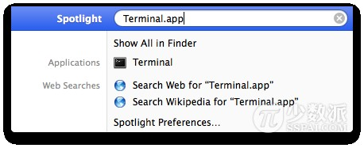
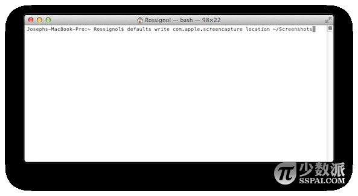
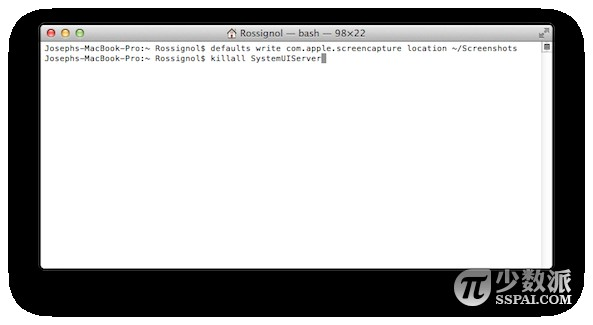

# Mac 基础教程：如何更改 OS X 截图默认保存路径

> 来源：http://sspai.com/26327

在 Mac 上进行截图可谓是不费吹灰之力，而且这些截图都默认保存到桌面上，但是如果你一次要截图很多次，那么当你返回桌面后，你会发现桌面上非常凌乱。可喜的是，我们可以改变这一设置，使得截图保存的默认位置不再单调得只剩下桌面一个地方。

## 如何更改 OS X 截图的默认保存路径

本教程将把截图保存位置设为「~/Documents/Screenshots」路径。

第一步：打开「终端」应用程序。



第二步：在「终端」窗口内输入如下命令：

```shell
defaults write com.apple.screencapture location ~/Documents/Screenshots
```



第三步：为使得更改生效，继续输入命令：

```shell
killall SystemUIServer
```

第四步：按下「回车」键确认。



你可以自行更改你喜欢保存截图的路径，而并不一定是「~/Documents/Screenshots」，感兴趣的读者可以试一试。
