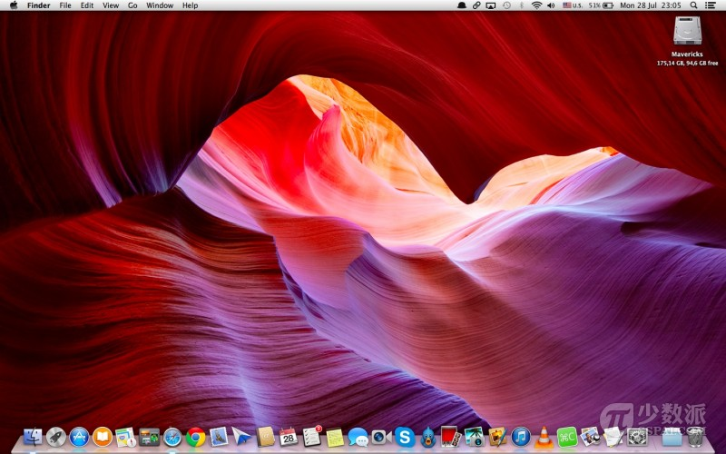

# Mac 基础教程：如何更改 OS X 默认的截图文件格式

> 来源：http://sspai.com/26321

我在 之前一篇文章 详细地讲解了如何在 OS X 上玩转截图，尤其是使用快捷键组合，方便至极。要知道，Mac OS X 默认的截图文件格式为「.png」。这一格式非常棒，图片质量非常高，还可以包含透明背景，但是往往这一格式的图片文件相对于其他常见的图片文件格式来说，体积有点大。

虽然你可以利用 Mac 自带的「预览」应用程序或第三方的图像编辑应用程序将「.png」格式图片转换为「.jpg」等格式图片，但是我觉得还是繁琐了点，能不能直接改变截图生成的图片文件格式呢？

> 注： OS X 默认识别以下图片格式：「.jpg」「.gif」「.pdf」「.png」和「.tiff」，所以你可以设置截图文件格式为上述 5 种。



想要改变 Mac OS X 默认的截图文件格式，我们需要使用到「终端」应用程序。 步骤非常简单，只需要打开「终端」，然后在窗口中输入相关命令，按下「回车」键即可。

## 1. 设置截图文件的格式为「.jpg」

在「终端」应用程序窗口内键入或粘贴以下命令并按下「回车」键执行：

```shell
defaults write com.apple.screencapture type jpg;killall SystemUIServer
```

## 2. 设置截图文件的格式为「.gif」

在「终端」应用程序窗口内键入或粘贴以下命令并按下「回车」键执行：

```shell
defaults write com.apple.screencapture type gif;killall SystemUIServer
```

## 3. 设置截图文件的格式为「.pdf」

在「终端」应用程序窗口内键入或粘贴以下命令并按下「回车」键执行：

```shell
defaults write com.apple.screencapture type PDF;killall SystemUIServer
```

## 4. 设置截图文件的格式为「.png」

在「终端」应用程序窗口内键入或粘贴以下命令并按下「回车」键执行：

```shell
defaults write com.apple.screencapture type png;killall SystemUIServer
```

## 5. 设置截图文件的格式为「.tiff」

在「终端」应用程序窗口内键入或粘贴以下命令并按下「回车」键执行：

```shell
defaults write com.apple.screencapture type tiff;killall SystemUIServer
```

通过对比上述终端命令，你是不是觉得很容易上手？赶紧试一试吧。
