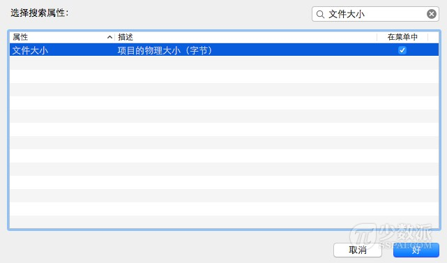

# Mac 小技巧：巧用搜索功能查找大型文件

> 来源：http://sspai.com/28210

笔者经常随身携带一支标配版 MacBook Air 外出，该笔记本的磁盘容量只有 128 GB。以前没发现什么问题，直到最近，我开始遇见「磁盘空间不足」的提示信息。说起来一头雾水，其实也想不起来这磁盘空间哪去了。于是我开始着手寻找 Mac 电脑磁盘上占用空间的「大头」，由此我想到使用内置的「搜索」功能即可胜任这一工作，接下来将其分享给大家。

如果你以前从未使用过的 Mac 的搜索功能。那么以后可能你要学着多用它一点，的确非常强大。

## 基于文件大小查找 Mac 文件

第一步：打开新的 Finder 窗口。

第二步：按下 Command＋F 调出搜索。

第三步：点击第一个过滤器（「种类」按钮），在下拉菜单中并选择「其他」，然后从属性列表中选择「文件大小」，确定即可。

第四步：点击第二个过滤器，并选择「大于」。

第五步：在第三个文本框内输入大小来搜索任何大于（例如：1000），并选择使用 MB 或 GB 作为最后的过滤条件。

你还可以将这个智能搜索结果保存起来（最方便的就是保存到 Finder 的侧边栏）以供日后使用。这样一来，每次只需要一次点击，便可以随时观察 Mac 电脑上大于 1000 MB 的文件的动态列表了。

点击搜索页面右上角的「存储」按钮即可进行保存。

存储到 Finder 侧边栏后的效果：

如果你正和笔者一样时不时担心自己的 Mac 电脑磁盘是否已满，想要查询哪些文件是占用磁盘空间的「大户」，那么本文提到的这一技巧赶紧 GET 起来吧。
