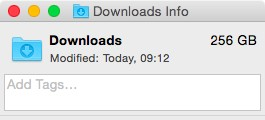
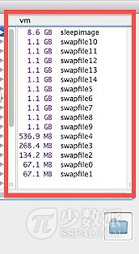
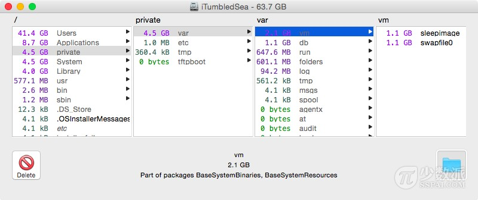
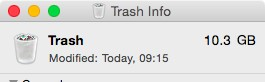
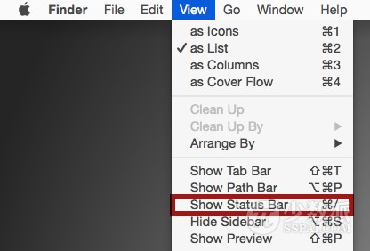

# 简单 5 招，教你快速腾出 Mac 磁盘可用空间

> 来源：http://sspai.com/28186

你有没有遇见 Mac 电脑的磁盘空间不足？如果你曾收到可怕的「磁盘几乎已满」消息，是怎么应对的呢？其实你可以通过一些简单有效的方法，快速释放一些可观的磁盘空间。今天就来分享 5 个简单的释放 Mac 磁盘空间的技巧。

## 1. 退出并重新开启应用程序

像 Safari 浏览器，Chrome 浏览器，Photoshop 等许多其他的应用程序，它们在运行时都会创建大量的临时缓存文件。如果你很长一段时间后还没有退出过这些应用程序，这些缓存的文件将不断继续增长，而且它们一般都不会被清除（直到应用程序被退出）。

当然你也可以手动删除缓存文件，但重新开启应用程序这一方法着实更容易。让应用程序自身帮你处理，何乐而不为？这一方法对于浏览器应用尤其有效。

## 2. 搞定「下载」目录



「下载」文件夹可谓是「臭名昭著」。我平时一般不怎么在意，听之任之了一阵子时间后，这一文件夹内的东西会非常多。转到你的相应文件夹（~/Downloads 目录），将文件按照占用磁盘空间大小排序，然后将不需要的文件通通删除吧。

所以希望用户你养成一个好的习惯：管理「下载」文件夹。一般来说，安装完毕应用程序后，删除安装的 .dmg 文件；解压缩文件完成后，删除原来的压缩文件；经常性地存档平时的文件。

## 3. 重新启动 Mac、安装系统更新

虽然我们很少重启 Mac 电脑，但是我还是要指出，重新启动 Mac 电脑可以释放出可观的磁盘可用空间。重新启动 Mac 电脑可以刷新系统缓存，清理一些应用程序的缓存，安装系统更新，也许更显著的是清除这两项：虚拟内存交换文件（Swapfile）和睡眠镜像文件（Sleepimage）。如果你很少重启你的 Mac 电脑，这两者可以变得非常大。当一台 Mac 电脑重新启动时，这两个文件将被清除，在下面的例子中，这两个临时文件占用了 21 GB 的磁盘空间。



所以在一段时间后重新启动 Mac 电脑的操作是一个好主意，哪怕一个月只有一次。同时也可以安装 OS X 更新。说到系统更新，如果你已经下载了，但没有安装它们，它们也只是坐在那里占用掉了你的 Mac 电脑上的磁盘空间。这些系统更新小则几百 MB，大则几个 GB。所以定期重新启动你的 Mac 电脑可以取回这些磁盘空间，并且安装好更新。

## 4. 使用 OmniDiskSweeper 揪出隐藏的空间大户


OmniDiskSweeper 是一个很好的免费的实用工具，启动它后，它将扫描你的硬盘，并按照大小顺序列出所有的目录，使用它你可以非常容易地确定磁盘空间的占用情况，搞清楚到底是是什么在占用你的磁盘空间。笔者经常使用这款应用程序来确定占用磁盘空间的大户是谁。记住：你永远不应该删除你尚未确定的文件，否则很容易出现稀奇古怪的问题而搞乱了你的 Mac 电脑。

* [OmniDiskSweeper 下载地址（免费）](http://www.omnigroup.com/more)



## 5. 清空废纸篓



听起来很明显的，对不对？它是，这一点也很容易忘记。废纸篓经过一段时间的「成长」便会不断「壮大」，有时 Mac 电脑的硬盘驱动器磁盘空间不足仅仅因为一大堆东西被移到了废纸篓，但实际上，这些东西都还存在在你的磁盘上。如果你很少清空废纸篓，赶紧在废纸篓图标上右击并选择「清空废纸篓」吧。

## 更多小技巧

### 游戏玩家？检查 Application Support 文件夹

如果你有安装 Steam 玩游戏，转到下面的路径看一看有什么可以删除的：

```shell
~/Library/Application Support/Steam/
```

该文件夹可以变为占用磁盘空间的大户，在磁盘空间吃紧时值得清理。

### 打开 Finder 底部的状态栏


启用 Finder 中的状态栏可以让你留意到可用的磁盘空间，这样你就不会对磁盘占用情况一直不知情。从 Finder 的菜单栏拉下「查看」菜单，选择「显示状态栏」即可。



### 卸载你不常用的应用程序

另一种有效的释放磁盘空间方式，就是卸载你不常用的 Mac 应用程序。

关于如何卸载 Mac OS X 的应用程序，可继续阅读笔者此前的教程《卸载 Mac 应用程序的 4 种基础方法》。

▲ 部分内容参考自 OS X Daily
