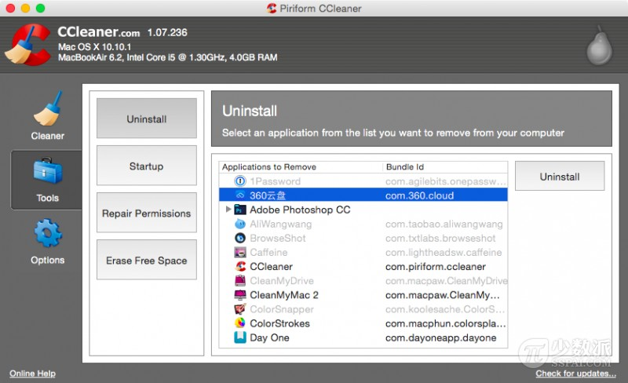

# 卸载 Mac 应用程序的 4 种基础方法

> 来源：http://sspai.com/28012

从 Mac 电脑上卸载已经安装的应用程序可能是你知道的操作系统里面最简单的一种了。而如果你是一名新买了 Mac 电脑的用户，那么你可能比较困惑：怎么没有控制面板中的相应板块来卸载它们呢？但是其实你想不到，在 Mac 电脑上卸载应用程序这一点简直简单得要命。本文就来讨论讨论如何卸载 Mac 电脑已经装好的应用程序。

## 1. 最经典的方法

这是 OS X 最经典的方法。你只需找到需要卸载的应用程序，然后拖动应用程序图标到垃圾桶；或右键单击并选择「移到废纸篓」选项；或直接按下 command－delete 快捷键组合。然后在废纸篓图标上单机鼠标右键，选择「清倒废纸篓」选项。


## 2. 使用 LaunchPad

如果你的应用程序来自 Mac App Store，那么你可以更快一点：

第一步：启动 LaunchPad 应用程序（或者按下键盘 F4 键）。

第二步：点击并按住你要卸载的应用程序的图标直至它们开始晃动起来，点击左上角的「X」按钮；或者按下 option 键不放进入抖动模式。

第三步：点击「删除」，接着确认即可。


> ▲ 注：这时都不用清空废纸篓。

使用 LaunchPad 来卸载是在运行 OS X 10.7 以及更高版本的电脑上最快的方法。如果你使用 iOS 设备，应该对此卸载方法很熟悉。

## 3. 求助第三方应用程序

你还可以使用 Clean My Mac 或 CCleaner 或是 AppCleaner 来进行卸载。


> ▲ 注：Clean My Mac 卸载



> ▲ 注：CCleaner 卸载


> ▲ 注：AppCleaner 卸载

有了第三方应用程序的帮助，卸载过程简单多了。此外，这些第三方卸载程序还会顺带删除一些关联的库文件、配置文档等，着实方便。

## 4. 使用应用程序自带的卸载程序

你可能会注意到，某些应用程序安装完毕后居然包括独立的卸载工具。这在 Mac 上有些罕见，但的确有些应用程序这么特立独行：通常是 Adobe 家或者微软家的软件。例如，Adobe 公司的 Photoshop 应用程序可能在安装主程序的同时安装 Adobe Bridge 等附加应用程序。这种情况下，你可以使用附带的卸载程序来帮忙。


## 5. 扫尾工作：删除应用程序的库文件，缓存，首选项

卸载某些应用程序后会留下一些预置文件和缓存等，一般这些文件没有潜在坏处，但是你可以删除它们来彻底跟该应用程序说拜拜。这些文件通常位于以下路径：

```shell
~/Library/Application Support/(应用程序名称)
~/Library/Preferences/(应用程序名称)
~/Library/Caches/(应用程序名称)
```

> 注：有时你会需要寻找开发商名称，而不是应用程序的名称，因为并不是所有的应用程序文件都是由它们的名称标识出来的。

以上便是笔者在使用 Mac 电脑卸载应用程序时用到的方法。如果你有相关建议和想法，欢迎在文末留言和在少数派讨论区发帖。PS. 老鸟如果想使用「终端」来卸载，可以在微博上和我（@iTumbledSea）进一步讨论。
