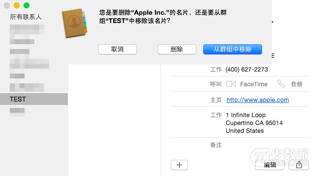

# 基础教程：如何给 Mac 通讯录联系人分组

> 来源：http://sspai.com/28203

「通讯录」里面乱七八糟，你是怎么管理、区分现有的联系人的呢？给他们分成不同的群组是一个好办法。将你的联系人分组，你可以受益更多：你还可以通过电子邮件发送群组邮件给某一组别（如基友组），却无需手动输入每个人的电子邮件地址。

## 在 Mac 上创建联系人组

第一步：启动 Mac 的通讯录应用程序。

第二步：在菜单栏中选择「查看」－「显示组」。

第三步：在菜单栏中，选择「文件」－「新建群组」。

第四步：新的「未命名组」将被创建。你可以重新命名为更具描述性的文字。例如「基友」。现在该分组还是空的。

第五步：要加入联系人到新创建的组，单击「所有联系人」，然后找到要添加到组中的联系人。只需点击＋拖放该联系人到组的名称上即可，你可以重复此步骤继续添加。

> ▲ 注：你可以通过按住键盘上的 Command 键，同时选择多个联系人，就可以在同一时间添加多个联系人到现有组。

## 快速从选定的联系人创建一个组

你还可以快速通过选择多个联系人，然后一起创建一个组。

第一步：启动 Mac 的通讯录应用程序。

第二步：在菜单栏中，选择「查看」－「显示组」。

第三步：点击「所有联系人」以突出显示。

第四步：按住 Command 键的同时，点几次鼠标，选定的多个联系人会以蓝色突出显示。

第五步：转到「文件」－「用所选新建群组」。

第六步：重命名该群组即可。

## 创建联系人智能组

Mac OS X 中有个牛叉的功能，可让您根据你选择预定义的标准来快速创建联系人组。例如，你可以创建一个组，包括所有在某公司工作的联系人。假设你有这样的数据在你联系人的名片里，Mac 就将能够智能地将这些人组在一起。

在下面的例子中，我将创建 sspai 的工作人员小组，根据他们的电子邮件地址来智能整合。

第一步：转到「文件－「新建智能群组」。

第二步：给你的智能组起个名字（少数派）。

第三步：选择基于你的智能组的数据块。我选择了「电子邮件」，但你还可以从许多方面，包括公司名称，城市等...

第四步：选择匹配的条件，选择「包含」。

第五步：选择条件。我输入「sspai」因为我想把包含「sspai」的电子邮件地址的所有联系人添加到新组。

第六步：确定。那么你的新组将出现在您的联系人应用程序的左侧组列表。

> ▲ 注 1：一旦创造了智能组，你将无法手动添加或删除智能组联系人。然而，而这正是智能分组变得更聪明，如果我添加一个新的联系人到我的通讯录，并假设这个新的联系人有一个@iDownloadBlog的电邮地址，他会自动在没有任何人工输入的情况下把他加入到已有的智能组，拽吧？

> ▲ 注 2：你可以通过添加多个层次的条件微调您的智能组。在这个例子中，我创建了一个联系人含有 @sspai 电邮地址且公司名也是 sspai 的群组。

## 从组中删除联系人

第一步：单击以选择您要删除的联系人的组。

第二步：单击该组的要删除的联系人，将其选中。

第三步：按下 Delete 键一次。一条警告消息会弹出，询问您是否要删除联系人，还是或简单地将其从组中移除。点击「从群组中移除」 。继续删除群组中的其他人就重复此步骤即可。

## 删除一个组

需要注意的是，尽管该组本身被删除，这个组里面的联系人并不会被删除。

第一步：单击以选中您要删除一个组。

第二步：选择「编辑」－「删除群组」（或按下 Delete 键）。接着点击「删除」进行确认。

好了。通过以上的阅读，相信你应该能够玩转「通讯录」分组了。现在，你可以通过只键入一次该组的名称就可以给群组中所有人发电子邮件啦。这一点非常省时省力，与此同时还能让你的「通讯录」联系人井井有条。
