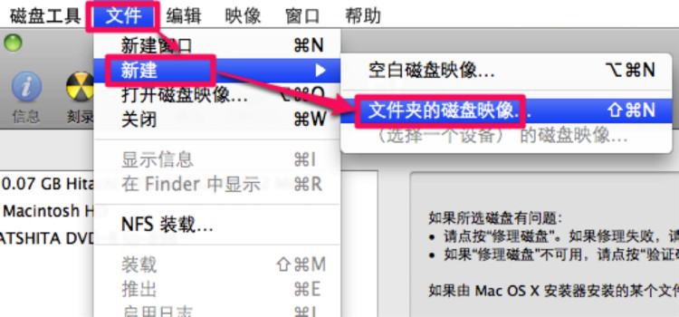
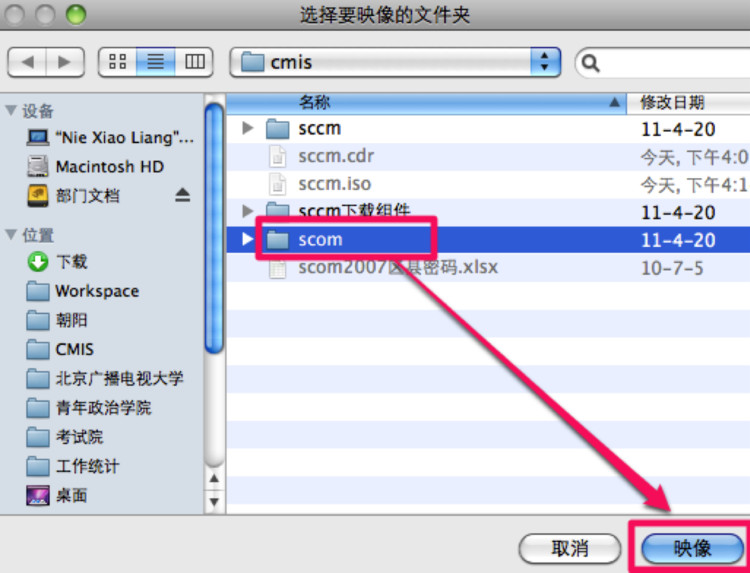
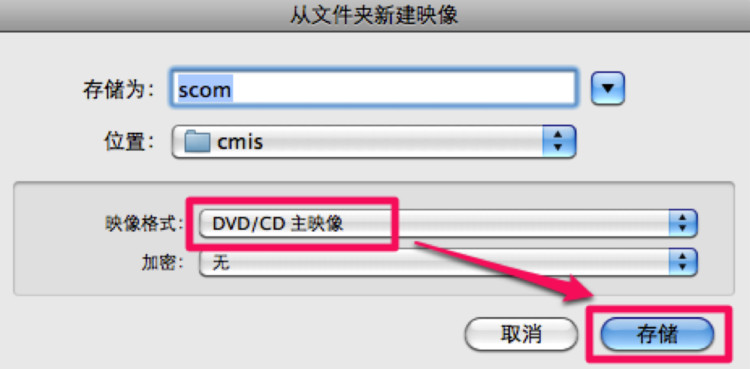
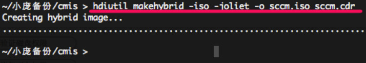

# 利用mac自带工作制作iso

> 来源：http://blog.163.com/jiaochengyang_2005/blog/static/60798845201111914314856/

> 来源：http://nio.name/2011/05/03/own-work-made-use-of-iso-mac/

运行磁盘工具，选择文件，新建，文件夹的磁盘映像



选择要做成ISO的文件夹，点击映像。



映像格式选择“DVD/CD主映像”，点击存储后会生成一个cdr文件。



开一个终端，运行红线下的命令，就能把cdr转换成iso了。

```shell
hdiutil makehybrid -iso -joliet -o scom.iso scom.cdr
```


