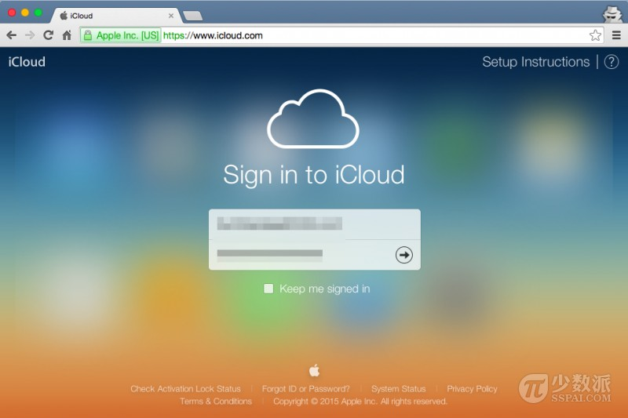
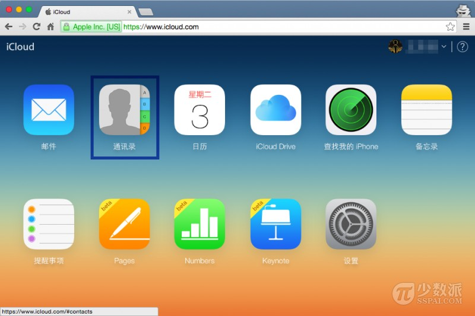
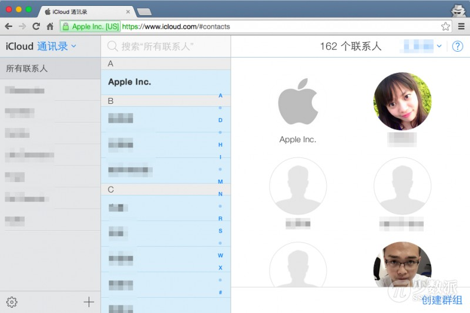
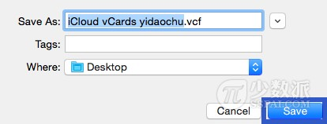

# 基础教程：如何从 iCloud 导出联系人

> 来源：http://sspai.com/28199

iCloud 可以在你的所有设备上保持联系人的同步。不仅如此，iCloud 还给你提供了联系人导出的选项：直接在 iCloud.com。这一点极其方便，如果你身在外，想要获取一份完整的联系人清单怎么办？此时你无需使用自身的设备即可访问它们。你可以将其用于备份或是与他人分享等。

导出为 .vcf 文件完成后，你就可以使用它来导入或分享这一通用标准的文件类型给许多其他应用程序或服务使用。

## 如何导出 iCloud 联系人

第一步：使用任一浏览器浏览 www.icloud.com，接着登录到你的 iCloud 帐户。

第二步：选择「通讯录」。

第三步：点击某一联系人，然后按下 Command＋A 全选（Windows 电脑按下 Ctrl＋A）。

第四步：点击左下角的齿轮图标。

第五步：选择「导出 vCard…」选项。

接下来选择保存 .vcf 文件的本地路径，点击右下角的「保存」按钮即可。

在你的 Mac 上导出完毕后，建议你应该直接顺势导入「通讯录」应用程序。
