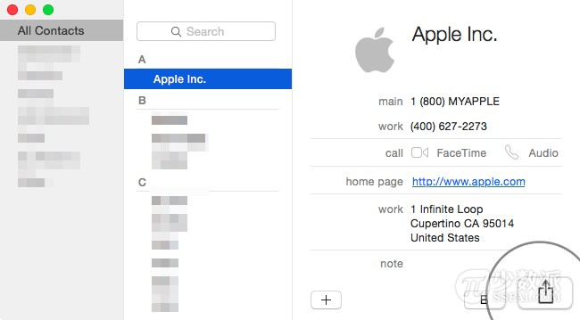
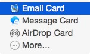
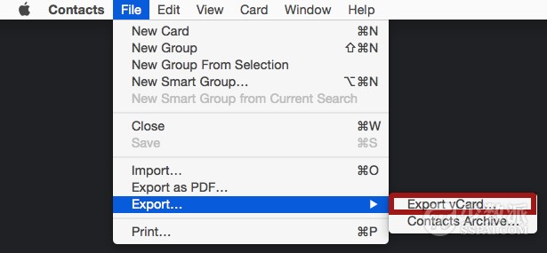
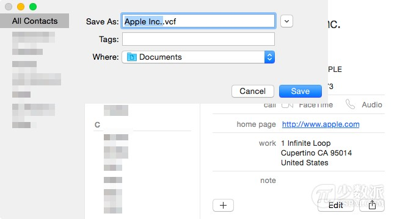
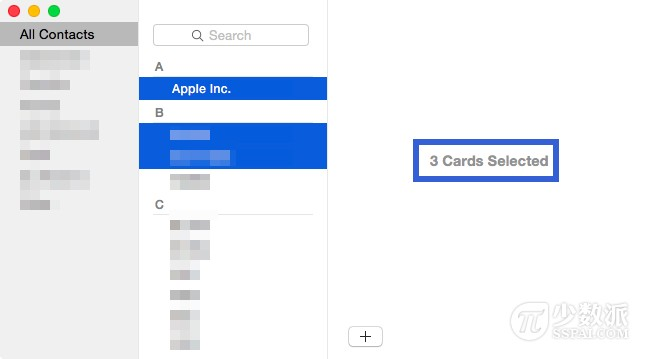
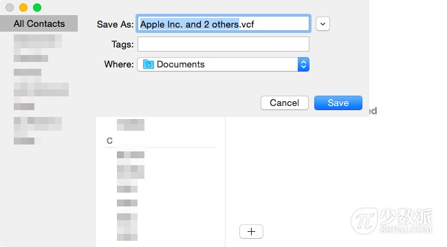
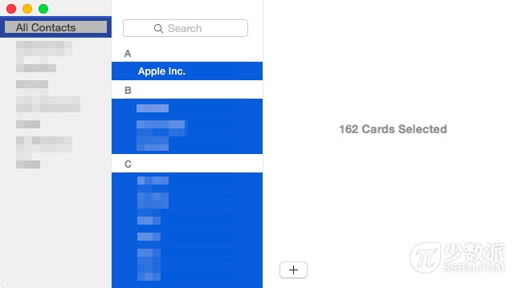
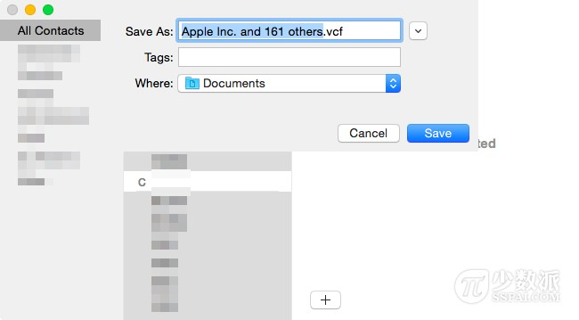
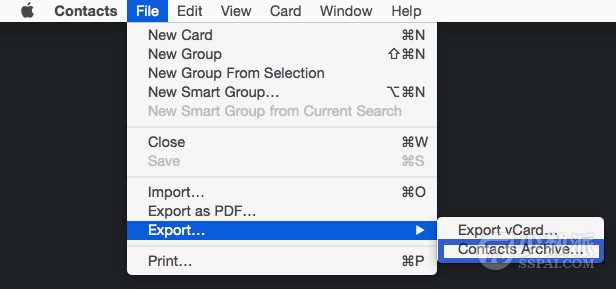
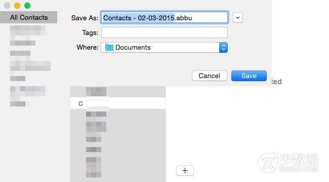

# Mac 基础教程：在 Mac 上如何导出联系人

无论你是想与某人共享一个联系人名片，还是想备份你 Mac 电脑上的所有联系人的到本地，都要进行一次导出操作。实际上，在 Mac 电脑上的操作比在 iPhone 上操作导出还要容易。

## 内容提要

1. 如何与别人共享联系人卡片
1. 如何导出一个联系人
1. 如何导出多个联系人
1. 将联系人导出为 .vcf 文件
1. 将联系人导出为 .abbu 文件

## 1. 如何与别人共享联系人卡片

与他人共享联系人卡片的操作非常简单（注意该方法一次只能分享一个联系人）。

第一步：在 Mac 上启动「通讯录」（Contacts）应用程序。点击你要共享的联系人的姓名，将其选中（选中后这个名字会以蓝色高亮显示）。

第二步：点击位于您要共享的联系人卡片右下角的分享图标，OS X 将弹出几个共享选项。

第三步：现在可以看到，你有多种方法来共享联系人。您可以通过电子邮件分享， 或者通过 iMessage，或使用 AirDrop。

## 2. 如何导出一个联系人

上述方法是与某人共享联系人，但假设你要把此联系人导出备份到你的电脑该怎么做？

第一步：在 Mac 上打开「通讯录」应用程序，然后单击要导出的联系人名称来选中。已选的联系人名称会以蓝色高亮显示。

第二步：在屏幕上方的菜单栏中，转到「文件」－「导出」－「导出 vCard」项。

第三步：此时你将可以选择你想要保存名片的路径。如果需要可以更改路径，改好了然后单击「保存」按钮。

一旦联系人卡片被保存到电脑本地，即可以保存作为备份供以后使用。当然你也可以通过电子邮件与他人分享这个联系人卡片文件。

## 3. 如何同时导出多个联系人

现在我们已经会导出某一个联系人了，下面我们将演示如何一次导出多个联系人。这个过程类似于上面那样。

第一步：启动 Mac 上的「通讯录」应用程序。

第二步：按住键盘上的 Command 键的同时点击以选择多个联系人。选定的联系人都会以蓝色高亮显示。你可以自由选择你想要导出的联系人数量。

第三步：在屏幕的左上角，选择「文件」－「导出」－「导出 vCard」项。

第四步：在出现的对话框内选择导出的联系人的路径。单击「保存」按钮以保存该文件。请注意，这样导出的几个联系人信息都将整合在一个单一的 .vcf 文件中。

你现在可以将此文件用作备份供以后使用。当然你也可以通过电子邮件与他人分享这个联系人卡片文件。

## 4. 如何将所有联系人导出到一个 .vcf 文件

在 Mac 上有两种方法来一次导出所有联系人。一种是导出为通用格式：导出的 .vcf 文件几乎可以被所有的操作系统、邮件客户端读取；另一种导出的文件格式只可以在 Mac 间兼容。

第一步：启动 Mac 的「通讯录」应用程序。如果你和笔者一样有多个联系人组，请务必点击在应用程序的左上角的「所有联系人」。

第二步：点击你联系人列表的任何一个联系人，将其选中。然后按下键盘上的 Command＋A 键来全选。这将选中所有的联系人。他们应该都是以蓝色高亮显示。

第三步：在应用程序菜单，选择「文件」－「导出」－「导出 vCard」项。

一个对话框将会弹出，询问你保存导出的联系人的路径。请注意，该联系人将被导出到一个 .vcf 文件，而 .vcf 文件是几乎所有计算机和电子邮件客户端公认的标准格式。

第四步：现在你可以保留此文件在您的电脑上作为备份。

## 5. 如何将所有联系人导出到一个 .abbu 文件

.abbu 文件格式是一种专有的格式，这意味着只有 Mac 电脑的「通讯录」应用程序可读取。如果你百分之百确定以后不会用其他操作系统来读取它的话，那就将联系人导出到这专有的 .abbu 文件试一试吧。

任何非 Mac 平台的电子邮件客户端（比如 Gmail）不会让你导入此格式文件 。正是这种使用限制使得我在推荐这个导出为 .abbu 文件格式的选项感到很为难，因为我更喜欢导出为 .vcf 文件格式。

第一步：打开「通讯录」应用程序。

第二步：在菜单栏，选择「文件」－「导出」－「存档联系人」项。

第三步：像往常一样选择好保存路径点击「保存」按钮即可。

大功告成，你将可以选择在 Mac 电脑本地来保存这一导出的 .abbu 联系人文件作为备份。
