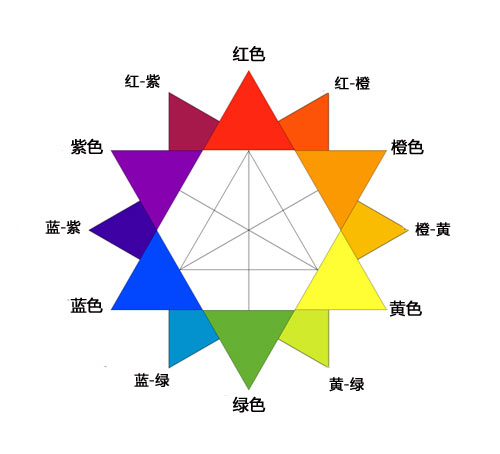
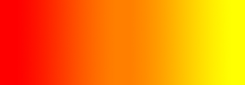

# 设计师的配色理论：你真懂颜色了吗？

> 来源：http://www.uisdc.com/color-theory-for-designers

> 原文：http://blog.enqoo.com/blog/2012/06/12/color-theory-for-designers-part-1-the-meaning-of-color/

在设计领域，颜色是非常主观的一样事物。某种颜色会唤起某人的情绪反应，但是同样的颜色对于另外一个人而言，唤起的可能就是另一种完全不同的情绪反 应。有时，这与个人偏好有关，有时，这与文化背景有关。颜色理论是自成体系的一门学科。一些人的工作就是研究颜色是如何影响不同人（个体或者群体）的。这 其中的奥妙不少。有时，像改变颜色的色调（hue）或是饱和度（saturation）这样小的调整都会给人带来完全不同的感受。而文化的差异则让一种色 彩在某国象征幸福或是愉悦，而在其他的国家则变成了代表压抑的颜色。

想要迅速学会配色，推荐您阅读配色三部曲

一、你真懂颜色了吗？(http://www.uisdc.com/color-theory-for-designers)

二、你真懂这些色彩术语吗？(http://www.uisdc.com/www.uisdc.com/color-concepts-and-terminology)

三、创建自己的调色板(http://www.uisdc.com/creating-your-own-color-palettes)

这次色彩理论的系列文章，包含三篇文章，本文是第一篇。这里我们将讨论不同色系 （color families）背后所代表的含义，随后还给出了一些例子，展示这些色彩是如何使用的（后面还有点小小的分析）。在第二部分，我们则会讨论色调 （hue），色度（chroma），明度（value），饱和度（saturation），色值（tones），浅色泽（tints），暗色泽 （shades），以及这些是如何影响我们对于颜色的感受。在第三部分，我们将讨论如何创建有效的调色板，供自己设计之用。

**色调（hue）**是最最基本的颜色术语、通常用来表示物体的颜色。当我们说红、蓝、绿时，我们说的就是色调。设计的色调可用来给网站的访问者传递重要信息。

**色度（chroma）**是指颜色的纯度

**饱和度（saturation）**是指某一色调在特定的光照条件下是如何呈现的。可以把饱和度看成是色调的强与弱、浊与清。

**明度（value）**也被称作亮度，它是指颜色的暗与明。

当灰色加入到一个色调（hue）中时，便产生了**色值（tones）**，色值要比纯的色调柔和或是暗淡些。

当黑色加入到一个色调（hue）中时，便产生了**暗色泽**。

当白色加入到一种色调（hue）中时，就会形成**浅色泽**。

## 暖色（Warm Colors）

暖色包含红、橙、黄以及这三种颜色的变种。它们分别是烈焰、落叶以及日出和日落的颜色，它们通常象征活力、激情和积极。

红和黄这两种颜色都属于三原色，而橙色则处于两种颜色之间，这意味着红色和黄色是真正的暖色，没法通过混和一种暖色和冷色而获得。你在设计中使用暖色以体现出激情，快乐，热忱和活力的主调来。

### 红色（原色）

红色是一种非常强烈的颜色，使人联想到烈焰，暴力战争。它也使人联想到爱与激情。在古时候，它即与恶魔有关，也与爱神丘比特有关。实际上红色会给人带来身体上的反应，提升血压和呼吸频率。也有资料表明它可以加快人体的新陈代谢。

红色与愤怒有关，不过它也与盛大的事件有关（看看颁奖典礼上的红地毯就知道了）。红色也预示着危险（这也是交通灯和标志使用红色的原因，大多数警告标志都是红色）。

在西方以外的地方，红色有不同的含义。譬如，在中国，红色是象征繁荣和幸福。它用来谋求幸运的降临。其他一些东方文化中，红色是结婚日新娘着装的颜色。不过在南非，红色则是丧服的颜色。红色也与共产主义有关。因红十字会的宣传，在非洲，红色已经成为艾滋病防治的标志色。

在设计中，红色是一种很重的色彩，如果在设计使用过多，会产生一种压倒性的感官效果，尤其是使用纯红色时。如果设计师想在设计中添加进力量和激情的感觉，红色就是一种非常不错的颜色。不过浅红更能体现活力，而深红则更能体现力量和优雅的一面。

#### 范例

作品中的暗红色给这个站点带来了一种力度和优雅的感受。

---

真正的红色调在黑色背景反衬中非常显眼，给网站带来一种力度和高端的感受。

---

网站中的鲜红色的高亮区有一种充满活力和运动的感觉

---

因为混用了格郎基元素（grunge），这个网站上的暗红色看起来更像是血的颜色。

---

当暗红色与白色或是灰色结合使用时，会给人形成一种非常优雅和专业的印象。

### 橙色（合成色）

橙色是一种充满生气和活力的颜色。柔和的橙色让人联想到大地以及秋色。因为它与季节的变换有关，橙色一般用来表现变化和运动的感觉。

因为橙色也与同名的水果有关，它也让人联想到健康和活力。在设计中，橙色不像红色那样强烈，但也能获取观众的注意力。通常认为橙色更友善和诱人，不像红色那样具有挑衅性。

#### 范例

尽管页面上有其他鲜红色的元素，但是网站上橙黄色方块还是将读者的注意吸引到它上面的内容上来。

---

橙色在这里的用法最为常见，用来代表火焰。

---

当深橙色抵消了酸橙绿（lime green），该色便在这里担当起一种中立的底色。

---

这里用橙色来烘托友好而诱人的印象来。

---

这里的橙色高亮区极大的吸引了眼球，并将读者的注意力带到那个行动呼吁上来。

### 黄色（原色）

黄色被认为是最明亮、最具活力的暖色。它让人联想到快乐和阳光，不过，黄色也与欺诈和懦弱有关（称呼某人是黄种人则是骂他懦弱）（译者：囧）。

黄色也与希望有关，在一些国度里，家中有亲人参军打仗的人家会挂黄丝带。黄页也与危险有关，不过没有红色那么强烈。

在一些国度，黄色有完全不同的含义。比如，在埃及，黄色是奔丧的颜色，而在日本，该色代表勇气。在印度，黄色则是商人的颜色。

在设计中，鲜黄色（bright yellow）可以增添快乐和愉悦感觉。柔和的黄色通常用作婴儿和小孩的中性色（相对蓝色或者粉红色）。淡黄色（ Light yellows）相对鲜黄色而言给人是一种更内敛的快乐感受。深黄色和金黄色有时很有古韵，当需要营造一种永恒的感觉时，则可使用这种颜色。

#### 范例

网站上鲜黄色的页眉（header）和图片给网站增添了一种活力和积极向上的感觉。

---

这里的页眉中，浅黄色是作为一种中性色加以运用的，配上手画的插画，给人一种非常愉悦的感受

---

浅黄色的高亮区将观众的注意力带向了网站最重要的一个部分。

---

鲜黄色的向日葵让网站的访客想起夏日，结合旧黄色的背景，给人一种自在可靠的感觉。

---

这里的页眉的鲜黄色给设计作品增添了一些活力。

## 冷色（Cool Colors）

冷色系包含绿色、蓝色和紫色，相对暖色，强度要弱。它们是夜、水和自然的代表颜色，通常给人感觉是舒缓，放松，以及有一点冷淡。

蓝色是冷色系中唯一的原色（primary color），这意味着其他颜色是由蓝色混合某种暖色而成（混合黄色得到绿色，混合红色得到紫色），绿色继承了黄色的一些属性，而紫色则继承了红色的一些属性。在设计中使用冷色可以营造一种冷静或专业的感觉。

### 绿色（合成色）

绿色是一种非常务实（down-to-earth）的颜色。它可以象征新的开始和成长。它也意味着新生和富饶。另外，绿色也可表示嫉妒和猜忌，代表缺乏经验。

绿色继承了蓝色所有具备的平静的属性，但是它也吸收了一些黄色的活力。在设计中，绿色有一种平衡和协调的效果，并且很稳定。对于与财富，安定，新生以及自然相关的设计，绿色很合适。亮绿色更具活力和生机，而橄榄绿更多表示自然界。而暗绿色则是富饶的最典型代表。

#### 范例

网站上运用的柔和的绿色给网站带来一种非常实在，非常自然的感受。

---

网站翠绿色的页眉配合绿叶的装饰给人带来一种自然而活泼的感受。

---

网站偏橄榄色的绿色给人带来一种大自然的质感，而这时非常契合网站的内容主题的。

---

网站复古风格的翠绿色给网站带来一种清晰而又充满活力的感受。

---

这是另一个非常有自然清新感觉的橄榄绿网站。

### 蓝色（原色）

在英语中，蓝色通常与忧伤有关。蓝色也广泛用来象征冷静和责任。浅蓝色有一种非常清新和友好的感觉。而深蓝色则是更多表示可靠和力度。蓝色也与和平有关。在许多文化中，蓝色有灵魂和宗教上的寓意（比如，圣母玛利亚则通常会被描绘成身着蓝色的长袍）。

蓝色的含义很大程度上取决于色调（hue）和暗色泽（shade）。在设计中，你所选用的蓝色的暗色泽会对极大地影响力作品给人的感受。浅蓝色通常表示放松和平静，而亮蓝色则通常表示活力和清新，而深蓝色则非常适合公司类型的网站，这类场合，感染力和可靠性是很重要的。

#### 范例

深蓝色给人带来一种可靠的感觉，而亮蓝色和浅蓝色则不会给人以稳重的感觉。

---

网站的深蓝色给人一种非常专业的感受，当结合白色背景时，尤其如此，而浅蓝色则给网站增添了一丝趣味。

---

网站的天蓝色给人一种年轻、时髦的感觉，而浅红色高亮区则进一步强调了这点。

---

这个网站混用了不同的蓝色，总的给人一种清新的感觉。

---

网站柔和的浅蓝色给人的第一印象是放松和平静。

### 紫色（合成色）

一直以来，紫色都与高贵有关。它是红色和蓝色的合成色，具有这两种颜色的一些属性。它也与创造力和想象力有关。

在泰国，紫色是寡妇的葬服色。深紫色则通常与财富和忠诚有关，而浅紫色（像淡紫色）则更多让人想到浪漫。

在设计中，深紫色给人一种富有和奢华的感受。浅紫色则更多让人想到春天和浪漫。

#### 范例

这里用的暗色泽让人想到紫色具有的高贵，非常适合爱丝普蕾这种奢侈品品牌。

---

这里所用的浅紫色和中度的紫色很好的传达出了创造力的感觉。

---

网站上亮紫色以及红紫色的色调给网站带来一种富有和活力的外观。

---

这里暗紫色的背景给整个网站带来一种非常有创造性的感觉。

---

网站上暗紫色的高亮区给人一种奢华和精致的感觉。

## 中性色

中性色通常用作设计作品的背景色。中性色通常与亮色混用。不过也可在设计中单独使用中，制作出老道的布局来。中性色的含义及其给人的影响容易受到周围暖色和冷色的影响。

### 黑色

黑色是最强烈的中性色。往好的方面看，它通常与力量，高雅以及严谨（formality）有关，从坏的方面看，它也与邪恶，死亡以及神秘有关。黑色是许多西方国家葬礼色。在一些文化中，它与叛乱关系紧密，并且也与万圣节和玄学有关。

黑色通常用在一些前卫和高雅的设计作品中。它可以很保守也可以很现代，可以很传统，也可以做到不落俗套，这主要取决与和它搭配的颜色。因为它的中立性，设计中，黑色一般都是字体排版和其他功能模块的颜色。在设计中，黑色可以很容传达出一种老练和神秘的感觉。

#### 范例

黑色的高亮区搭配亮色以及深褐色的背景，给整个设计作品带来一种前卫的外观。

---

混合冰蓝色，黑色看起来也带有寒意。

---

这里的黑色混用深灰色和酸橙绿，以及加上格郎基（grungy）风格主题，给设计作品增添了更前卫的味道。

---

这里黑色的高亮区给网站增添了老练和现代的气息。

---

网站深黑色的高亮区给整个设计作品增加了一种老道的味道。

### 白色

在光谱上，黑色另一头就是白色，不过跟黑色一样，它能与其他任何颜色搭配的很不错。白色通常与纯洁，干净，贞操联系起来。在西方，白色通常是新娘在 婚礼上穿的颜色。他通常也与医疗行业有关。尤其是跟医生，护士，以及牙医联系起来。白色也与上帝有关。天使就被人认为是身穿白色的。

在设计中，白色通常都作为中立的背景，可以设计作品中的其他颜色有更重的分量。它也可以用来传达简洁的理念。在极简约风格的设计中，白色用的最多。在设计中，白色可以用表示冬天或是夏天，具体取决于白色周围的设计图案和颜色。

#### 范例

Fuelhaus 网站上白色用来与铁蓝色（electric blue）形成对比

---

在极简约设计风格的网站中，白色背景是很常用的。相对黑色的字体排版能获得非常出色的对比。

---

这里，白色被当作强调色用，从而让网站的整体效果变得缓和。

---

白色混合灰色给设计作品带来一种柔和而洁净的感觉。

这里，白色再次用作背景色，从而让网站的整体效果变得缓和。

### 灰色

灰色是一种中立色，通常是在光谱冷色区一端。有时，灰色被视为是忧郁或是压抑，在一些设计中们浅灰色用来取代白色，用神灰色取代黑色。

灰色一般都显得保守和正式，不过也可以显得很现代。有时它被视作是哀悼色。在公司的设计作品中，经常用到，因为这里，给人正式和专业感觉至关重要。 它也可以是一种非常深奥的色彩。纯灰色是黑色的暗色泽，而其他灰色则有蓝色或是褐色混入其中。在设计中，灰色背景一种非常常见的排版。

#### 范例

浅灰色给设计带来一种平缓而安静的感觉。

---

这里浅灰色给排版（ typography）增添了现代感。

---

网站上的冷灰色给人一种现代，精致的感觉

---

深灰色的背景和浅灰色的排版色给设计带来一种鲜明的现代感。

---

设计中广泛使用的各种灰色泽一道给网站的设计带来一种老练而专业的外观。

### 褐色

褐色通常与大地，树木和岩石扯上关系。它是彻头彻尾的自然色和暖系中立色。因其坚定和质朴的性质，褐色也与信赖和可靠联系起来。它也可以被视作迟钝无趣。

在设计作品中，褐色一般都用作背景色。这种颜色在木质纹理（Wood texture）和石质纹理中也很常见。他可以给设计带来温暖、健康的感觉。有时也用深褐色来取代黑色，用作背景色或是字体色。

#### 范例

这里运用的灰褐色给人一种可靠而信赖的感觉

---

这里的橙褐色给人一种踏实而可靠的感觉

---

背景中用到的深褐色给整个带来一种朴实、稳固的感觉，让设计中的浅色真正突出出来。

---

木纹理褐色的一种常用用法，在这里，暖褐色增添极简约设计风格的网站增添了一些亲切感。

---

灰褐色的背景在这里给人一种可靠和脚踏实地的感觉。

### 米黄色和茶色（Beige and Tan）

在色谱上，米黄色有点特殊，它既可以带有点暖色值也可以带有点冷色值（warm tone），这取决于它附近的颜色。它带有褐色的暖色质和白色的冷色质。有时，这个色彩看似很无趣。在大多数情况下，米黄色是保守色，通常用作背景。它也可以用来象征虔诚。

在设计中，米黄色通常用作背景，在以纸张材质做素材的背景中，这种色彩尤其常见。它会呈现出周围附近颜色的特质。它在设计作品中与其他颜色搭配使用，很少影响到设计作品给人最终的印象。

#### 范例

因为周围的亮色，这里的淡茶色的背景给人一种年轻、清新的感觉

---

但茶色的背景给整个设计作品带俩一种保守而雅致的感觉。

---

网站上橙色和褐色高亮区让茶黄色的背景看起来更温暖。

---

茶黄色通常用在纸袋的纹理中，而更会灰一点的茶色则用作水泥或是石头的材质。

---

网站上米黄色的标题背景和其他高亮区给整个设计带来一种文雅而传统的感觉。

### 奶油色和乳白色（Cream and Ivory）

乳白色和奶油色是机巧的颜色，带有一点褐色的温暖，另外更多的是混杂有白色的冷意，这种颜色通常很安静，回会唤起一种历史的质感。奶油色是镇定色，带有白色的一点纯粹，也带有一点暖意。

在设计中，乳白色可以给网站带来一种高雅而又镇定的感觉。当与桃红色和褐色这类质朴色结合使用时，它可从中吸收质朴的性质。它可以用来冲淡暗色，而不会产生使用白色时所形成的突兀的强对比

#### 范例

这里奶油色色的背景含有一点暖色的特性，调和了网站上了的一些冷色。

---

浅灰色的奶油色背景因桔褐色的高亮区而显得更具暖意。

---

奶油色的背景给网站增添了它所缺乏的一种高雅感。

---

这里奶油色的背景增强了设计中图片所蕴含的复古主题。

---

乳白色结合浅色整体给网站带来一种非常优雅的外观。

## 简要概述……

这部分包含的信息看起来可能有点多，颜色理论除了包含特定暗色泽（shade）所给人带来的感觉外，也包含其他方面。不过下面的内容可以作为一个快速的参考指南，让你了解上面所讨论的颜色所代表的一般含义。

* 红色：激情、爱情、愤怒。

* 橙色：活力、快乐、生气。

* 黄色：快乐、希望、虚伪。

* 绿色：新生、富饶、自然

* 蓝色：冷静、责任、忧伤。

* 紫色：创造力、高贵、财富。

* 黑色：神秘、优雅、邪恶。

* 灰色：忧郁、保守、严谨。

* 白色：纯洁、干净、贞洁。

* 褐色：自然、健康、可靠。

* 米黄色或茶色：保守、虔诚、无趣。

* 奶油色或乳白色：平静、优雅、纯粹。

## 深入阅读

* 颜色的含义(http://desktoppub.about.com/cs/color/a/symbolism.htm)

About.com网站对颜色含义做的一个非常透彻的指南。

* 颜色的含义（Color Wheel Pro网站出品）(http://www.color-wheel-pro.com/color-meaning.html)

有关颜色含义的另一篇优秀指南

* 颜色(http://en.wikipedia.org/wiki/Color)

维基百科上的对应条目
