# 设计师的配色理论：你真懂这些色彩术语吗？

> 来源：http://www.uisdc.com/color-concepts-and-terminology

> 原文：http://blog.enqoo.com/blog/2012/06/14/understanding-concepts-and-terminology/

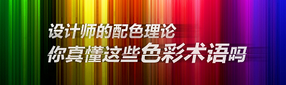

如果要在设计中有效的使用颜色，那么就需要了解一下颜色的概念和颜色理论术语。透彻的了解像色度、明度和饱和度这样的概念是创建属于你自己的非常棒的配色方案的关键。在我们的颜色理论系列第1部分：颜色的含义中，提到了不同颜色的意义。在此我们首先将温习一下这个理论的基础：什么条件将影响到一个已 知的颜色，例如添加灰色、白色或灰色到纯色相中，此外，还有这样做将如何影响设计，当然示例是必不可少的。

## 色相

色相是最基本的颜色术语，通常指的是一个物体的颜色。当我们说“蓝色”、“绿色”或“红色”时，我们所谈论的就是色相。设计当中色相的使用向网站的访问者传递了重要的信息。阅读本文第一篇可以了解不同色相传递的意义。

### 示例

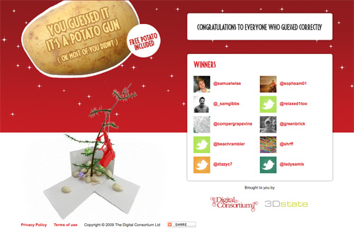

Happy Twitmas网站背景和版式的一些部分所使用的主色相是鲜红色。

---

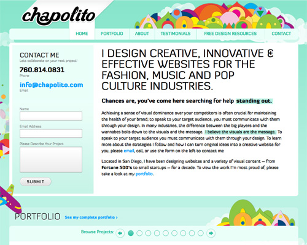

同时使用大量的纯色相可以增添外观的有趣性，看起来妙趣横生，如这个网站的标题和其他一些地方所体现的那样。

---

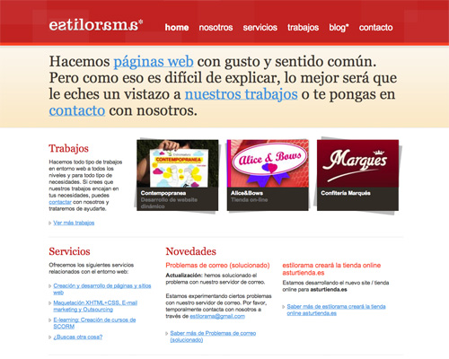

纯红色在网页设计中是非常受欢迎的颜色。

---

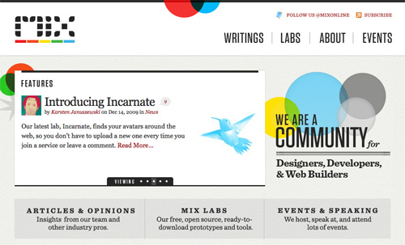

这个网站的标题和logo混合使用了大量的纯色相。

---

纯绿色通常很少看到，因此较之其他颜色显得更出众。

## 色度

色度指的是颜色的纯度。高色度的色相当中没有黑色、白色或灰色。添加白色、黑色或灰色将降低色度。它类似于饱和度，但又不完全一致。色度可被看作是一个颜色相对于白色的亮度。

在设计当中，要避免使用具有非常相似色度的色相。而要选择那些具有相同或差异较大色度的色相。

### 示例

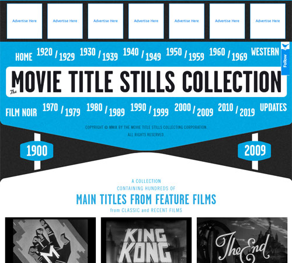

青色具有很高的色度，因此在黑色和白色之间非常突出。

---

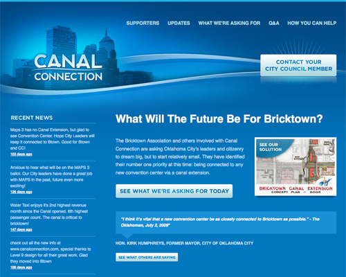

这是另一个具有高色度蓝色的网站，尽管其中包含了一些色度略低的浅色调和阴影色调。

---

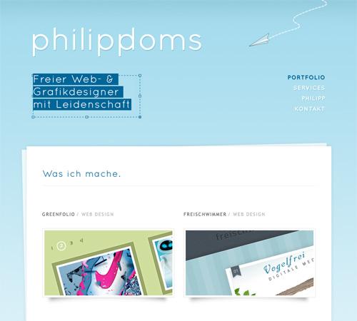

在同样的色调中结合高饱和度和低饱和度可以呈现复杂和典雅的设计效果。

---

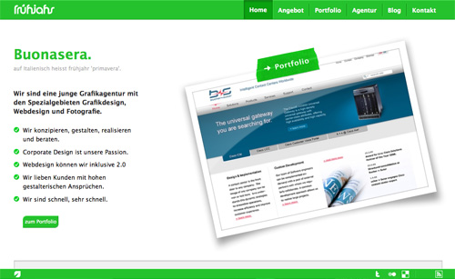

具有高色度的颜色是中庸型设计的首选，如本例所示。

---

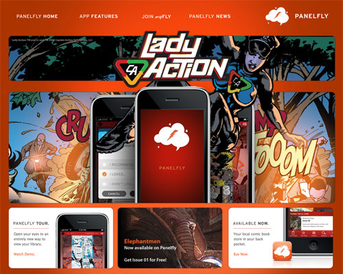

不同色度的应用可以制造出非常舒适的视觉渐变效果。

## 饱和度

饱和度指的是色调在特定的照明条件下呈现出的样子。饱和度可以使用术语弱、强，或术语弱色相及纯色相来表示。

在设计当中，相似级别饱和度的颜色让设计看起来更具连贯的一致性。同色度一样，具有相似但不完全相同饱和度的颜色可以让访客有不和谐之感。

### 示例

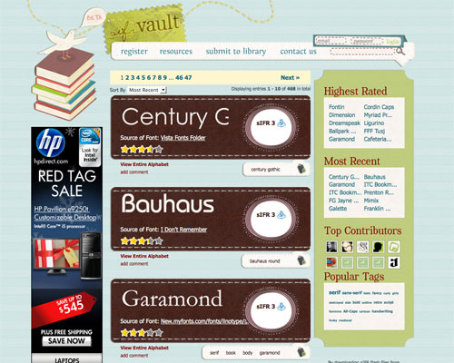

本例所使用的大量不同的色相都具有相似的饱和度水平，从而为整体的设计增添了协调感。

---

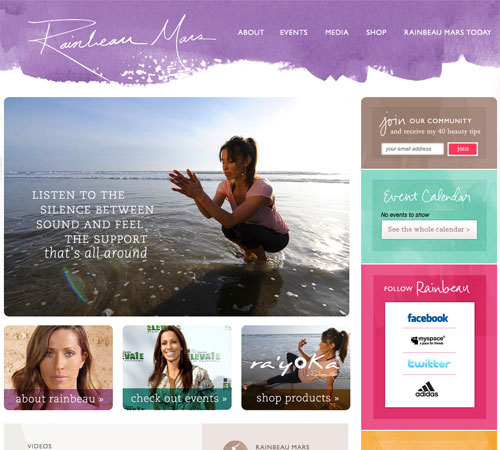

通过水彩效果的强调，色彩与相似的柔和饱和度水平相结合创造出一种柔和的设计效果。

---

如本例所示，低饱和度水平的色相不一定要更鲜亮。

---

这是一个极好的例子演示如何在低饱和度背景中使用高饱和度色相以达到突出的效果。

---

这是另一个如何使用低饱和度颜色来突出临近的高饱和度颜色。

## 明度

明度也被称作“亮度”。它指的是颜色的明暗程度。亮的颜色具有较高的明度值。例如，橙色的明度比深蓝色或暗紫色更高。黑色的明度是所有色相中最低的，而白色的明度是最高的。

当在设计中应用明度的时候，最好选用不同明度的颜色，特别对于高色度的颜色来说。高对比度通常可以设计出更具美感的效果。

### 示例

这里，具有高明度黄色的使用在低明度的黑色和灰色中相当突出。

---

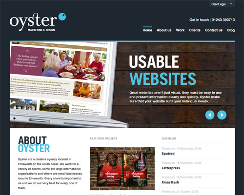

该网站使用了两种不同明度的蓝色调。由于不同的明度对比强烈，整体效果更具视觉上的吸引力。

---

将具有相似明度的颜色放在一起创造出了一个充满活力和生动的背景，这是设计本身所产生的增强效果。

---

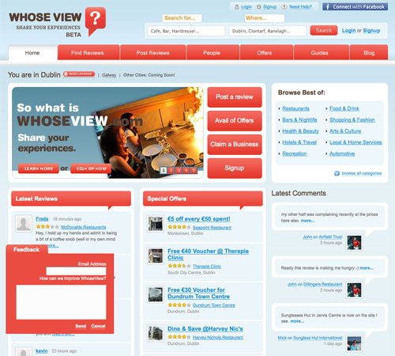

这里红色的明度比淡蓝色稍低，它的明度比白色还低。

---

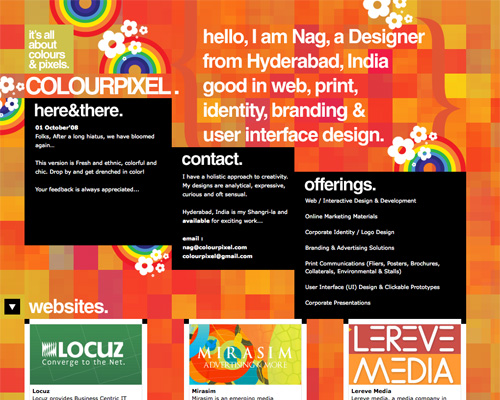

即使在非常类似的色调中，人类的眼睛也可以选出不同的明度。

## 色调

当灰色加入某色相时就形成了色调。色调通常比纯色相看起来更暗淡或柔和。

色调有时在设计中非常容易使用。掺入更多灰色的色调可以使网站具有一定的古旧感。根据不同的色调也可以为外观效果增添一些精致优雅的感觉。

### 示例

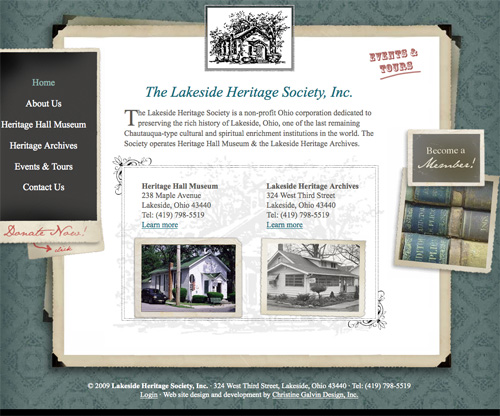

色调的应用可以使网站看起来非常精致，同时增添一些复古的韵味。

---

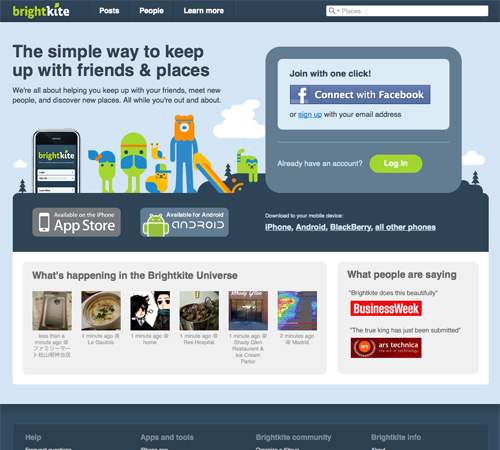

这个网站将不同色调、阴影色调和浅色调的蓝色结合使用。

---

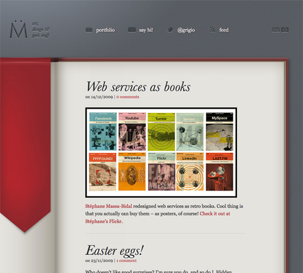

如本例所示，色调可以通过在周边加入灰色来强调

---

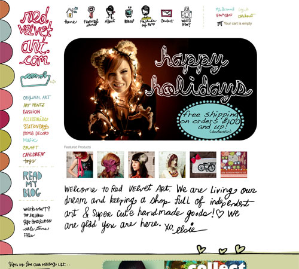

在这个设计中，导航区和背景使用的色调让这个网站看起来具有复古风和手工制作的效果。

---

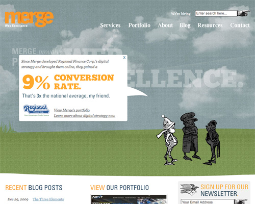

这个例子极好的展现了如何在具有色调的背景下纯色相可以真正的被突出。

---

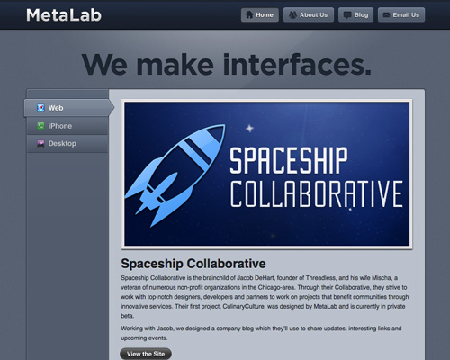

我们认为可能是灰色的一些颜色实际上是其他颜色的色调。在本例中，背景实际上是加入了大量灰色的蓝色色调。

## 阴影色调

当在色相中加入黑色使其更暗时就形成了阴影色调。这个词经常被错误的用来描述浅色调或者色调，但实际上阴影色调只应用于加入了黑色，从而使色相更深的情况。

在设计中，较深的色调通常被用于替代黑色，并可以用作非彩色。综合应用阴影色调和浅色调是避免外观看起来过于阴暗和厚重最好的方法。

### 示例

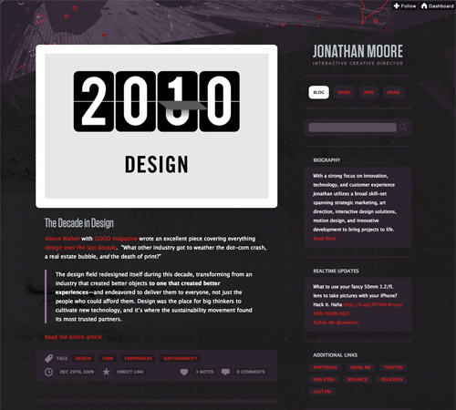

乔纳森·穆尔的网站在背景上应用了不同阴影色调的紫色，而在其他部分使用了一些浅色调。

---

只要保持其间有足够的对比度，不同阴影色调的协同使用效果也非常好。

---

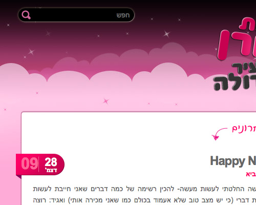

有效结合阴影色调和浅色调，亮点在于页头的设计上这种方法的应用。

---

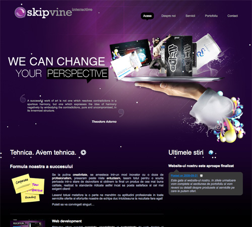

另一个具有阴影色调和少量浅色调梯度纹理的背景设计。

---

阴影色调和纹理的结合使用为这个网站增加了趣味性。

## 浅色调

当白色加入某色相使之变亮就形成了浅色调。非常亮的浅色调也称作柔和粉色，但对于任何加入白色的纯色相来说都是浅色调。

浅色调通常应用于创建女性化的或较亮的设计当中。柔和的浅色调特别用于让设计更具女性化的特点。这种方法在复古的设计中效果很好，在针对婴幼儿家长的网站上也非常受欢迎。

### 示例

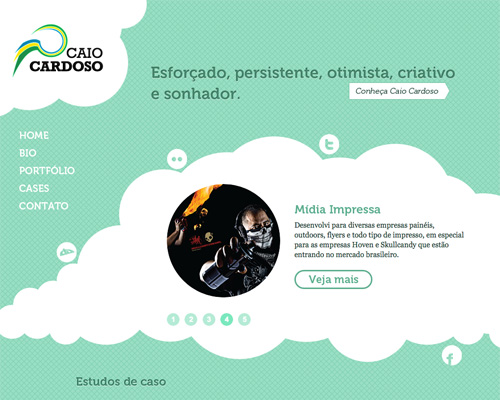

卡欧·卡多佐的网站在背景和其他元素当中应用了不同的浅绿色调。

---

费尔南多·斯朗斯的网站应用了浅蓝色色调看起来柔和而精致。

---

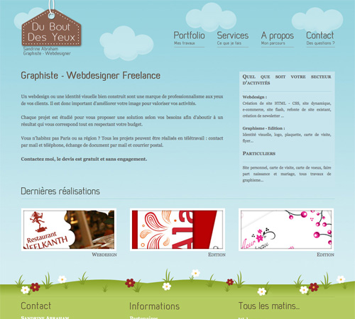

浅蓝色调在天空和自然的图样中非常流行。

---

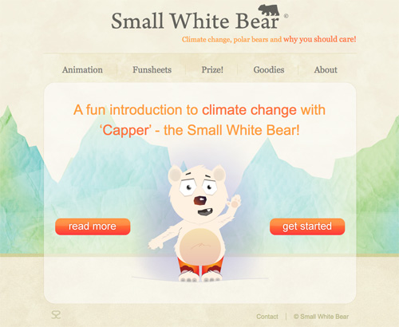

浅色调在基于水彩的设计中也非常流行。

---

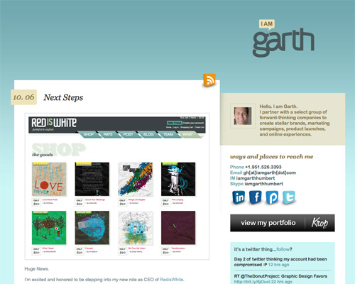

为体现复杂变化梯度而组合的浅色调。

## 结论

尽管你无需记住所有这些技术术语，但应该对实际的概念比较熟悉，尤其要掌握这个系列的第3部分（创建属于你自己的配色方案）。 为此，这里有一个唤醒记忆的备忘单：

* 色调即颜色（蓝，绿，红等）。

* 色度是颜色的纯度（高色度未添加黑色、白色或灰色）。

* 饱和度指颜色的强弱（高饱和度越高就越强）。

* 明度值的是颜色的深浅（浅的颜色具有高明度）。

* 色调通过在一个颜色中加入灰色来创建，使之比原先更暗淡。

* 阴影色调通过在一个颜色中加入黑色来创建，使之比原先颜色更深。

* 浅色调通过在一个颜色中加入白色来创建，使之比原先的颜色更浅。

## 更多资源

* 颜色术语词汇表(http://www.colorcube.com/articles/theory/glossary.htm)

来自于Color Cube很好的参考资料。

* 设计提示：让颜色饱和(http://www.netmechanic.com/news/vol4/design_no13.htm)

一篇较老的文章，但仍然可以找到一些有价值的信息。

* 设计元素：明度与颜色(http://www.usask.ca/education/coursework/skaalid/theory/cgdt/color.htm)

萨斯喀彻温大学一个极好的色彩课程。

* 颜色(http://daphne.palomar.edu/design/color.html)

Design Notes的一篇关于颜色及如何理解颜色的文章
