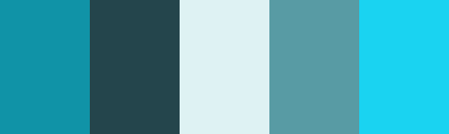

# 设计师的配色理论：创建自己的调色板

> 来源：http://www.uisdc.com/creating-your-own-color-palettes

> 原文：http://blog.enqoo.com/blog/2012/06/18/creating-your-own-color-palettes/

在颜色论系列的前两部分，我们主要讨论了颜色背后的意义和关于颜色的术语。尽管这些信息非常重要，但我相信很多人都非常想知道什么时候才开始进入讨论创建一些实质的配色方案。

好吧！本文，也就是本系列的第三部分将介绍这个问题。我们将从头开始讨论创建属于你自己的配色方案的方法。我们还将讨论传统的配色方案模式（例如单色设计，类比设计，互补设计等），以及如何创建自定义的并不严格基于一种模式的方案。在本文最后，你将学会使用工具和技巧为自己的设计项目创建漂亮的调色板。提高技能的最好方法是实践，因此为自己设定一个目标，每天创建一个新的配色方案是个好主意。

## 快速回顾

让我们先回顾一下第一部分和第二部分的内容。在第一部分，我们谈到了不同的国家和文化，所有的颜色都具有传承而固有的不同意义。这些含义对于网站访客对网站是如何理解的有直接影响，即使这种影响只是潜意识层面的。 你所选择的颜色对你试图创建的品牌标识既有可能起到促进作用，也可能妨碍其发挥作用。

在第二部分，我们讨论了颜色术语：色相（是什么颜色，如蓝色或红色），色度（色彩中包含的单种标准色成分的多少，缺乏白色，加入黑色或灰色），饱和 度（颜色的鲜艳程度是强还是弱），明度（颜色是亮还是暗）;色调（通过在纯的色相中加入灰色创建）;阴影色（通过在纯的色相中加入黑色创建）;以及浅色 （通过在纯的色相中加入白色创建） 。对于要继续学习创建属于我们自己的配色方案来说，熟悉这些术语是非常重要的。

## 传统的配色方案类型

有许多使创建新方案更容易的预定义配色方案，对于初学者更是如此。下面是传统的方案，每一种有几个例子。

基本的12辐色轮是创建配色方案的重要工具。

### 单色

单色配色方案由不同的色调构成，是在特定色调内的阴影色和浅色。这是创建配色方案最简单的方法，因为它们都来自同一色相，因此尽管也有一定的可能，但是很难创建出一个不和谐的或者丑陋的方案。

#### 示例：

这里有三个单色配色方案的例子。对于这些配色方案大部分来说，从左到右的第一个颜色通常被用作标题的颜色。第二个颜色将用于正文，或者也可用作背景。第三个颜色将可能用于背景，如果#2颜色被用作背景的话，那么它将被用于正文。而最后两种颜色将作为强调，或用在图形中。

---

---

### 类比

类比配色方案是仅次于单色的一个易于创建的配色方案。类比方案是由在12辐色轮中相邻的三种颜色创建的。一般来说，类比配色方案都具有相同的色度水平，但通过色调、阴影色和浅色的使用，我们可以增加这些方案的趣味，并且可以适应我们所设计网站的需要。

#### 示例：

这是一个传统的类比配色方案，虽然它的视觉感染力很强，但是对于设计一个让人印象深刻的网站来说，颜色的对比度不够强。

---

这个一个和上图有相同色相的配色方案，但是色度上的调整体现出多样性。 它现在更适合用于网站设计。

---

另外一个传统类比配色方案的例子。

---

以上主题经过修正可以用于网站设计。

### 互补

互补配色方案是通过将色轮上对立面的颜色相融合来创建。这些配色方案最基本的形式是仅由两种颜色构成，但是可以很容易通过色调，浅色和阴影色的形式扩展。 温馨提示：即使使用彼此相邻的具有相同色度或者明度而又完全相反的颜色可能看起来会很不和谐，从严格意义上来说，它们的边界看起来会很刺眼。因此最好通过 在它们之间留白，或者在它们之间加入另一个过渡色来避免这种情况。

#### 示例：

广范围的浅色、阴影色、和色调的应用让这个配色方案看起来非常具有通用特性。

---

另一个具有广范围色度的互补配色方案。

---

别忘了米色和棕色其实是橙色的浅色和阴影色。

### 分列互补

分列互补配色方案和互补配色方案几乎一样简单。这种配色方案使用的颜色是和位于你的基础色相对角位置的色相相邻左右的两种颜色，而非色轮上对角的颜色本身。

#### 示例：

上图是一个以黄绿色为基础色相的配色方案。你所选择的这种类型的配色方案的颜色间拥有足够的色度和明度差别是非常重要的。

---

另一个具有广范围色度的调色板例子。

### 三元配色方案

三元配色方案由在12轮辐色轮中具有相等间隔的色相组成。和其他配色方案相比，这种方案稍显不同。

#### 示例：

在三元配色方案中，使用一种颜色的浅色或深色版本，与另外两种颜色的两种阴影色/色调/浅色一起运用，让这种单一的颜色在配色方案中显得中立，可作为中和色使用。

---

或者，使用将一种非常明亮的色相搭配一对柔和的色相使用可以让这种明亮的色相更加突出。

### 双互补（四元）配色方案

四元配色方案可能是最难有效完成的一种方案。

#### 示例：

上图是非常不起眼四元配色方案。使用这种配色方案最好的方法是在设计中把一种颜色当作主要颜色，其他的颜色仅仅用作突出它。

---

当使用相似的色度和明度创建配色方案时，四维配色方案的效果非常好。只需添加一个中和色用作文本和强调，如使用暗灰色或黑色。

---

对于深色配色方案来说，它的效果也非常好。

### 自定义

自定义配色方案是最难创建的。自定义配色方案并不基于任何正式的规则，而非像上面讨论的那样遵照某种预定义的配色方案。在创建这种类型的配色方案是，请谨记色度、明度和饱和度等等诸如此类的东西。

#### 示例：

上图的所有颜色都有相同级别的色度和饱和度。

---

同样，使用具有类似色度和饱和度的颜色是非常有效的，此外，能够创建出的整个配色方案非常具有内聚力。

---

在都是低色度的颜色中使用一种高色度的颜色是另一种有效的方法，这种高色度的颜色可以用作强调。

## 创建一个配色方案

创建属于你自己的配色方案，可能听起来有点让人畏缩。但它并没有很多人认为的那样复杂。从开始着手，就有很多小窍门可以运用到创建一个非常棒的调色板中。

上文我们已经介绍了不同种类的配色方案。现在，让我们开始尝试建立自己配色方案的一部分。有大量的在线工具可以用来协助创建一个配色方案，但是从现在开始我们暂时摒弃这些工具，仅使用Photoshop来完成这项工作。

让我们试着脱离上我已经提到的配色方案，并创建了一些自定义的方案。虽然了解不同颜色之间相互作用的方式，以及传统的配色方案是如何创建的是非常重要的，但是对于你有可能去创建自定义配色方案的大多数设计项目而言，无需严格遵循任何预定义的模式。

因此，为了我们的项目目标，我们将创建三个配色方案，每一个用于两个不同的网站。我们的虚拟客户是一个现代建筑设计的博客和一个深受维多利亚时代风格影响的高档女性服装零售商。

为了对每一种方案都有一个感性认识，我们先从最基础的单色配色方案开始。虽然我曾提到传统的配色方案模式在设计中不常用到，但是单色配色方案确实这一规则的例外。你将可能发现所使用的单色方案是相当常用的基础原理。

对于我们的服装店来说，将加入的白色作为中和色是一个传统的配色方案。

---

对于我们的设计博客，我们配以由阴影色和浅灰色组成的的配色方案。

---

上图可以看作类比配色方案，但我们省略了一个颜色。它深紫色和红紫色组成。在色轮上这两个颜色彼此相邻，看起来效果很好，特别是当它们使用不同级别的明度和饱和度时。

---

在灰色配色方案中添加两个红色色调可以引起视觉上的关注，同时也为你设计中的特定部分增添了潜在的特别强调。

---

在上图中，我们不再使用紫色色相，转而使用酒红色。酒红色也是在色轮上与红紫色相邻的颜色。我们还增加在色轮上位于紫色对角上的浅黄色调。它充当我们的中和色，并且和我们的其他色相相比，看起来更像是白色。

---

虽然这个配色方案乍眼看上去像另一个标准的灰色和红色调色板，但是如果更仔细的研究一下，你将会发现灰色其实是蓝色调。蓝色和红色构成了四阶配色方案的三分之二，但在没有黄色的时候看起来也很好，特别是在当红色保持高纯度而蓝色色调淡化到几乎变为灰色的点时。

### 为什么阴影色、色调和浅色都很重要

正如在上文的配色方案中看到的那样，在你的配色方案中使用浅色、色调和阴影色是至关重要的。纯色相都有类似于明度和饱和度的等级。这导致了配色方案既具有不可替代的压倒性，同时却又很枯燥。

当将色调、阴影色和浅色这些概念混合在一起时，原来12辐色轮的概念在你的设计中可以使用的颜色数量将扩大为无限。创建具有专业外观配色方案的最简单方法 是为某一非纯色相的特定颜色选用一些色调、浅色和阴影色，加入到另一个纯的、或者接近纯的色相中，这些色相是在色轮中至少间隔三个颜色（是三维、四维或分 列互补配色方案）用于强调色。这种方法为你的配色方案增添了视觉冲击力，同时仍不失平衡感。

### 加入一些中性色

中和色是创建一个配色方案的另一个重要组成部分。灰色，黑色，白色，棕色，棕褐色和灰白色通常被认为是中性色。褐色，棕褐色，和灰白色往往使配色方案在视 觉上有温暖的感觉（由于它们其实都是橙色和黄色的色调，阴影色和浅色）。灰色根据周边的颜色呈现出暖色或者冷色的效果。黑色与白色的同样可以是暖色或冷 色，这取决于周围的颜色而定。

黑色和白色是最简单的，几乎可以加入任何一个配色方案中的中性色。 然而为了加入更多的视觉冲击力，可以考虑使用稍亮或者稍暗的灰色置于白色或黑色的位置。

添加褐色，棕褐色，和灰白色色调更具技巧一些，但通过一些练习你将会发现渐渐变得容易了。对于褐色来说，可以考虑在黑色的位置使用一种非常暗的巧克 力棕色。灰淡白色在很多情况下可以替代白色或者浅灰色。和棕褐色也可以取代灰色的位置（通过添加以小额灰色来创建色调会更容易些）。

### 配色方案中使用照片

我个人最喜欢的创建配色方案的方法是使用照片。在线的自动化工具可以为你自动完成这项工作（Adobe Kuler是这些工具中我个人最喜欢的一种），或者也可以使用Photoshop来完成制作。

使用Adobe Kuler，不仅可以搜索Flickr上的照片，也可以上传自己本机上的图片。如果你正在为在网站设计中使用什么颜色而绞尽脑汁的话，可以尝试在Flickr中搜索相关的词。有时，这种方法可以找到也许你自己都根本没有想到的配色方案。

让我们尝试这种使用Kuler和Photoshop两种方法。在Flickr中找到你喜欢的，可以激发出你希望创造出的设计感觉的照片。我选择了这一张：

---

以下是Kuler基于这张图片创建的原始配色方案：

---

Kuler上基于图片创建配色方案最棒的功能就是它的“选择基调”选项。包括彩色，亮色，柔和色，深色，和暗色。以下的配色方案是我们使用同一张照片得到的每一种基调。

彩色

---

亮色

---

柔和色

---

深色

---

暗色

现在让我们使用同一张图片在Photoshop中创建一个彩色配色方案。和Kuler相比，这种方法的科学性稍逊一筹。我通常使用滴管工具选择一种 颜色，然后在图像中的不同点上点击直到找到和它相配的另一种颜色。以下是结果。这种方法比使用Photoshop节约不超过五分钟，因此它并非像传说的那 样节省时间：

在Photoshop中基于一张图片创建配色方案是最简单的方法，可以从相关的单色开始。使用色彩相对丰富的图像会使难度增加。

这次让我们尝试一个颜色更丰富的例子。下面这张图片是我们将要基于工作的：

---

以下是Kuler给我们的基于这张图片的五种配色方案：

彩色

---

亮色

---

柔和色

---

深色

---

暗色

---

下图是基于同一张图片使用Photoshop得到的配色方案：

正如你所看到的，使用Photoshop得到的版本和Kuler提供的版本完全不同，但是以上的所有配色方案都具有视觉上的吸引力。这里的Photoshop版本了比上例用了更长的时间，部分原因图像颜色的多样性。

### 最简单的配色方案

正如我们前面提到的那样，在别的中性色调色板中添加强调亮色是创建配色方案的最简单方法。运用这种方法也可以创造出最引人注目的视觉效果。如果你对自己在创建自定义配色方案的技术方面没有自信的话，可以先从这种类型的调色板开始。

这里有几个例子可以让你理解我刚刚说的内容：

---

---

---

---

这里可以看到如何使用棕色，而不是灰色使整个方案看起来更偏向于暖色，即使在用蓝色来强调的时候。

在这种类型的方案中，可以使用任何颜色的色调代替灰色或者棕色，只需要保持接近灰色的范围内就可以得到最简单的结果。作为一般规则，冷灰色和纯灰色对于现代设计是最好的选择。在传统的设计中，偏向暖色的灰色和棕色搭配在一起看起来更好。

### 有多少种颜色？

您会注意到本文通篇使用的配色方案只有五种不同的颜色。五是一个很好的数字，它为这里的概念图解提供了许多的选择，同时，在设计中它也是一个可行的数字。当然在你自己的方案中可以任意选择更多或者更少的颜色。

绝大多数网站可能只在其设计使用3种颜色。甚至有一些只使用2个。而有些可能使用8种或10种，这相对于仅使用少量颜色的网站来说难度更大。通过实 验决定在你的设计中使用多少颜色。但是你可能希望从五种颜色的调色板开始，然后在设计的过程中决定是增加还是减少颜色以达到最合适的状态。

添加一种颜色最简单的方法是立足于已有的传统配色方案，然后基于这些配色方案来开始工作。这至少给你一个方向定位，直到有其他的颜色可以考虑。

## 配色方案精美的10大网站

为了给你更多的灵感，这里有10个具有完美配色方案的网站可以参考。下面的一些配色方案可能乍眼看起来有些奇怪，但是可以参考他们是如何使用极尽可能广范围的配色方案来展现的。

---

Wentings 自行车 & 山地车店(http://wentings.com/)

配色方案：

---

Trivuong.com(http://www.trivuong.com/)

配色方案：

---

Oscar理发师(http://www.oscarbarber.com/)

配色方案：

---

东北地区和平伙伴(http://northeastpeace.com/)

配色方案：

---

mbA建筑(http://www.mbaarc.com/)

配色方案：

---

13工作室

配色方案：

---

Joy项目

配色方案：

---

Morphix博客(http://blog.morphix.si/)

配色方案：

---

萨尔瓦多合作设计

配色方案：

---

LemonStand(http://lemonstandapp.com/)

配色方案：

## 结论

本系列中我们只是触及颜色理论的皮毛。有专门的专家，他们花了很多年来使其挑选颜色的能力精益求精，可以让它适合任何环境。

学习创建出色配色方案的最好方法就是实践。可以指定一个每天的学习计划。您可以使用自动工具来先（如Kuler的形象创造的这个计划的工具），或只 开放Photoshop和启动。 开始的时候可以使用自动工具，如Kuler基于图片创建配色方案的工具来做这项工作，或者可以从使用Photoshop开始。如果在日常生活中开到了特别 美丽或者引人注目的颜色，可以尝试围绕这个颜色创建配色方案。可以利用那些让你上传配色方案并将其组织起来供以后参考的网站。这种方法可以让那些配色方案 更贴合实际并在今后更易于使用。

## 更多资源

以下的资源应当有助于你建立自己的配色方案，还有更多的关于传统的配色方案的链接。

* 10种超级有用的选择正确调色板的工具(http://webdesignledger.com/tools/10-super-useful-tools-for-choosing-the-right-color-palette)

从Web Design Ledger汇总的10种寻找并创建调色板很棒的工具。

* 100 Random Colors 2.0(http://www.raquedan.com/random100.php)

该网页包含以十六进制代码表示的100种随机颜色，。如果你正在寻找色彩灵感的话，这个网站是个好地方。

* 经典配色方案(http://www.color-wheel-pro.com/color-schemes.html)

这篇Color Wheel Pro上的文章涵盖了所有传统配色方案的详细信息和例子。

* ColorMunki(http://www.colormunki.com/)

另一种配色方案工具。它的颜色库标签在寻找和创建单色配色方案时非常有用。

* ColorSchemer(http://www.colorschemer.com/)

一种配色方案库和工具的免费在线版本。

* ColourLovers(http://www.colourlovers.com/)

一种颜色和设计界，包含一个调色板，搜索功能以及工具巨大的画廊创建自己的调色板。 一个颜色和设计的社区，包括大量的调色板素材、搜索功能和创建属于自己的调色板的工具。
