# 巧用色彩的冲击力！13例大胆用色网页设计赏

> 来源：http://www.uisdc.com/13-beautiful-colors-websites

> 原文地址：http://webdesignledger.com/inspiration/13-beautiful-examples-of-bold-colors-in-web-design

> 优设网翻译：@MartinRGB

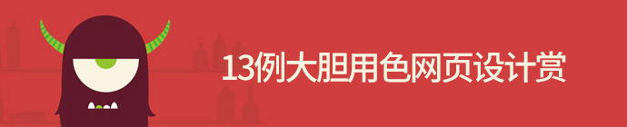

在网页设计中，如果想要独树一帜，不妨在最直接吸引眼球的色彩上下下功夫，大胆的使用色彩，能够让你的网站更个性化。然而配色问题一直是设计行业的挑战，如何用好色，配好色，分清主次，自然需要潜心研究了。如果做得好，那么效果会极具冲击力。推荐您看下我们之前推荐的人气文章《配色三部曲》。

本文收集了一些大胆用色的优秀网页设计案例。一起来学习一下吧。

## 1. Studio MPLS

http://studiompls.com/

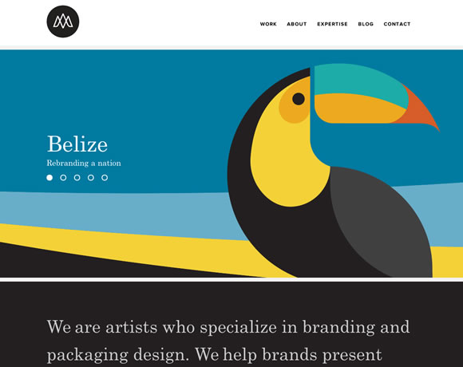

## 2. Heikopaiko

http://www.heikopaiko.com/

## 3. do a backflip

http://doabackflip.com/

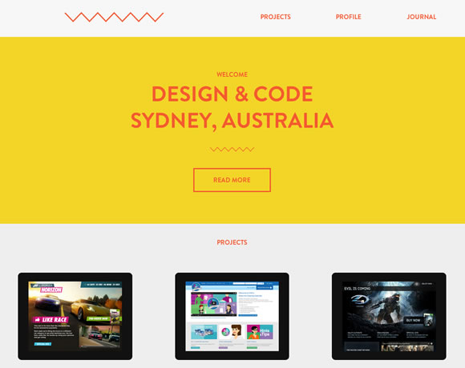

## 4. BarCamp Omaha

http://barcampomaha.org/

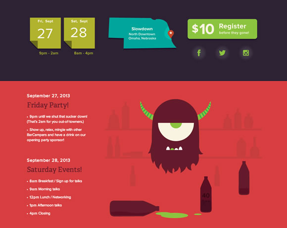

## 5. Brand Village

http://www.brandvillage.com.au/

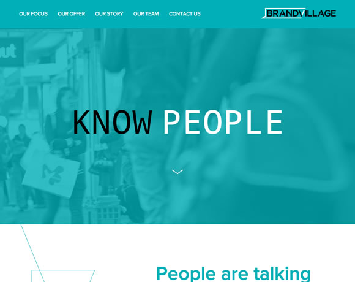

## 6. 100 Ans de Tour

http://100ansdetour.fr/

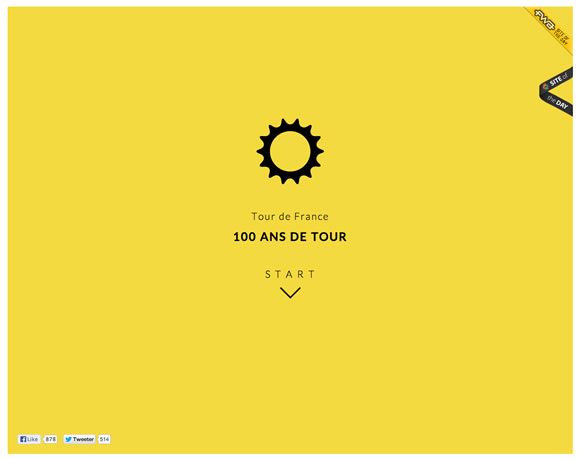

## 7. Spring/Summer

http://springsummer.dk/#/spring-summer

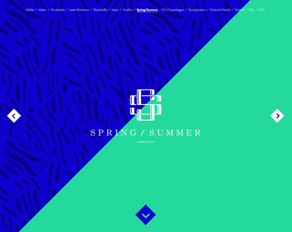

## 8.Snipcart

https://snipcart.com/

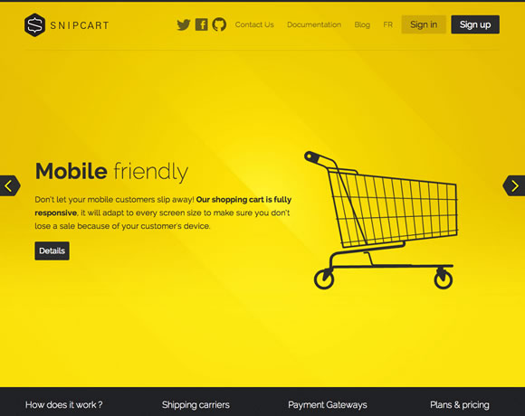

## 9.Reunite the River

http://www.reunitetheriver.com/

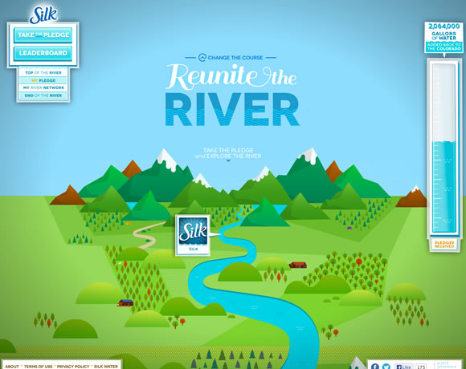

## 10. Think Big

http://startsmall.eu/

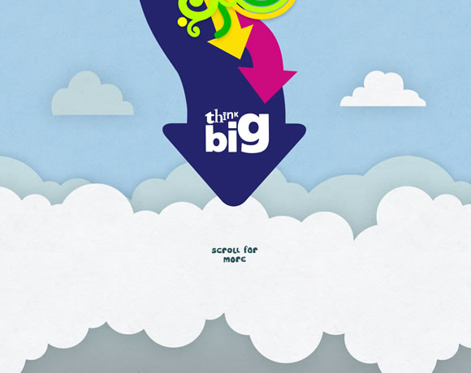

## 11.Caramel Budgie

http://www.caramelbudgie.com/

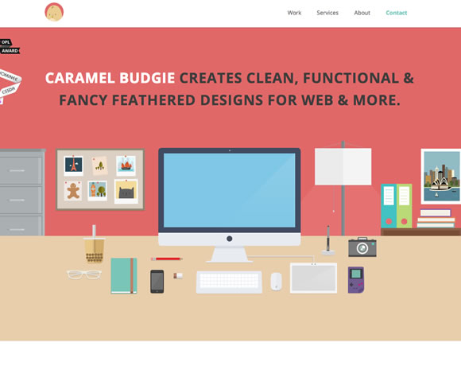

## 12. Nineswiss

http://www.nineswiss.com/

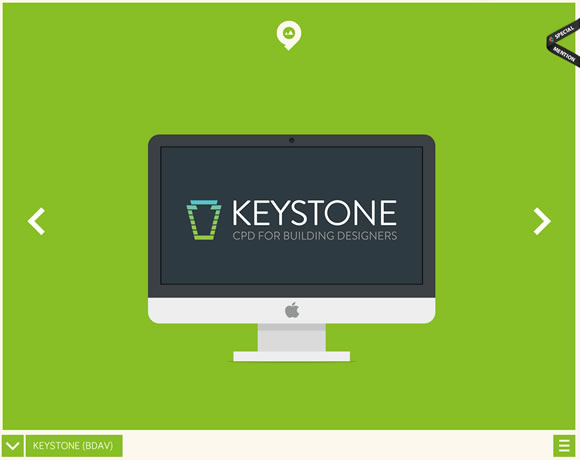

## 13.Parallax.js

http://wagerfield.github.io/parallax/

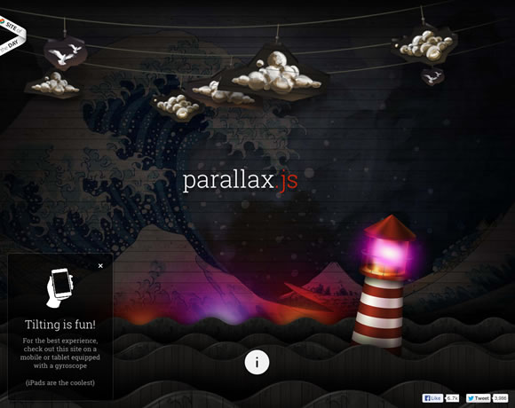
