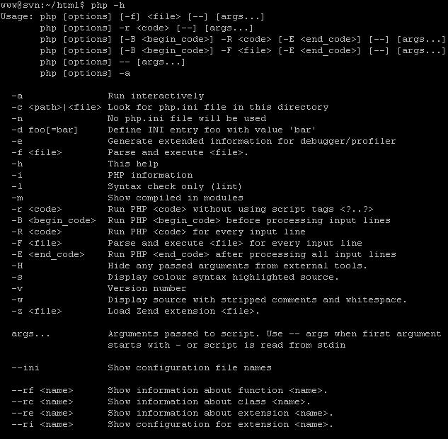

# 学习使用PHP_CodeSniffer（一）

> http://blog.csdn.net/xinhaozheng/article/details/3324796

## 认识PHP_CodeSniffer

`PHP_CodeSniffer`是PEAR中的一个用PHP5写的用来检查嗅探PHP代码是否有违反一组预先设置好的编码标准的一个包，它是确保你的代码简洁一致的必不可少的开发工具，甚至还可以帮助程序员减少一些语义错误。

## 安装PHP_CodeSniffer

如果你的WEB服务器上已经安装了PHP和PEAR，那么直接运行下列命令就可以安装`PHP_CodeSniffer`。

```shell
$ pear install PHP_CodeSniffer
```

安装后，你可以在命令行敲入命令phpcs来调用`PHP_CodeSniffer`检查代码，默认情况下，`PHP_CodeSniffer`采用的是PEAR的编码标准；你现在就可以尝试一下用它来检查你的代码是否符合编码标准，如：

```shell
$ phpcs /path/to/code/yourfile.php
```

如果要检查一个目录，则应使用下列命令：

```shell
$ phpcs /path/to/code
```

## PHP_CodeSniffer的使用方法

使用`PHP_CodeSniffer`的主程序是phpcs，它的具体使用方法我们可以通过在命令行运行下列命令来获得phpcs的相关参数及相应的使用信息。

```shell
$ phpcs -h
```



## 使用PHP_CodeSniffer检查文件或文件目录

使用`PHP_CodeSniffer`的最简单的方式是直接给phpcs传递一个路径。如果路径是指向一个文件目录，那么`PHP_CodeSniffer`会检查该文件目录及其也有了目录中的所有文件。如果你不希望检查所有子目录，你可以加上-l（locally)参数，这样它只会检查当前目录中的文件。

```shell
$ phpcs /path/to/code/myfile.inc
$ phpcs /path/to/code/my_dir
```

你也可以同时指定多个文件或目录以供`PHP_CodeSniffer`检查。

```shell
$ phpcs /path/to/code/myfile.inc /path/to/code/my_dir
```

## 控制PHP_CodeSniffer输出的检查结果

`PHP_CodeSniffer`在检查完文件之后会给你一个错误报告，列出所有文件中违反编码标准的错误和警告信息。


如果你不想在输出的检查结果中包含警告信息(WARNING)，你可以给phpcs加上`-n`参数。

默认情况下，检查完文件后`PHP_CodeSniffer`会输出所有的错误和警告信息的列表，通常是很长的，尤其是在检查比较多的文件的时候，列表很长而且速度很快，你根本看不到什么。这个时候你可能只需要知道每个文件各自都有多少个错误和警告信息，你可以使用 `--report=summary` 参数。

```shell
$ phpcs --report=summary /path/to/code
```

此外，`PHP_CodeSniffer`还可以将检查结果以xml,csv和类似于Checkstyle输出结果的格式输出，这样方便你在你自己的脚本中对检查结果进步分析处理或者提供给支持Checkstyle的应用程序处理。

```shell
$ phpcs --report=checkstyle /path/to/code
$ phpcs --report=csv /path/to/code
$ phpcs --report=checkstyle /path/to/code
```

> 注：在以csv格式输出检查结果时，输出结果的第一行指示了检查结果信息的顺序（即哪一列对就着什么信息）。

另外，`PHP_CodeSniffer`在处理过程中不输出任何信息直到处理结束输出检查结果。在处理比较多的文件时，有可能需要等待比较长的时间，如果你想知道在此过程中发生了什么事情，你可以在执行`PHP_CodeSniffer`时带上-v参数，这样`PHP_CodeSniffer`在处理过程中会输出当前正在处理的文件的名称，所包含的行数和标识符的个数。

```shell
$ phpcs /path/to/code/CodeSniffer -v
```

## 设置PHP_CodeSniffer的相关配置选项

`PHP_CodeSniffere`有提供一些配置选项，某些编码标准只有在设置了配置选项后才能使用。要设置一个`PHP_CodeSniffer`配置选项，可以使用：

```shell
$ phpcs --config-set <option> <value>
```

你可以使用下列命令删除任意的配置选项，使它恢复到初始值。

```shell
$ phpcs --config-delete <option>
```

使用下列查看配置选项的当前设置

```shell
$ phpcs --config-show
```

下列是`PHP_CodeSniffer`的配置选项列表及其设置方法：

* `default_standard`  默认的编码标准
* `report_format`     默认的错误报告格式
* `show_warnings`     是否默认显示错误报告中的警告(WARNING)信息
* `tab_width`         默认的tab宽度相当于几个空格
* `zend_ca_path`      Zend编码标准所使用的配置选项，指向Zend Code Analyzer（Zend编码分析器）所在的路径

默认情况下，如果命令行没有指定编码标准，`PHP_CodeSniffer`会使用PEAR作为编码标准。你可以通过下列命令来修改默认的编码标准。

```shell
$ phpcs --config-set default_standard Zend
```

默认情况下，即如果命令行没有提供报表输出格式的参数，`PHP_CodeSniffer`会使用完全错误报表格式输出检查结果。你可以通过下列命令来修改检查结果的默认输出格式。

```shell
$ phpcs --config-set report_format summary
```

默认情况下，`PHP_CodeSniffer`输出结果会输出错误和警告信息，你可以在执行phpcs带上`-n`去掉警告信息，也可以通过设定`show_warnings`来决定默认是要显示还是不显示。

```shell
$ phpcs --config-set show_warnings 0
```

默认情况下，`PHP_CodeSniffer`不会将检查过的文件中的tab替换成空格。在命令行指定一个`tab`宽度可以使用`PHP_CodeSniffer`在检查时替换掉被检查文件中的tab。你可以设定`config-set`使`PHP_CodeSniffer`默认替换`tab`成空格。

```shell
$ phpcs --config-set tab_width 4
```

> 注：在`PHP_CodeSniffer`已经被设定成默认替换tab成空格时，在命令行指定`tab_width`为`0`会让`PHP_CodeSniffer`停止替换tab。

Zend编码标准包含一个使用Zend Code Analyzer（Zend编码分析器）的sniff，使用`zend_ca_path`配置选项告诉Zend Code Analyzer的路径。

```shell
$ phpcs --config-set zend_ca_path /path/to/ZendCodeAnalyzer
```

## 指定`PHP_CodeSniffer`所需检查的文件类型（扩展名）

默认情况下，`PHP_CodeSniffer`会检查.inc和.php文件。也就是说，如果你指定了一个目录让`PHP_CodeSniffer`检查，那么只有以inc和php为扩展名的文件才会被检查。你可以在命令行通过`extensions`参数来设置哪一类扩展名的文件需要`PHP_CodeSniffer`检查。

```shell
# 只检查该目录中以php为扩展名的文件
$ phpcs --extensions=php /path/to/code
# 检查该目录中所有以php,inc,lib为扩展名的文件
$ phpcs --extensions=php,inc,lib /path/to/code
```

> 注：此参数对在命令行直接指定文件（而不是文件目录）的情况不适用，因为这种情况下`PHP_CodeSniffer`将会忽略掉所有文件的扩展名。

```shell
# 虽然指定了inc,仍然会检查php文件
$ phpcs --extensions=inc sgl_06x/www/index.php sgl_06x/www/rpc/server.php
```

忽略掉文件的扩展名是`PHP_CodeSniffer`的一个特性，也是唯一的一种检查没有扩展名文件的方法。如果给`phpcs`的是一个文件目录作为参数，那么这个目录中的所以没有扩展名的文件将不会被检查，如果要检查，只能一个一个检查。

## 让PHP_CodeSniffer在检查大量文件时忽略掉其中的某些特殊的文件

在`PHP_CodeSniffer`对大量文件进行检查时，我们可能不想`PHP_CodeSniffer`检查其中的某些特殊的文件。你可以使用`ignore`参数指定文件名的匹配模式，所有文件名与模式匹配的文件都会被忽略掉而不检查。

```shell
$ phpcs --ignore=*/tests/*,*/data/* /path/to/code
```

（待续）
