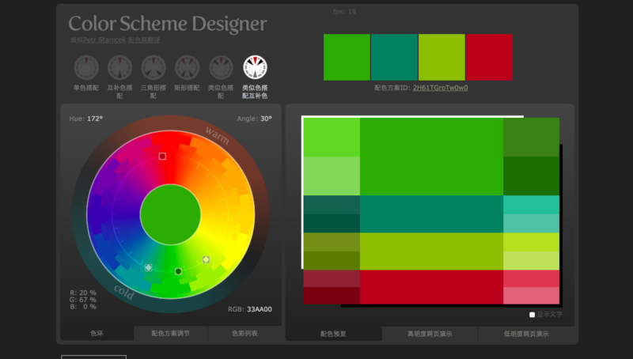
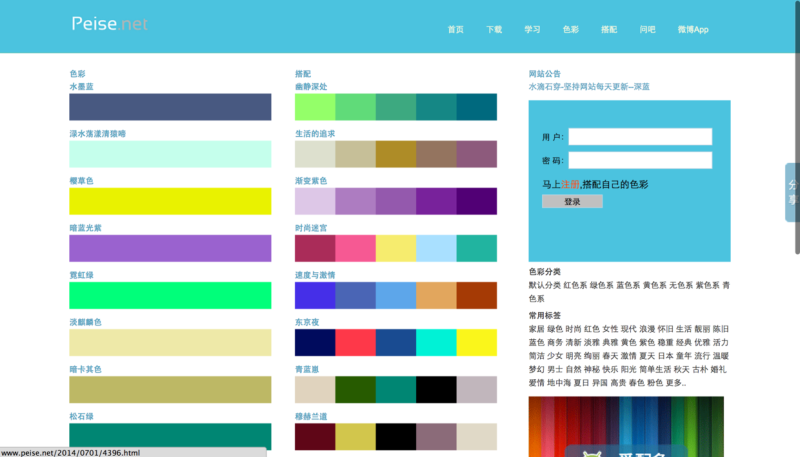
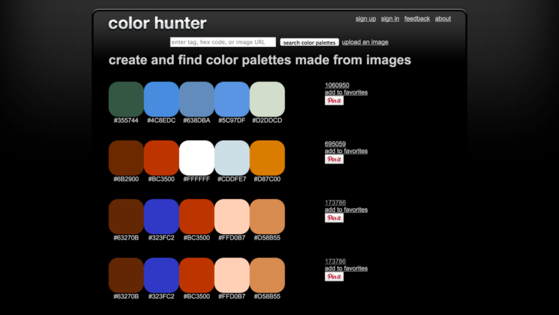
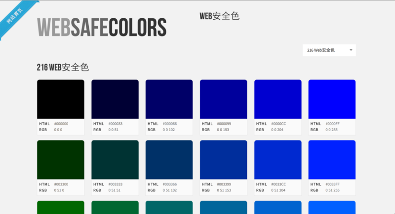
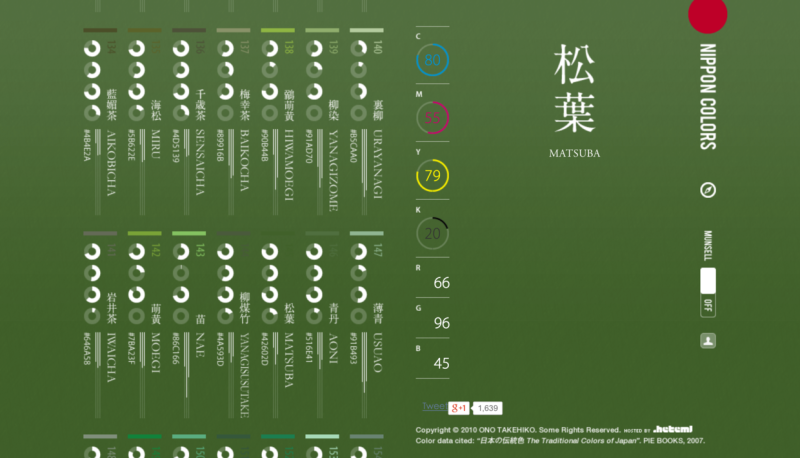

# 让高手帮你配色！超好用的在线配色网站TOP 5

> 来源：http://www.uisdc.com/online-color-swich-top5

> 编者按：想象一下，在部门会议上，Boss对你美工同事设计的配色不太满意，你却始终笑而不语，当问到你的意见时，你呵气如兰，轻声说出：“就用绀桔梗色搭配枇杷茶色吧，再加少许苏芳香。”—— 如此狂拽酷炫的场景，还用得着去问在线配色哪家强吗？配色交给它们，你马克就好。

## 1. Color Scheme Designer

[Color Scheme Designer](http://www.peise.net/tools/web/) 后来改名成Paletton，是笔者一直使用的配色网站。使用时只用开一个窗口，功能完备且实用，定制性强，几乎无缺点，非要说一个的话就是复制RGB值不太方便。但是从今年6月开始，由于中国特色防火墙技术（你懂的），导致原网站打不开，目前由Peise网代理。

## 2. Peise

[配色网](http://www.peise.net/tools/web/)是国内少有的非盈利配色素材网站，要命的是，界面没有任何广告！无任何收费项目！虽然旁边有个注册登录框，但是无账号用户同样可以使用网站的所有资源，而注册的同学就有资格提交自己的配色设计方案，经过管理员的重重审核（一审二审终审），就可以分享给他人。更要命的是，这货还有一个配色app！太感动了~~

此处非软文，千万放宽心。

## 3. Color Hunter

Color Hunter(http://www.colorhunter.com/
) 也是一个十分酷炫的配色网站，功能简单，操作方便，逼格很高，质量上乘，很适合初（lan）学（chong）者使用。网站提供了无数套设计方案，只要搜索你想要的标签名（在网页底部有很多tag，自己找到你想要的就行，否则可能会搜不到），就会迅速给出数套配色方案。还有一个我很喜欢的特色功能：直接把一张图片的URL复制到Search框，网站就能分析图片并给出适合这张图片的配色，用了你就知道有多爽了。

## 4. Web安全色

关于“什么是[Web安全色](http://www.bootcss.com/p/websafecolors/)？”]和“为什么要使用Web安全色？”请移步[web安全色_百度百科](http://baike.baidu.com/view/1529041.htm?fr=aladdin)涨姿势。

其实这算不上是一个配色网站，只能算一种标准。为了方便大家使用，笔者觉得 Bootstrap中文网 上的这个参考页面算是比较清爽又方便的，值得放入收藏夹，以便随时参考。

## 5. 日本の顏色

上面的网站标题是我YY出来的，其实真正的名字就叫 [Nippon Colors](http://nipponcolors.com/)。在使用意义上，这个配色网站并不优秀。要论逼格，却不见得有敌手。

想象一下，旁边的美工朋友开着上面四个之一的配色网站在哪里不停微调，而你却泡一壶清茶，缓缓打开NipponColors网站，绝对秒同事五条街。

想象一下，在部门会议上，Boss对你美工同事设计的配色不太满意，你却始终笑而不语，当问到你的意见时，你呵气如兰，轻声说出：“就用绀桔梗色搭配枇杷茶色吧，再加少许苏芳香。”顿时四座哑然，不懂的以为你在泡花茶，却又不敢质疑，生怕表现自己的无知。如果有日本领导/客户在场，你还可以说出这些颜色的日文发音：KONKIKYO，BIWACHA，SUOHKOH，让那些只会说RGB值的美工同事立刻orz，升职加薪迎娶白富美走上人生巅峰不是梦。

## 后记

写完五个推荐后，已是凌晨两点，让保证早睡的李响同学再一次没有兑现诺言。估计这个也没有多少人看，看了也不一定会去点开链接。（小编：来优设投稿！包涨粉加薪！）但是好东西不分享，奴婢真的做不到啊！！以后还会有更新，敬请期待~
