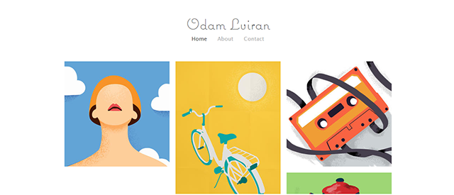
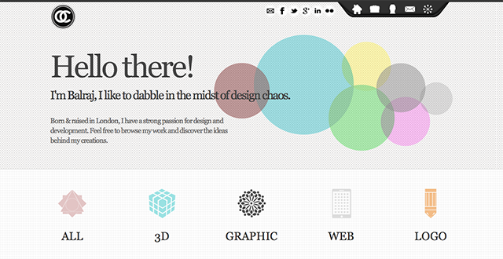
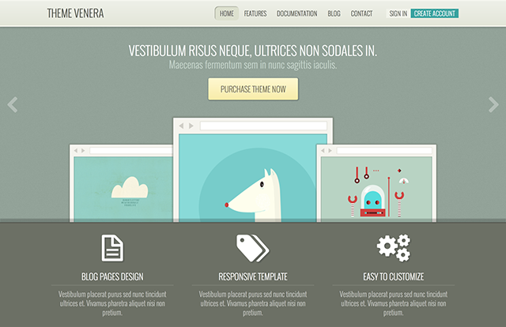

# 跟上色彩潮流！带你展望2015年的网页设计配色趋势

> 来源：http://www.uisdc.com/2015-website-color-trend

前几天分享的2015年春夏流行色人气很高，今天直接放干货，@AnyForWeb_UDC 的同学根据2015年的色彩大致趋势走向，结合相关的设计经验，作出了以下网页配色预测分析，来看看有哪些亮点吧。

提前搞定2015年的设计好文：

* 《我的征程是未来！带你展望2015年最重要的网页设计趋势》(http://www.uisdc.com/7-crucial-webdesign-trends-2015)
* 《快来跟上潮流！来了解一下2015年春夏流行色》(http://www.uisdc.com/2015-spring-fashion-color)

## 一、Metro和柔和鲜嫩的色彩

Odam Luiran的网站是Metro风格，这种风格尤其适合一些比较鲜嫩柔和的颜色，扁平化网页设计在2014年中的流行让柔和色彩的用途变得越来越广泛。这样的色彩基调将在2015年得到进一步的延续，马卡龙色系也许会常常出现在网页设计中。

## 二、偏灰的冷色系粉彩

偏灰的冷色系色彩是一种看起来比较百搭的颜色，但是实际上，要将这类颜色使用的恰如其分却并不是一件容易的事情。这类色彩表现的比较中性，所以搭配任何颜色都不会显得突兀，但也不算出挑，而要让色彩之间真正融合，应该选择清淡的粉彩系透明色，让网页看起来清新脱俗。

还有哪些搭配方法？阿里前辈在前，就不多说咯：《色彩搭配速成！3个实用方法帮你全面搞定配色》（http://www.uisdc.com/3-color-matching-skills)

## 三、根据图片搭配背景色

网页设计需要看整体，而不能针对性的看局部。网页中显示的图片往往是表达网站思想和意图的一部分，属于网站元素中比较重要的环节，所以让背景色来适应图片的颜色是情理之中。如下案例所示，蓝色系的图片搭配蓝灰色的背景，整体表现的十分融洽。

## 四、只有一个重点色

一谈到色彩搭配，常常有人会说一个比较保守的搭配方法：一个区域范围里不能超过三种颜色。这句话并不算完全正确，更深层的含义是，只能有一个重点色。

对这类方法，我们有一大波优秀范例可以给你参考：

* 《洒一腔热血！35个热烈奔放的红色色调网站设计》(http://www.uisdc.com/red-color-website-design)
* 《色彩中的雅痞！26个优雅的蓝色网站设计》(http://www.uisdc.com/26-beautifully-blue-webdesign)
* 《大胆有范！25个配色惊人的黄色色调网站设计欣赏》(http://www.uisdc.com/yellow-color-website-design)
