# 教你从零开始学配色（一）

> 来源：http://www.uisdc.com/head-first-color-theory

> 原文地址：http://www.sitepoint.com/color-theory-101-2/

> 优设网翻译：@木草弥生 (http://weibo.com/inshine)

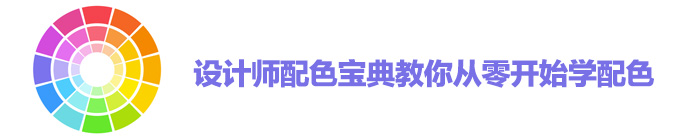

今天我们来聊聊设计师的经典话题：配色！很多自学设计的同学没有接受过系统的色彩训练，在配色方面始终不能随心发挥。网络上的配色技巧很多，但大多不够全面，今天优设从国外翻译了整个系列的配色指南，即使是毫无经验的新手，学习完也能对色彩有比较深刻的认识。

## 设计原则101——色彩理论

第一印象决定一切！大家都可以从各自的外表上大概看出一个人的性格。同样的，这个理论也可以延伸到设计工作里。但是影响设计工作的因素有很多，但是第一时间被关注到的应该是颜色。颜色反映了设计的整体感觉，有时候单凭颜色就可以调度起一个人的情绪、情感甚至回忆。如果没有掌握色彩理论的基础知识，你会发现在日常工作和生活中，你忽略掉了很多细节。

找出哪些颜色配搭在一起很美腻并不是一件偶然的事儿，这其实是一项很科学道理的工作。不同的颜色组合适合不同的作品，而且这种类似固定搭配的组合规则并不能轻易被打破。让我们从最基础的部分开始了解色彩理论吧！

### 原色

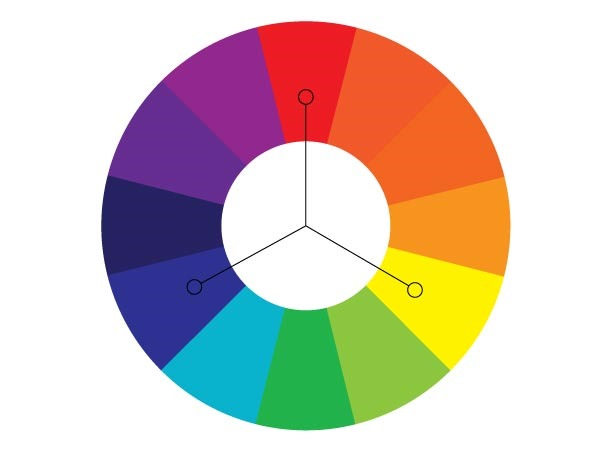

所有颜色的源头被称为三原色，三原色指的是红色、黄色和蓝色。如果我们谈论的是屏幕的显示颜色，比如显示器，三原色则分别是红色、绿色和蓝色，也就是我们熟悉的RGB。

### 间色

如果将红色和黄色、黄色和蓝色、蓝色和红色均匀混合，就会创建三种间色：绿色、橙色和紫色。将这些颜色应用进项目中，可以提供很强烈的对比。

### 三级颜色

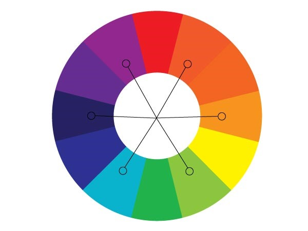

三次色来源于间色与原色的混合，主要有：红紫色、蓝紫色、蓝绿色、黄绿色、橙红色和橙黄色。现在，你应该了解了颜色到底都是怎么衍生出来的，也可以了解色轮上的颜色组合都是从何而来。理解了色彩的原则将有助于在项目中选择颜色。为自己的设计选择一个合适的调性，并创建适量的对比度，让设计工作更好地展开吧！

接下来我们聊聊基于色轮我们可以得到的基本色彩组合。

### 互补色

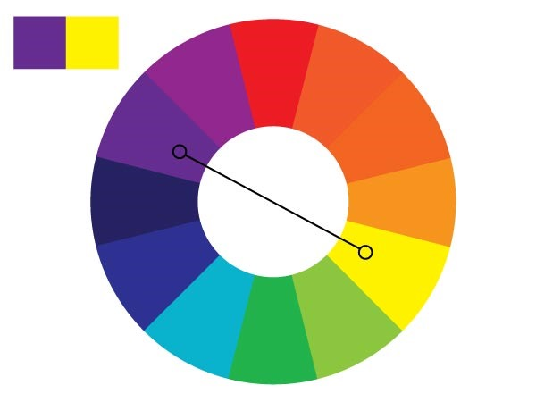

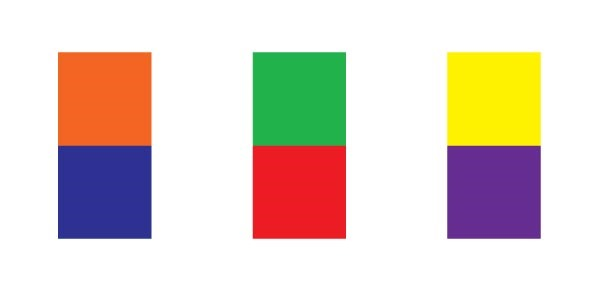

互补色是指色轮上那些呈180°角的颜色。比如蓝色和橙色、红色和绿色、黄色和紫色等。互补色有非常强烈的对比度，在颜色饱和度很高的情况下，可以创建很多十分震撼的视觉效果。

### 相似色

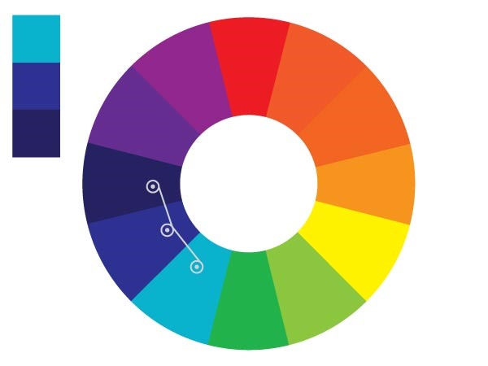

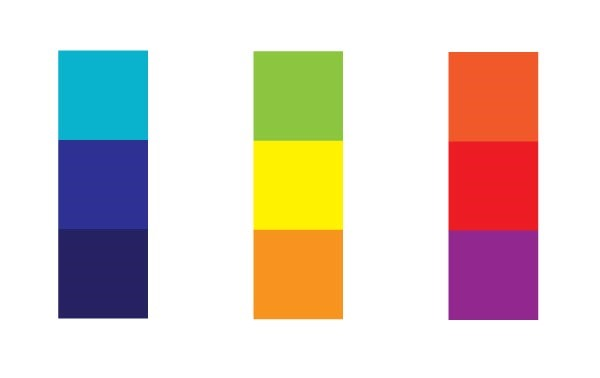

相似色是指在色轮上相邻的三个颜色。相似色是选择相近颜色时十分不错的方法，可以在同一个色调中制造丰富的质感和层次。一些很好的色彩组合有：蓝绿色、蓝色和蓝紫色；还有黄绿色、黄色和橘黄色。

### 三角色

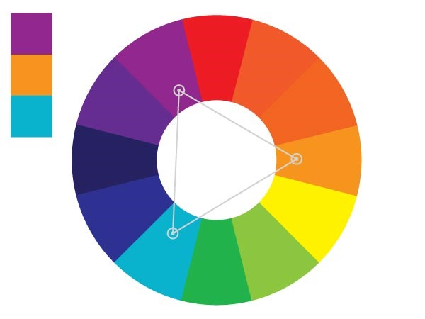

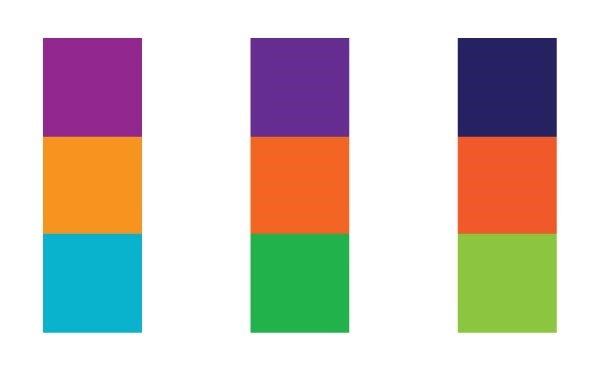

三角色也是一组颜色。是通过在色环上创建一个等边三角形来取出的一组颜色，可以让作品的颜色很丰富。在上面的例子中，蓝紫色和黄绿色就可以形成十分强烈的对比。

### 分散的互补色

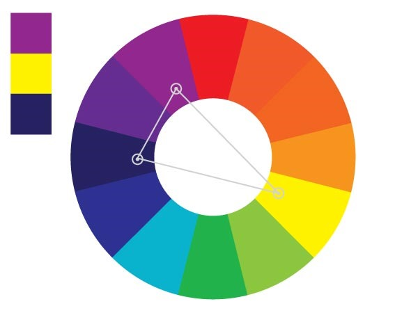

分散的互补色和互补色的区别在于分散的互补色并不是取目标颜色正对面的颜色。拿上面的图做例子来说吧，黄色的互补色应该是紫色，但是我们取紫色旁边的两个颜色——紫红色和蓝紫色。这样子不仅可以有一个强烈的对比度，而且还可以让颜色更丰富。

### 四方色

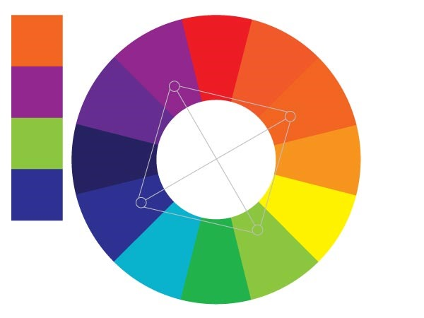

四方色是在色轮上画一个正方形，取四个角的颜色。在上面的例子中是：紫红色、橙黄色、黄绿色和蓝紫色。这个颜色真的超棒的，不信可以自己用用感受一下，尤其是使用其中一个颜色作为主色，其他的三个颜色作为辅助色的时候。

### 四方补色

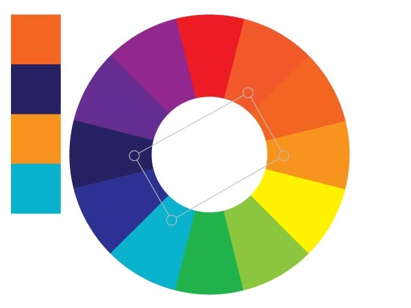

四方补色和四方色的差别在于四方补色采用的是一个矩形。通过一组互补色两旁的颜色建立的色彩组合。如上图中的互补色橙色和蓝色，分别选用他们两旁的颜色来建立矩形，最终取得橙红色、橙黄色、蓝绿色和蓝紫色。

### 明暗

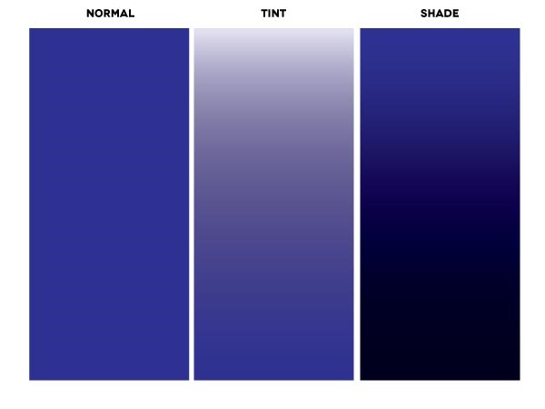

颜色的色调也可以影响颜色给人的感觉，就拿上图的蓝色来说，第一张是原图，第二张添加了白色，第三张添加了黑色，同样的蓝色产生了不同的感觉。在实际应用中，可以在采用单色配色方案时，通过改变颜色的色调来创建不同的感觉。

### 暖色

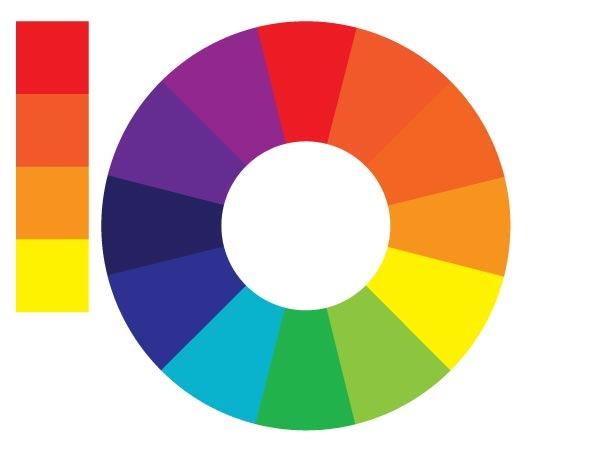

暖色可以创造温暖的感觉，暖色通常会让人联想起太阳、火焰和爱情。红色是血的颜色，感觉是温暖的，橙色和黄色会给人夏天的感觉。给图像添加一个橙色的滤镜，图像看起来就会有温馨快乐的感觉。

### 冷色

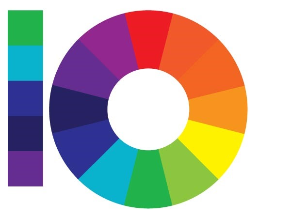

## 颜色的意义

冷色也有其独特的含义，通常会让人联想起凉爽的气候、冬季、死亡、悲伤、冰、夜晚和水这些事物。冷色可以给人平静、安宁、新人、干净的感觉。紫色与尊贵经常联系在一起，看起来十分内敛。

### 红色

红色是代表爱情和激情的颜色。情人节的礼物通常都有一个红色的盒子，或者是粉红色，也就是添加一些白色的红色。红色也代表愤怒和血液。在火焰中可以同时找到红色、橙色和黄色。红色也表示危险，所以很多表示停止的标识牌都是红色的，因为红色可以很好地吸引人们的注意。红色是很强势的颜色，当它和其他颜色相遇时，比如搭配黑色，可以创建非常强势的感觉。红色可以搭配一些严肃的语气和强硬的命令。

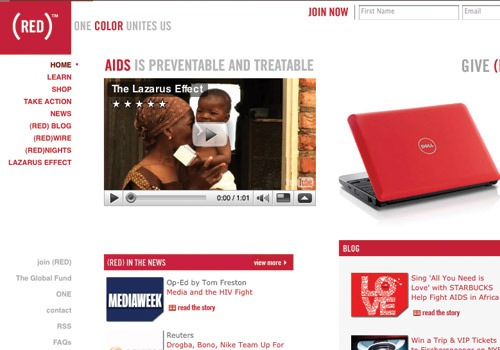

### 橙色

橙色代表了温暖，但是并不像红色那样咄咄逼人。橙色能够创建一个有趣的氛围，因为它充满了活力，而且橙色创造出的活跃气氛并没有危险的感觉。橙色可以与一些健康产品搭上关系，比如维生素C，毕竟橙子里也有很多维生素C。

### 黄色

提到黄色，经常可以联想到太阳和温暖。使用橙色的时候，可以创造出一种夏天的好玩的感觉，黄色则带给人口渴的感觉，所以经常可以在卖饮料的地方看到黄色的装饰。黄色也可以和懦弱与恐惧联系起来，这个则是因为以前“yellow”这个词也代表着这个意思。当黄色与黑色搭配在一起时，十分吸引人的注意力，一个绝佳的例子就是很多国家的出租车都采用这种配色。

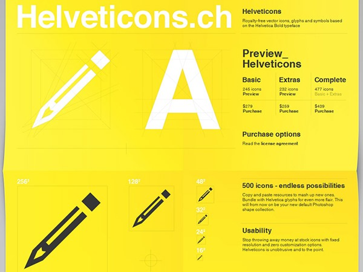

### 绿色

在西方国家，绿色是钱的颜色，这与他们的文化和财富有关。因为大多数植物都是绿色的。绿色也代表着经济增长和健康。绿色经常用作一些保健食品的LOGO，因为看起来就十分贴近自然。绿色还意味着利润和收益。如果搭配上蓝色，通常会给人健康、清洁、生活和自然的感觉。

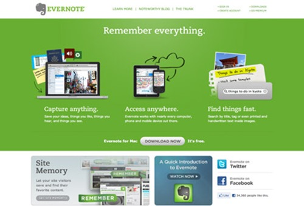

### 蓝色

蓝色是一个神奇的颜色，因为不同明度的蓝色会给人不同的感受、想法和情绪。如下图中所示，深蓝色可以给人一种悲伤的感觉，让人联想起伤心时怎么听都不够的蓝调音乐。而浅蓝色则通常会让人联想起天空和水，给人以提神、自由和平静的感觉。蓝天永远都是平静的，水流可以冲走泥土，清洗伤口，所以蓝色也代表着新鲜和更新。蓝色给人冷静的感觉，会帮助人放松下来。

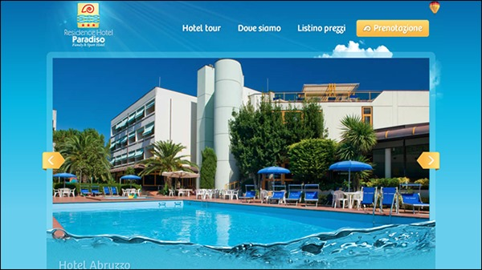

### 紫色

紫色总是让人不禁想起皇室成员的长袍。紫色可以更多地与浪漫、亲密、柔软舒适的质感产生联系。紫色给人一种奢华的感觉，也有一种神秘感。下面这个葡萄酒网站就是极好的例子。

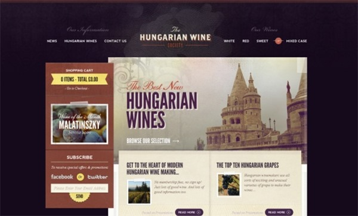

### 白色

白色通常与医院联系在一起，因为医生们都是穿着白大褂的，而且医院内部的装修通常也是白色的。此外，宗教绘画有时候也是没有色彩的，白色也代表着圣洁。白色通常给人干净的感觉，比如白色的床单和衣服都让人感觉很干净。也可以代表棉花和柔软的云朵。心理健康相关的事物也可以选用白色，白色也同样适用于卫生、清洁相关的设计。比如下面这个网站，就很好地利用了白色。

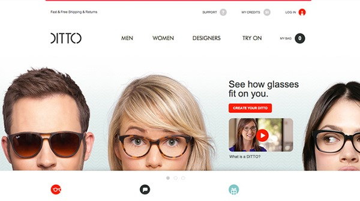

### 黑色

黑色通常与死亡有关，尤其是在美国。它可以代表腐坏，因为很多食物腐坏变质以后就是黑色的。黑色也代表邪恶，因为是白色的对立颜色，而白色通常代表着纯洁美好善良。黑暗和未知也会给人焦虑的感觉。很多图像中，黑色表达了抑郁、绝望和孤独。虽然黑色有很多负面的含义，但是黑色也是一个万能色彩，当黑色遇上其他颜色的时候会产生其他的意义。比如当黑色邂逅金黄色，就可以给人一种奢华、高档的感觉；当黑色偶遇银灰色，则会给人一种成熟稳重的感觉。下面的网站就完美诠释了这一点。

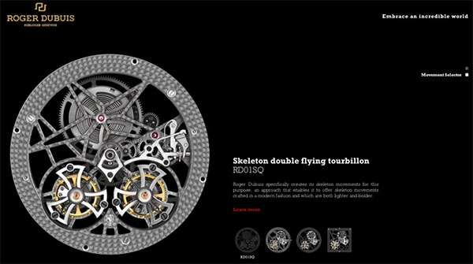

## 总结

作为一名设计师，了解色彩是一件必不可少的事儿。在设计的时候应该慎重地考虑和选用颜色。通过不同的颜色，可以创造出不同感觉的图像。合适的组合可以获得关注，通过视觉传达设计师所想，进一步拉近设计师与观众的距离，让图像更具力量。如果之前并不仔细考虑用色，现在开始，应该培养对于色彩的感觉。相信客户会看到一个不一样的你，你的设计作品将会通过颜色建立联想，更好地传达信息。
