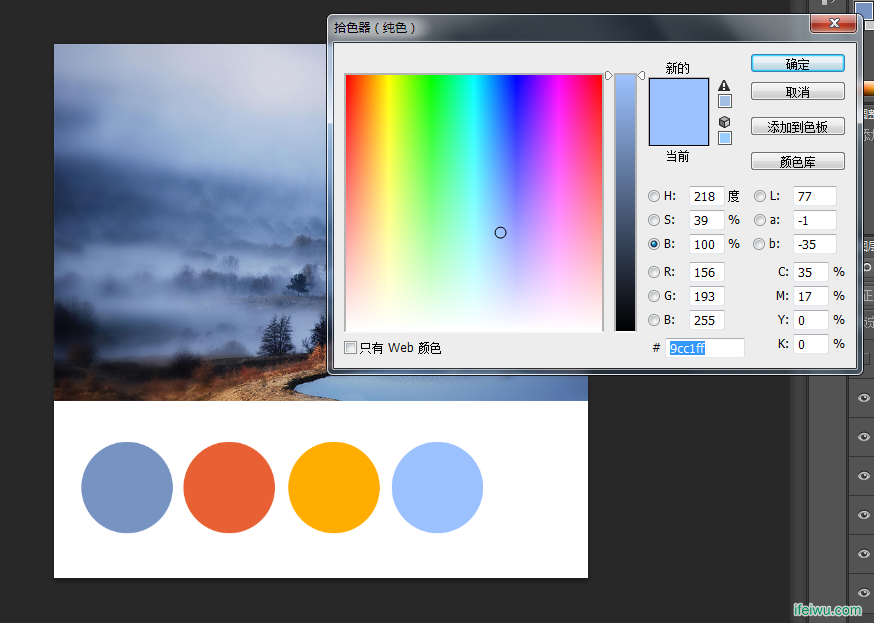

# 配色弱有救了！教你利用图片创建独有的色彩方案！

> 来源：http://www.uisdc.com/use-picture-create-swatches

> 原文地址：http://jianshu.io/p/b4ad4ec87699

> 作者：@飞屋睿UIdesign (http://weibo.com/u/5015930794)

> 编者按：@飞屋睿UIdesign 这篇文章所讲述的配色方法和之前我们发布的[《设计师必备取色技巧！教你在PS里通过照片创建色板》](http://www.uisdc.com/create-color-swatches-from-photograph)基本是相同的，素材处理和细节考量稍有差异，两篇文章互为补充，可以为纠结于配色的你点亮一盏灯。

我们开始设计手机网页时，总是需要先确定好网页的配色方案。那么，这时，除非是客户提出色彩方案，我们大部分要面对的情况的是，根据客户的需求创建出一个色彩方案。在此，我想教大家如何从“图片”这一来源中获取灵感并创建出色彩方案。

## 一、选择图片

首先，去各大网站搜索你喜欢的图片，图片的选择应该尽量选择色调有变化且明暗对比也较为明显的。因为黑白或低对比度的色调只会让你最后的色彩方案看起来不够鲜明。

选择图片去下面这几个网站是不错的：

* http://500px.com/flow/curate
* https://www.flickr.com/explore/
* http://wallbase.cc/

（以上网站自备梯子 ^ ^）不够的话右戳：[设计师网址导航](http://hao.uisdc.com/)，要嘛有嘛

要从配色方面吸引自己的图片上进行选择。

## 二、吸取色彩

在PS里打开这张图片，吸取色彩。吸取色彩并不是任意选取自己喜欢的颜色就可以，根据整个图片的色彩分布，先找到图片的主色调。

### 主色调的选择和使用

主色调的选择依据整个图像当中分布最广的一种颜色，在这张图片中，我们可以看出分布最广的为蓝色，这些蓝色呈现明暗层次深浅的不同，因此，在深蓝到浅蓝中我选择了过渡最为均衡的一种中度灰的蓝色。这种蓝色在图片上表现的是一团团云雾和湖泊的颜色。

## 三、建立自己的色彩方案

选择新建一个文件，白色底背景，图片中选好的色彩作为前景色画一个圆形。这个圆形也就是你的色彩方案中的第一个色彩：主色调。

### 主色调的运用范围

在网页设计的时候，主色调的使用范围在整个网页的色彩面积较大的地方，例如用于网页背景或形状元素上。当然，一种色彩是无法开始设计的，因此接下来我们会选择第二种颜色。

### 辅助色的选择

辅助色通常是一个能烘托、能与之产生呼应的颜色，如果主色调是一个冷色调，那么辅助色就偏向为一个暖色调。因为一张色彩丰富的图片必定是具备冷暖两种倾向的色彩，因此，你这时会在主色调的另外相反色温的色调上进行选择。

在这里我选择了红色屋顶的暖橙色，和蓝色的冷感进行了均衡。

### 辅助色的运用范围

辅助色通常会使用在网页设计中的字体、小面积的元素上。辅助色如果和主色形成了互补色就会产生一种强烈的对比，这时对比色还会有强调的作用。当你想要凸显网页中某个元素时就可以试用上强调色。

那么什么是对比色呢？就是在色环上位置刚好相对的颜色，例如：红色和绿色，紫色和橙色，蓝色和黄色。

如果你觉得你选择辅助色强调不够强烈，你可以另外在主色基础上，从色环里选择主色的对比色，作为第三种色彩方案。

### 高光和阴影

这里通常是指主色调在图片上展示出来的高光和阴影部分。这时，已经无需完全依靠图片了。我们的色彩方案里已经备选了三种颜色，而剩下的色彩就在主色调基础上调整变化。

主色调增加白色就变作高光部分，作为第四种颜色。

如果你的设计配色色彩偏重，这时可以往主色调添加黑色，作为第五种色彩选择。

高光和阴影色在网页中也作为一种修饰的颜色选择，注意慎用。高光和阴影色可选其中一种作为中立色。因为这种利用黑白变幻出的颜色层次丰富，因此这里的选择会非常多。这就需要你在最终色彩方案中再根据实际情况进行调整。

### 确定色彩方案

色彩方案选择好以后，最好确保整体颜色不得超过3种颜色：主色、辅助色、高亮/阴影色。

即使是三种颜色，但是色调都不会偏离整体的蓝色基调。

### 色彩方案的运用

在进行色彩运用的时候，也会出现黑白灰的灵活运用，但要确保这些颜色的出现不会干扰整体画面色彩的和谐感（左）。

大多数时候，我们未必希望纯白色作为我们的底色调。要想让整体看起来优雅，添加一点透明度非常低的主色调作背景是必不可少的（右）。

除了找现成的图片来配色之外，你还可以试试「彩通配色」：

* 《大开眼界！那些巧用「彩通配色」的醒目设计》(http://www.uisdc.com/eye-catching-pantone-inspired-projects)

取色工具多不胜数，不过Kuler应该还是口碑最好的几个取色工具之一：

* 《VC教程！教你使用最受欢迎的配色小工具KULER》(http://www.uisdc.com/adobe-kuler-vc)

当然，行走江湖怎么可以没有备用方案！所以，这个时候不妨看看：

* 《碉堡！配色神器第二代！COLOR CUBE免费开放下载》(http://www.uisdc.com/color-cube-2)
