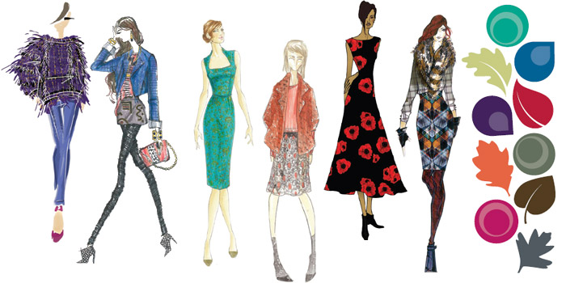

# 设计师们！来了解一下2013年秋冬流行色

> 来源：http://www.uisdc.com/2013-fashion-colour

> 原文地址：http://ux.etao.com/posts/816

纽约著名设计师Isaac Mizrahi曾说过：“时尚让人觉得很棒是因为它让你忘记你即将死去的这个现实”。当然，让你觉得很棒的东西都不会是提醒你早晚都会死这件事儿的。抛去时尚的魔力不提，作为UX设计的我们为什么要了解流行色呢？

美国流行色彩研究中心的一项调查表明，人们在挑选商品的时候存在一个”7秒钟定律” ：面对琳琅满目的商品，人们只需7秒钟就可以确定对这些商品是否感兴趣。在这短暂而关键的7秒钟内，色彩的作用占到67 %，成为决定人们对商品好恶的重要因素，这就是20世纪80年代出现的”色彩营销”的理论依据。同样道理，网页和界面的色彩如果选择和搭配恰到好处，也可 以在段时间内给新用户以良好的印象。同时，商业社会无形的推动下，流行色会不断以各种形式、通过不同媒介出现在我们眼前，而且往往以精美的时装漂亮的模特 等联系在一起；熟悉会带来好感，在不断的视觉轰炸之下那些颜色会不知不觉中深入人心。所以，了解这些颜色、恰当的使用这些颜色，会为我们的设计带来意想不 到的效果。

下面转入正题，来了解一下今年秋冬的流行色吧～

## 2013秋冬女性流行色主题：心情调色板

这一季，设计师们巧妙地安排了这些颜色搭配，表达了秋天里的各种心情，以提升客户们的形象。同时，为满足我们的内在需求，这些颜色的组合唤醒不同的心绪，包括从世故成熟到生动活泼，使我们的衣橱可以充分表达从沉思内省到兴高采烈的不同情绪。

“就如图秋日里树叶颜色的变换，客户们将会享受随意改变自己’形象’的能力，并试着为之后的节日尝试新的方式，” Leatrice Eiseman，潘通色彩研究所的执行总监说到。”2013年秋天的调色板提供了多变的搭配和自由尝试的可能。”

随 着季节的更替，春天的绿色系逐渐演变和发展。多变的祖母绿将在本季继续散发迷人的光彩，给这一季的调色板带来奢华和优雅，而带着黄色色调的菩提绿，给秋季 深色的阴影带来了一抹明快和光彩。米诺斯蓝是一种大胆脱俗、又充满冥想氛围的色调，试着用米诺斯蓝来搭配祖母绿和菩提绿吧，这样可以营造一种典雅而轻松的 秋季新形象。

祖母绿无疑是今年最大行其道的色彩，它常常和”奢华”，”优雅”这样high fashion的形容词联系在一起，但并不阻止个档次的品牌和对象广泛地使用它。作为”color of the year”，祖母绿在网页设计中已经被广泛使用（更多例子见 http://www.awwwards.com/think-in-green-selected-websites-in-shades-of-emerald-inspired-by-pantone-s-color-of-the-year.html ）：

异国情调的深紫色（来自巴西莓的颜色）为调色板添加了神秘和丰富的调子，并且可以与其它颜色搭配创造一系列有力量感的秋季色彩组合。用祖母绿来搭配这种幽雅的深紫色，营造一种贵族风尚，或者用桑巴舞一样热情的桑巴红色搭配，创造一种感性而戏剧性的形象。

锦鲤，一种装饰性的桔黄色，带着眩目而闪闪发光的质感，仿佛在说，”把我添加到你的衣橱里面吧～”。活力紫红，一种野性而难以驾驭的深色紫红，为这个秋天增添了热情奔放的气质。

深苔藓绿是一种天然的深色葱绿，与活力紫红色搭配，充满活力的色彩，巧妙的捕捉了本季光谱的两端。蓝灰色（turbulence），一种深色的水银灰，以及 深褐色（carafe原义是深色玻璃酒瓶），一种丰富而富有魅力的棕色，为渐冷的季节增加了更有趣而富于变化的基础色调，而这种基础色调往往是单调的黑色 扮演的。蓝灰和深褐两种冷色，都适合与充满表现力的暖色优雅的搭配，比如桑巴红，锦鲤和活力紫红色。

## 2013秋冬男性流行色主题：多变而中性的调色板

本季的时尚调色板比以往更倾向于中性色调。于女性流行色类似，2013年秋冬男士流行色同样多变，让客户可以在凉爽的季节里更随意的演绎不同的风格。

奢华的祖母绿，一种迷幻精致而生动活泼的绿色，应该与米诺斯蓝或菩提绿搭配，展示一种经典的清爽形象。当与大胆的色彩搭配时，比如桑巴红，深紫色会增添迷人 的神秘气质。而锦鲤保留了装饰性和戏剧性，为秋冬的衣柜增加了一道活泼的桔黄色。深苔藓绿作为基础色加入到男士流行色之中，将这种深色的苔藓色与高饱和度 的博若莱酒红搭配，营造一种典型的绅士形象。

多变的蓝灰色与温和厚重的深褐色，同样在男士流行色中扮演了主要角色，是秋冬外套的主打颜色。与博若莱酒红或锦鲤搭配，可以创造一种和谐的冷暖平衡。

女性和男性秋冬流行色共11种：

网页设计色彩搭配举例：

一些时尚大牌的主页也纷纷改头换面，开始弥漫优雅深邃的秋季颜色：

