# 设计师们！来了解一下2014年春季流行色

> 来源：http://www.uisdc.com/fashion-color-report-spring-2014

> 原文地址：http://ux.etao.com/posts/981

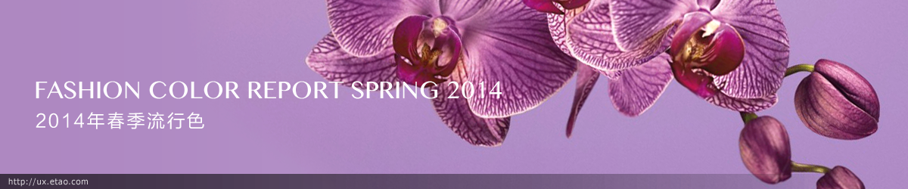

Dazzling Blue（闪蓝色）曾经是年度颜色的热门选择，笔者也为此庆幸过——这种饱和度高的颜色应该不会导致2013年那种祖母绿色泛滥成灾的现象了～ 结果最后公布的是一种取自紫色蝴蝶兰的颜色，这种略带旖旎略带忧伤略带暧昧的颜色可以用在不同场合～ 而且2014年的流行色中，紫色系出现的频率最高！难道是预示着充满基情的一年吗？还是不景气的经济状况需要梦幻的色调来调剂？

* 上期回顾地址 《2013年秋冬流行色》(http://www.uisdc.com/2013-fashion-colour)

Anyway, 在浏览今年流行色之前，先回顾一下过去半个世纪的流行色吧～

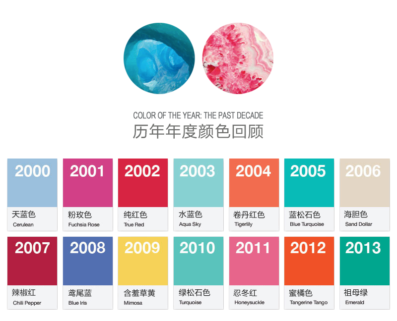

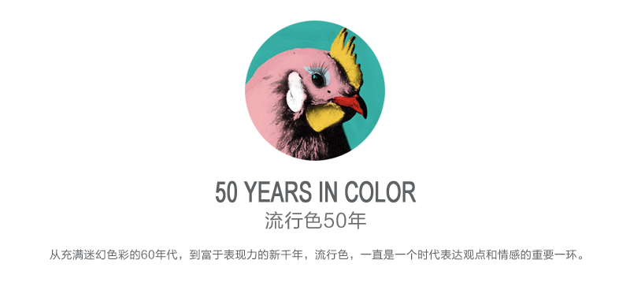

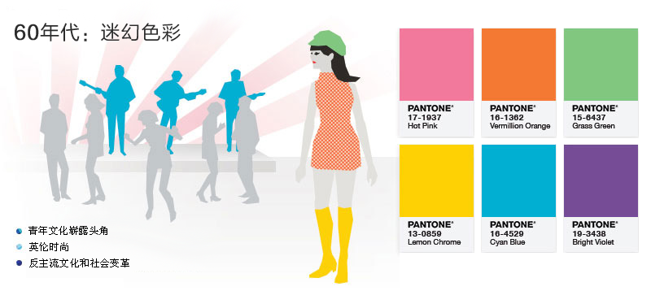

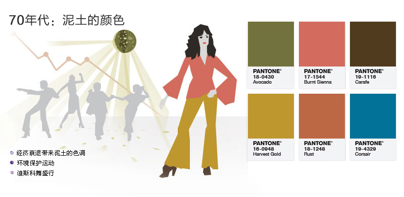

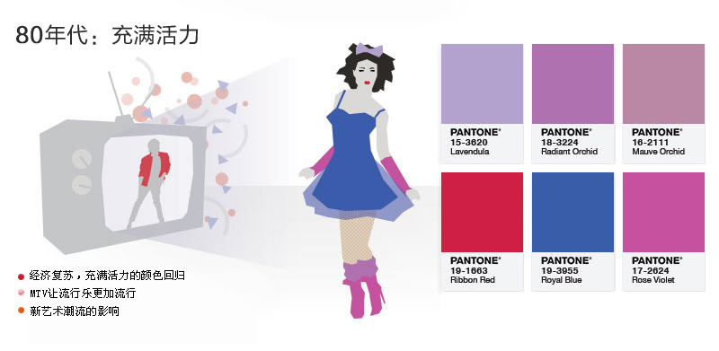

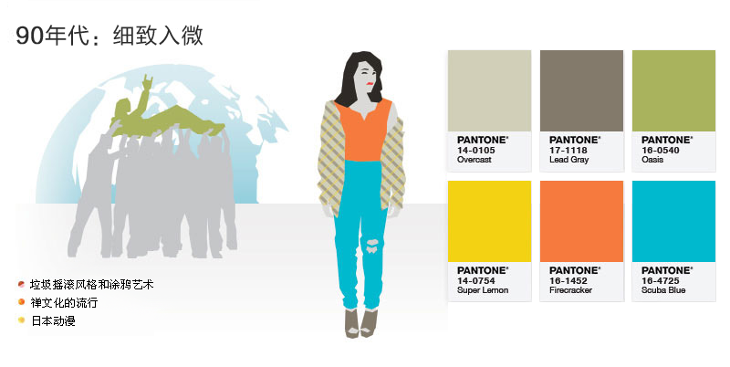

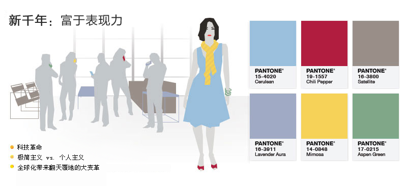

万物复苏的季节通常是明艳的色彩唱主角，这一次的颜色大多来自花花草草，外加土豪金的颜色也来参合了一把～

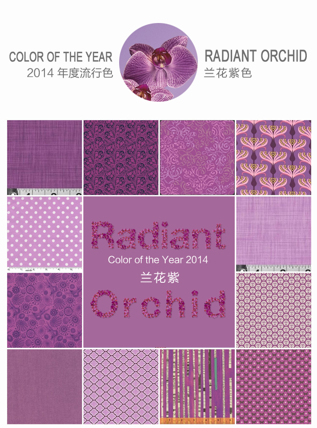

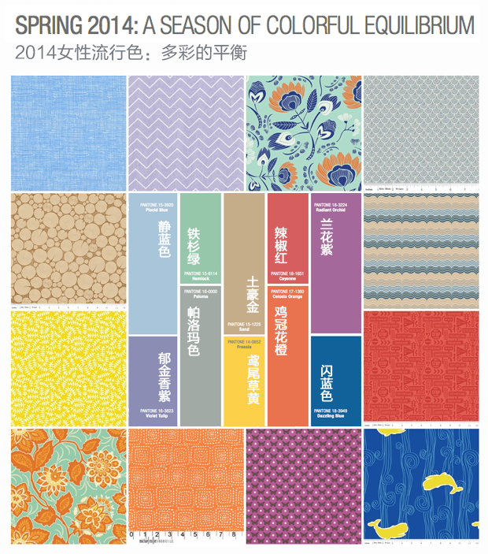

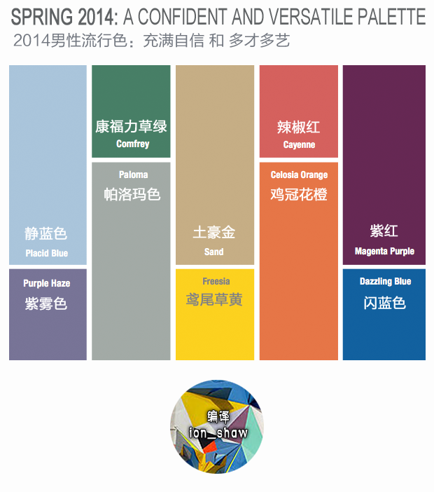

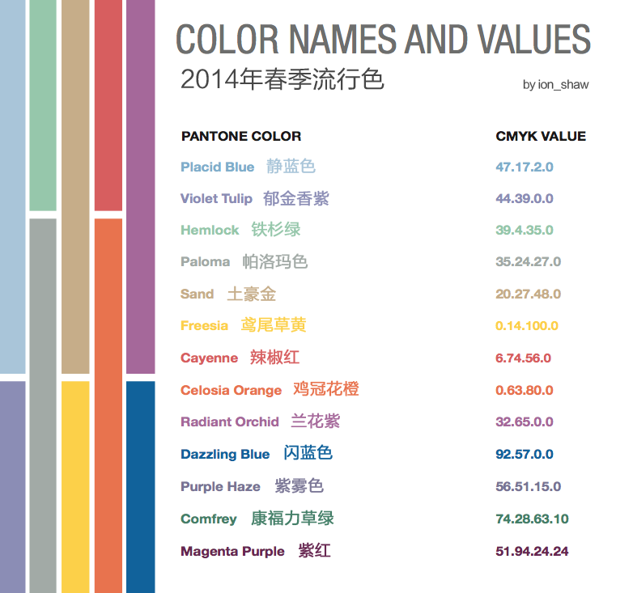
