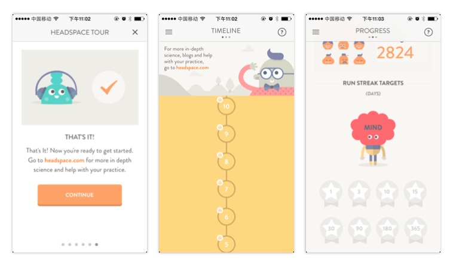

# 快来跟上潮流！来了解一下2015年春夏流行色

> 来源：http://www.uisdc.com/2015-spring-fashion-color

> 原文地址：http://mux.alimama.com/posts/1391

> 编者按：来人啊报警啊，这里捕获好多超漂亮的色彩啦！今天阿里的同学来贡献新干货了，明年的女性流行色是轻盈优雅的组合，男性流行色是纯天然的深沉色调，还有即将到来的春夏流行色，全都非常舒服，当然，一个有格调的色彩名是不可少的，来涨姿势咯。

往期回顾：

* 《设计师们！来了解一下2014年春季流行色》(http://www.uisdc.com/fashion-color-report-spring-2014)
* 《设计师们！来了解一下2013年秋冬流行色》(http://www.uisdc.com/2013-fashion-colour)

---

寒冷的冬天提醒我又要关注一下来年春夏的颜色了，因为春夏的颜色往往清新明快，赏心悦目的颜色会让我感觉冬天不那么难熬…

除了一系列和谐又多变的色彩之外，时尚大师们对于色彩的热情诠释同样让我备受启发。色彩如此直观的牵动人的情绪和思想，想营造庄严的寂静？还是宁静的优雅？是空气感的轻盈？还是现代感的速度？是想给人薰衣草庄园一样的梦幻感？美酒和宝石的奢华感？还是水果和甜品的愉悦感？

2015年春夏的色彩更加偏向冷色调，色彩更加柔软、明快和朴素。女性流行色的领衔颜色是水蓝色，空气感的蓝色调有一种梦幻般的感觉，令人宁静。这种给人舒适感的蓝色能帮助我们缓解压力。

Scuba Blue的出现令我感到惊喜，尽管它属于冷色调，但却给人一种兴奋、欢快的感觉。这种颜色的灵感“来自热带海洋，因此让人有逃离喧嚣、来到异国天堂的愉悦之感”。可惜的是想不出合适的翻译Scuba Blue这个名称… (=￣ω￣=).

---

2015的男性流行色有不小的转变（我感觉有些偏女性呀），更加强调即兴搭配，来自自然的色彩和基本色互相混搭，创造了一系列平易近人、成熟老练风格的流行色。

不知道你发现没有，明年的流行色基本都带有一种偏灰的粉彩色调~

---

关于流行色在界面中的应用，关键是产品自身需要什么样的气质、希望给用户什么样的印象和感受，颜色本身都是美的，设计的美不美，则看设计师的功力。比如今年流行的闪蓝色（Dazzling blue），我曾一度认为这种饱和度很高的颜色很难用在界面中，特别不能作为主色，可是新改版的Foursquare让我眼前一亮，可以说个性十分鲜明：

而2015年的流行色比较适合营造温馨、舒适的感觉，比如这一款灵修功能的APP（是帮助大家开发大脑的啦~呵呵），偏灰白的色系用的恰到好处：

你的色彩搭配是准备传递怎样的讯息呢？

---

【配色达人速成三部曲】

Step 1：打好色彩基础是关键呦！

* 《设计师配色宝典！教你从零开始学配色（一）》(http://www.uisdc.com/head-first-color-theory)

Step 2：进阶技巧！向高手模仿是捷径！

* 《配色弱有救了！教你利用图片创建独有的色彩方案》(http://www.uisdc.com/use-picture-create-swatches)

Step 3：直接开挂！不保证顶尖但一定正确！

* 《秒变配色高手！怎么都不会错的6条网页设计配色原则》(http://www.uisdc.com/6-rules-webdesign-color)
