# 色彩的流行趋势分析及实际设计中的应用

> 来源：http://www.uisdc.com/color-trend

> 刘义 (http://weibo.com/liuyibrand)

无论是平面设计，包装设计还是网页设计，空间设计还是产品设计，色彩永远是最为重要的环节，但我们距离显示屏较远的时候，我们看到的不是优美的版式或者是美丽的图片，而是电脑界面的色彩。

关于色彩的原理有许多，在此我们不可能一一阐述，大家可以看看相关设计书籍或者特别棒的设计案例，有利于系统系统地理解，在此我们通过设计的对比和配色告诉大家在工作中，色彩的配置和色标使用；下面介绍一些色彩在实际使用中的步骤；

## 第一步、底色和图形色；

色彩搭配的问题确实不是一个简单的问题。这一代的设计师比上一代的设计师，所能运用的色彩工具多了许多。如今，我们能运用好计算机为我们提供的丰富色彩，看来不是很简单的事情。就我个人而言，在我从事设计师工作以来，往往也会迷失在色彩的世界。现在交流一下自己学过的和掌握的一些经验，希望大家指正。配色所要注意的要素实际设计时，我们经常会按照设计的目的来考虑与形态、肌理有关联的配色及色彩面积的处理方案，这个方案就是我的配色计划。在做配色计划时，我们应该考虑下述几点以突出视觉效果。

在设计时我们会经常遇到用几个色做各种形的构成，作为底的色我们往往会将它推远，而作为图形或文字的色我们要将它拉近。这就需要我们了解受配色关系的影响是什么样的。一般明亮和鲜艳的色比暗浊的色更容易有图形效果。因此，配色时为了取得明了的图形效果必须首先考虑图形色和底色的关系。图形色要和底色有一定的对比度。这样才可以很明确的传达我们要表现的东西。我们要突出的图形色必须让它能够吸引观者的主要注意力。如果不是这样就会喧宾夺主。

## 第二步、整体色调

如果我们想使我们的设计能够充满生气，稳健，冷清或者温暖，寒冷等感觉都是由整体色调决定的。那么我们怎么能够控制好整体色调呢？只有控制好构成整体色调的色相、明度、纯度关系和面积关系等。才可以控制好我们设计的整体色调。首先要在配色中心决定占大面积的色，并根据这一色来选择不同的配色方案会得到不同的整体色调。从中选择出我们想要的。

如果我们用暖色系列来做我们的整体色调则会呈现出温暖的感觉，反之亦然。如果用暖色和纯度高的色作为整体色调则给人以火热刺激的感觉，以冷色和纯度低的色为主色调则让人感到清冷、平静的感觉。以明度高的色为主则亮丽，而且变得轻快，以明度低的色为主则显得比较庄重、肃穆。 取对比的色相和明度则活泼，取类似、同一色系则感到稳健。色相数多则会华丽，少则淡雅、清新。 以上几点整体色调的选择要根据我们所要表达的内容来决定。

## 第三步、配色的平衡

颜色的平衡就是颜色的强弱、轻重、浓淡这种关系的平衡。这些元素在感觉上会左右颜色的平衡关系。因此，即使相同的配色，也将会根据图形的形状和面积的大小来决定成为调和色或不调和色。一般同类色配色比较容易平衡。处于补色关系且明度也相似的纯色配色，如：红和兰绿的配色，会因过分强烈感到刺眼，成为不调和色。可是若把一个色的面积缩小或加白黑，改变其明度和彩度并取得平衡，则可以使这种不调和色变的调和。纯度高而且强烈的色与同样明度的浊色或灰色配合时，如果前者的面积小，而后者的面积大也可以很容易的取得平衡。将明色与暗色上下配置时，若明色在上暗色在下则会显得安定。反之，若暗色在明色上则有动感。

## 第四步、配色时要有重点色

配色时，为了弥补调子的单调，可以将某个色作为重点，从而使整体配色平衡。在整体配色的关系不明确暧昧时，我们就需要突出一个重点色来平衡配色关系。选择重点色要注意以下几点：重点色应该使用比其他的色调更强烈的色。 重点色应该选择与整体色调相对比的调和色。 重点色应该用于极小的面积上。而不能用于大面积上。选择重点色必须考虑配色方面的平衡效果。

## 第五步、配色的节奏

由颜色的配置产生整体的调子。而这种配置关系在整体色调中反复出现排列就产生了节奏。色的节奏和颜色的排放，形状，质感等有关。由于渐进的变化色相、明度、纯度都会产生变化而且时有规律的，所以就产生了阶调的节奏。将色相、明暗、强弱等等的变化做几次反复，从而会产生反复的节奏。可以通过赋予色彩的配置以跳跃和方向感就会产生动的节奏，等等。我们可以通过学习或训练来掌握更多的节奏效果。

## 第六步、渐变色的调和

2色或2个以上的色不调和时，在其中间插入阶梯变化的几个色，就可以使之调和。色环的渐变：色相的渐变象色环一样，在红、黄、绿、兰、紫等色相之间配以中间色，就可以得到渐变的变化。明度的渐变：从明色到暗色阶梯的变化。 纯度的渐变：从纯色到浊色或到黑色的阶梯变化。根据色相、明度、纯度组合的渐变，把各种各样的变化作为渐变的处理，从而构成复杂的效果。这些渐变色都是调和的。

## 第七步、在配色方面的统调

所谓统调，即为了多色配合的整体统一而用一个色调支配全体，将这个色叫做统调色，也就是支配色调。色相统调是在各色中加入相同的色相，而使整体色调统一在一个色系当中。从而达到调和。明度统调是加白色或黑色，以使全体色调的明度相似。这样也可以达到调和。 纯度统调是加灰色，以使全体色调的纯度相似

## 第八步、在配色方面的分割

2个色如果互相处于对立关系是对比的，具有过分强烈的效果，成为不调和色。为了调节它们，在这些色中用其它色把它们划分开来，即分割。将用于分割的色叫做分割色。由于分割的目的，可以用于分割色的颜色不多，最常用的是白、灰、黑。金色和银色也具有分割的效果。但在我们的电脑中很难调出具有重量感的这两种色，所以在电脑中几乎用不到这两种色。但可以用于印刷中。使用其它彩色进行分割也可以，但要选择与原来色有明显区别的明度，同时也应考虑色相和纯度。

这些在配色时注意的一些问题和解决的一些基本方法。我想还有更多的色彩问题，我这里没有谈到。如：色彩的感情、色彩的形状、色彩的味觉、色彩的距离感、色彩的音乐感等等。

## 附录：

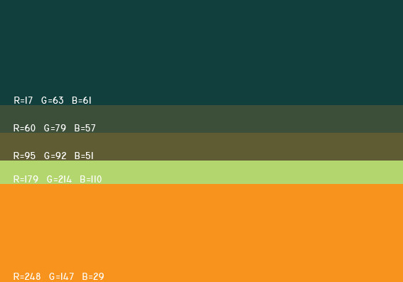

---

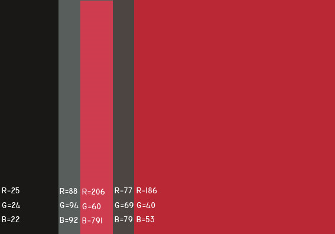

---

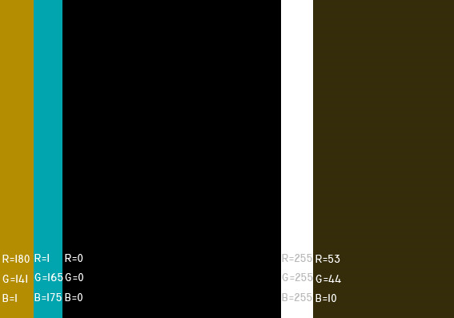

---

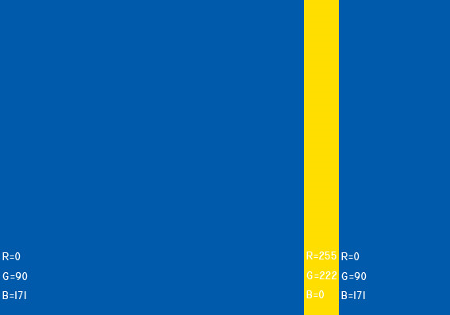

---

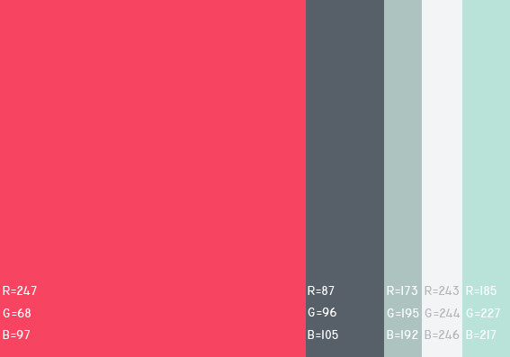

---

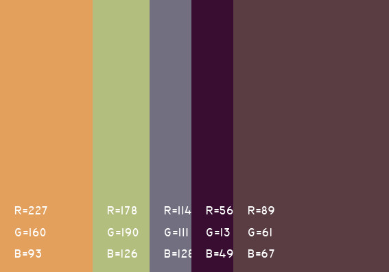

---

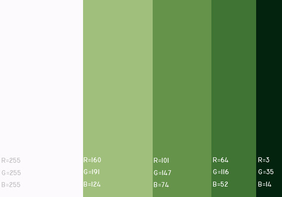

---

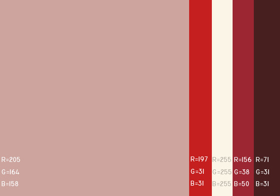

---

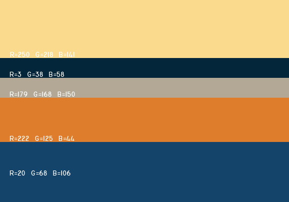

---

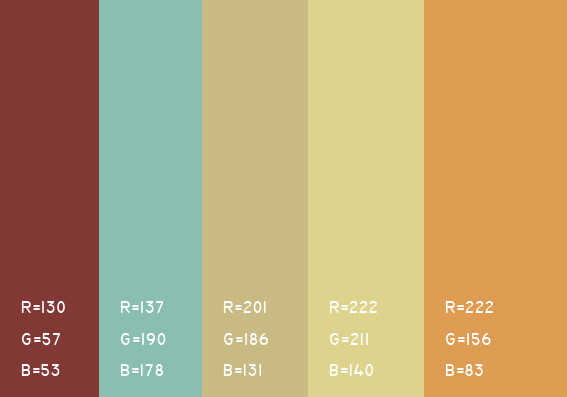

---

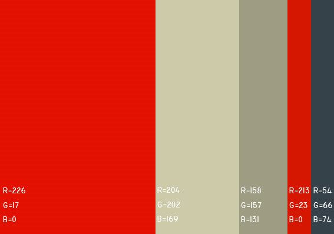

---

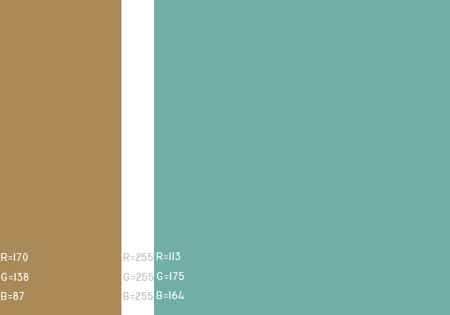

---

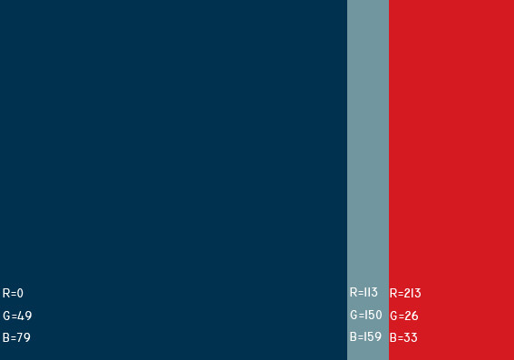

---

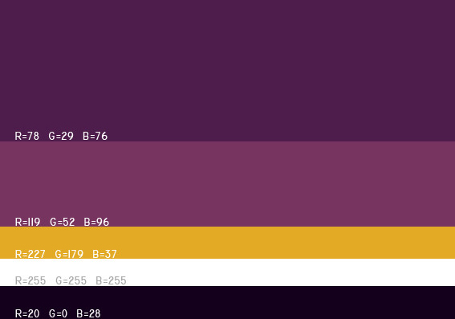

---

---

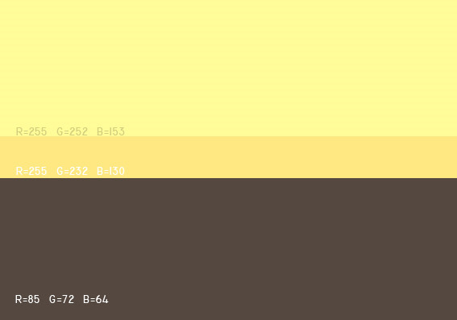

---

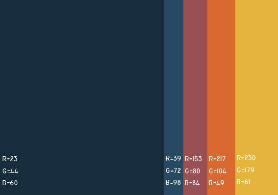

---

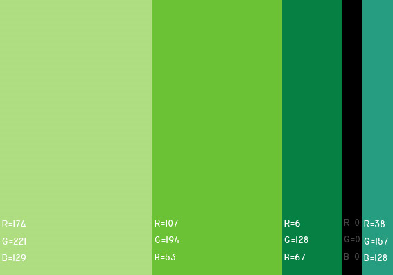

---

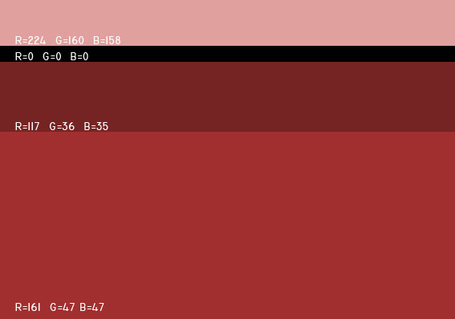

---

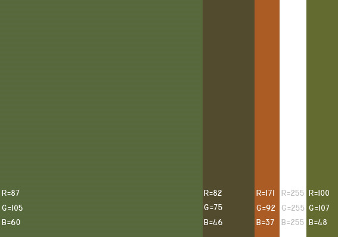

---

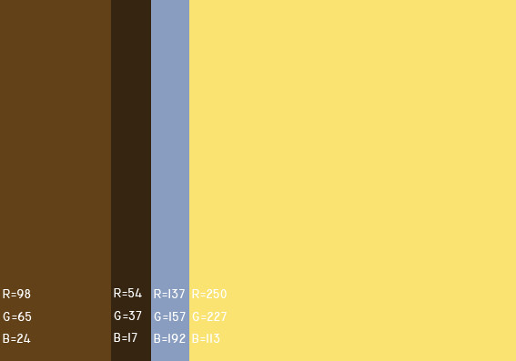

---

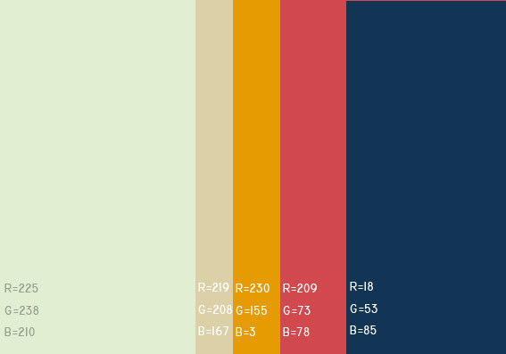

---

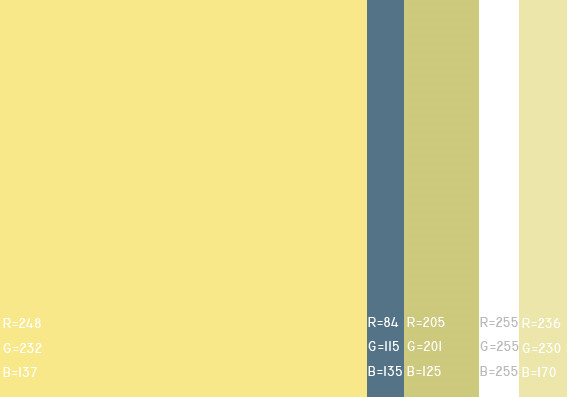

---

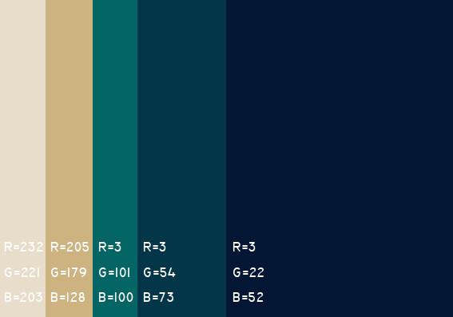

---

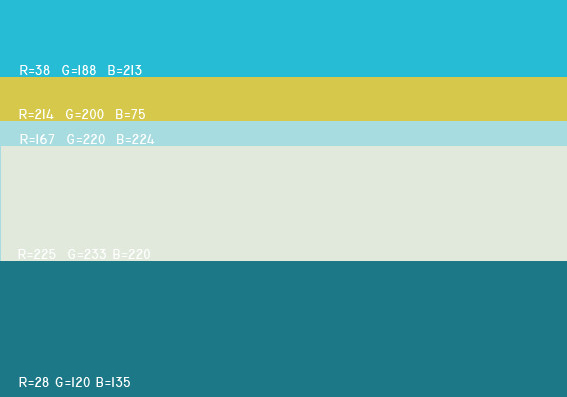

---

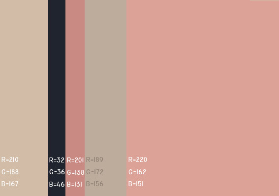

---

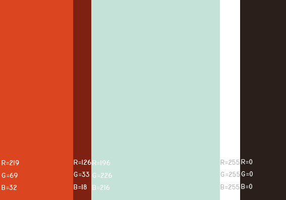

---

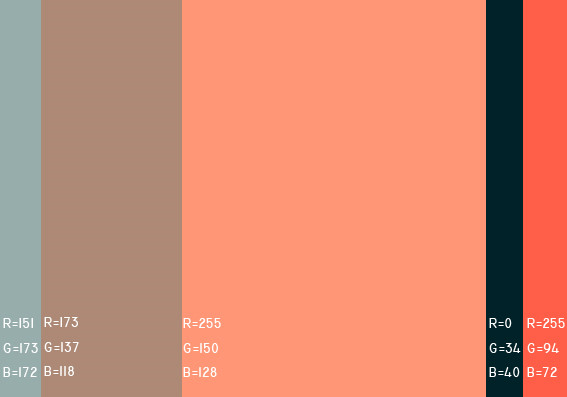

---

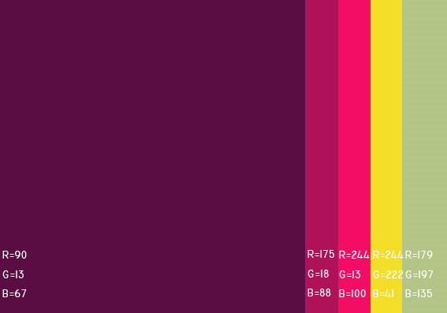

---

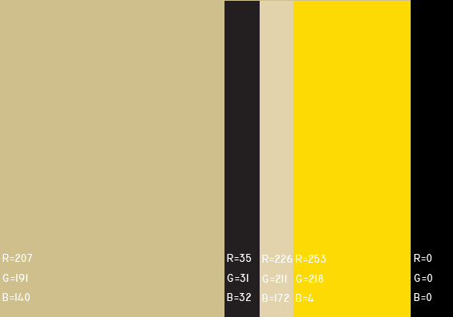

---

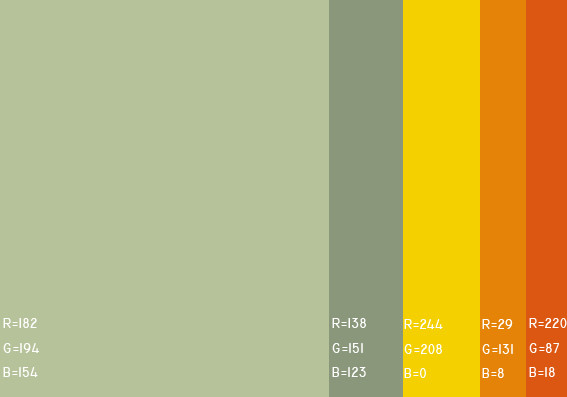

---

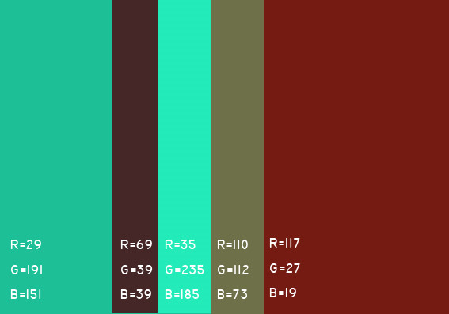

---

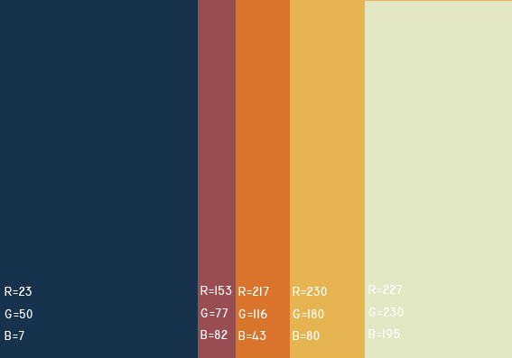

---

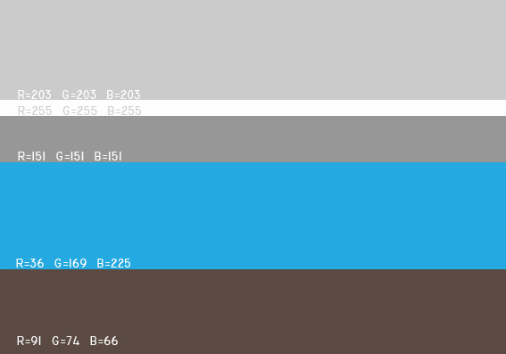

---

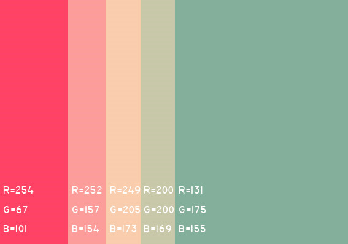

---

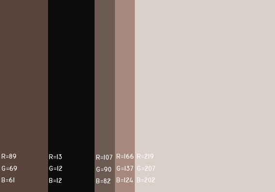

---

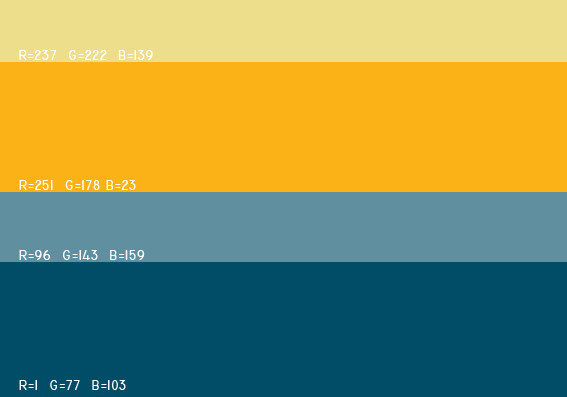
