# 色彩设计方法

> 来源：http://mux.alimama.com/posts/1392

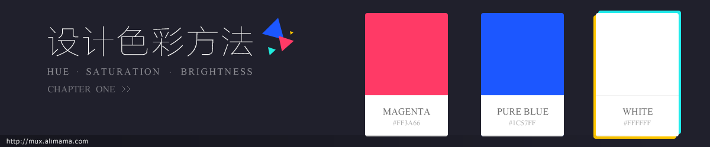

## 为什么要整理设计色彩方法？

在色彩设计应用中，我们对颜色不同程度的理解，影响到设计页面的表现，熟练地运用色彩搭配，设计时岂不事半功倍。一张优秀的设计作品，它的色彩搭配必定和谐得体，令人赏心悦目，反思我们在设计过程中，怎样的色彩搭配更容易达到设计目的，又是什么影响了我们的配色思维呢？

以下几点常会影响色彩搭配思维：

1. 仅关注色彩表象
1. 搭配方法不够系统
1. 色彩与构成掌握不到位

首先，我们简单理解一下色相和色调概念：

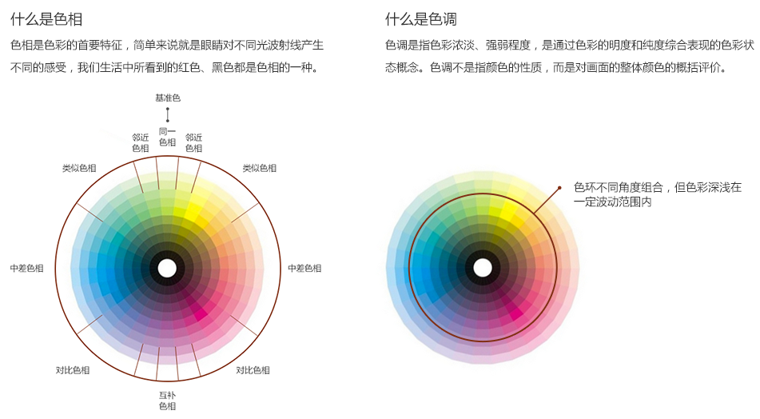

## 谈谈一些基础配色方法

接下来我们按三个大类的配色方法，结合一些案例，分析色彩在页面中的应用手法。

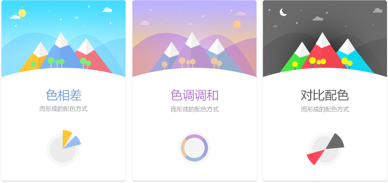

### (一)色相差而形成的配色方式

#### 1.1 有主导色彩配色

这是由一种色相构成的统一性配色。即由某一种色相支配、统一画面的配色，如果不是同一种色相，色环上相邻的类似色也可以形成相近的配色效果。当然，也有一些色相差距较大的做法，比如撞色的对比，或者有无色彩的对比，但这里先讲述带主导色的配色案例。

根据主色与辅色之间的色相差不同，可以分为以下各种类型：

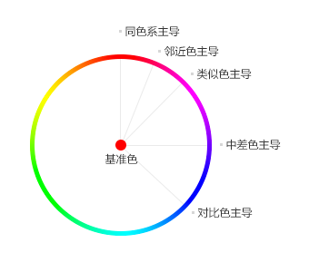

##### 1.1-1 同色系配色

同色系配色是指主色和辅色都在统一色相上，这种配色方法往往会给人页面很一致化的感受。

twitter的案例：https://twitter.com/

整体蓝色设计带来统一印象，颜色的深浅分别承载不同类型的内容信息，比如信息内容模块，白色底代表用户内容，浅蓝色底代表回复内容，更深一点的蓝色底代表可回复操作，颜色主导着信息层次，也保持了twitter的品牌形象。

> 观点：颜色差分割页面层次和模块，并代表不同功能任务属性。

##### 1.1-2 邻近色配色

近邻色配色方法比较常见，搭配比同色系稍微丰富，色相柔和过渡看起来也很和谐。

ALIDP的案例：https://alidp.org/

纯度高的色彩，基本用于组控件和文本标题颜色，各控件采用邻近色使页面不那么单调，再把色彩饱和度降低用于不同背景色和模块划分。

> 观点：基于品牌色的邻近色运用，灵活运用到各类控件中。

##### 1.1-3 类似色配色

类似色配色也是常用的配色方法，对比不强给人色感平静、调和的感觉。

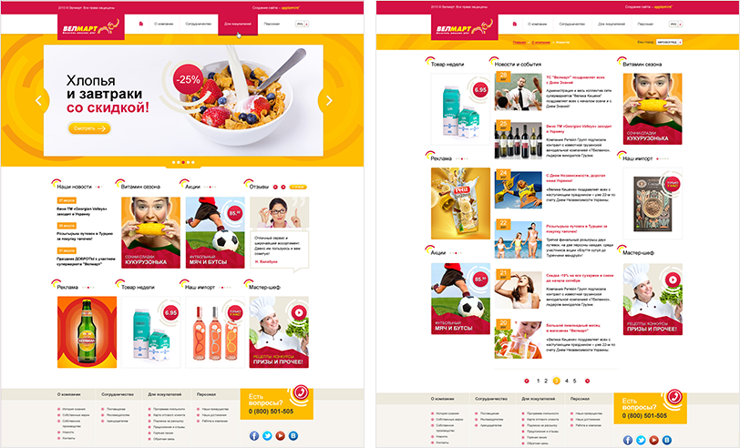

BENMAPT的案例

红黄双色主导页面，色彩基本用于不同组控件表现，红色用于导航控件、按钮和图标，同时也作辅助元素的主色。利用偏橙的黄色代替品牌色，用于内容标签和背景搭配。

> 观点：基于品牌色的类似色运用，有主次地用到页面各类控件和主体内容中。

##### 1.1-4 中差色配色

中差色对比相对突出，色彩对比明快，容易呈现饱和度高的色彩。

facebook的案例：http://www.facebook.com/

颜色深浅营造空间感，也辅助了内容模块层次之分，统一的深蓝色系运用，传播品牌形象。中间色绿色按钮起到丰富页面色彩的作用，同时也突出绿色按钮任务层级为最高。深蓝色吊顶导航打通整站路径，并有引导用户向下阅读之意。

> 观点：利用色彩对比突出按钮任务优先级，增加页面气氛。

##### 1.1-5 对比色配色

主导的对比配色需要精准地控制色彩搭配和面积，其中主导色会带动页面气氛，产生激烈的心理感受。

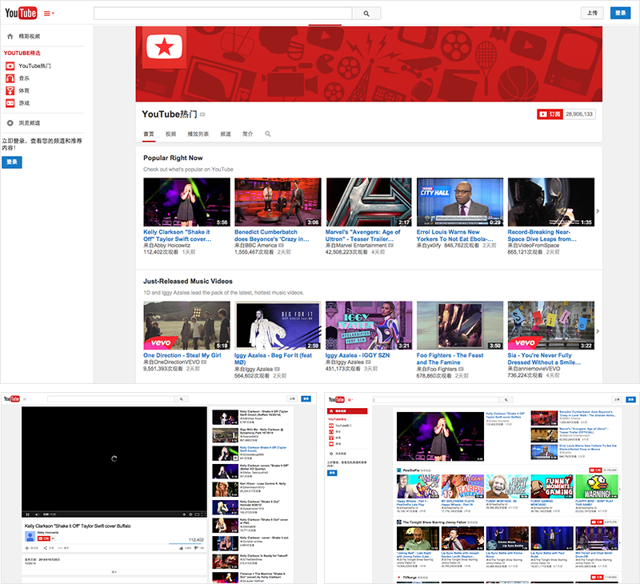

YouTube的案例：https://www.youtube.com/

红色的热闹体现内容的丰富多彩，品牌红色赋予组控件色彩和可操作任务，贯穿整个站点的可操作提示，又能体现品牌形象。红色多代表导航指引和类目分类，蓝色代表登录按钮、默认用户头像和标题，展示用户所产生的内容信息。

> 观点：红蓝色反应不同交互和信息的可操作性，针对系统操作和用户操作的区分。

##### 1.1-6 中性色配色

用一些中性的色彩作为基调搭配，常应用在信息量大的网站，突出内容，不会受不必要的色彩干扰。这种过配色比较通用，非常经典。

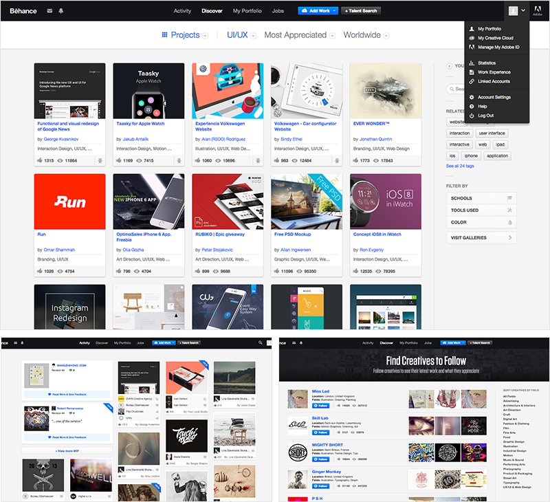

Bechan的案例：https://www.behance.net/

黑色突出网站导航和内容模块的区分，品牌蓝色主要用于可点击的操作控件，包括用户名称、内容标题。相较于大片使用品牌色的手法，更能突出内容和信息，适合以内容为王的通用化、平台类站点。

> 观点：利用大面积中性色作为主导色，品牌色在这里起到画龙点睛的作用，用于一些需要重点突出的场景，强调交互的状态等。

##### 1.1-7 多色搭配下的主导

主色和其他搭配色之间的关系会更丰富，可能有类似色、中差色、对比色等搭配方式，但其中某种色彩会占主导。

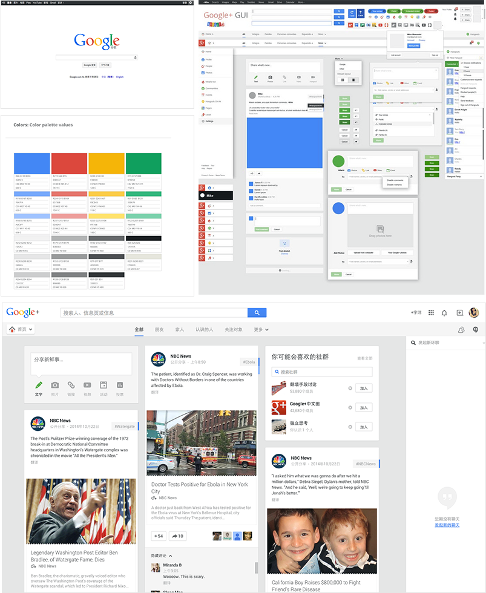

Google的案例：http://www.google.com

对于具有丰富产品线的谷歌来说，通过4种品牌色按照一定的纯度比，再用无色彩黑白灰能搭配出千变万化的配色方案，让品牌极具统一感。在大部分页面，蓝色会充当主导色，其他3色作辅色并设定不同的任务属性，黑白灰多作为辅助色，对于平台类站点来说，多色主导有非常好的延展性。

观点：谷歌设置了四种品牌色，通过主次、合理的比例应用在界面中，并通过组控件不同的交互状态合理分配功能任务。

### (二)色调调和而形成的配色方式

#### 2.1 有主导色调配色

这是由同一色调构成的统一性配色。深色调和暗色调等类似色调搭配也可以形成同样的配色效果。即使出现多种色相，只要保持色调一致，画面也能呈现整体统一性。

根据色彩的情感，不同的调子会给人不同的感受

##### 2.1-1 清澈色调

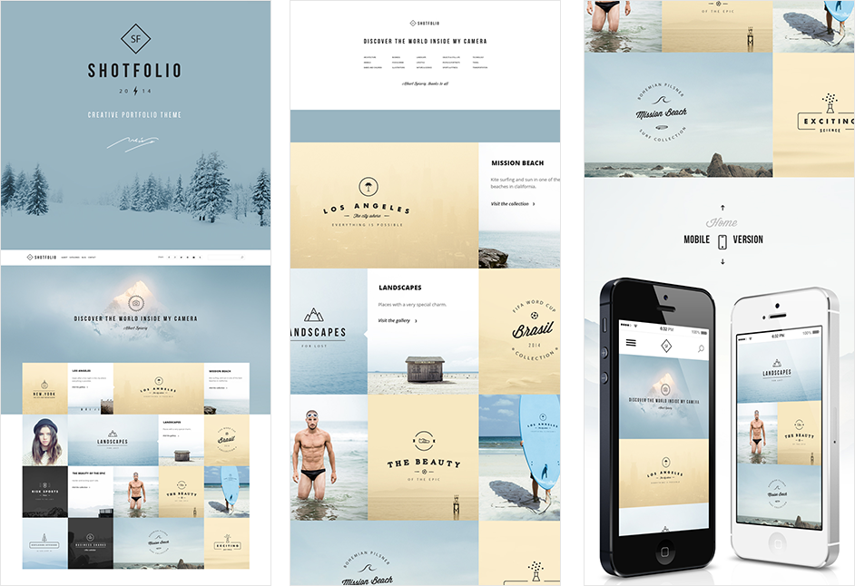

SHOTFOLIO的案例

清澈调子使页面非常和谐，即使是不同色相形同色调的配色能让页面保持较高的协调度。蓝色另页面产生安静冰冷的气氛，茶色让我们想起大地泥土的厚实，给页面增加了稳定踏实感觉，同时暖和蓝色的冰冷。

> 观点：互补的色相搭配在一起，通过统一色调的手法，可以缓和色彩之间的对比效果。

2.1-2 阴暗色调

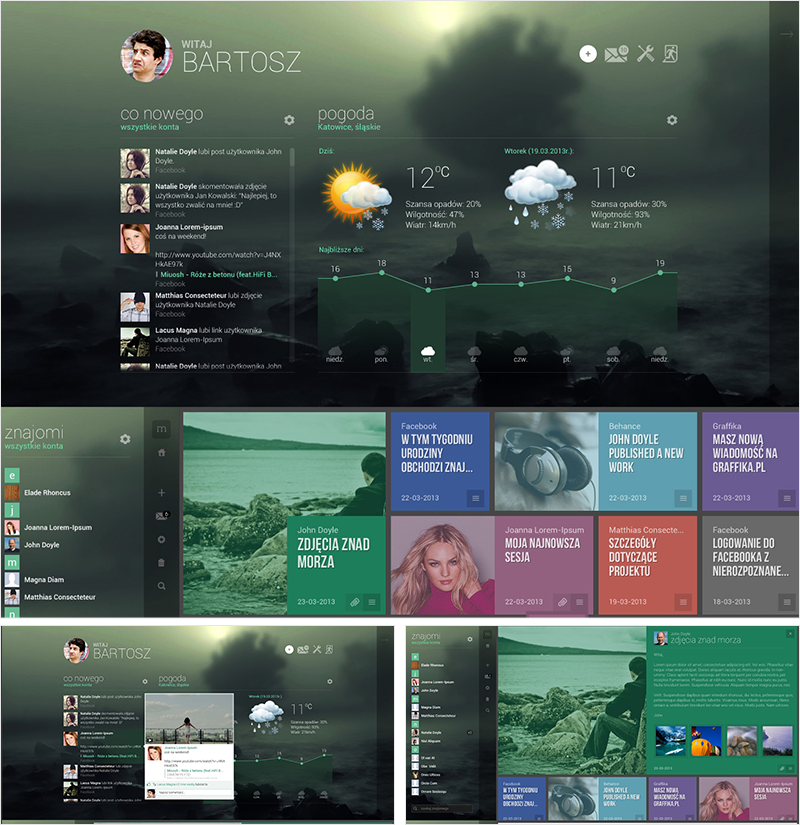

概念应用的案例

阴暗的色调渲染场景氛围，通过不同色相的色彩变化丰富信息分类，降低色彩饱和度使各色块协调并融入场景，白色和明亮的青绿色作为信息载体呈现。

> 观点：多色彩经过统一色调处理，区域间非常协调，也不影响整体页面阴暗气氛表现。

##### 2.1-3 明亮色调

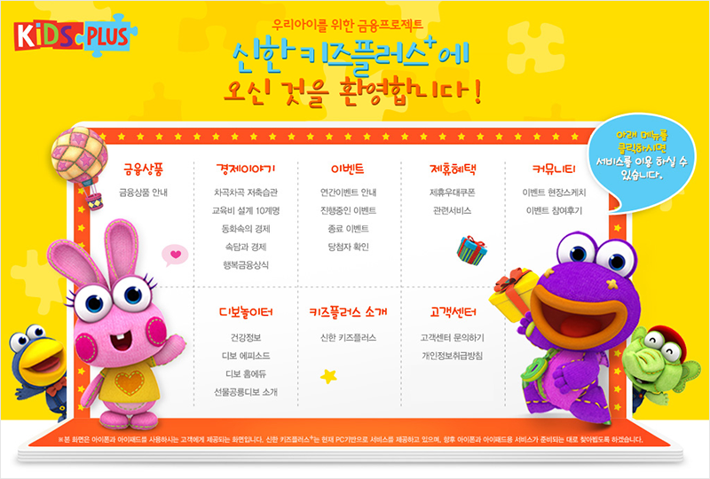

Kids plus的案例

明亮的颜色活泼清晰，热闹的气氛和醒目的卡通形像叙述着一场庆典，但铺满高纯度的色彩，过于刺激，不适宜长时间游览。

> 观点：饱和度与纯度特性明显的搭配，在达到视觉冲击力的同时，可适当采用对比色或降低明度等方法调和视觉表现。

2.1-4 深暗色调

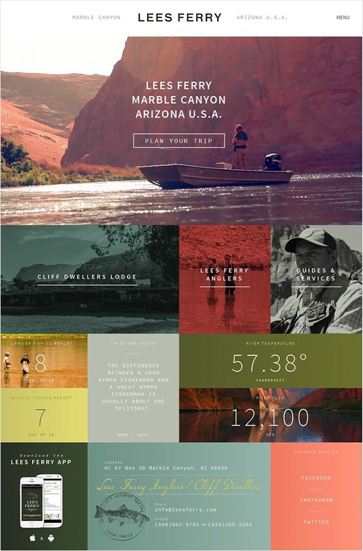

LEES FERRY的案例

页面以深暗偏灰色调为主，不同的色彩搭配，像在叙述着不同的故事，白色文字的排版，整个页面显得厚重精致，小区域微渐变增加版面质感。

> 观点：以低暗色调构成整体画面氛围，小面积明亮部分不会影响整体感觉。

2.1-5 雅白色调

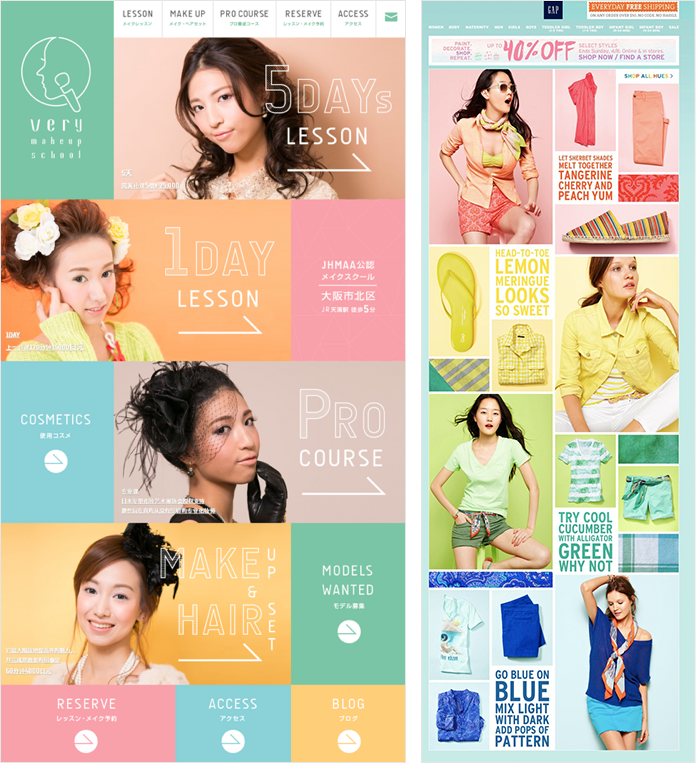

Very的案例

柔和的调子使页面显得明快温暖，就算色彩很多也不会造成视觉负重。页面的同色调搭配，颜色作为不同模块的信息分类，不抢主体的重点，还能衬托不同类型载体的内容信息。

> 观点：同色调不同色彩的模块，就算承载着不同的信息内容也能表现很和谐。

#### 2.2 同色调配色

这是由同一或类似色调中的色相变化构成的配色类型，与主导色调配色中的属于同类技法。区别在于色调分布平均，没有过深或过浅的模块，色调范围更为严格。

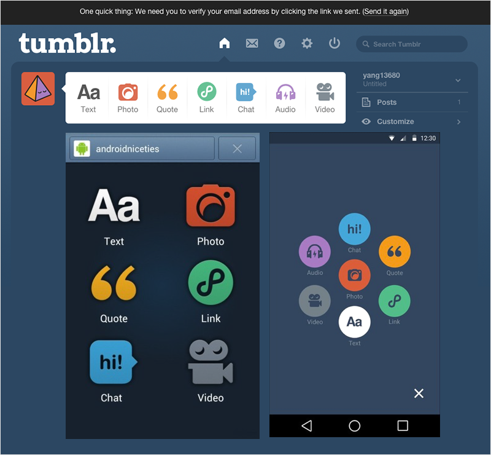

tumblr的案例：www.tumblr.com

在实际的设计运用中，常会用些更综合的手法，例如整体有主导色调，小范围布局会采用同色调搭配。拿tumblr的发布模块来说，虽然页面有自己的主色调，但小模块使用同色调不同色彩的功能按钮，结合色相变化和图形表达不同的功能点，众多的按钮放在一起，由于同色调原因模块非常稳定统一。

> 观点：综合运用的情况，整体界面是有主导色调，在布局例如重点图标等是同色调配色灵活运用。

#### 2.3 同色深浅搭配

这是由同一色相的色调差构成的配色类型，属于单一色彩配色的一种。 与主导色调配色中的同色系配色属于同类技法。从理论上来讲，在同一色相下的色调不存在色相差异，而是通过不同的色调阶层搭配形成，可以理解为色调配色的一种。

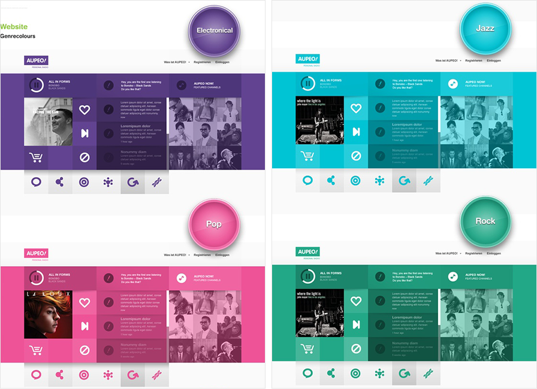

Genrecolours的案例

拿紫色界面来说，利用同一色相通过色调深浅对比，营造页面空间层次。虽然色彩深浅搭配合理，但有些难以区分主次，由于是同一色相搭配，颜色的特性决定着心理感受。

> 观点：同色深浅配色有着极高的统一性，但有点枯燥。

### (三)对比配色而形成的配色方式

由于对比色相互对比构成的配色，可以分为互补色或相反色搭配构成的色相对比效果，由白色、黑色等明度差异构成的明度对比效果，以及由纯度差异构成的纯度对比效果。

#### 3.1 色相对比

##### 3.1-1 双色对比

色彩间对比视觉冲击强烈，容易吸引用户注意，使用时经常大范围搭配。

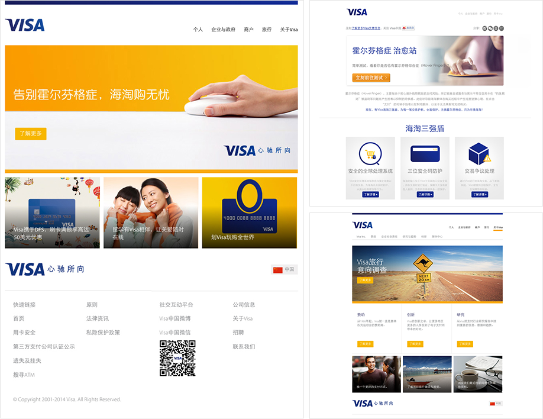

VISA的案例：http://www.visa.cn/

VISA是一个信用卡品牌，深蓝色传达和平安全的品牌形象，黄色能让用户产生兴奋幸福感。另外蓝色降低明度后再和黄色搭配，对比鲜明之余还能缓和视觉疲劳。

> 观点： 不管是整体对比还是局部对比，对比色给人强烈的视觉冲击，结合色彩心理学对品牌传达效果更佳。

##### 3.1-2 三色对比

三色对比色相上更为丰富，通过加强色调重点突出某一种颜色，且在色彩面积更为讲究。

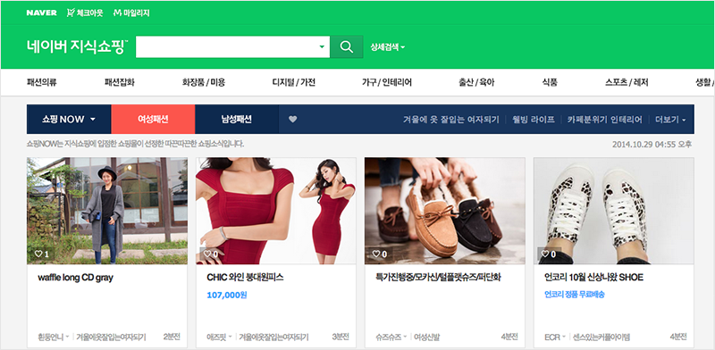

NAVER的案例：www.naver.com

大面积绿色作为站点主导航，形象鲜明突出。使用品牌色对应的两种中差色作二级导航，并降低其中一方蓝色系明度，再用同色调的西瓜红作为当前位置状态，二级导航内部对比非常强烈却不影响主导航效果。

> 观点： 三色对比中西瓜红作为强调色限定在小面积展现非常关键，面积大小直接影响画面平衡感。

##### 3.1-3 多色对比

多色对比给人丰富饱满的感觉，色彩搭配协调会使页面会非常精致，模块感强烈。

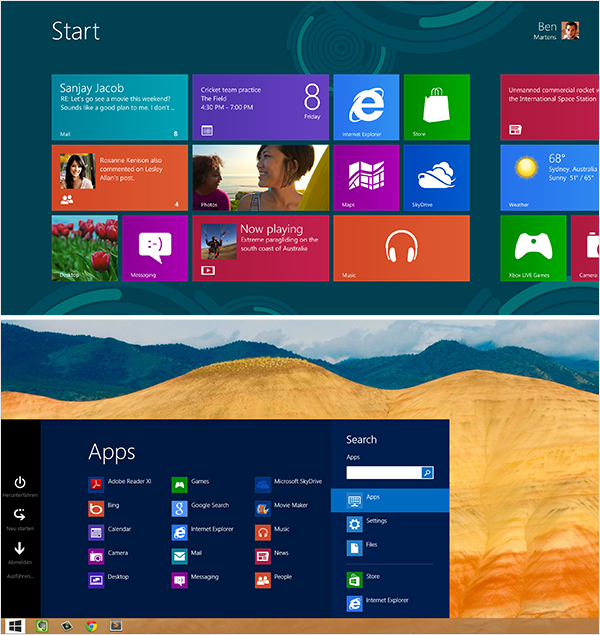

Metro的案例：http://www.microsoft.com/

Metro风格采用大量色彩，分隔不同的信息模块。保持大模块区域面积相等，模块内部可以细分出不同内容层级，单色模块只承载一种信息内容，配上对应功能图标识别性高。

> 观点：色彩色相对比、色彩面积对比，只要保持一定的比例关系，页面也能整整有序。

#### 3.2 纯度对比

相对与色相对比，纯度差对比，对比色彩的选择非常多，设计应用范围广泛，可用于一些突出品牌、营销类的场景。

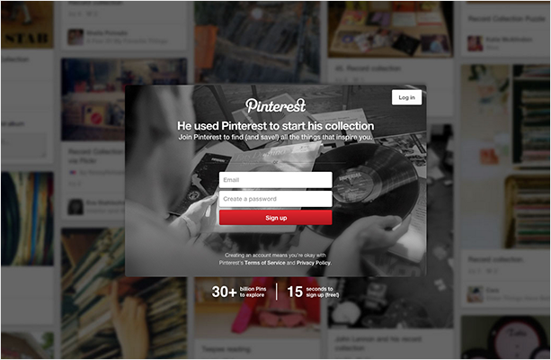

PINTEREST的案例：http://www.pinterest.com/

页面中心登录模块，通过降低纯度处理制造无色相背景，再利用红色按钮的对比，形成纯度差关系。与色相对比相较，纯色对比冲突感刺激感相对小一些，非常容易突出主体内容的真实性。

> 观点： 运用对比重要的是对比例的把握，面积、构图、节奏、颜色、位置等一切可以发生变化的元素，形成视觉的强烈冲突。

#### 3.3 明度对比

明度对比接近生活实际反映，通过环境远近、日照角度等明暗关系，设计趋于真实。

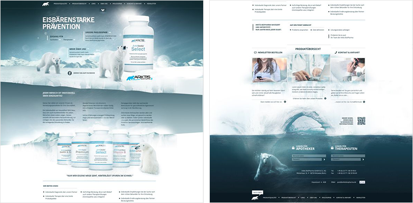

ARKTIS的案例

明度对比够构成画面的空间纵深层次，呈现远近的对比关系，高明度突出近景主体内容，低明度表现远景的距离。而明度差使人注意力集中在高亮区域，呈现出药瓶的真实写照。

> 观点： 明度对比使页面显得更单纯、统一，而高低明度差可产生距离关系。

## 总结

色彩是最能引起心境共鸣和情绪认知的元素，三原色能调配出非常丰富的色彩，色彩搭配更是千变万化。设计配色时，我们可以摒弃一些传统的默认样式，了解设计背后的需求目的，思考色彩对页面场景表现、情感传达等作用，从而有依据、有条理、有方法地构建色彩搭配方案。
