# Thinkful网站配色完全学习指南(上)

> 来源：http://www.uisdc.com/thinkful-color-theory-basics-1

> 原文地址：http://www.thinkful.com/learn/color-theory-basics/

> 优设网译者：@陈子木 (http://weibo.com/chenzimu7/)

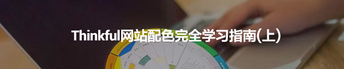

> 毫无疑问网站的配色是非常重要的。创建一套具有凝聚力又能抓人眼球的色板是创建一个成功网站的先决条件。在技术发展的驱动之下，我们在网页设计的时候可以更加精确地控制色彩，这也使得色板的精细打磨显得更加必要和重要。今天这个网站配色完全学习指南，就是想更加系统地解决这个问题。

> 这篇指南的作者是Aleksandra Tamarina，发表于Thinkful网站，由优设编译。

## 入门

在开始探索配色和色板创建之道之前，你首先要考虑一下你想做一个什么样的网站，而创建这个网站的目的又是什么。

另一个需要考虑的重要因素是，你的网站是否拥有现成的品牌。如果你拥有现成的品牌那么就意味着你构建网站的时候，会使用到现成的品牌风格指南，这时候你有着现成的色板，你只需要根据需求适当地拓展出不同深浅、色度的衍生色。当然，更多的时候，你需要从无到有构建一个全新的色板，而这篇文章正是要帮你完成这项任务。

## 构建网站的“情感”

色彩与品牌有着千丝万缕的联系。不同于语言和文字，色彩为品牌提供了一种非口头传达的意义和信息。而色彩给人的感觉和所蕴含的含义主要来源于所处的文化和环境。在深入了解一个网站之前，用户通常先注意到色彩，色彩所传达出来的情绪会下意识地感染用户，所以你可以利用这种原理来设计网站、优化品牌。

那么你需要向用户传递什么样的情感呢？你希望用户怎样和你的网站互动？这可能还得从品牌识别（BI）来考量（如果有的话），同时也可以让网站成为品牌的延伸。花点时间仔细想想吧。

接下来，我们一同来探讨一下，美国的文化背景下的大众品牌中的色彩的含义。

## 色彩的含义

下面是一些常见色彩的含义：

* 红色：能量，力量，活力，领导地位，勇气，激情，快乐，危险，邪恶，愤怒，血，高识别度；

* 橙色：开朗，热情，快乐，激情，魅力，创意，有趣，轻浮，华丽，粗鲁，低端；

* 黄色：乐观，清新，法律，教育，傲慢，怯懦，疾病，背叛，幼稚；

* 绿色：财富，金钱，平静，树木，野心，耐力，治愈，冷静，打赌，自然，完备，保护，羡慕，嫉妒，不成熟；

* 蓝色：安全，守信，稳定，忠诚，智慧，信任，友爱，保鲜，勇气，科学，悲伤，抑郁，冷漠，稳重；

* 紫色：神奇，神秘，灵性，潜意识，创造力，尊严，皇室，悲哀，残酷，自大，自负；

* 黑色：强大，神秘，高贵，精致，功能性，死亡，病态，瘟疫，孤傲；

---

有些著名的品牌在色彩的情感传达上非常突出，麦当劳就是其中的佼佼者：

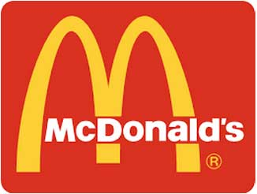

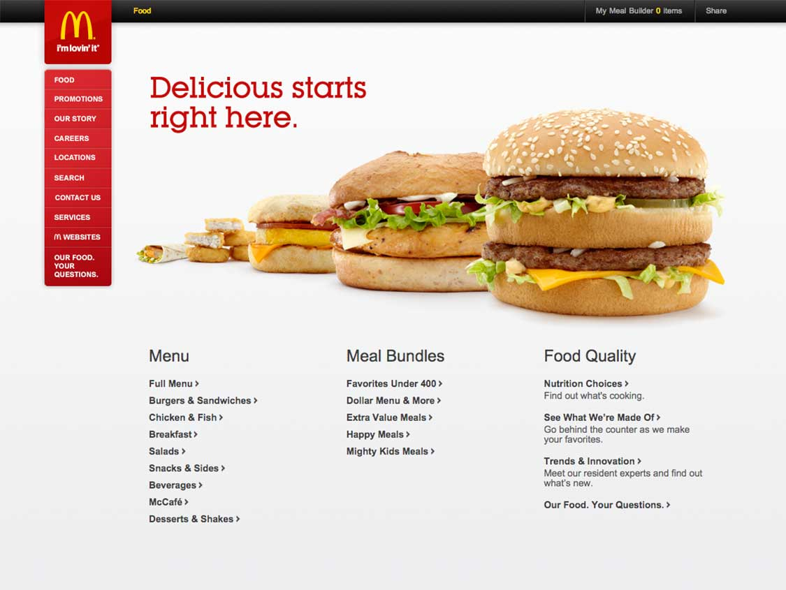

麦当劳LOGO中，黄色的拱门能够唤起用户新鲜、快乐的情绪，黄色还能引起饥饿感。LOGO中的红色所包含的活力感、愉悦和能量会促使用户快速地离开，这样也就促使餐厅中人流的快速流转。作为快餐店，这样的色彩搭配构成了麦当劳独特的品牌情感传达，和品牌故事。虽然麦当劳官网目前还没有追随设计潮流，尚需要一些设计上的提升，但是它的色彩非常简明，并且专注于视频领域的推广和传播。有意思的是，同LOGO相比，在网页配色上相对降低了红色所占据的比例，因为这家快餐巨头想留住你来浏览，而非促使你离开。

不仅是麦当劳从这种配色方式中受益，许多同类的快餐店也使用了类似的配色，比如DairyQueen、BurgerKing、Wendy’s、Sonic以及Pizza Hut。这种配色方案的本质就是吸引人来购买，然后敦促他们离开，以便能服务更多人。

---

另外一个品牌配色的好案例就是Whole Foods了。

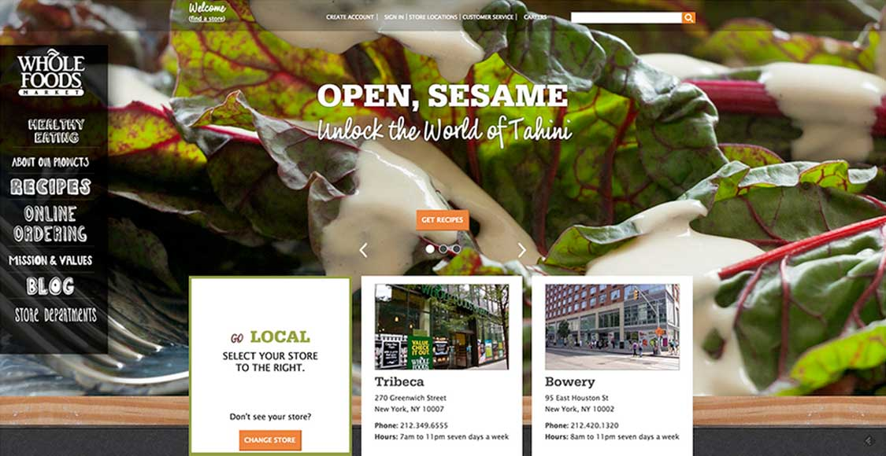

绿色常常被赋予自然、环境和治愈等含义，而Whole Foods正是一个全天然有机食品品牌。这些有机食品和品牌与绿色完美的融合在一起，Wholefood.com 网站中使用了大量的绿色的元素和形象，唤起用户对于自然的认同感，配合黑色和白色这种中性色来完成整个网站的设计，三种色彩在网站设计中达到了平衡点。

除了Whole foods之外，同类型的食品杂货品牌Publix也使用了类似的配色方案来装点网站。如果你熟悉这类食品杂货品牌，你会发现这种绿色为主的配色应用得非常普遍，因为这种色彩使用可以呈现出品牌的自然和品质感。

---

谷歌是一个典型的多色彩使用的品牌。

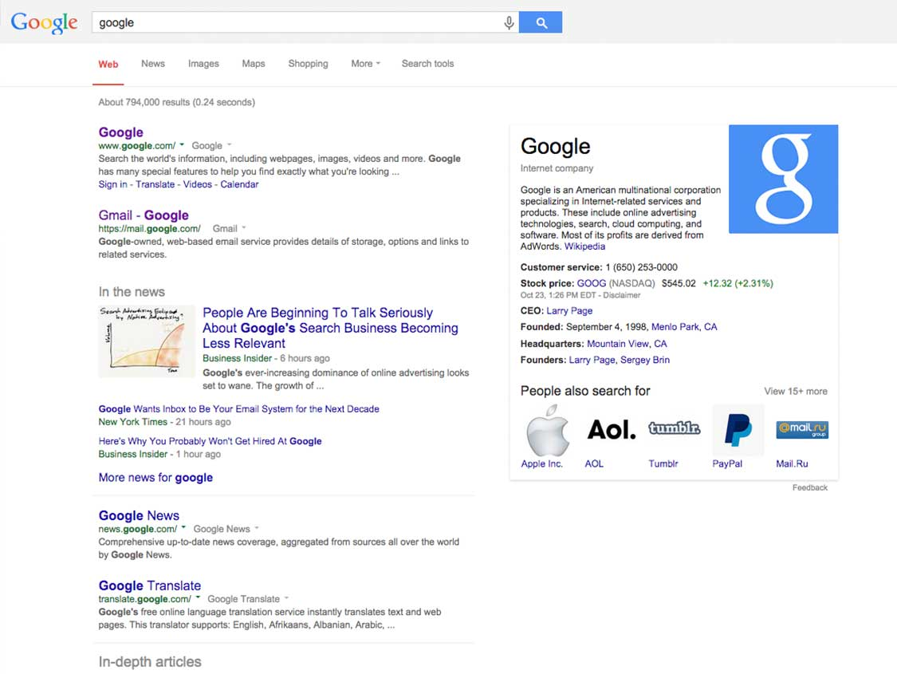

使用多色彩的品牌通常都传递出创意、色彩和艺术性。虽然谷歌已经成长为一个庞大的科技企业，但是它依然保持着多年以前的那种创意、愉悦和自然。毫无疑问，谷歌掌控着搜索的艺术，谷歌搜索的主页也一直是以实用为主要诉求。虽然使用了多种色彩，但是谷歌还是选择蓝色作为LOGO中的基础色，这种选择你可以在谷歌的链接和小LOGO上感受到。而LOGO中其他的色彩，主要是赋予整个LOGO以层次感和对比度。

类似的LOGO还有苹果早期的品牌LOGO和奥林匹克的标识。当年苹果所发布的G3系列的iMac和iBook所使用的多彩塑料材质正好呼应了这种多彩的设计，后续的iPod也延续了这些色彩使用。奥林匹克也是，丰富的色彩正好呼应了人类的活力和竞争的主题。

## 探索网站配色

接下来，你要开始写下你的网站想要具备什么样的个性，想传达什么样的感情。有了这些基础的东西之后，你就可以根据这些含义来匹配颜色了。看看那些已经同类的、成型的品牌/网站所使用的配色吧，你再想想他们的品牌价值观是怎样的，他们的情感和色彩是如何结合到一起的，他们又是如何看待用户的。接下来，我们先看看下面的几个案例：

### 你想激发用户信心？

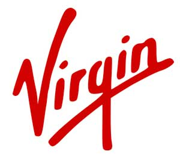

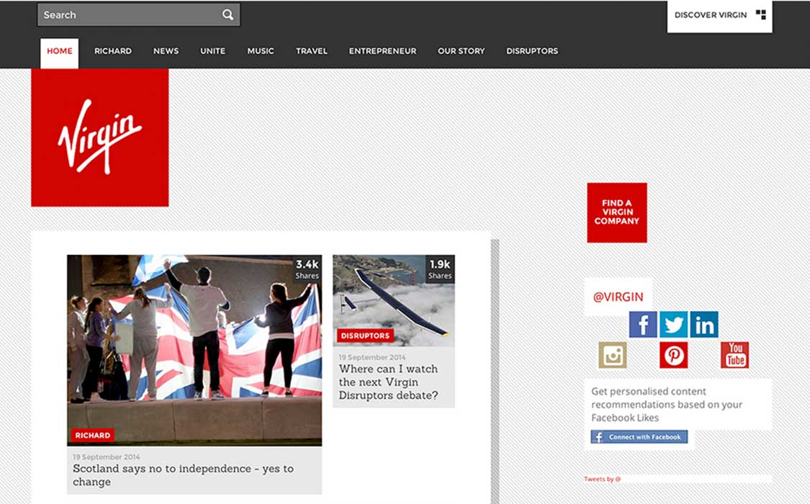

作为一个大型品牌，Virgin 主要使用了红色和白色来传递信心的感觉，其中的红色传递出行动、能量和激情的感觉，让品牌具备了力量感。

---

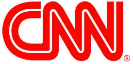

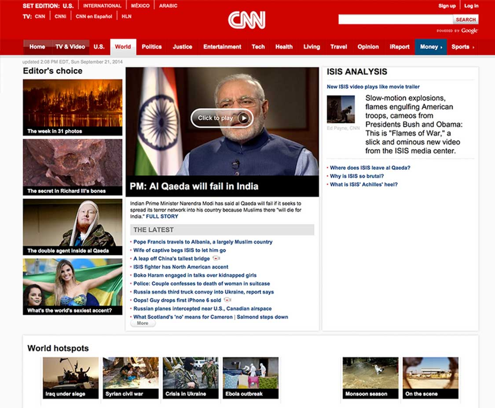

CNN也是如此，他们需要用户和读者来相信他们的新闻来源。所以CNN使用了红色来表现他们的领导地位，以及激情、能量的感觉。

### 你想让用户感觉高端？

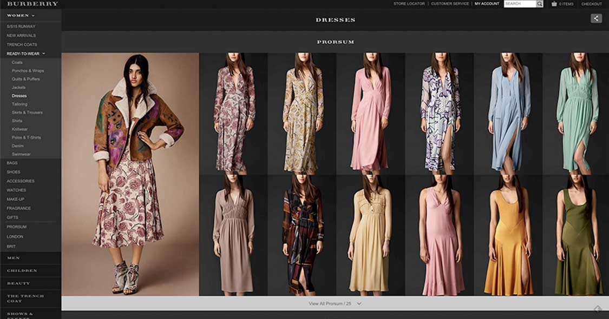

Burberry使用暗灰色来散发出神秘、高贵和精致的感觉。当用户浏览Burberry的网站的时候，会觉得这个网站是有讲究的，有品质的，形成信任感。

---

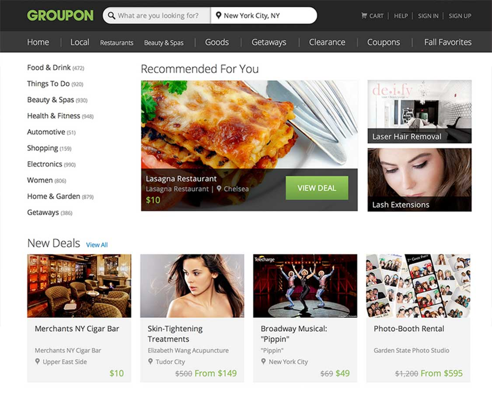

Groupon 使用了绿色和灰色来表现“节约资金”和“独特”的特性。

### 你想被信任？

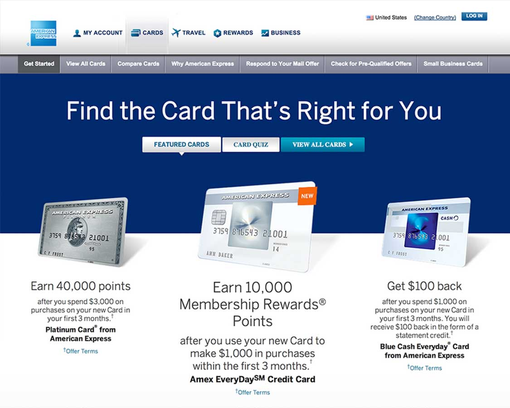

蓝色能够赋予用户安全、可信和稳定感，这符合信用卡所应具备的所有特性。

---

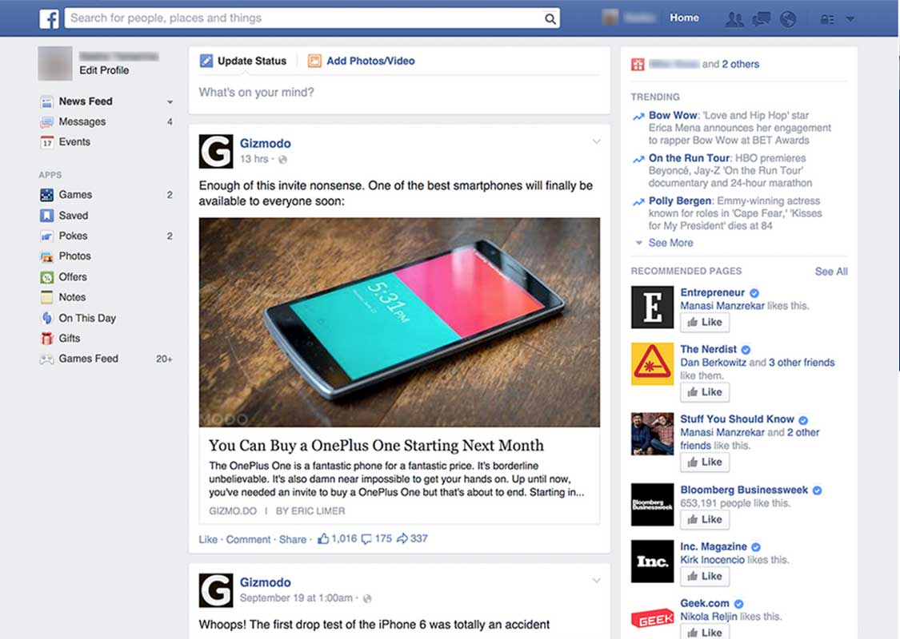

作为社交网站，Facebook 极其需要用户的信任，让用户能够自如地发布关于他们生活的信息，所以Facebook选择了蓝色来传递出“信任”的感受。

---

当你写下你的网站所需要的全部特性之后，你就需要选择一个合适的色彩开始你的设计了。为了更深入的挖掘这些信息，你需要了解一些关于色彩的术语和知识。文章的下半部分，我将为你详细讲述这些内容。

---

# Thinkful网站配色完全学习指南(下)

---

来源：http://www.uisdc.com/thinkful-color-theory-basics-2

原文地址：(http://www.thinkful.com/learn/color-theory-basics/)

[Thinkful]:

优设网译者：[@陈子木](http://weibo.com/chenzimu7/)

---

>常听人感慨，看了那么多的案例，依然搞不定配色，这真是一个悲伤的故事啊！的确，找到漂亮的网站容易，弄明白为什么漂亮，却需要从根子上来思考，所以，读完上篇的基础分析之后，接下来你需要掌控那些关于配色的概念和思路，这才是真正意义上的授人以渔。上半部分右戳：[《配色讲道理！THINKFUL网站配色完全学习指南(上)》](http://www.uisdc.com/thinkful-color-theory-basics-1)

>优设之前也曾发布过从零开始构建配色方案的文章，先来一发预热一下：[《设计师必备取色技巧！教你在PS里通过照片创建色板》](http://www.uisdc.com/create-color-swatches-from-photograph)

>

---

## 色彩术语

色彩术语的存在让我们能够区分和描述色彩，熟悉并了解这些术语之后，我们能够灵活地

* 色相(Hue)—即各类色彩的相貌称谓。

* 色彩饱和度(Saturation)/色度(Chroma)—颜色的整体强度或者亮度

* 明度(Value)—色彩的明暗程度

* 色调(Tone)—是纯色和灰色组合产生的颜色，也可以说是一幅画中画面色彩的总体倾向

* 色度(Shade)—是纯色和不同比例的黑色混合产生的颜色，色彩的纯度

* 色彩(Tint)—是纯色和白色混合产生的颜色，一种色相(Hue)通过加入不同比例的白色能够产生不同的颜色

## 色彩属性

色彩的很多属性能直接影响到一个物体的视觉效果。比如饱和度较高的物体比饱和度较低的物体更能吸引人的眼球，而明度较高的物体也有类似的效果。而实际上，色相本身也能传达出特定的视觉感知。在所有色彩中，下列色彩尤其突出：

1、红色(最突出)

2、蓝色

3、绿色

4、橙色

5、黄色(最不突出)

当你在页面中使用红色的时候，整体视觉会更加突出，所以当你需要吸引用户注意力或者涉及重要操作的时候，可以这么用色。而黄色相对而言更容易融入背景色，并不会像红色那么抓人眼球。所以，当你在制作配色方案的时候，这些色彩关系和配对方案就显得尤为重要了。合理地色彩搭配能够让你制作出震撼的视觉效果，设计出吸引人的焦点。为了更好的明确色彩之间的关系，设计师和艺术家们常常会借助色轮来进行配色。

## 色轮

色轮可以说是最实用的色彩管理工具之一，它可以反映不同色彩之间的关系，帮你挑选首选色、搭配色。 在制作配色方案的过程中，色轮是最重要也是最实用的工具之一。色轮最初还是源于牛顿1672年所发布的一个实验，牛顿使用棱镜来查看不同波长的光，将折射后的光线投射到一个圆环上。随后他证明，饱和度最高的色彩位于色轮的外侧，而中性色位于中间。牛顿认为，艺术家可以借助他的研究成果来提高艺术作品中的色彩对比。实际上他的色轮模型也确实为设计师们提供来行之有效的配色途径，创造出更为漂亮的艺术作品。

几百年后的今天，色轮依然是设计师手中最为得力的配色工具之一，不论是网页设计还是品牌设计，色轮能赋予你的设计一套富有凝聚力的配色方案。由于色轮本身所承载的色彩数目限制，它所提供的配色方案更多是一个大概，而非最终的方案。

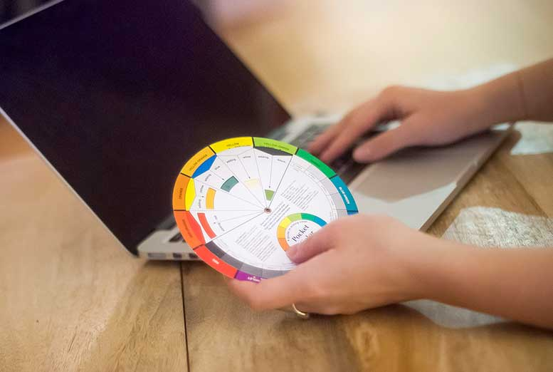

传统意义上的色轮通常是印刷出来的2～3个纸质环形构成的，中间被固定住，可以旋转。Adobe的网站[Kuler]就为你提供了一个不错的在线版本，并且还能帮你配色。另外一个在线色轮网站是[Colorhexa.com]，也是不错的选择。

[Kuler]:(http://kuler.adobe.com/)

[Colorhexa.com]:(http://colorhexa.com/)

### 配色方案

当你选好基本的颜色之后，你就可以借助色轮来确定配色方案了。

* 近似色

你可以使用色轮上位置相邻的色彩。确定首选色之后，你需要选择用来搭配的第二和第三种颜色。近似色与你的首选色接近而不同，能与之和谐存在，你可以使用近似色来构建配色方案。

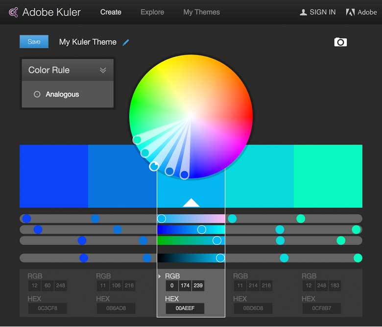

* 单色

基于单色的配色方案也不难实现，首选色的色相确定之后，调整它的色度、色调和色彩（让其与不同比例的黑色、白色和灰色混合），也可以形成一套配色方案。

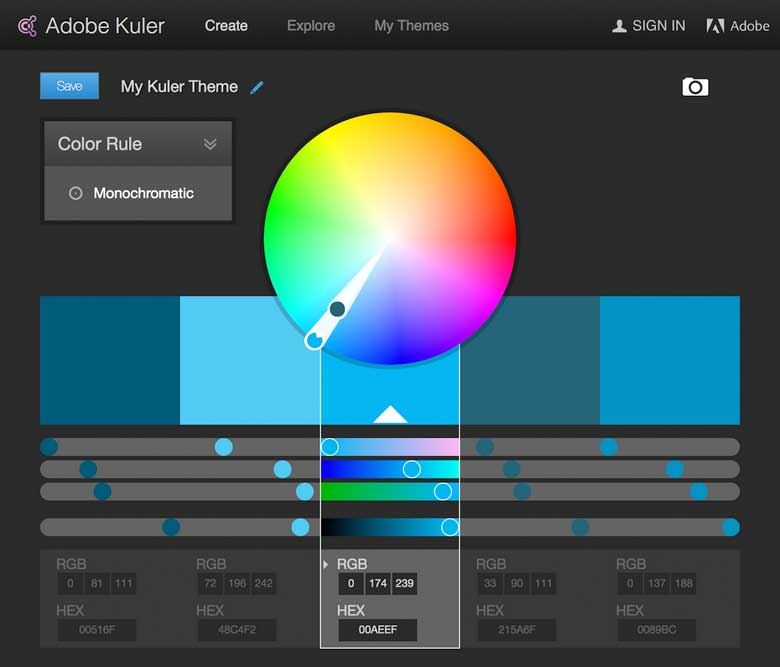

* 三色

三色配色方案借助色轮很容易实现，也就是使用色轮上相互等距离的3种颜色即可。

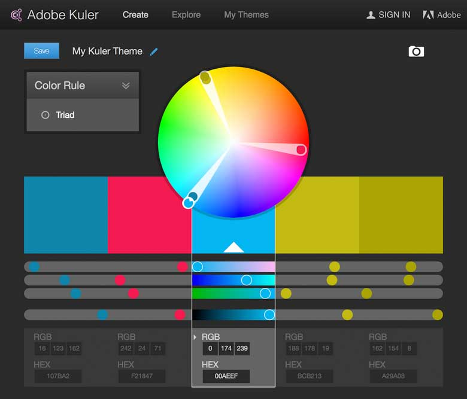

* 互补色

色轮中心对称的两边的颜色就是互补色，两种色彩相互抵消，色盲的用户可能分辨不出来部分对比色。所以，如果你想每个人都看清楚网页的内容，那么请不要使用两种正好处于相反位置的色彩。（稍微偏一点就好了）

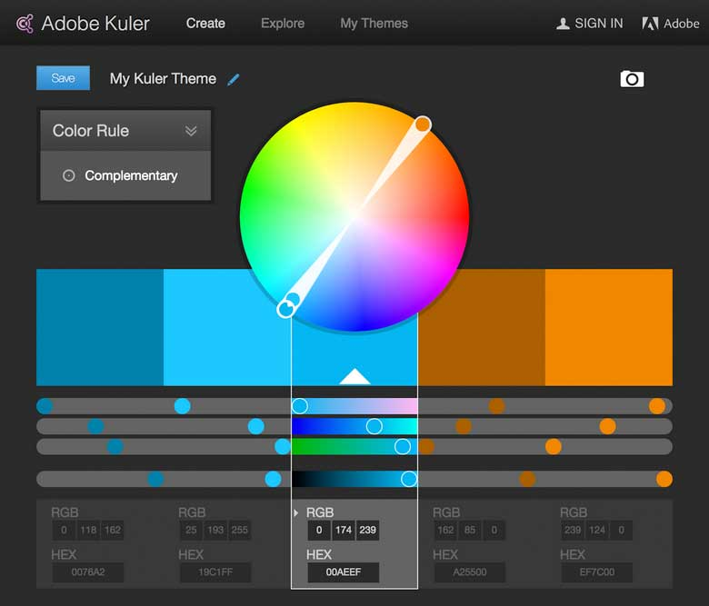

* 复合色

确定首选色之后，挑选一个互补色，然后加上一个与首选色同色系的色彩，这样的三色搭配方案很容易实现，提供了明显的色彩反差，也不容易被滥用。

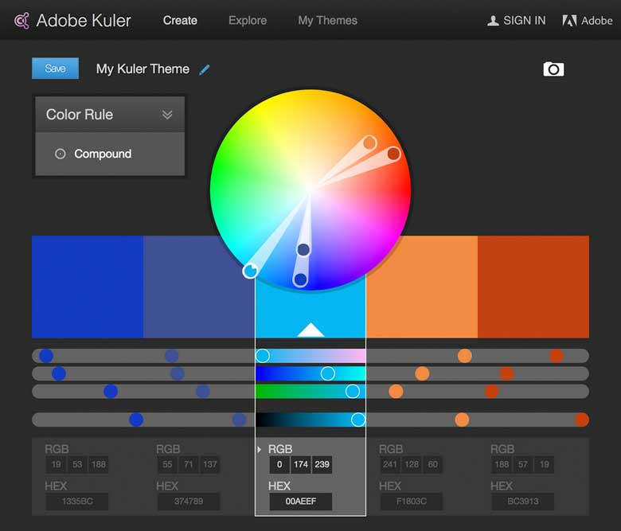

* 中性色

很多高大上的网站就是这么配色的，就靠中性色黑白灰撑起来的。

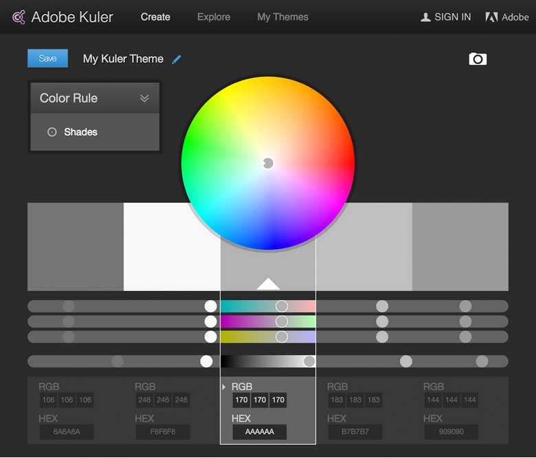

* 自定义

抛开上面的配色规则，不再遵循传统，用更加冒险和激进的方案来装饰网站。

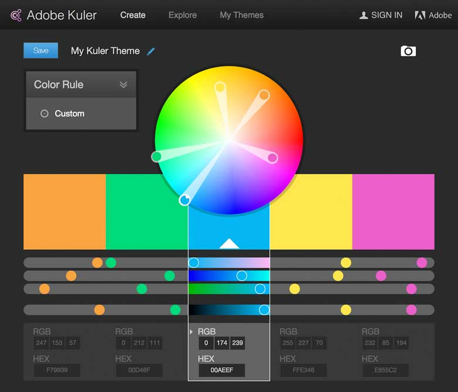

最后，请记住最后一点，网站配色的目的是要提高网站的体验和可读性，不要让用户分心。当你设计配色方案的时候，需要保证即使是色盲用户都能准确而轻松地获取网站内容，这也就意味着你的配色要保证足够的视觉反差，而非全部使用对比色。最简单的验证方法，就是将饱和度降到最低，如果你依然能看到网站最重要的内容，能看清图形和图像，就好了。

这样一来，想必你也对于网页配色有了更清晰的想法了吧。至少选择两种色彩，一主一次，并且两种色彩足以支撑起网站的视觉。在必要的时候，可以基于这两种色彩拓展出更多的同色系色彩，令网站色彩更丰富。

## 色调、色度和色彩

### 配色方案最重要的因素

当你要使用你的配色方案来设计网页布局的时候，你需要仔细审视整个网站来考虑如何使用这些色彩来引导你的用户。审视网页布局，你得先找出哪些地方更重要，哪些地方需要你的用户点击，哪个页面是你希望用户优先访问的，确定了这些用户行为方向之后，你就知道哪些地方的视觉是需要强化的。合理调整配色中颜色的色彩、色度和色调可以让页面不同的部分有轻重之分，正确引导用户。

很多时候，你希望用户能直接点击某个按钮，通常网页设计中会让它成为一个“行为召唤按钮”，让它随着鼠标行为而改变颜色。为了吸引用户，按钮一般状态下会使用首选色，那么要如何选择它的悬停和禁用时候的颜色呢？一般来说，最好是有微小的过度，所以很多设计师会选择使用同色系的色调或者色度来表示不同的状态。

比如，假设首选色使用的是#00AEEF：

按钮一般有四种状态：normal(一般)，hover(悬停)，pressed(按下)，disabled(禁用)。接下来，你需要做的是基于色板中的色彩，来调整出一套与之适配的用色，而不用引入更多不必要的色彩。

这个时候你可以从首选色#00AEEF开始，加入一定的黑色(Shade)，配出Hover的时候的用色#0077A1。按下状态下，色彩应该会更深，那么，你可以加入更多的黑色来模拟出那种物理按钮被按下的状态。通常当按钮被禁用的时候，设计师会让色彩看起来更浅一点，所以，你需要做的就是让首选色色彩或者色调更浅一点(加入白色或者灰色)，就成了。

案例在此：[Code](http://codepen.io/anon/pen/ubAws)

用户界面中有许多元素，涉及到各种不同的操作，为了区分它们又得忠于配色方案，灵活调整色彩、色度和色调是非常必要的。

## 中性色

### 让网页有对比更平衡

在很多网页中，你会发现网页的主体通常使用了白色的背景和灰色或者黑色的文字。这种设计上的尝试早已有之，这种对比度确保了可读性。

使用中性色的美妙之处在于，它可以和任何配色方案搭配。你可以在配色方案中添加中性色，提高排版效果和可读性。你也可以在网页元素中适当地增加灰度，提高信息的层次，并不是网页中每个元素都非得色彩鲜亮。有了层次，视觉就有了焦点，用户就不会分心。

正如下面的案例，云托管服务商Digital Ocean的网站，灰色背景让网站主色调突出，提高了可读性。

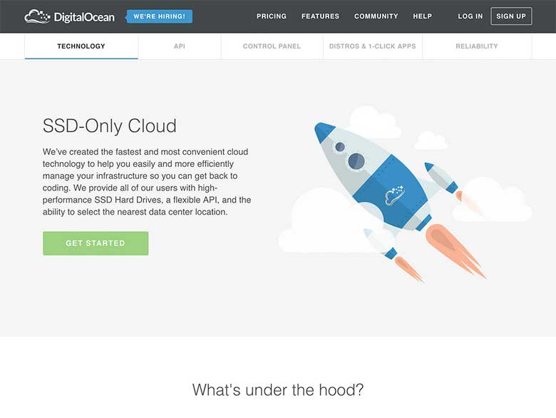

## 选择多少色彩才合适

通常能具备主次两种色调就够用了，但是也可以通过调整色调、色彩和色度可以灵活创造更多的可能性。

值得一提的是，网站的色彩比例控制为6:3:1最为适宜。色彩比例均匀的话，会让色彩之间相互冲突，主次不分。6:3:1规则指的是，主色调应该覆盖6成的网页和UI元素，辅助色占据3成，而剩下的1成则应该是装饰色或者强调色，让网站或者UI更舒适。

Best Buy就是个典型的案例，蓝色为主色调，黄色为辅助色，红色用以强调。

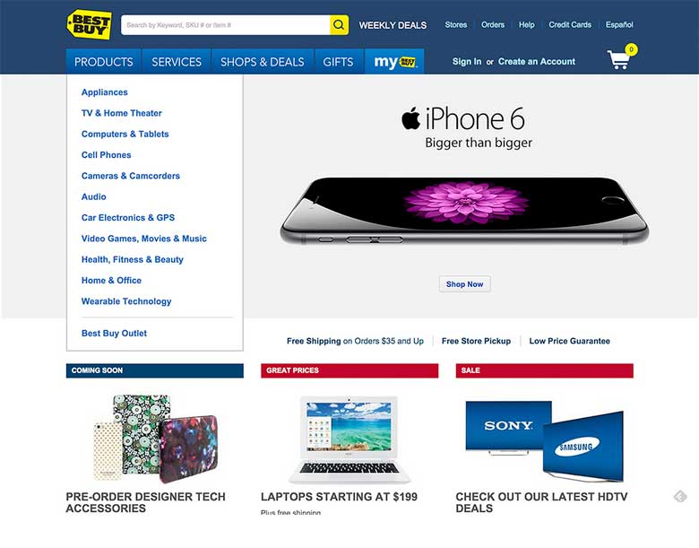

---

而在这个例子中，色彩使用太过于散乱，各种色彩的比例不明显，对比混乱。

---

最后这个网站的配色堪称是灾难性的。典型的反例

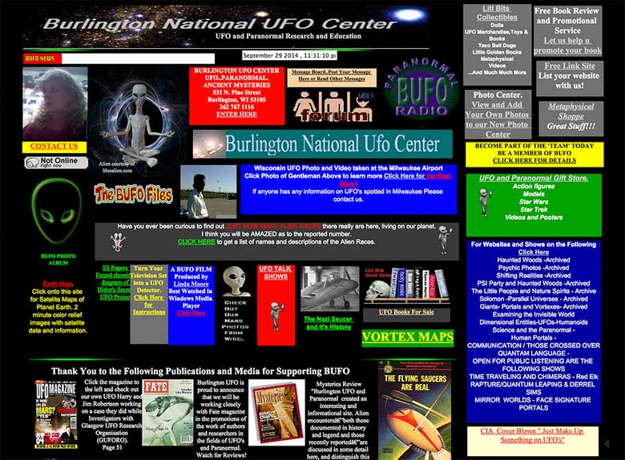

## 结语

其实，理论学习并不难，读完收藏也就几分钟的事情，但是要融会贯通需要大量的练习，反复的思考，合理的总结。接下来，打开电脑动手吧~
