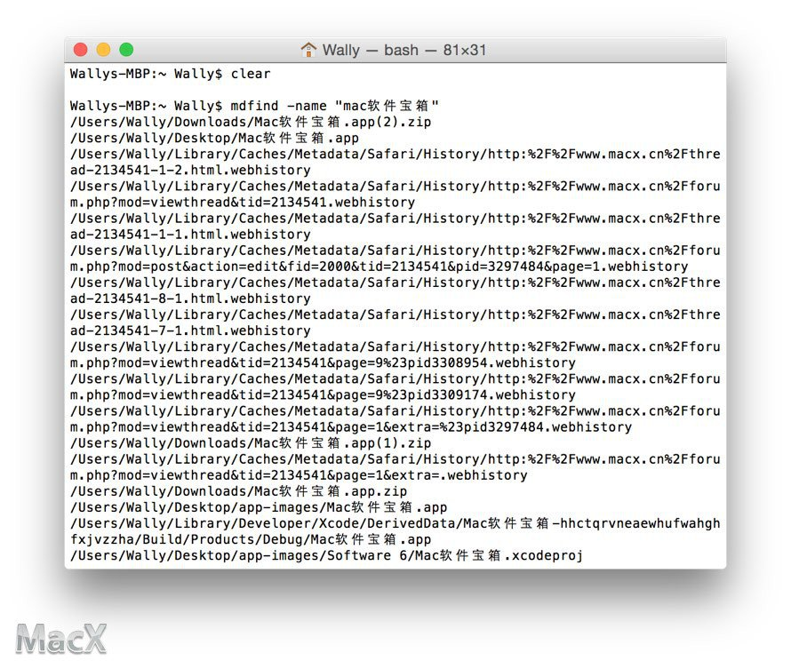

# 进阶教程 如何使用终端命令彻底完全卸载删除软件

> 来源：http://www.macx.cn/forum.php?mod=viewthread&tid=2135380&extra=page%3D1%26filter%3Ddigest%26digest%3D1%26typeid%3D7%26digest%3D1%26typeid%3D7

对于普通用户来说, 一般安装软件的方法其实很简单. 有如下三种.

1. Mac App Store 直接安装与删除.
1. 网上下载, DMG 磁盘镜像安装包, 将文件复制到应用程序安装.
1. DMG 磁盘镜像需要运行安装程序安装, 例如 Office , Adobe 等软件.

而卸载方式, 一般情况下, 如果软件方提供了卸载工具, 最好选择专用卸载器, 比如 Adobe , 输入法等.

其他普通软件对于一般用户紧紧需要将应用程序图标拖拽到垃圾桶上进行删除即可.

对于进阶教程,
其实软件会在系统内留下一些小痕迹.
这些小痕迹包括:  注册信息保存, 偏好设置保存, 程序缓存文件等.
所以我们将使用终端命令 mdfind 来查找文件并且进行彻底删除.

> 本文涉及到终端与 UNIX 命令的使用, 并且会执行删除命令, 对于新用户来说请小心以免删除重要的文件.

我们以 Mac 软件宝箱 为例.

打开应用程序 - 实用工具 - 终端

输入

```shell
Wallys-MBP:~ Wally$ mdfind -name "mac软件宝箱"
```

```shell
/Users/Wally/Library/Caches/Metadata/Safari/History/http:%2F%2Fwww.macx.cn%2Fthread-2134541-1-1.html.webhistory

/Users/Wally/Library/Caches/Metadata/Safari/History/http:%2F%2Fwww.macx.cn%2Fforum.php?mod=post&action=edit&fid=2000&tid=2134541&pid=3297484&page=1.webhistory

/Users/Wally/Library/Caches/Metadata/Safari/History/http:%2F%2Fwww.macx.cn%2Fthread-2134541-8-1.html.webhistory

/Users/Wally/Downloads/Mac软件宝箱.app(2).zip
/Users/Wally/Desktop/Mac软件宝箱.app
```

.... 省略更多....



系统会按照名字来匹配 mac软件宝箱 在硬盘上的所有文件.  使用终端命令搜索的好处就是可以搜索很多系统隐藏的文件, 这些文件一般 Spotlight 是不会去搜索的.

应用程序缓存的目录一般在如下几个常用的目录下:

```shell
/应用程序/
~/资源库/Application Support/
~/资源库/Preferences/
~/资源库/Caches/
~/资源库/Containers
~/资源库/LaunchAgents/
~/资源库/PreferencePanes/
~/下载
/System/Library/LaunchDaemons/
/System/Library/LaunchAgents
```

如果你经过搜索发现了如上目录内有残留就可以执行删除, 实现彻底清理软件 与卸载软件.

终端内删除文件的命令是

```shell
sudo rm -rf 文件路径.
```

删除命令请小心使用哦.
