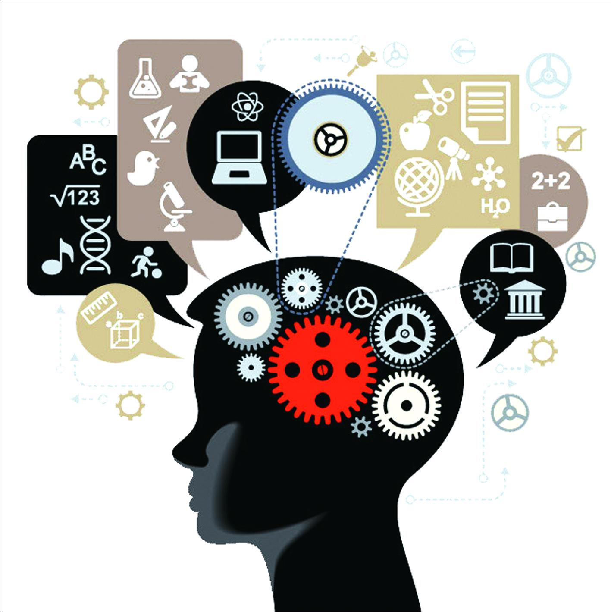
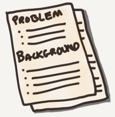
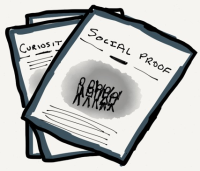
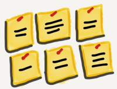
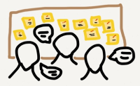
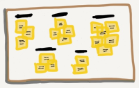

# 如何让头脑风暴更有效率

> 文章翻译：用户体验咨询：BESD设计实验室 (http://www.besdlab.cn/)

> 原文来源：Catriona Cornett (http://www.inspireux.com/2013/07/18/tips-for-structuring-better-brainstorming-sessions/)

---

---

## 目录

1. 确定问题
1. 激发创造力
1. 平等贡献
1. 分享讨论
1. 综合分类

---

头脑风暴法是广泛用于团队的一个产生想法和解决问题的方法。然而，许多头脑风暴活动是有不完美的，最终并不能帮助激发思想上的创新。众所周知，传统的头脑风暴，团体在一起，把想法一个接一个的表达出来，通常这是一个有缺陷的过程。

* 缺乏准备：

如果在一个头脑风暴会议参与者不事先了解会议的目标，他们会准备不足，大量的时间用于了解讨论的是什么。

* 想法有限：

许多头脑风暴活动集中于产生独特的想法或与问题无关的解决方案。创新，但是，往往是通过对个人的想法通过把它们拆开、改善或改变某一部分了。

* 公司理念：

公司关注的事物是最受重视的，它会减少了其它的创意。

* 不平等性：

传统的头脑风暴往往倾向于外向的人去表达，这样可能会导致会议的延长和容易讨论无关的问题。

* 恐惧心理：

参与者往往都会害怕贡献糟糕的想法，所以会进行“表演”来迎合主体。然而研究表明，批判和冲突会导致更好和更富有想象力的想法。

---

我们应该将头脑风暴的利益最大化，下面是头脑风暴的几个技巧：

* 确定问题
* 激发创造
* 平等贡献
* 分享讨论
* 综合分类

## 1. 确定问题

在头脑风暴会议之前（最好提前24小时），给参与者一个明确的说明会议的目的。说明你正在试图解决的问题。不要让问题描述太具体哦，这可以增加创造性的解决方案。更大，更抽象的问题让参与者挑战假设，产生新的观点，并发现解决问题的新方法。

提供背景材料，将帮助了解问题的背景。。通过给参与者总结的背景材料和完整的材料的链接，你可以帮助他们，让他们在准备会议时不会感到不知所措。

设置期望，参与者需要提前准备的会议，简单地重新强调目标和问题，在头脑风暴会议开始时，确保所有的参与者都是明确会议的目标。

## 2. 激发创造力

许多头脑风暴会议要求参与者直接陈述。许多人可能不知道从哪里开始，往往会拿出的想法没有任何进一步的创意。我们可以引导他们来更好的表达观点，这里有些好的建议：

* 心理：

创建一个心理概念列表，引导学员思考可以应用于特定的问题。

* 观点：

可以从多个角度去考虑问题。

* 平行：

可以对其它行业相似的问题进行比较。

* 集锦：

选择几个关键的行情，统计，或从以往的研究结果的研究或战略文件中选出能帮助成员有更好的想法的文件。

## 3. 平等贡献

应该使参与讨论者在相同的时间内阐述观点，这样有利于在更短的时间倾听更多人的想法和收集创意。

你可以邀请跟问题无关的人员，比如你是设计师，那你可以邀请产品经理、客服、工程师等等，不必仅限于团队成员。

可以为每个参与者都提供一些便利贴或卡片，引导他们将更多的想法写在纸上或通过绘图表达。

## 4. 分享讨论

我们可以讨论参与者先将自己的想法陈述并记录下来，可以贴在一面墙上。

然后进行讨论、结合、修改这些墙上的想法。

可以对这些想法多问几个为什么来推动讨论。

同时我们可以给每个人一对一的反馈机会，与作者反馈或者与另一人讨论。

## 5. 综合分类

你可以对这些想法进行分类，对想法进行评估，根据优先级进行排列。也可以将一些相似的想法合并。

如果你也有好的建议或技巧的，可以告诉我们哦！
