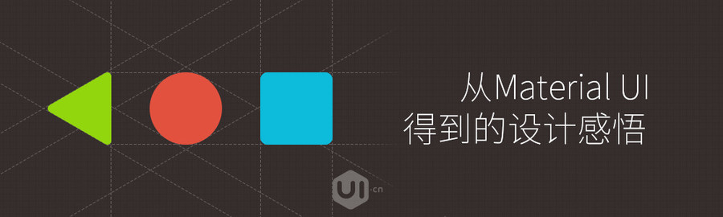
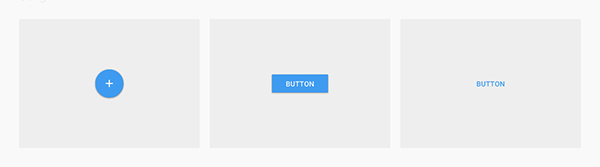
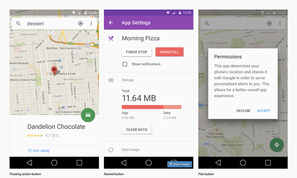
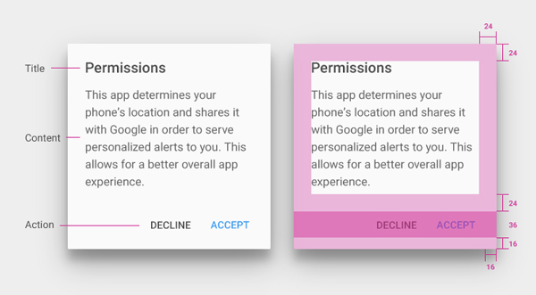
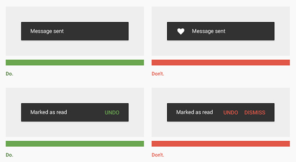
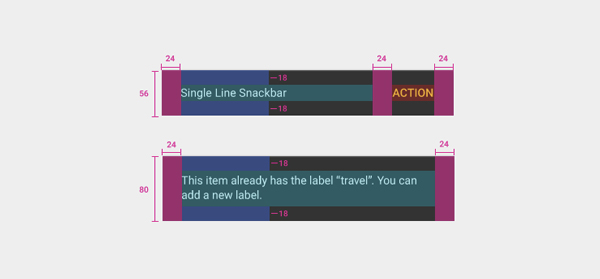
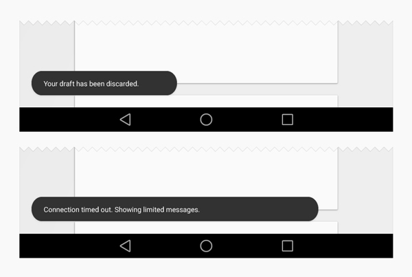

# 从 Material UI 得到的设计感悟

> 翻译：蒋灿

> 原文地址：designmodo (http://designmodo.com/material-design-components/)

如果你读过Google的[Material设计文档]，你就会发现其对细节和深度的注重。在文档中你能学到很多东西。其中最为重要的一项，就是其证明了编写复杂视觉风格指南是完全可能的。尽管可能困难重重，但还是可能的。特别是对于Google复杂多样的产品组合来说。

[Material设计文档]:(http://designmodo.com/material-design-documentation/)

如果你想学习视觉设计，就应该认真研究一下Material设计是如何处理不同元素或要素的。Google的文档详细介绍了18种不同的设计元素，从按钮到菜单再到标签等等等等。那么，通过分析这些设计元素能给我们带来哪些收获呢？

## 接受变体

文档中仅按钮就有很多不同的规则。《素材设计》中介绍了三种不同的按钮类型：浮动、突起和扁平。在《素材设计》所介绍的各种不同界面中要只使用单一的一种按钮类型是非常困难的。

同时，要保证各种不同界面之间的一致性也不容易。然而，为了保证最佳设计效果，Material设计采用了三种不同的按钮类型。其所采用的方法就是将设计改造成有时看似不太好的模式。

>“为主要按钮选择按钮类型要取决于按钮的重要地位、屏幕上的框架数量以及屏幕整体布局情况。”– [按钮的使用]

[按钮的使用]:(https://www.google.com/design/spec/components/buttons.html#buttons-usage)

按钮方面的部分指南比较具体，还有一部分比较模糊。总而言之，指南思考的非常透彻。指南中就如何使用以及何时不使用按钮有非常详尽的说明，以方便设计师开展工作。而这正是这份指南的美妙之处，其将设计的决定权交给了设计师。

## 注意容易被遗忘的要素

你在设计界面时是否会经常考虑弹窗或提醒模块？Material设计文档中有专门介绍对话框的一节。通常来说设计师不会从对话框入手进行设计。但在使用对话框时，它们同样属于设计的一个组成部分，需要相应的处理。

指南中有关对话框的部分非常详尽。其介绍了需要在其中使用的按钮类型以及相应原因。另外，指南还对对话框的架构进行了解释，其内容详实并且透彻。

>“如果每个标签上的文字不超出最大按钮宽度（例如常用的确定/取消按钮），那么推荐使用并排按钮。”– [对话框]

>“如果文字标签超出了最大按钮宽度，则可以使用层叠按钮容纳文字。”– [对话框]

[对话框]:(https://www.google.com/design/spec/components/dialogs.html)

指南中对对话框中应包含哪些类型的内容和操作进行了详细说明。这部分的介绍非常有趣，同时这也是经常被忽视的一个部分。其介绍道：为了创造出有力的样式指南和设计语言，所有设计要素没有大小之分，都非常重要。

## 一切为了可供性

文档用很大篇幅强调了可供性。从新创建并统一设计语言的唯一目的，就是为了实现跨浏览器/设备的可供性。一份高质量的样式指南应当将可供性融入设计语言，以求创造出高质量的设计指南。

>“标签的可供性就是显示相关的内容组。标签的说明应当简洁的介绍标签相关的内容祖。”– [标签]

[标签]:(https://www.google.com/design/spec/components/tabs.html)

Material设计文档中介绍标签所使用的方式非常精彩。其并不是把标签视为导航工具的一种形式，而是作为另一种浏览内容的方式。标签栏等特定元素也存在着局限这种观点非常新颖。显然，编写Material设计文档的设计师不仅考虑到了样式，还考虑到了元素的功能性，以免其被误用。

如果不同元素的功能得到了清楚明确的界定，那么这些元素的使用方式必然也就会被局限。反过来说，这样将有助于提高可供性。如果某个元素能够以不同的方式反复使用，就会给用户造成误解。

>“标签可以方便探索和切换应用中不同的视图或功能区域，或用于浏览不同种类的数据集。”– [标签]

## 打造你自己的元素

>“浮窗能够在移动平台屏幕底部以及台式机左下角以弹窗的形式提供有关操作的少量反馈信息。在屏幕上，他们会覆盖所有元素，包括浮动的操作按钮。”- [浮窗和提示栏]

>“提示栏和浮窗类似，但其中不包含操作内容，因此无法滑出屏幕。”- [浮窗和提示栏]

[浮窗和提示栏]:(https://www.google.com/design/spec/components/snackbars-and-toasts.html)

Material设计文档中有一个很有趣的部分叫做“浮窗和提示栏”。这个设计名词可能不太常听见；浮窗和提示栏是我们已经知道的设计元素。如果你读了下面的注解再看一下下方的图片，就能够理解浮窗和提示栏其实就是简单的弹窗通知。

但文档里面的介绍却非常细致。Materila设计文档对弹窗进行了分类。这是其设计语言的需要。浮窗和提示栏类似于对话框但实际却不同；因此他们是两个分离的概念。Materila设计文档将它们区分开的原因是其需要它们执行不同的功能。创建新元素是没问题的。和Materila设计文档中其他部分一样，浮窗和提示栏也有专门的指南——使用、案例、度量和颜色。

通常，我们会忘记这些元素不能以多种或新方式使用。有时候，区分弹窗的两种不同功能这种简单的问题也能讲出很深的道理，着实有趣。另外，不要忘了你可以加入可能被视为过时的元素，或者你自以为存在实则不然的元素，并以这种方式来革新你的设计。对小玩意的革新能够给未来的设计带来巨大的改变。

## 你和Material

亲自读一下[Material设计文档]，给我们讲讲你的心得体会吧。这套简单明了的文档能够给你带来设计方面的大量信息。
