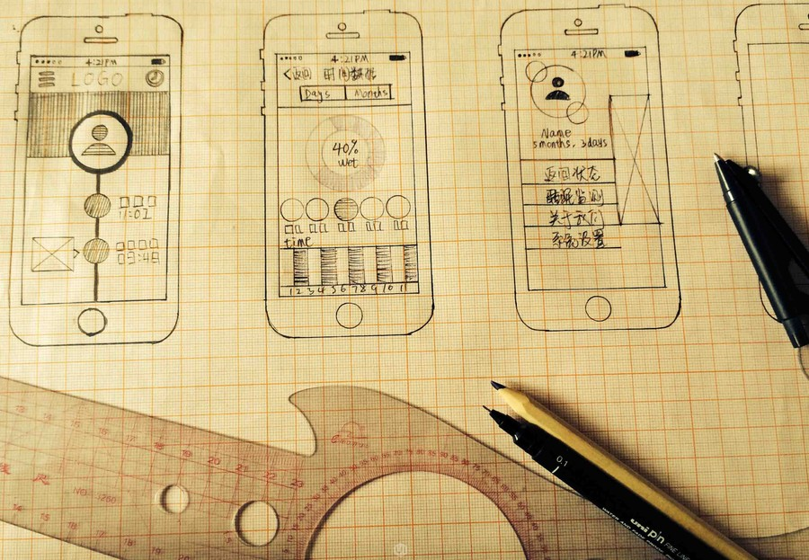
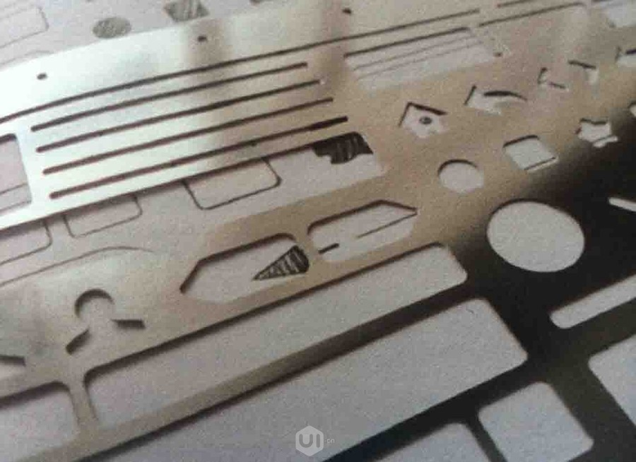
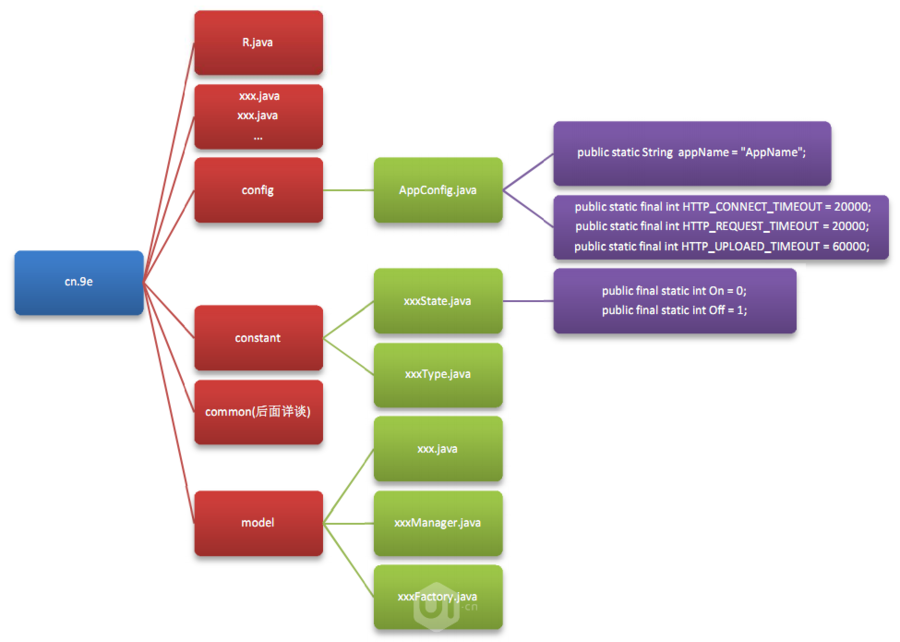
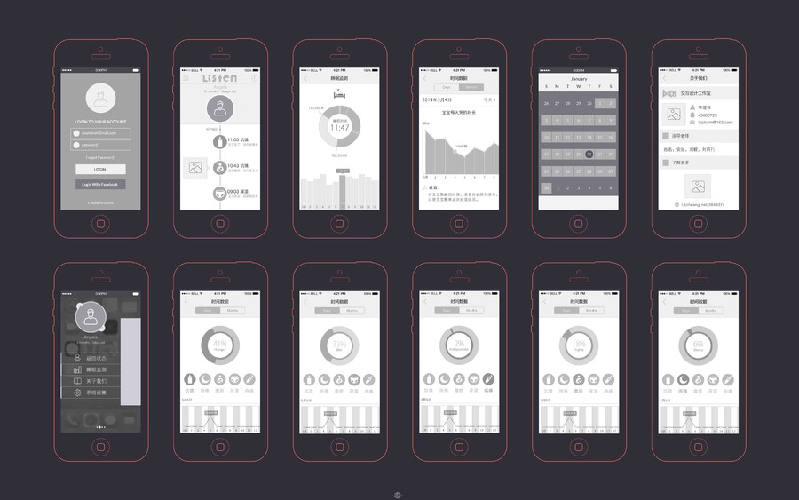
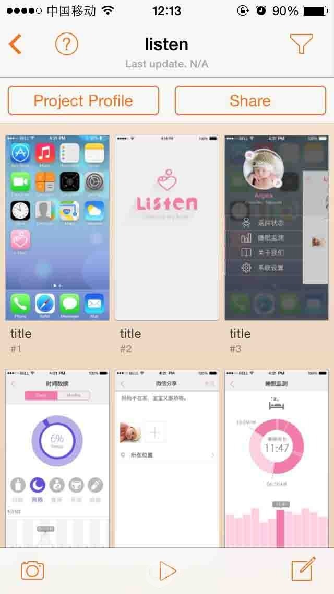

# 交互设计工具篇

> 我是佳佳，欢迎交流。

> 新浪微博@SSSStorm

工欲善其事必先利器，如今交互设计的工具五花八门。基于低保真原型的两个要求：轻巧快速和易于修改。在追求短频快的产品节奏下，企业一般用什么工具进行交互设计？使用哪些工具能够快速高效的输出？

## 1.前期

产品前期的讨论，强调的是创意或展示流程的核心概念，设计师们关注的是设计方向的可行性和用户体验，并提出问题。简单的手绘在前期阶段发挥着不可替代的作用，除了纸笔手绘线框，还可以使用尺子画出界面通用的控件或基本元素。

## 2.过程

* 思维导图工具比较多，使用 XMind, Mindmanager 等比较常见。

* 低保真原型使用工具也是多样性的，有visio，早期的设计都还在用（现在看到比较多是IT人在用）。

* Axure，目前主流的使用工具，配合组件库，可以快速调出需要的控件、基本元素、窗口等快速进行交互原型制作。也可进行制作交互动画，更清晰展示原型的流程。

> 这里提供一个ios7组件库给大家下载：http://pan.baidu.com/s/1bnvT2nd

* Illustrator，矢量工具。特点是操作麻烦，控件需要手动添加，输出效率较低。Coreldraw道理与Illustrator相同。常见与做文档输出，新手或者早期的原型不推荐使用。

* Keynote / PPT,在MAC,WIN环境下的标配，使用的情况也不多，除非是时间紧迫要跟客户或领导展示产品概念。画草图不好展示，用Keynote / PPT可以快速出一些动效，助于概念阐述。缺点也很明显毕竟不是专业绘图工具，没有模板，不利于长期修改。

* OmniGraffle,这款绘图软件，曾获得2002年苹果设计奖。但只能于运行在Mac OS X和iPad平台之上。可以绘制普通图表、树状结构图、流程图、页面编排等，基本上交互设计所涉及的都涵盖了。有MAC的同学可以尝试下，很多资深交互设计师都推荐的一款软件。

* 其他，交互设计工具多样化， Photoshop等等也可以。但不管用哪种工具，找到一款适合自己，并熟练使用它，才是真正的高效。

## 3.展示

展示部分，分为静态与动态两部分阐述。

### 静态

静态一般是指文档规范，比如用Keynote/PPT/InDesign输出的PDF，文档，表格，图片等格式。这类文档要求交互注释清晰，流程一目了然。可供开发，视觉乃至PM，看清楚你所设计的内容并作为规范。

### 动态

动态的展示，一般是在设计之初展示给领导或客户看的Demo，以及设计上线展示给用户的演示。

#### PC端

常见的有Flash，AfterEffects, Premiere Pro，Keynote/PPT，UIDeigne ,Axure等软件。输出两种，一种是可点击/拖拽的交互Demo。另外是演示的视频，这类多用After Effects, Premiere Pro软件，进行视频的剪辑，交互动画的展示。

附毕业设计做的视频展示供参考：

* Listen APP演示  http://v.youku.com/v_show/id_XNzExNjY1NzU2.html
* Listen设计过程  http://v.youku.com/v_show/id_XNzExODU2NTQ4.html

##### 移动端

POP，快现，UIDPlayer等软件，这里推荐这3个给大家。它们简单易用，用手机拍手绘草图，添加热区，就可以在iPhone/ Android上演示原型，并且POP内嵌的交互动作如侧滑、展开、消失。快现的“摇一摇”等功能，可以满足一般的动态演示需要。

另外，还有一些在线生产的动效，这里推荐一个：https://www.flinto.com

## 4.其他

除上述之外，一些素材库，字体，模板等也能帮助你进行高效的输出有质量的交互文档。

快动动手规划下你的设计软件吧^.^

下周写一编关于交互设计实战项目，请持续关注~
