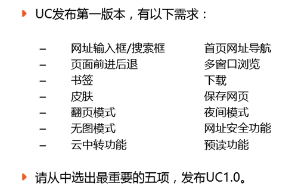

# 推荐：交互设计七大定律

> 来源：http://www.uisdc.com/7-interaction-design

> 原址：http://www.geekpark.net/read/view/166489

作为交互设计之父的阿兰·库珀最为人熟知的或许就是这句“除非有更好的选择，否则就遵从标准”了，在交互设计领域有很多经过了时间的验证的法则定律被认作了标准，那么你都知道都有哪些吗？

## 1. Fitts’ Law / 菲茨定律（费茨法则）

定律内容：从一个起始位置移动到一个最终目标所需的时间由两个参数来决定，到目标的距离和目标的大小（上图中的 D与 W），用数学公式表达为时间 T = a + b log2(D/W+1)。

它是 1954 年保罗.菲茨首先提出来的，用来预测从任意一点到目标中心位置所需时间的数学模型，在人机交互（HCI）和设计领域的影响却最为广泛和深远。 新的 Windows 8 中由开始菜单到开始屏幕的转变背后也可以看作是该定律的应用。

菲茨定律的启示：

* 按钮等可点击对象需要合理的大小尺寸。
* 屏幕的边和角很适合放置像菜单栏和按钮这样的元素，因为边角是巨大的目标，它们无限高或无限宽，你不可能用鼠标超过它们。即不管你移动了多远，鼠标最终会停在屏幕的边缘，并定位到按钮或菜单的上面。
* 出现在用户正在操作的对象旁边的控制菜单（右键菜单）比下拉菜单或工具栏可以被打开得更快，因为不需要移动到屏幕的其他位置。

扩展阅读：Windows 设计规范中的鼠标交互[^Windows设计规范中的鼠标交互]、菲茨定律与互联网设计[^菲茨定律与互联网设计]、費茲定律Fitts Law與使用者介面設計[^費茲定律Fitts Law與使用者介面設計]、Google Chrome 与 Fitts Law[^Google Chrome 与 Fitts Law]、谈谈 Fitts 定律[^谈谈 Fitts 定律]、费茨法则在交互设计中的应用[^费茨法则在交互设计中的应用]（Readlists[^Readlists]）

[^Windows设计规范中的鼠标交互]:Windows设计规范中的鼠标交互:http://www.uxguide.net/wiki/windows:Interaction/mouse-and-points

[^菲茨定律与互联网设计]:菲茨定律与互联网设计:http://cdc.tencent.com/?p=6122

[^費茲定律Fitts Law與使用者介面設計]:費茲定律Fitts-Law與使用者介面設計:http://blog.vgod.tw/2009/10/02/fitts-law/

[^Google Chrome 与 Fitts Law]:Google-Chrome与Fitts-Law:http://blog.renren.com/share/248135400/2570031761

[^谈谈 Fitts 定律]:谈谈Fitts定律:http://blog.sina.com.cn/s/blog_8de72dd101012jcu.html

[^费茨法则在交互设计中的应用]:费茨法则在交互设计中的应用:http://www.cnblogs.com/yanrongpi/archive/2009/02/17/476361.html%20%20

[^Readlists]:Readlists:http://readlists.com/94b9126f

## 2. Hick’s Law / 席克定律（希克法则）

定律内容：一个人面临的选择（n）越多，所需要作出决定的时间（T）就越长。用数学公式表达为反应时间 T=a+b log2（n）。在人机交互中界面中选项越多，意味着用户做出决定的时间越长。例如比起 2 个菜单，每个菜单有 5 项，用户会更快得从有 10 项的 1 个菜单中做出选择。

席克定律多应用于软件/网站界面的菜单及子菜单的设计中，在移动设备中也比较适用。

扩展阅读：席克法則[^席克法則]、谈谈Hick定律[^谈谈Hick定律]（Readlists[^Readlists2]）

[^席克法則]:席克法則:http://www.innofaci.com/2012/03/09/design-peinciple-hicks-law

[^谈谈Hick定律]:谈谈Hick定律:http://blog.sina.com.cn/s/blog_8de72dd101012jm5.html

[^Readlists2]:Readlists:http://readlists.com/268ffc81/

## 3. 神奇数字 7±2 法则

1956 年乔治米勒对短时记忆能力进行了定量研究[^定量研究]，他发现人类头脑最好的状态能记忆含有7（±2）项信息块，在记忆了 5-9 项信息后人类的头脑就开始出错。与席克定律类似，神奇数字 7±2 法则也经常被应用在移动应用交互设计上，如应用的选项卡不会超过 5 个。

[^定量研究]:定量研究:http://www.musanim.com/miller1956/

## 4. The Law Of Proximity 接近法则

根据格式塔（Gestalt）心理学：当对象离得太近的时候，意识会认为它们是相关的。在交互设计中表现为一个提交按钮会紧挨着一个文本框，因此当相互靠近的功能块是不相关的话，就说明交互设计可能是有问题的。

## 5. Tesler’s Law 泰思勒定律（复杂性守恒定律）

该定律认为[^该定律认为]每一个过程都有其固有的复杂性，存在一个临界点，超过了这个点过程就不能再简化了，你只能将固有的复杂性从一个地方移动到另外一个地方。如对于邮箱的设计，收件人地址是不能再简化的，而对于发件人却可以通过客户端的集成来转移它的复杂性。

[^该定律认为]:泰思勒定律（复杂性守恒定律）:http://www.nomodes.com/Larry_Tesler_Consulting/Complexity_Law.html

## 6. 新乡重夫：防错原则

放错原则认为大部分的意外都是由设计的疏忽，而不是人为操作疏忽。通过改变设计可以把过失降到最低。该原则最初是用于工业管理的，但在交互设计也十分适用。如在硬件设计上的 USB 插槽；而在界面交互设计中也是可以经常看到，如当使用条件没有满足时，常常通过使功能失效来表示（一般按钮会变为灰色无法点击），以避免勿按。

如上图所示极客公园的评论功能快，在留言框没有内容或邮箱格式不正确的时候是无法获取验证码的，只有两者都满足了才可以。

## 7. Occam’s Razor 奥卡姆剃刀原理（简单有效原理）

这个原理被称为“如无必要，勿增实体”，即如有两个功能相等的设计，那么选择最简单的。在[极客公开课?走进 UC] 中 UC 浏览器产品经理苏剑南在[UC 浏览器 For Android 产品设计思考]演讲中也有讲到该原理的应用，”如果 UC 手机浏览器要发布第一个版本 UC 1.0，你会选择哪五个功能？‘’

[极客公开课?走进 UC]:极客公开课?走进UC:http://www.geekpark.net/event/view/review/165478

[UC 浏览器 For Android 产品设计思考]:UC浏览器For-Android产品设计思考:http://www.geekpark.net/cast/view/166184

为了遵守神奇的数字 7 法则本篇就只介绍到这里了，如果你还有兴趣自己去找找其他的定律法则，如与费茨定律接近的 Steering Law转向定律、Gutenberg Diagram古登堡图法则以及雷打不动到哪哪适用的帕累托定律（80/20 原则）、三等分原则等。

---

最后想说的是虽然这些法则定律被很多人认定为标准，很多人也记得 Alan Cooper 说过的那句名言，但从实际出发这些法则定了起到的只是参考或启发作为，作为交互设计人员千万不能照本宣科，因为只有亲自做过后才会深有体会。
