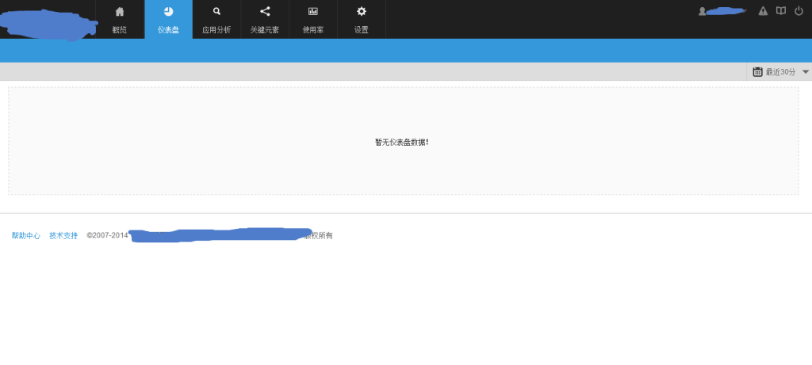
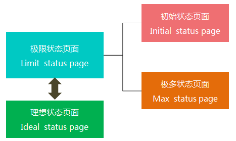
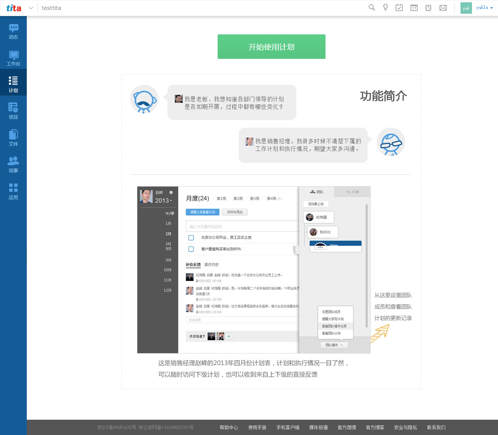
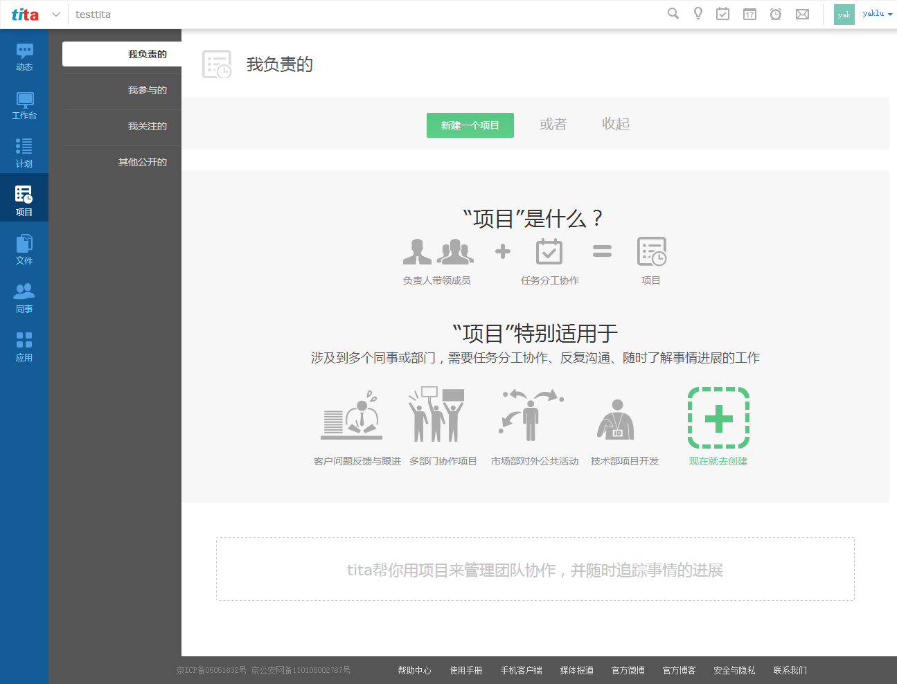
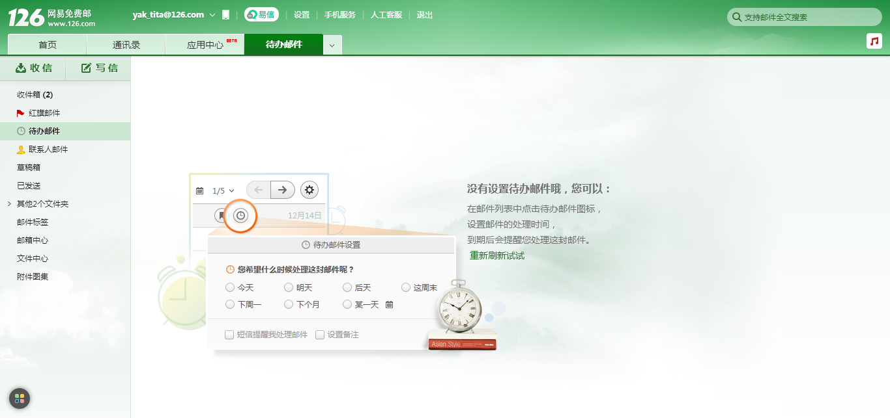
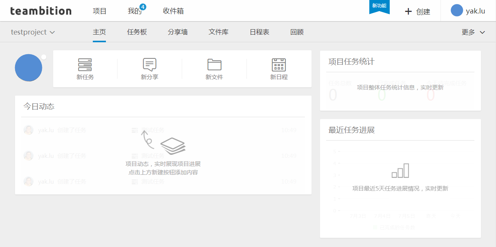

# 高手之路！教你如何打造优雅的初始状态页

---

> 来源：http://www.uisdc.com/elegant-link-page-design

> 投稿者：@产品经理朝阳陆 (http://weibo.com/u/1872140863)

在本文的开头，一如既往的举几个例子，不过这次是反例，第一个例子是国内某个网络监控软件的仪表盘界面设计：

---

再来一个该产品详细数据的展示界面：

---

接下来看另外一个OA系统的产品类别页面：

以上的反例已经足够说明一个问题——初始状态页面需要设计。

---

实际上本文的编写有个来源，前些日子在”产品经理实战训练营”的一个微信分享里有篇文章叫《用户界面设计原则》（原文作者不详，应该是一篇翻译的文章），其中第16条原则提到关于初始状态页面的设计问题，以下是原文描述：” 第一次使用界面的体验是非常重要的，而这却常常被设计师忽略。为了让用户更快的上手，最好在设计的时候保持初始状态，也就是还没开始使用过的状态。这个状态不是一张空白的画布……它应该要提供一个方向和指引，令用户迅速进入状况。在初始状态下的互动过程中可能会存在一些摩擦，一旦用户了解了规则，那将会有很高的机会获得成功。”

个人认为，所谓初始状态页，实际上是极限状态页面设计中的一种，极限状态页面包括了初始页面与极多状态页面，如下图所示：

初始状态就是刚刚开始使用的界面，极多页面我们可以理解为当数据量非常大的时候，整个界面的效果，两者都非常重要。

在大部分的情况下，产品经理和交互设计师都关心理想状态设计，即正常情况下产品界面是什么样子，所以在设计软件的交互原型时，我们喜欢用比较合理的数据条数把界面设计的精美与看似可用，但是往往会忽略没有数据或者数据非常多的情况，界面是否能够承载原有的设计方式，而恰恰实际的软件必须要考虑这些状态。今天主要讨论初始状态页面的设计，极多状态会在后面的文章中单独说明。

---

回到问题的出发点，初始状态页面要解决什么问题？个人列出了几点：

1、告知：告诉用户这个页面还没有数据，需要用户来创建或者添加；

2、引导：通过明确的步骤性的操作引导用户如何应用系统；

3、模板：默认给出数据模板，让用户理解已有情况，基于此快速入门；

较好的初始状态页面设计应该能涵盖这三个点中的两个以上（不好的设计只做到了告知甚至没有），下面我们一起来看看比较优秀的界面设计：

如下是国内有名的企业级在线协同工作软件tita的”计划”初始页面，如果传统的设计，可能只会给出一个提示叫”当前没有计划，请创建”。而tita的设计师比较巧妙的进行了告知与引导——把相关的功能用类似讲故事的方式进行了说明，让刚刚进来的用户能对”如何做计划”有个大致的理解，另外设计师讲故事的方式也比较活泼，让人能够很好的入门。

---

项目的页面设计也是如此，如下界面中给用户解释了什么是项目、项目能帮助用户做什么进而引导用户新建一个项目。

---

126邮箱的待办邮件界面，在没有设置待办邮件时，给用户提示以及相关的帮助引导，如下界面设计。

---

国内发展势头非常迅猛的另一个新生代企业级协同服务teambition，它的项目初始状态页非常有趣，可谓是另辟路径。我们注意下图中有浮动层的设计，比如”今日动态”这里，浮动层上用图标和文字提示项目动态的帮助及使用引导，而半透明的浮动层下显示了如果已经添加了任务的效果，预先给用户可期待结果。

---

以上是个人发现的比较好的一些初始状态页面设计的例子，不管如何设计，问题的本源是要考虑用户最开始的学习成本如何降低，只有让用户快速接受，产品才不会被容易抛弃——变得更有价值。

最后强调一个概念，初始状态页绝不等于空白页面，相信看了这篇文章，这点大家在后面的设计中能有所体会；
