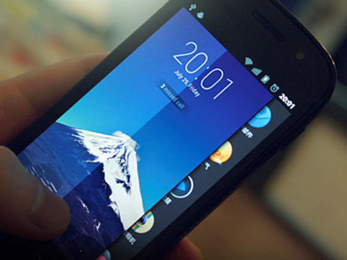
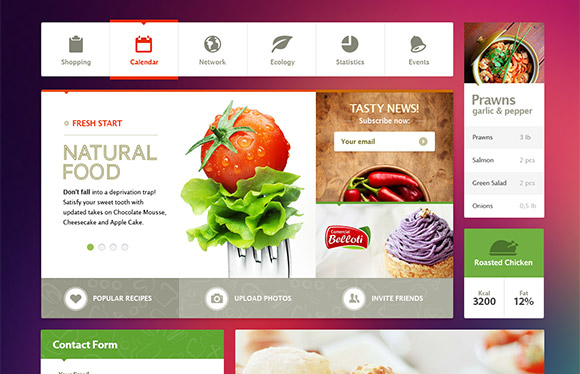
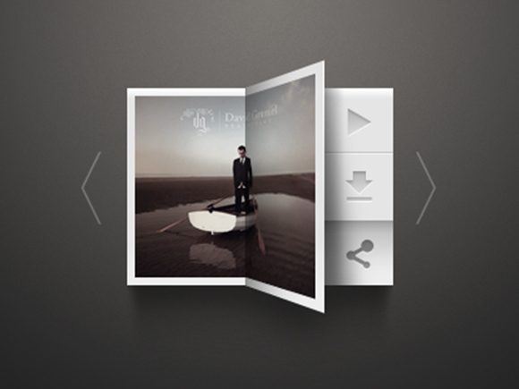
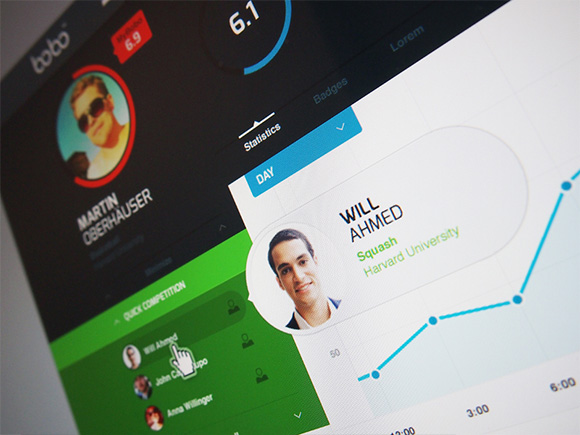
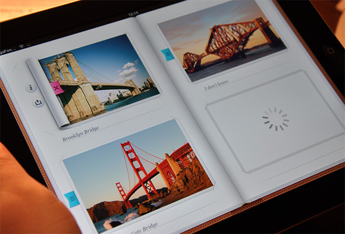

# 优秀的界面是隐形的

> 来源：http://article.yeeyan.org/view/418335/386633

> 译者： 十萬個為什麼 (http://user.yeeyan.org/u/greenzorro)

> 原作者：PATRICK COX

真正优秀的用户界面会被无视，而糟糕的设计则迫使用户注意界面，而非内容。用户都是带着目的来访问网站的：买本新书、学习JQuery、与朋友分享一篇文章、发现新音乐、写小说或者仅仅是寻找最近的目的地。他们不会只为把玩界面而来。实际上，用户根本不在意界面设计。多年来，台式机系统树立的典范和交互式工具的缺失，都使人们开始思考用户界面，它如何发挥作用？如何让设计增色或减分？但用户真的需要关心这些吗？

用户已经熟知界面的模式和组成元素，但他们根本不在意。多年来，网页设计师们已经在按钮颜色、投影、边框和渐变上花了成百上千个小时，只为了让界面更易用和美观。但事实上，优秀用户界面的终极形态不是易用，而是隐形。

或许你已了解，移动设备是近年来的重头戏。多点触控设备的问世引出了一个轰动性概念——用户界面就是一系列对内容进行的点击操作和事件，移动设备的崛起令人机界面更加自然。这一现象有诸多原因，但对直接对内容进行操作，和摒弃过时的具象化事物（像台式机里的那些）赋予了这些设备极高的易用性，因为它们的界面几乎消失了。

不过我们仍然需要用台式机和笔记本来工作，我们也需要浏览网站、使用web应用程序。那些神奇有趣的多点触控技术，和它创造出的更加自然的新式用户界面，却未必能派上用场。那么，既然还不能为我们所用，我们要继续创作那些过时且“碍事”的UI元素吗？当然不行，隐形界面应该是每位UI设计师与开发者的目标。

## 界面，而非障碍

界面不该成为用户浏览内容或达成目的的障碍。达成目的之前，用户根本没必要经历那些UI陷阱和胡乱编排的导航。多年来，我们都在使用和发明各种UI障碍。表面上它们似乎能解决某些问题，却给用户增加了更多负担。面包屑就是个极好的例子。通常认为，要让用户了解自己在应用中所处的位置，面包屑是个不错选择。但它更多时候只是平添了不必要的UI元素，影响正常的用户体验。

尽管面包屑并没有直接给用户带来负担，但它占据了屏幕宝贵的空间资源，而这本该用来引导用户达成目的和展示内容。增加面包屑来应对导航问题，不如直接设法解决它。为“修复”某些UI问题，经常会引入新的元素。然而，太多不必要的元素积少成多，最终界面成了一个障碍重重的迷宫。若是一味增加UI元素，界面还如何隐形？

## 解决界面问题

这与我们前面所讲的息息相关，但是要打造隐形的界面，意味着要解决更深层次的问题，你得真正解决那些问题所在。我的背有点小毛病，当然，敲一敲和服用镇痛药都能止痛，只是治标不治本。我缺乏运动，经常无精打采，像石头一样僵直。我们对待界面问题也是一样。创作网站和APP时，我们总会发现各种千奇百怪的问题。多数时候我们只是做些表面文章来解决问题，界面下却隐藏着更深层次的问题。此举只是头痛医头，脚痛医脚。

不过这已经成为惯例了，因为我们总得学着与项目经理、网站主、股东、项目进度或仅仅是懒惰抗争。我们总以此为理由进行用户测试和AB测试。“我知道有些不对劲，不过还是通过用户来验证一下这是否真的是个问题。”若想要实现隐形设计，这可不是什么好方法。完全透明的界面意味着解决设计中最深层的问题，它们才不会出来作乱，成为用户的绊脚石。

## 宽容的设计

宽容，往往是隐形用户界面的一个特征。自然的界面并不限制各种探索性的点击。当用户进入死胡同，它不会轻易显示错误信息，而是将用户引向别处。

宽容用户意味着他们犯错时不要惩罚他们。用户错误操作，往往因为他们无法预料结果。我们总将问题归咎于用户，并弹出大大的警告和错误提示来惩罚他们。当用户踏入陷阱时，隐形的界面会避免责罚他们。相比弹出错误提示，优秀的界面设计能预测应用中出错率较高的地方，并提供解决方法，甚至引导跳转。

宽容也意味着网站或APP的规则可以被用户打破。这是下策，不过假设你打破了妈妈的古董花瓶，想要把它粘回去，却因为手指粘在一起被抓住，这肯定是最深刻的教训。用户弥补他们犯下的错误时，他们将更了解你的APP，别出现那些大红错误图标和晦涩难懂的文案。

## 首要任务，达成目标

这是个交互设计的绝佳案例，是Cooper正在进行的项目，鉴于它尚未上线，我应该只被允许小小提示一下——以目标为导向的设计。你的界面设计也应该围绕用户的目的展开。不是用户要什么或喜欢什么，去他的，根本不是这么回事。而是挖掘用户的需求，然后指引他们达成目标。这很滑稽，用户对于他们想用什么样的产品总能夸夸其谈，却对自己的目的一无所知。你的职责就是挖掘他们的需求，而非要求。“要求”会导致界面臃肿、障碍重重，令用户厌烦。

找出目标并让用户尽快完成它，他们不在乎其他事情，尽快到达目的地才是对他们最大的回报。不需要为此设计漂亮的界面，避免用过度设计来补偿糟糕的目标引导。

## 一致性

不错，在用户体验的世界中，我们一直在谈论一致性原则。界面设计中，一致性是重点。如果你的界面元素都放在相同的位置，有着相同的颜色和功能，那么你的界面会逐渐消失……像Marty McFly一样。不过，如果只是把所有按钮放在每页的同一个位置，或用某个特殊操作执行相同的功能，并不能解决一致性问题。

在用户体验设计中，我们还经常借鉴APP或网站中那些一致或相似的东西。我之前写过文章，解释了相似的环境如何使得界面更舒服。然而我们要创造真正的隐形界面，不是为了一致而一致，光有这些还不够。隐形界面有着“真正的一致性”，不仅元素、数值、链接和其他数据展现形式统一，场景和含义也是一致的。

例如，你应该注意到了，其他很多APP把登陆按钮或链接放在右上角，所以你会觉得，既然其他APP都这么做，放那里肯定错不了。但在你的APP中，放在那个位置或许就毫无意义。与其继续创造有瑕疵的界面，不如将界面元素放在最合适的位置，然后在整个产品中延续其一致性。

## 结论：鼓舞用户

最后，优秀的隐形设计还需要鼓舞用户。当界面脱离了用户的操作步骤，直接将他们引向最终目标，用户会集中精神在他们的目标上。

界面应当通过数据和内容的无缝切换，来鼓励用户与它建立良好的关系。用户有时喜欢探索一个界面巧妙的产品，甚至玩得很开心。但更多时候，对他们而言不存在的界面更有鼓舞作用
