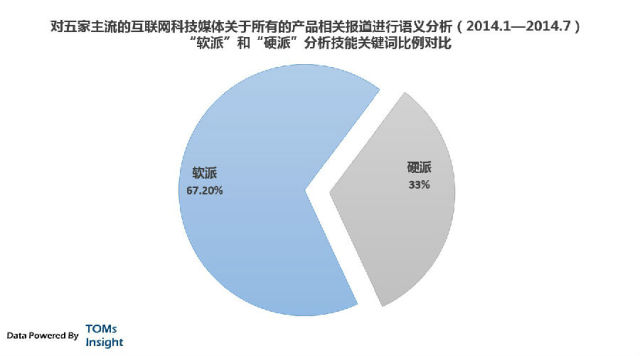
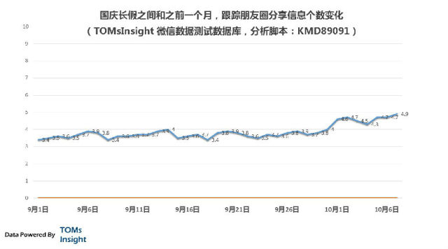
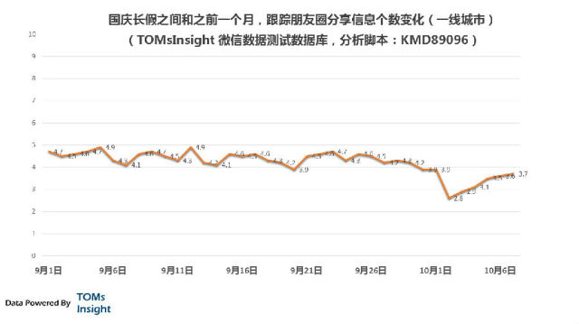

# 怎样深入做用户分析

> 来源：http://zaodula.com/archives/10936.html

> 文章来源：TOMsInsight

> 早读课编辑、校对：Violaz   Wint

互联网的红利烧红了一个新的职业：产品经理。一夜间，人人都是产品经理。很多成名大佬喜欢说：“其实，我是一名产品经理”，不论之前是写博客的还是说相声的。边装低姿态，边暗示自己产品领域倍专业，居功至伟。名头可以随便起，但是作为一个产品经理的核心功力：用户需求分析，就没有那么容易忽悠了。让我们从一个故事说起：

从前有一个国王，国王有个极其娇惯、任性、无比作的公主，这个国王又无比的宠爱这个公主：不管这个公主有什么愿望，国王一定满足。终于有一天，公主说：“父王，我要月亮！”，于是国王叫来一个臣仆，说把月亮给我女儿给摘来，不然我就杀了你，臣仆欲哭无泪，最终被国王杀害，接着叫来另一个臣仆，也无奈之愤愤而终。在公主的哭闹下，臣仆一个个死去，终于轮到了一个聪明的，他接到任务后，来到公主前谦卑的问：“亲爱的公主啊，请告诉愚昧的臣仆，月亮是什么啊？”公主不耐烦的说：“月亮是什么你都不知道！月亮就是用金子做的，如手指盖般大小，弯弯的，晚上就会挂在我窗前的树枝上啊，白天不知道被谁偷走了。”此臣仆暗喜，照此炮制，逃过一劫。

这个故事从我们TOMsInsight团队的老板口中听到，讲完此故事后，老板叹了口气，说：“需求啊，需求，也许上帝都不知道人类的需求是什么。”当然老板就是老板，多少都会有一些深沉（zhuangB）属性，但是此故事却让我们分析师团队很受启发。互联网发展至今，当用户至上一次次的被提起；当以产品、用户为中心，打造极致成为口号；当大学落榜生都由于自己装过几百个app而就自以为是合格的产品经理；当大量互联网从业人员都由于自以为发现了用户需求上的空白几乎而觉得要不是自己有房贷那创业了肯定是一个互联网巨头；再加上不懂技术只能围绕产品概念说事的互联网科技媒体助拳，一时间好像只有产品经理在改变世界。

当这些浮躁的情绪在整个行业里绵延的时候，我们又能不能沉下心来，真正的去深入用户需求分析呢。今天TOMsInsight的主题是：那些用户需求分析背后隐藏的门槛。

## 用户需求分析技能门派之分

用户需求分析的方法技能大概可以分成两个门派，或者说两个不同的风格：一种是注重意识形态分析，喜欢的是：用户心理、人性利用、用户体验、交互体验、群体效应、用户调研、深度用户理解、用户行为模拟、再加上一些炒作的概念、等等。出于后文描述方便，我们可以把这一类叫做：软派。另一种是注重数据建模和分析，喜欢的是：数据、用数据说话、数据建模、结构化数据构建、用户数据细分、用数据profiling用户、大数据分析、数据模拟运营、小流量测试、等等。同样出于后文描述方便，我们可以把这一类叫做：硬派。

为什么用户需求分析会变成这两种门派呢：

由于国情，在互联网发展起来之前的软件产业（也包括目前的软件产业）的用户以企业级客户，专业用户为主（直接面向消费级终端用户较少），而成本主要是技术投入，所以在考虑用户需求时，主要是如何尽可能用低成本去满足。而这时期的产品经理，更是以系统结构师、系统分析师转化或者兼职，都是技术出身。不管目前大家对张小龙、雷军、周鸿祎的互联网产品理念多么推崇，但是当年他们入行都是以程序员的身份，并有长时间技术生涯。

 互联网行业不同与软件，由于产品直接面向消费级终端用户（网民），门槛降低。又因为行业发展的红利，其入门起薪要高出别行业一大截。再加上乔布斯的成功，其重设计、体验的产品理念和做到极致的追求，与其非技术出身的背景。这些原因都让非技术背景的人才在07、08年以后大量的涌入互联网产品经理的行列。

对互联网企业来说，由于技术逐步平台化和服务化，成本降低。互联网产品需要创新，快速迭代，在“试错”中摸索。所以乐于吸纳各类背景的人才，甚至年轻化人才，希望其五花八门的创意中碰巧出现一个世界级的应用。而这些各类背景，年轻化的人才，也开始充分利用自己的优势，形成软派。而技术出身、或者从技术研发转型的产品设计人员，更加保守且注重逻辑思维逻辑化，在用户需求分析时喜欢运用特长、发挥优势，用数据说话，以他们为主慢慢形成了硬派。

事实上，没有谁的用户需求分析思路会是纯软或者纯硬，有的是3分软7分硬，有的2分硬8分软，巧妙融合，如果这样深入下去，踏实探索，并无大碍。但是由于行业风气浮躁，大家更多的是浮在水面，导致不管软还是硬，都是卡在不同层级的门槛之前，不得深入。

## 软派技能的门槛

我们先来研究下软派技能的门槛，按照水平递进我们分成以下三类：

### 1.一级门槛：把自己当用户。

喜欢把自己当用户或者把自己臆想成一部分用户群体，把自己的需求或者臆想出来的需求无限放大，盲目乐观。具体的说是：当我们遇到了一些需求没法得到满足，就会觉得有大量的用户肯定也有类似的需求；或者因为和一个朋友聊天忽然发现了需求，就认定朋友这类人群有类似的大量的需求存在；再或者自己直接臆想出来一个装逼需求，除了装逼以外没有任何用处。

刚刚到这个行业的产品设计人员或多或少的都会被这个门槛挡住。有时候明白用户是一个分析对象而并不是自己，不像说起来那么容易：真正的去了解用户，搜集相关的信息，把自己变成空白，再变成用户，客观的思考；再变成空白，切换成自己，理性的分析。

### 2.二级门槛：有色眼镜局限。

跨过第一级，已经掌握如果利用问卷调查、目标用户访谈、或者相关的深度调研来分析用户需求。但是这时候，我们一般会被自己的有色眼镜（自己的意识形态、生活的水准、成长的背景、阶级定位等等）所局限，无法真正了解用户需求的本质。说的直接点，就是由于我们和我们的用户群体根本不是一类人，就没法深入的去把握用户的需求，总是被自己的观点所误导。一般水平的专业分析人员或多或少的都会被这个门槛挡住。比如一个从15岁身边就是一堆倒贴mm的高富帅，真的能了解那些急需解放右手的渴望么？比如一路贫困刚刚毕业才吃了第一顿必胜客几乎都睡在公司的产品新人，想做一款高尔夫社交应用，不管多深入的约谈潜在目标用户，能真正了解他们对社交的真正心理么？再比如一个从来不看篮球不打篮球的文艺青年，能明白天天刷NBA论坛的高中生NBA对他们意味着怎么样的精神寄托？

### 3.三级门槛：非体系谈心理。

接下来是第三级的门槛：真正（注意是真正，只会说的不算是跨越^_^）跨越第二级，已经懂得用户心理的微妙把握和对于人性的利用了。但是这时候，我们一般做不到建立起完整的对心理学、社会行为学的知识体系结构，所以构成不了一个对用户心理、行为的体系化的认知。所谓的单方气死名医，但是却无法代替名医。名医明白如何去平衡身体的各种机能而不是头疼医头脚疼医脚。

同理，当我们没有体系化的对用户心理、行为进行认知，只能利用这个群体的部分心理诉求的时候，对这个用户群体的需求的了解，并不能算平衡，依据此需求设计的产品，一般会呈现火一时但是不长久的状态。

越过这三级门槛，就掌握了一流的软派用户分析技能。其实只要沉下心去钻压，踏实的学习，一点都不难。就怕跟着互联网行业的浮躁这风：最近经常看到一些科技媒体上95后少年在谈自己创业的产品如果利用人性。说句不好听的话，等真正成了人，熟悉了性，再谈人性吧。

## 硬派技能的门槛

接下来我们再看，硬派用户需求分析技能的三个门槛，也是按照水平级别递进：

### 1.一级门槛：数据都是事实。

不知道什么时候开始，“用数据说话”就已经成为互联网公司的核心方法论，也成为了硬派用户的核心理念。但是数据是一把双刃剑，不怕不懂数据，就怕自以为很懂数据却又不深入，从而得到错误的数据结果。我们用实际的情况举一个例子吧。TOMsInsight的数据分析团队在国庆长假期间监控了2789个微信号的朋友圈中435092好友在朋友圈中分享数据的变化情况如下：

没有跨越第一级门槛的硬派技能分析人员就开始下结论了：假期期间大家更喜欢分享信息。但是我们再看一下，如果仅仅监控其中的北上广深四个一线城市的169809个用户，结果如下：

我们例子中的数据由于方法局限也不能代表什么结论，但是换一个角度，就出现了完全不同的结果。数据有很多维度的视角，仅仅从少数的视角维度就得出结论，利大于弊。

### 2.二级门槛：有数据无观点。

跨越了第一阶段的硬派的分析技能，就可以全方位的用数据描述用户需求了：年龄、地域分布、用什么手机、手机系统、访问什么网站、上网时长、时间段分布……等等等。数据做的非常专业，各种算法分析、各种数据建模，排除干扰噪点等等。能做到这种水准的一般都技术背景深厚，又沉迷于此，却遇到新的门槛：把数据做的大而全，但是却毫无任何客观的观点，在数据抓取分析过程中没有主心骨或者太有倾向性。

说个可能对大家有启发的故事：二战时期美国军工公司曾对伤回战机进行全方位的数据分析，得出一些需要修改设计的结论，而进一步优化，此项目被军方叫停，因为显而易见的错误：那些真正的重伤飞机都完全毁掉消失，这些伤回飞机的分析再透彻，又能多客观呢？另外一个例子几乎是所有学过数据挖掘在校都听过的案例，啤酒与尿布：美国超市数据分析发现买啤酒的人总是买尿布。好吧，如果这是一个发现，又有什么用呢？为什么我们从来就没见过啤酒和尿布在一起卖的超市呢？当然，美国也没有。

### 3.三级门槛：数据描述一切。

跨过前面两个阶段，就已经能成为优秀的硬派需求分析师，可以在互联网巨头混个不错的职位独当一面了。但是这时候反而会遇到新的误区，喜欢用数据描述一切。比如最近火热的大数据在一定程度上就推波助澜此道。过于详细的数据其实也就失去了意义，失去了用户需求的真正核心价值。分析是过程，而不是结果；数据是方法，而不是目的。

有些需求是永远无法用数据去描述清楚，也无法用数据去论证。我们需要在数据中找到一个平衡点，用来支撑我们继续探索的道路，但是不是用数据描述出来这个道路。劳民伤财，也没有任何意义。

软派和硬派，各有其优势和局限。两者有效的结合在一起，形成合力，更能准确的把握用户需求。两方面技能都跨过这三个门槛，就能成为用户需求分析领域的高手了（或配合成高手团队）。
