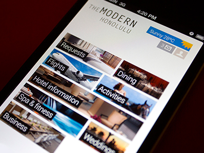
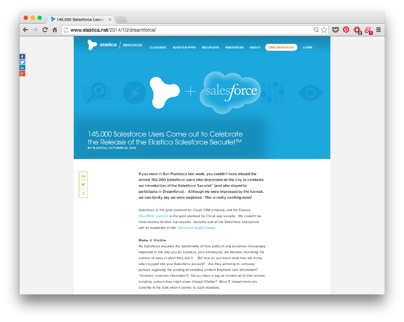

# UI设计新手？试一试这7条法则（Part 1）

---

> 本文编译自[Medium]，作者是一位UX（User Experience, 用户体验)设计师，他通过自己学习UI设计的过程，总结出7条实用的法则，为UI设计新手提供了宝贵的经验。文章分为2个部分，这里是第1部分。第2部分请移步：[UI设计新手？试一试这7条法则（Part 2）]

[Medium]:(https://medium.com/erikdkennedy/7-rules-for-creating-gorgeous-ui-part-1-559d4e805cda)

[UI设计新手？试一试这7条法则（Part 2）]:(http://www.36kr.com/p/217392.html)

---

## 序言

首先，明确一点，这篇文章并不是为所有人准备的，而是有特定的目标读者：

* 想要在开发产品时设计出好看UI的开发者。
* 想要让自己作品集更出彩的UX设计师，或者是想要做出更精美的UI和UX的设计师。

如果你是学艺术的学生或者已经是UI设计师了，你可能觉得这篇文章很无聊，而且观点都是错的。没关系，你的批评没错，把这个网页关了，去忙别的事吧。

---

那么从这篇文章中到底能学到什么呢？我曾是一名不懂UI的UX设计师。我非常热爱UX设计，但是后来我发现，做出精美的界面是多么的必要:

* 我以前的作品集看起来一团糟，显得我的作品和思考过程很差劲。
* 我做UX咨询的客户更喜欢有能力呈现作品的人，而不是只会画一堆方块和箭头的人。
* 我能为一些早期的创业公司工作吗？还是一边儿呆着吧。

我当然也有借口：

> 我没有美术基础，我主修工程专业，所以我做出难看的东西也无可厚非。

最终，我还是学了app设计，不断地分析案例，厚着脸皮临摹成功的作品。假设我在1个UI项目上花10个小时的时间，其中只有1个小时是有效的，其它9个小时都是在失败中不断地学习，玩命的在Google、Pinterest或者Dribble上找值得借鉴的东西。

---

下面这些“法则”都是我从失败中总结出来的。**所以，我需要提醒新人：我现在擅长UI，主要得益于我经常分析，并不是突然开悟，理解了什么是美，什么是平衡。**

这篇文章不讲理论，只谈应用。我不会讲什么黄金分割、色彩理论，只有实站中总结出的经验和教训。就好像，柔道源于日本几个世纪以来的尚武精神和哲学理念。上柔道课时，不仅能学到打斗，还会学到很多关于能量、气息与和谐之类的东西。而以色列格斗术（Krav Maga）则完全不同。这种格斗术是纳粹压迫下犹太人发明的。其中根本没有“艺术”，在以色列格斗术的课堂上，你学到就是怎样用一根笔或者本书袭击别人的眼睛。

这篇文章就是产品设计领域的以色列格斗术。

---

以下是我要讲的法则：

* 光线来自天空

* 黑白优先

* 增加空白空间

* 学会在图片上呈现文字（第２部分）

* 做好强调和淡化（第２部分）

* 只用合适的字体（第２部分）

* 像艺术家一样偷师（第２部分）

我们来一起看看这些法则。

## 法则1：光线来自天空

阴影能够告诉人脑我们到底在看什么样的UI元素。

这可能是学习UI设计时，**最容易忽略却又极为重要的**一点了:光线来自天空。光线总是从天空（上方）来的，从下面照上来的光看起来会非常诡异。

当光线从天上照下来的时候，物品的上端会偏亮，而下方会出现阴影。上半部分颜色浅一些，而下半部分深一些。

从下面打一束光到人脸上是不是看起来很渗人？UI设计也是同理。我们的屏幕是平的，但是我们可以通过一些艺术手法让它看起来是3D的，在每个元素的下方加一些阴影。

---

就拿这个按钮举例，这是一个相对“扁平化”(flat)的按钮，但依然可以看出一些光线变化的细节:

* 没有按下去的按钮底部边缘更暗，因为没有光线照到那里。

* 没有按下去的按钮上半部分比下半部分稍微亮一些。这是在模仿一个略有弧度的表面（见侧视图）。

* 没有按下去的按钮下方有一些细微的阴影，在放大图中看得更清楚。

* 按下去的按钮整体颜色都更暗了，但下半部分的颜色依然比上面深。这是因为按钮在屏幕的平面上，光线不容易照到。也有人说，在现实中，按下去的按钮颜色更深，因为手遮挡住了光线。

这么一个简单的按钮就有4种不同的光线变化。实际上，我们可以把这种原则运用到各处。

---

iOS 6有点过时了，但还是学习光线不错的案例。这张图是iOS 6“勿扰模式”和“通知”的设置，看看上面有多少种不同的光线变化。

* 控制面板的上边缘有一小块阴影。

* “开启”滑动槽上部也有阴影。

* “开启”滑动槽的下半部分，反射了一些光线。

* 按钮是突出的，上边缘较亮，因为是与光源垂直的，接收了大量光线，折射到你的眼睛中。

* 因为光线角度的问题，分割线处出现了阴影。

### 通常会内嵌的元素：

* 文字输入框

* 按下的按钮

* 滑动槽

* 单选框（未选择的）

* 复选框

### 通常会外凸的元素

* 未按下的按钮

* 滑动按钮

* 下拉控件

* 卡片

* 选择后的单选按钮

* 弹出消息

### 等等，现在不是追求扁平化的设计吗？

iOS 7引发了科技界对于“扁平化设计”(flat design)的追求。也就是说图标是平的，不再模仿实物而外凸或内凹，只有线条和单一颜色的形状。

我很喜欢这种干净、简洁的风格，但是我认为这种趋势不会长久。通过细微的变化模拟出3D的效果非常自然，不会被完全取代的。

在不久的将来，我们很可能会看到半扁平的UI（这也是我推荐你使用的设计风格）我把它称为“flatty design”，依然非常干净简洁，但是也有一些阴影，有轻点、滑动、按下操作的提示。

---

现在，Google也在各个产品上推行他们的[Material Design]，提供一种统一的视觉设计语言。[Material Design]的设计指导为我们展示了它如何运用阴影表现不同的层次。

[Material Design]:(http://www.36kr.com/p/213358.html)

这也是我所认同的类型。用现实世界的元素来传递信息，关键在于:细微。你不能说它没有模仿现实世界，但也绝不是2006年的网页风格，没有纹理，没有梯度，更没有光泽。

我认为“flatty”是未来的方向。扁平化？早晚会过时的。

## 法则2：黑白优先

>在上色前用灰度模式设计可以简化大量的工作，让你更加关注空间和元素布局。

UX设计师现在都喜欢“移动优先”的概念，这就意味着你要先考虑好在手机上如何显示页面，然后才考虑在超清的Retina屏幕上的显示效果。

**这种限制非常好，能够帮你理清思路。**先解决一些棘手的问题（在小屏幕上显示）。然后再解决简单的问题（在大屏幕上的可用性）。

我希望你先用黑色和白色设计，先把复杂的问题解决了。在不借助颜色帮助的情况下把app做得美观易用。**最后再有目的地上色。**

这种方法能保持app“干净”、“简洁”。**加入过多的颜色很容易毁掉简洁性。**“黑白优先”会促使你关注空间、尺寸和布局这些更重要的问题。先来看一些经典的用灰度模式设计的页面。

“黑白优先”法则并不适用于所有情况，比如运动、卡通等有着鲜明特色的设计就需要好好地运用各种颜色。**不过，大部分app并没有这样鲜明的特点，只要保持干净和整洁就好**，绚丽的颜色被公认是很难设计的，所以，还是先用黑色和白色来吧。

### 第二步:如何上色

上色最简单的方法就是只加一种颜色。

在灰色的基础上只加一种颜色可以简单快速的吸引眼球和注意力。

---

>**实践中的颜色法则——什么是色调？**

>网页主要用的是十六进制RGB表。但RGB不是个好的颜色设计框架，HSB模式会更好用，其中H(hues)表示色相，S(saturation)表示饱和度，B（brightness）表示亮度。

>HSB模式是比RGB模式更适合我们看待颜色的方式。如果你对这方面不太了解，以下是一些HSB模式简单的入门知识。

---

通过调整单一色相的饱和度和亮度，你可以生成各种不同的颜色——深色、浅色、背景色、强调的地方、吸引眼球的地方等，但是又不会很扎眼。

使用一种或两种基础色调的多种颜色是**强调和淡化某些元素，而又不把设计搞得一团糟的最可靠的方法。**

### 关于颜色的其它几点建议

颜色是视觉设计中最复杂的。我从复杂的理论和长期的实践中挑出了一些好的建议送给你:

小工具箱：

* 不要用纯黑色：

在现实世界中几乎见不到绝对的黑色。调整不同的饱和度可以增加设计的丰富程度，也更接近现实世界。

* Adobe Color CC：

寻找、调整、创造颜色组合的绝佳工具。

* 在Dribble通过颜色搜索：

寻找某种颜色如何搭配的好方法，非常实用，如果你已经决定了要用那种颜色，可以通过颜色搜索看看世界顶级的设计师是如何配色的。

## 法则3：增加空白空间

> 为了让UI看起来更加有设计感，留出一些空白的空间。

在第2条法则中，我说到了黑白优先的原则，让设计师在考虑颜色之前先想想空间和布局，那么现在我们就来说说如何安排空间和布局。

HTML的默认版式是这样的：

所有东西都堆在屏幕上，字号、行距都很小，段与段之间有一些间隔，但是也不是很大。这么布局实在是太难看了。**如果你想设计出精美的UI，那就需要留出更多空白的空间。**

---

>**留白空间、HTML和CSS**

>**如果你和我以前一样，习惯用CSS来调整布局，那你最好改掉这个坏习惯，因为CSS默认是没有留出空间的。试着把空白当作默认状态，在空白页面添加各种元素。从没有修饰过的HTML开始，先做好内容，然后再做排版。**

---

下图是Piotr Kwiatkowski设计的一个音乐播放器。

请注意左侧的菜单栏。字号是12px，行间距有文字的两倍高。再看看列表的名称，“PLAYLISTS”和下划线之间有15px的空白，播放列表名称之间还有25px的间距。

在顶部导航栏也有很大的空间，搜索图标和“Search all music”占到了导航栏高度的20%。

留白的空间收到了良好的效果，不同的元素有机的组合在一起，使得这个页面成为最好的音乐播放器UI之一。

---

大量的空白可以把混乱的界面做得简洁美观，比如这个论坛：

或者维基百科：

很多人认为在维基百科的这个新页面上，很多功能找不到了，但是你不能否认这是学习页面设计的一个好案例。

---

在行之间留出空间。

在各个元素之间留出空间。

在各组元素之间留出空间。

> 分析一下哪些是可行的。

---

好了，以上就是第1部分的内容，感谢阅读！

在第2部分中，我会讲到剩下的4条法则：

* 学会在图片上呈现文字
* 做好强调和淡化
* 只用合适的字体
* 善于借鉴优秀的作品

---

# UI设计新手？试一试这7条法则（Part 2）

---

>本文编译自[Medium]，作者是一位UX（User Experience, 用户体验)设计师，他通过自己学习UI设计的过程，总结出7条实用的法则，为UI设计新手提供了宝贵的经验。文章分为2个部分，这里是第2部分。第1部分请移步：[UI设计新手？试一试这7条法则（Part 1）]

[UI设计新手？试一试这7条法则（Part 1）]:(http://www.36kr.com/p/217265)

---

以下是UI设计入门你需要掌握的7条法则：

* 光线来自天空（第1部分）

* 黑白优先（第1部分）

* 增加空白空间（第1部分）

* 学会在图片上呈现文字

* 做好强调和弱化

* 只用合适的字体

* 像艺术家一样偷师

---

## 法则4：学会在图片上呈现文字

> 在图片上优雅地呈现文字并不容易，这里给出6种方法。

如果你想要成为好的UI设计师，你必须学会在图片上美观地呈现文字。优秀的设计师在这方面做得都不错，而水平较低的设计师往往在这方面也比较差，甚至完全不会。在学习了这部分以后，相信你会有很大的提升。

### 方法0：直接在图片上放文字

我很犹豫要不要讲这种方法，因为应用起来十分困难。不过直接在图片上放文字从技术上来说也是可行的，下面这个网站的首页就很不错，所以说说也无妨。

直接在图片上放文字时，有几点需要非常注意：

* **图片应该比较暗**，而且颜色不能有太大的反差。

* **文字必须是白色的**，我知道你也能找到用其它颜色的案例。但是我觉得，你最好还是用白色。

* **在不同屏幕，不同尺寸的窗口调试页面**，确保各种情况下文字都是清晰、易于辨识的。

上面这3个方面调整好就OK了，不要再做其它处理。

我自己从来没有在任何专业的项目上直接把文字放在图片上，这种方法是可行的，也能做出酷炫的效果，但还是小心点。

### 方法1：暗化整张图片

可能在图片上放文字最简单的方法就是暗化整张图片，如果原图颜色不够深，你可以用半透明的黑色在上面覆盖一层，比如下面这个案例就加了一层不透明度35%的黑色。

如果你直接放原图，底色太亮，和文字的反差不够明显，看不清文字。

类似的方法同样适用于小图。

加一层黑色是最简单、普适性最强的。当然你也可以用其它合适的颜色，比如这样：

### 方法2：给文字加个框

这是一种简单有效的方法。在白色文字下方加上一个略透明的黑色方块，就可以放在各种各样的图片上了，而且显示效果非常清晰。

当然，你也可以放别的颜色，只是需要小心谨慎。

### 方法3：虚化图片

虚化图片是增加文字易读性的好方法，把文字下方的图片虚化了，同时把虚化部分亮度调低。

iOS 7用毛玻璃的效果虚化了背景，而Windows Vista也使用了这种虚化效果。

虚化图片的方法也有局限性，你需要确保在不同屏幕上图片尺寸调整后，文字依然是在虚化的区域上的。

---

看看下面这个例子，你能看清小标题吗？真不知道这样的设计是怎么通过审核上线的。

### 方法4：底部褪色

所谓底部褪色是将图片的下边缘变暗一些，然后在放上白色的文字。这是一种非常有独创性的方法，我不知道在Medium之前有没有人用过，但我是先在Medium上看到的。

乍一看，你可能觉得这就是把文字放在了图片上。其实不然，图片上有一些非常细微的变化，中间完全没有黑色覆盖，而底部有不透明度大约20%的黑色覆盖在上面。

这样的变化很难看出来，但确实存在，而且确实提高了文字的可辨认性。

---

>**此外，Medium还给文集图片上的文字加了些许阴影，进一步提高了文字的易读性。最终的效果就是Medium可以把任何文字放在任何图片上，阅读体验非常好。**

---

有人可能会问了，为什么是把图片的底部变暗呢？为什么不能是图片的其它区域？要回答这个问题，请看法则1：光线来自天空。光线从上面照下来，图片的上方亮一些，而底部较暗，看起来更自然。

此外，你还可以把虚化和底部褪色结合起来，做出底部虚化的效果，比如下面这张图的效果：

### 方法5：把图片部分区域的光线变得更柔和

[Elastica的博客]的题图并不是太暗，而且对比都较强。为什么文字的辨识度还这么高呢，就像下面两张图显示的这样：

[Elastica的博客]:(http://www.elastica.net/category/blog/)

---

这里实际上是把图片局部区域的光线变得更柔和，突出了文字。如果我们在浏览器上缩小[Elastica博客]，会看出到底发生了什么。

在图片左下角有一块阴影区域，文字置于其上，就很容易辨认了。

这可能是在图片优雅呈现文字最细微的一种方法。我还没在别处见过，保存下来，说不定将来什么时候就用到了。

## 法则5：做好强调与弱化

> 把文字设计得又美观又得体通常就是通过放大或缩小文字，做出反差的效果。

我认为，UI设计最困难的地方就在于文字的装饰，因为设计文字时需要考虑的因素太多了：

* 字号
* 颜色
* 字体粗细
* 大小写
* 斜体
* 字母间距
* 页边空白（准确的说不是文字的一部分，但是容易影响阅读时的注意力，所以也算在这个列表里了）

---

还有其它一些方法调整文字吸引读者的注意力，但是不常用，也不推荐你使用。

* 下划线。

下划线现在基本上等同于超链接了，我觉得你还是不要挑战人们的常识比较好。

* 文字背景色。

这个有时候也被当作超链接，只不过不是那么常见。

* 删除线。

一边待着去吧，你这个怪人。

就我个人经验来说，当我觉得一段文字设计的不好时，通常不是因为用了大写字母，或者颜色太重，而是因为各种要素的搭配出了问题。

### 强调和弱化

你可以把所有的文字样式分成两类：

* **增强可读性的样式：**

大字号、粗体、大写等；

* **减弱可读性的样式：**

小字号、与背景对比不明显、空白较少等。

上图“Material Design”这个标题就很突出：**字号大、反衬明显、字体较粗**

上图页脚的字就是弱化处理的，**字号小、反衬不明显、字体较细**

我认为文字设计的核心在于：

>**标题是唯一需要全部强调的元素，其它的部分则应该将强调与弱化结合使用。**

如果网页上某个元素需要强调，把强调和弱化结合在一起，可以避免整个页面看起来太有压迫感，同时又让各个元素的呈现效果恰到好处。

---

下面这张Blu Homes的首页堪称是这方面的典范：上方文字较大，突出显示，但是用了小写字母。没有给人强烈的压迫感。

网页上的数字字号较大，是网页上的重要信息。但是请注意，数字的字体很细，与背景色对比也不明显；而数字下方的单位虽然写得很小，却全部加粗，用大写字母。

这就是设计中的平衡。

---

上面这张图是Contents Magazine的网站，也是学习强调和弱化的一个好案例。

* **文章标题**是唯一没有用斜体的部分，而且还做了加粗处理，更容易吸引读者的关注。

* **作者姓名**写在文章标题下方，字体加粗，与没有加粗的”by“区分开来。

* **“ALREADY OUT”**独立出来，字号很小，与背景区分不明显，但是用了大写字母，字间距很大，文字外围空白较多，当你想要找它的时候一眼就能看见。

### 鼠标悬停或选中时的样式

设计鼠标悬停或选中时的样式也是同样的道理，只不过更难一些。

通常情况下，改变字体大小、大小写、粗细时会改变文字所占空间的大小，让人们理解鼠标正悬停在这里。

此外，下面这些要素也能够影响人们的感受：

* 文字颜色

* 背景色

* 阴影

* 下划线

* 细小的动画——上升、下降等

这里再推荐一个比较普适的方法：给白色的元素上色；或者当背景颜色较深时，把有颜色的内容变成白色。

装饰文字是非常难的，但是每当我感到“这些文字不可能再变好看时”，我的判断都是错的。我需要做的就是不断优化，不断尝试。

所以想开点吧，如果你设计出来的文字不好看，不要担心，你需要不断地提升自己的能力，让自己变得更好。

## 法则6：只用合适的字体

>有些字体很不错，就用它们吧。

>注意:这一部分没有太多知识要学，我只是给你推荐一些好用的免费字体给你。

有的网站很有个性，会用到比较特别的字体。但是，大多数产品的UI设计只要保持干净、简洁就可以了。所以，把那些太花哨的字体放到一边吧。

我在这里推荐一些免费的字体。因为这篇文章是为初学UI设计的人所写，这些免费的字体完全够用了。

我希望你把这些字体下载下来，在你开始项目设计之前，浏览一下它们。

### 以下是我推荐的字体：

* Ubuntu（上图）

字体偏粗，对于有些app来说太张扬了，但是对于大多数app来说还是不错的。在[Google Fonts]上可以找到。

[Google Fonts]:(http://www.google.com/fonts/specimen/Ubuntu)

---

* Open Sans

非常易于辩读，是一款很流行的字体，用在正文非常合适，在[Google Fonts]上也能找到。

---

* Bebas Neue

适合作标题，都是大写字母，在[Fontfabric]上能找到，这个网站上还有一些Bebas Neue的应用实例。

[Fontfabric]:(http://fontfabric.com/bebas-neue/)

---

* Montserrat

只有两种粗细，但也足够了。是Gotham和Proximate Nova最好的免费替代品，但不如那两种好。在[Google Fonts]上能找到。

---

* Raleway

适合作标题，但不适合用于正文。有一个极细的版本（上图没有展现），在[Google Fonts]可以找到。

---

* Cabin

在[Google Fonts]可以找到。

---

* Lato

在[Google Fonts]可以找到。

---

* PT Sans

在[Google Fonts]可以找到。

---

* Entypo Social

一个社交网络图标集，在[Entypo.com]上能找到。

[Entypo.com]:(http://www.entypo.com/)

---

这里还有其它一些资源：

* [Beautiful Google web fonts]

有Google Fonts的运用实例，我经常在这里找灵感。

[Beautiful Google web fonts]:(http://hellohappy.org/beautiful-web-type/)

* [FontSquiirrel]

收集了不少可以免费商用的好字体。

[FontSquiirrel]:(http://hellohappy.org/beautiful-web-type/)

* [Typekit]

如果你用Adobe Creative Cloud（也就是用Photoshop或Illustrator等），你就可以从Typekit中获得包括Proximate Nova在内的大量字体。

[Typekit]:(https://typekit.com/)

## 法则7：像艺术家一样偷师

我第一次坐下来试着设计按钮、图标、弹窗等各个app元素时，我感到我对于什么是“好”知之甚少。但是我也很幸运，我并不需要完全设计全新的UI，因为有很多优秀的作品可以借鉴。

下面列出一些资源，肯定会对你的设计非常有用(按照重要性从高到低排列)

### 1. [Dribbble](http://dribbble.com/)

这个专为设计师而做的网站集合了网上最好的UI设计作品，在Dribbble上你能找到几乎各种类型的案例。

你可以关注一下[我的dribbble作品集]。

[我的dribbble作品集]:(https://dribbble.com/erikdkennedy)

---

下面是其他一些推荐给你关注的人：

* [Victor Erixon](https://dribbble.com/victorerixon)

有着非常明显的个人风格，非常厉害。他的作品很漂亮、简洁，扁平设计。他做UI设计师已经3年了，是这方面数一数二的人才。

* [Focus Lab](https://dribbble.com/focuslab)

这些人是Dribbble中的名人，他们的作品非常多样化，绝对是一流的。

* [Cosmin Capitanu](https://dribbble.com/Radium)

他是个通才，做出来的东西很疯狂，有未来感，但又不太花哨。他用色非常棒，但并不只专注做UX设计的。

### 2. [Flat UI Pinboard](https://www.pinterest.com/warmarc/flat-ui-design/)

这里面有一些特别棒的手机UI设计，你能找到很多精美的UI设计实例。

### 3. [Pttrns](http://pttrns.com/)

这里面有大量app截屏，它的一大好处在于，它是按照UX模式分类的，因此，你在搜索你手头正在做的这一类作品时非常方便。

我坚定地认为每个艺术家初期都该像鹦鹉一样，不断的模仿和学习，直到能把顶尖的作品模仿得惟妙惟肖，然后再开始找到自己的风格，引领新的潮流。

所以，像个艺术家一样偷师吧！

## 总结

我之所以写这篇文章，是因为我很遗憾自己当初在学UI设计时，没有这样的教程。我希望这篇文章能帮到你。如果你是一名UX设计师，在画好框架和线框图之后，做出个漂亮的实物模型吧。如果你是一名开发者，把你下一个项目做得更美观一些吧。

UI设计的学习不可能一蹴而就，而是需要不断地观察、模仿并且和他人交流。以上是到目前为止我所学到的，我也会保持着初学者的心态，继续前进。
