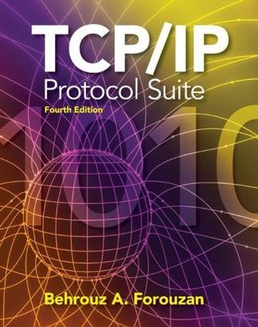

# 10本适合于系统管理员的最佳书籍

> 来源：http://blog.jobbole.com/17073/

> 英文原文：[iSystemAdmin]

> 编译：伯乐在线 — 陈舸

[iSystemAdmin]:(http://isystemadmin.com/)

> 本文翻译自 [iSystemAdmin] 的 [10 best system administration book].

[10 best system administration book]:(http://isystemadmin.com/10-best-system-administration-book)

---

## 1. RedHat Linux Bible

RedHat Linux无论在商业应用领域还是个人免费使用中都是最流行的且使用最为广泛的Linux发行版。Christopher Negus的《[RedHat Bible] | [Linux Bible 2011 版]》系列图书在学习RedHat Linux这个主题上阐述的相当详细，再没有哪本书能做的更好了。这本书涵盖了从初学者到专家级用户所需要的一切，从Linux的一般性知识到专属于RedHat Linux的特定方面，从日常使用的用户级命令到复杂的系统管理工具全都涵盖到了。对于那些希望在手头备一本参考书学习，也能在紧急情况下快速找到解决方案的管理员们来说，这本书堪称“圣经”。

[RedHat Bible]:(http://www.amazon.com/gp/product/0764539388/ref=as_li_qf_sp_asin_il_tl?ie=UTF8&tag=job0ae-20&linkCode=as2&camp=1789&creative=9325&creativeASIN=0764539388)

[Linux Bible 2011 版]:(http://www.amazon.cn/gp/product/0470929987/ref=as_li_qf_sp_asin_il_tl?ie=UTF8&tag=vastwork-23&linkCode=as2&camp=536&creative=3200&creativeASIN=0470929987)

## 2. Advanced Bash-Scripting Guide

Shell脚本是每一个系统管理员都无法回避的，尤其是那些工作在Linux或UNIX上的系统管理员。如果想知道Shell脚本能做些什么，可以去读读Mendel Cooper的《[Advanced Bash-Scripting Guide]》。简单来说，读过这本书后你将学到如何在Shell脚本中施展魔法。但是如果你只是个初学者的话，Machtelt Garrels的《[Bash Guide for Beginners]》比较适合你。这两本书都是电子书，而且可以在TLDP（The Linux Documentation Project）站点上免费下载到。

[Advanced Bash-Scripting Guide]:(http://www.amazon.com/gp/product/143575218X/ref=as_li_qf_sp_asin_il_tl?ie=UTF8&tag=job0ae-20&linkCode=as2&camp=1789&creative=9325&creativeASIN=143575218X)

[Bash Guide for Beginners]:(http://www.amazon.com/gp/product/0974433942/ref=as_li_qf_sp_asin_il_tl?ie=UTF8&tag=job0ae-20&linkCode=as2&camp=1789&creative=9325&creativeASIN=0974433942)

## 3. Solaris 10 System Adminstration

如果我提到一本主要聚焦于认证考试的书的话，请别误会。我不能否认，这两本书的内容是学习Solaris 10系统的绝好机会。Solaris 10被称为是地球上功能最为强大的服务器端操作系统。Bill Calkins的《[Solaris 10 System Administration] |  [Solaris 10系统管理] 》[第一]和[第二]部分，尽管主要是面向Solaris 10认证考试的，但书中也会涵盖从初级到专家级Solaris 10和UNIX管理员所需要的知识。此外，如果你想的话还可以借此机会考过这个业界领先的认证考试呢。

[Solaris 10 System Administration]:(http://www.amazon.com/gp/product/013700009X/ref=as_li_qf_sp_asin_il_tl?ie=UTF8&tag=job0ae-20&linkCode=as2&camp=1789&creative=9325&creativeASIN=013700009X)

[Solaris 10系统管理]:(http://www.amazon.cn/gp/product/B0031Y7KD2/ref=as_li_qf_sp_asin_il_tl?ie=UTF8&tag=vastwork-23&linkCode=as2&camp=536&creative=3200&creativeASIN=B0031Y7KD2)

[第一]:(http://www.amazon.com/gp/product/B001J2DAZU/ref=as_li_qf_sp_asin_il_tl?ie=UTF8&tag=job0ae-20&linkCode=as2&camp=1789&creative=9325&creativeASIN=B001J2DAZU)

[第二]:(http://www.amazon.com/gp/product/0789738171/ref=as_li_qf_sp_asin_il_tl?ie=UTF8&tag=job0ae-20&linkCode=as2&camp=1789&creative=9325&creativeASIN=0789738171)

## 4. Perl CookBook

成为一名Perl专家始终是所有系统管理员的梦想。虽然Perl是一种编程语言，但主要由系统管理员用做脚本处理。Tom Christiansen和Nathan Torkington的《[Perl Cookbook] | [Perl 参考手册(影印版)(第2版)] 》将通过例子向您展示如何控制你的系统并通过Perl完成自动化处理。这本书是O’reilly出版的最棒的图书之一。

[Perl Cookbook]:(http://www.amazon.com/gp/product/0596003137/ref=as_li_qf_sp_asin_il_tl?ie=UTF8&tag=job0ae-20&linkCode=as2&camp=1789&creative=9325&creativeASIN=0596003137)

[Perl 参考手册(影印版)(第2版)]:(http://www.amazon.cn/gp/product/B004TJLW3M/ref=as_li_qf_sp_asin_il_tl?ie=UTF8&tag=vastwork-23&linkCode=as2&camp=536&creative=3200&creativeASIN=B004TJLW3M)

## 5. Mastering Windows Server 2008 R2

由Wiley出版社出版的《[Mastering Windows Server 2008 R2]》在Windows系统管理员中非常流行。通过学习这本书你真的可以成为一名“大师”。只是对于1400页的厚度你不要犯晕就好。基本上本书涵盖了Windows Server 2008 R2管理方面的所有细枝末节。本书作者是Mark Minasi。

[Mastering Windows Server 2008 R2]:(http://www.amazon.com/gp/product/B003GY0K84/ref=as_li_qf_sp_asin_il_tl?ie=UTF8&tag=job0ae-20&linkCode=as2&camp=1789&creative=9325&creativeASIN=B003GY0K84)

## 6. [MySQL High Availability] |  [高可用性MySQL(影印版)]

无论是Windows还是Linux系统管理员，你都需要同MySQL数据库打交道。由于缺乏对MySQL强大功能的了解，大部分管理员会担心其处 理业务的连贯性。本书由Charles Bell、Mats Kindahl以及Lars Thalmann写就，将向您展示MySQL如何确保你的业务顺利运行，就算是在灾难情况下也是如此。您将学习到MySQL的几个特点，能够在断电情况下 保护你的系统，无论系统是运行在实际硬件还是虚拟机上甚至是在云端。可以在这里获得[本书的拷贝]。

[MySQL High Availability]:(http://www.amazon.com/gp/product/0596807309/ref=as_li_qf_sp_asin_il_tl?ie=UTF8&tag=job0ae-20&linkCode=as2&camp=1789&creative=9325&creativeASIN=0596807309)

[高可用性MySQL(影印版)]:(http://www.amazon.com/gp/product/0596807309/ref=as_li_qf_sp_asin_il_tl?ie=UTF8&tag=job0ae-20&linkCode=as2&camp=1789&creative=9325&creativeASIN=0596807309)

[本书的拷贝]:(http://www.amazon.com/gp/product/0596807309/ref=as_li_qf_sp_asin_il_tl?ie=UTF8&tag=job0ae-20&linkCode=as2&camp=1789&creative=9325&creativeASIN=0596807309)

## 7. TCP/IP Protocol Suite

TCP/IP在诞生40多年后依然统治着网络世界，没有TCP/IP我们无法想象Internet是个什么样子。《[TCP/IP Protocol Suite] | [TCP/IP协议族(第4版)] 》适用于学生和专家，读者不需要事先了解有关TCP/IP的方方面面。本书利用数百幅插图来帮助读者理解技术要点，同时也有许多例子来帮助读者将技术和真实世界的应用联系起来。只要TCP/IP还存在于互联网中，这本书就是个非常好的参考资料。

[TCP/IP Protocol Suite]:(http://www.amazon.com/gp/product/0073376043/ref=as_li_qf_sp_asin_il_tl?ie=UTF8&tag=job0ae-20&linkCode=as2&camp=1789&creative=9325&creativeASIN=0073376043)

[TCP/IP协议族(第4版)]:(http://www.amazon.cn/gp/product/B004JZY9BI/ref=as_li_qf_sp_asin_il_tl?ie=UTF8&tag=vastwork-23&linkCode=as2&camp=536&creative=3200&creativeASIN=B004JZY9BI)

## 8. DNS and Bind

对DNS有着非常好且清晰的理解是成为一名合格的系统管理员的必要条件。《[DNS and BIND]》 是O’reilly出版的系统管理方面的图书中最受推崇的之一。本书将使你了解并解决一些Internet中非常基础的组件，比如域名到IP地址的映射是 如何决议的，email的工作原理等等。无论你是个在日常工作中需要涉及到DNS管理的系统管理员或者只是个希望了解更多Internet方面的知识，想 搞清楚其工作原理的普通用户，你都会发现这本书真的是非常值得一读。

[DNS and BIND]:(http://www.amazon.com/gp/product/0596100574/ref=as_li_qf_sp_asin_il_tl?ie=UTF8&tag=job0ae-20&linkCode=as2&camp=1789&creative=9325&creativeASIN=0596100574)

## 9. Sendmail

Sendmail是Linux和UNIX系统中使用最为广泛的开源电子邮件解决方案。Sendmail声称通过“sendmail”命令能完成任何 有关email的操作。但如何加密sendmail的配置项对于所有的系统管理员来说都是需要了解的，我个人对此有些发怵。如果你读过Oreilly出版 的《[Sendmail]》，你至少会深深赞同的一点就是：sendmail的配置语法都是有一定意义的，而且都有定义良好的目的。本书包含的内容适合从Sendmail的初学者到超级专家。因此，如果你没有对Sendmail感到厌烦的话，无论你属于哪个读者群体你都需要这本书。

[Sendmail]:(http://www.amazon.com/gp/product/0596510292/ref=as_li_qf_sp_asin_il_tl?ie=UTF8&tag=job0ae-20&linkCode=as2&camp=1789&creative=9325&creativeASIN=0596510292)

## 10. Windows Networking Essentials

网络是个复杂的主题，尤其是对于那些刚加入IT领域的新人来说。这本全彩色的书重点突出，详略得当，每个主题都是清晰明了且易于理解的。本书采用了 一种独特的方式将网络从复杂中剥离出来，还原为基础，以这种方式教授Windows网络的初学者。初学者获得了网络的坚实基础之后可以了解更高级的主题和 技术。本书每章的最后还带有一些自测题，读者可以在读过一章之后检验自己对该主题的理解。所有的Windows系统管理员都应该有[一本]。

[一本]:(http://www.amazon.com/gp/product/1118016858/ref=as_li_qf_sp_asin_il_tl?ie=UTF8&tag=job0ae-20&linkCode=as2&camp=1789&creative=9325&creativeASIN=1118016858)

## 关于作者

Sifat是一名资深系统管理员，他现在仍然喜欢在控制台上手敲各种命令。Sifat在IT和通信行业拥有14 年的系统操作和管理经验，在IT组织、IT流程管理、成本控制等方面拥有成功的经验。在有效降低软件和硬件整合和虚拟化的成本和运营费用上颇有心得。 Sifat获得了ITIL和VMware的专业资格认证。
