# 11本免费的编程电子书（英文）

> 来源：http://blog.jobbole.com/59424/

> 本文由 伯乐在线 - XiaoxiaoLi[^XiaoxiaoLi] 翻译。未经许可，禁止转载！

> 英文出处：vikas[^vikas]。欢迎加入翻译小组[^翻译小组]。

[^XiaoxiaoLi]:**XiaoxiaoLi**: http://blog.jobbole.com/author/heycinderella/

[^vikas]:**vikas**: http://designzum.com/2014/02/05/11-best-free-online-programming-books/

[^翻译小组]:**翻译小组**: http://www.jobbole.com/groups/6/?utm_source=jobboleblog-article

---

## 目录

1. Data Structure and Algorithm
1. ASP.Net MVC 1.0
1. PHP The Right Way
1. Learn Python – The Hard Way
1. Foundations Of Programming
1. Beginning- Perl
1. Programming Ruby
1. The Art of Unix Programming
1. Learn SQL – The Hard Way
1. JavaScript – The Right Way
1. Learning Java

---

学习，是获取新的或校正和加强已有的知识、行为和技能的简单的过程。它也有可能涉及合成不同信息的过程。学习是不能一蹴而就的，相反，根据你已有的 知识和学习方法，学习是需要时间和精力的。网页设计和开发的学习过程也是这样的，它需要你全身心的投入以及相应的学习技巧。网页设计和开发的学习完全取决 于你对任意一门编程语言的基础知识的了解。如果我们某门编程语言的基本功很强，那么达到完美的编程水平就非常容易了。

如果你真的想学习编程语言，那你需要强大的基础知识。为此你需要阅读一些和编程有关的书籍。现如今如果你想学新一些的东西，那么上网查最简单也最容易了。网上不同地方都有许多信息。甚至网上还有许多在线的编程书籍能够很快地帮助你学会编程语言。

作为一个网页开发者，很多编程语言我都是通过网上的编程书籍学会的。它们都是免费的而且几分钟就能下载完。在网上学编程语言还能帮助测试你的知识水平以及试验不同的编程技巧。为了锦上添花我们在这分享一组帮助你学习新技术的最好的网上免费编程书籍。

## 1. Data Structure and Algorithm

链接：http://dotnetslackers.com/Community/files/folders/30283/download.aspx

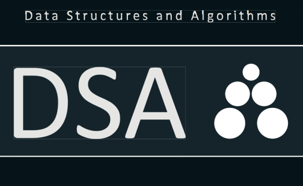

## 2. ASP.Net MVC 1.0

链接：https://docs.google.com/viewer?url=http://aspnetmvcbook.s3.amazonaws.com/aspnetmvc-nerdinner_v1.pdf

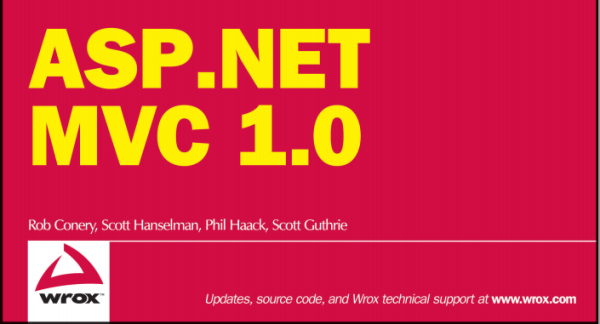

## 3. PHP The Right Way

链接：http://www.phptherightway.com/

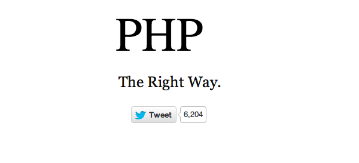

## 4. Learn Python – The Hard Way

链接：http://learnpythonthehardway.org/book/)

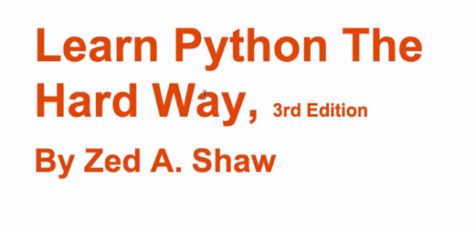

## 5. Foundations Of Programming

链接： https://docs.google.com/viewer?url=http://openmymind.net/FoundationsOfProgramming.pdf

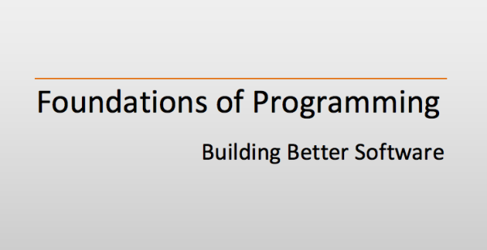

## 6. Beginning- Perl

链接： http://www.perl.org/books/beginning-perl/

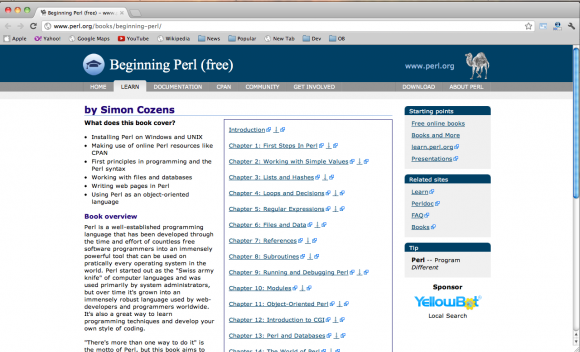

## 7. Programming Ruby

链接： http://ruby-doc.com/docs/ProgrammingRuby/

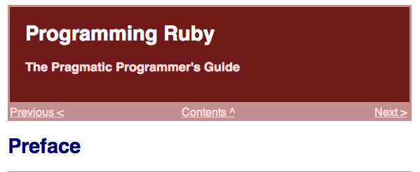

## 8. The Art of Unix Programming

链接： http://catb.org/esr/writings/taoup/html/

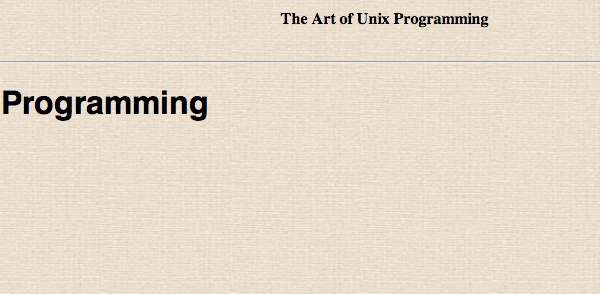

## 9. Learn SQL – The Hard Way

链接： http://sql.learncodethehardway.org/

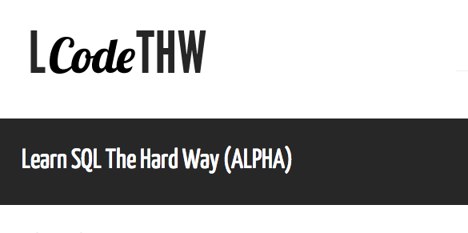

## 10. JavaScript – The Right Way

链接： https://github.com/braziljs/js-the-right-way

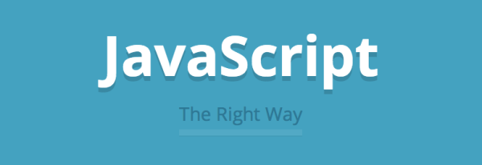

## 11. Learning Java

链接： http://chimera.labs.oreilly.com/books/1234000001805/index.html

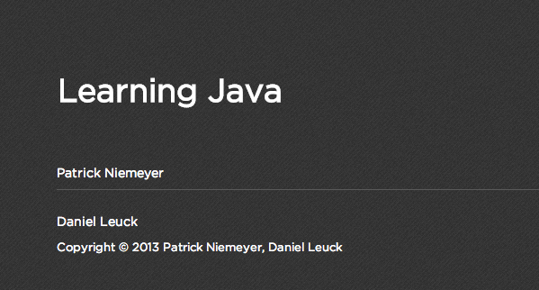
