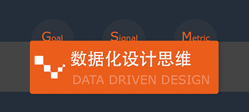
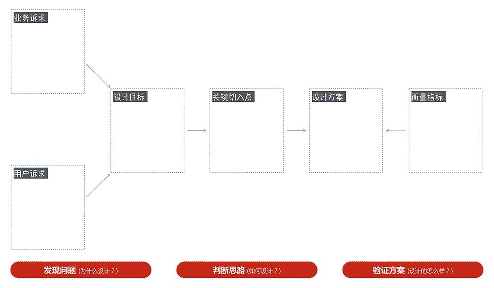
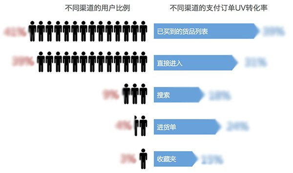
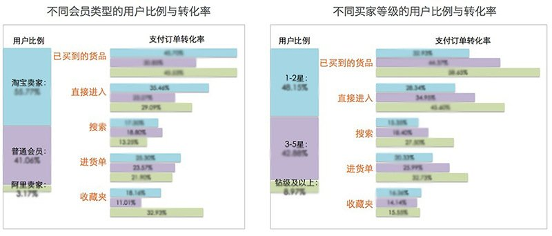
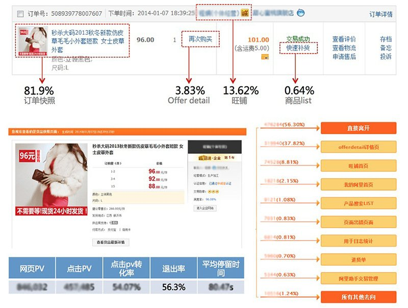
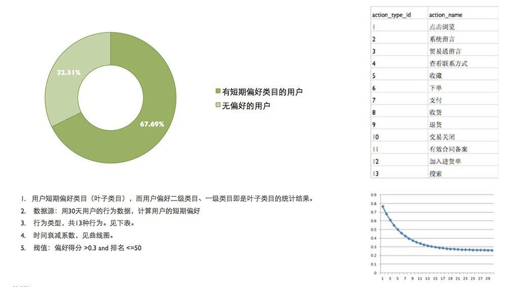
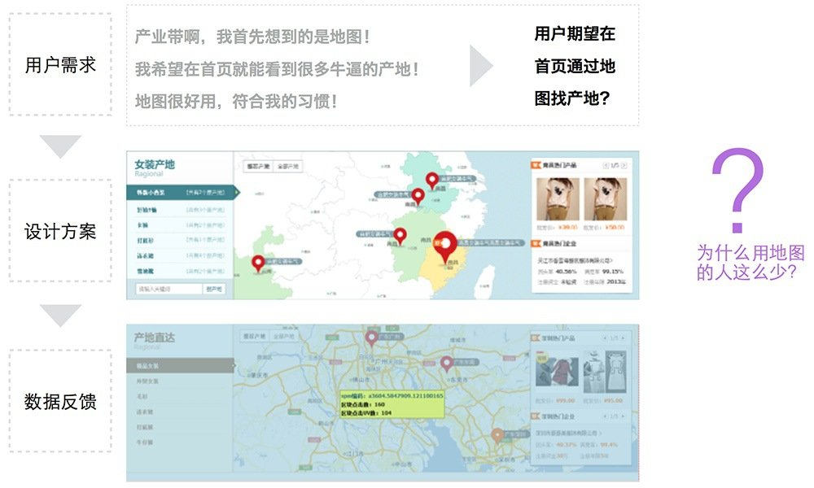
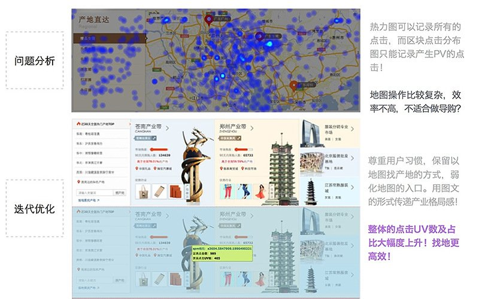
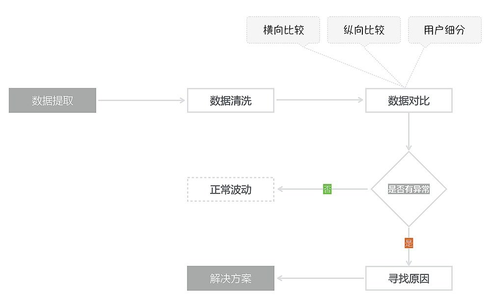
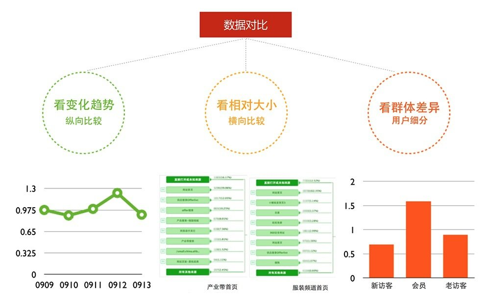

# 浅析数据化设计思维

> 作者：余代军

> 原文：[aliued]

[aliued]:(http://www.aliued.cn/2015/01/06/%E6%B5%85%E6%9E%90%E6%95%B0%E6%8D%AE%E5%8C%96%E8%AE%BE%E8%AE%A1%E6%80%9D%E7%BB%B4.html)

## 1、做设计为什么还需要看数据？

很多设计师从来不看数据，要么是因为没有数据可看，要么是根本不想看，但是也一样把设计做的很好啊！设计本来就是有感性的一面，为什么非得要和数据扯上关系呢？我们不妨先看看设计的本质是什么。设计不同于纯粹的艺术，艺术源于艺术家对现实的观察和思考，以及对这种观察和思考的自我表达；设计天生就是为别人在做事情，纵然同样需要观察和思考，但是这种观察和思考不是为了表现设计师的自我，而是为了更好地服务于某个用户群，因而设计师了解用户就变得非常重要。尤其是要了解用户的目标、行为、态度等相关的情况，我们这里说的数据其实也就是对用户的目标、行为、态度等情况的量化，因此，通过对这些数据的分析，我们可以更好地挖掘用户的需求，进而为用户提供更好地体验。

简单点说，设计是服务于用户的，了解用户才能更好地做设计，数据是了解用户的一种途径。

## 2、数据在项目中的作用有哪些？

要了解这个作用，我们先回到设计师看数据的主要场景，总结起来无外乎两类：一个是因为项目的需求，通过数据的论证，让设计走得更从容，有理有据，而不是设计师自己的YY；另外一个是日常监测的需求，自己做的产品，总要知道大概有多少人在用，使用的情况如何，用户的行为和预期是否一致。也就是说要了解你的设计被使用的情况，否则你怎么知道设计的好不好，是不是达到了设计目标，是不是真的帮助用户解决了问题。

先来分析下项目中看数据的场景。几乎整个设计的过程都可能会用到数据，概括起来可以把这个过程切分成三部分：

设计前数据帮你发现问题：所有设计开始之前的研究和分析，都是为了更明确用户的需求，明确为什么要做这个设计？从业务的角度来看，这个产品对公司有何价值，此次设计要达到什么目的；从用户的角度来看，这个产品对用户有何价值，此次设计要为用户解决什么问题；在了解业务诉求和用户诉求的过程中，我们难免要用到数据，这个阶段，数据的作用就是为了“发现问题”，看看设计可以解决什么问题，从而更佳明确设计的目标。

当然具体的工作中，多数设计师都比较纠结，既要考虑业务诉求，又要考虑用户诉求，如果这两者不能完全匹配的时候，我们该咋办，是两者的相加吗？还是我们就只考虑用户诉求，对业务诉求看看就行了。我个人的理解是，现实工作中我们都不是在追求最完美的设计，更多的是在做平衡，如果是一个用户型的产品，比如偏向于为用户提供某个功能的平台，本身就是完全从用户的角度出发，通过为用户提供功能帮助用户解决问题的，应该向用户诉求靠拢多一些；如果是一个商业型的产品，比如偏向于为用户提供某些内容的平台，那么在为用户提供主动查找的入口的同时，可以适度的向着业务发展需求倾斜，做适度的业务层面的引导；当然这个也不是绝对的，往往同一个平台，同一个产品，在不同的发展阶段也有不同的需求，如果是一个全新的产品，业务的生存就变得格外重要，这个时候设计应该多一些考虑业务诉求，先帮助业务生存，否则，这个产品都要挂了，还怎么为用户提供服务呢？

当然，好的设计师总是能在业务和用户之间找到巧妙的平衡，找到二者的交集，举个例子，假如这个产品这个阶段就是要做用户规模，而用户诉求是享受个性化的服务，看似完全不关的两个诉求，实际上我们完全可以通过更好的个性化服务提升用户满意度，获得好的用户口碑，再间接地借助用户口碑提升产品的用户规模，这二者之间并不是完全的不相干，更多的时候看能否找到他们的关联性，抓住阶段性的设计目标。

通过一个具体的例子看看如何利用数据来发现问题？数据代表的是用户的目标、行为和态度，但是单独看一个数字是没办法发现问题的，数据的对比是最简单有效地手段。我们知道交易关系买家所产生的交易对1688网站有着非常重要的意义，我们想提升交易关系型买家的交易体验，但是不知道从何入手，因此做了大量的数据分析。交易关系买家是通过什么方式找到老卖家?不同路径的转化率如何?不同用户查找方式与转化率有什么差异?

首先，通过用户群的细分，我们发现，交易关系买家通过搜索支付订单转化率是搜索整体支付订单转化率的2倍。因此,在搜索结果中增加老买 家标签,方便找到老卖家。

此外，我们还发现，普通会员、1-2星会员等级,是提升交易关系交易的关键用户。

然后，通过对用户路径以及页面的点击转化数据来看，我们发现，订单快照页面的退出率高达56.3%，相对于同类型的页面来说，退出率较高，因此这个页面有着较大的提升空间！

通过以上的数据分析，我们找到了目前主要的一些问题，围绕着这些问题，后续做了优化方案。

设计中数据帮你判断思路：因为设计师的个人经验不同，创造性思维不同，因此不同的设计师面对同一个问题，解决方案也很可能差别较大，即便是同一个设计师也会想到不同的解决方案，到底哪个方案更合适，有些情况下数据可以给你参考意见，为你提供“判断思路”，协助你做决策；条条大路通罗马，但是哪一条路才是当前最合适的呢？

通过一个具体的例子看看如何利用数据来判断思路？有一个批发类的电商网站（1688.com）的频道首页（ye.1688.com），我们发现用户的转化率很低，就去研究了数据，然后结合了对典型用户做的用户访谈的结论，最后发现转化率底的原因其实很简单，这个频道的首页入口主要是来源于整个网站的首页，而整个网站的首页是一个全行业品类的页面，用户如果是女装行业的买家，她从一个全品类的首页点击一个链接进入另一个全品类的页面，再艰难的找到女装这个类目，再点击进入List页面查看商品，这个路径是非常深的，那么怎么解决这个问题呢？那就是要避免做女装的用户从网站首页进入这个频道之后还要再次选择女装类目，才能看到女装的商品！

解决这个问题的思路有哪些？可以在网站首页增加入口，让用户直接点击女装类目进入频道首页，给用户展示女装商品；可以在用户进入频道首页之后，根据行业偏好的个性化数据来推荐商品，推荐的不准确，用户也可以去定制；到底哪个更靠谱？两个思路各有利弊，鉴于前一个思路需要有外部依赖，要改动网站首页，所以我们内心都很期望后一个思路能跑通，但是怎么知道这个思路行不行？首先我们需要知道行业的个性化推荐能覆盖多大的人群，又有多少的人愿意去定制行业偏好？

对于普通的网站来说这个可能是一个不够明确的问题，但是1688.com是一个会员用户早就过亿的B类电商网站，有着如此庞大的用户规模，较高的用户覆盖率，这就意味着对用户行为数据的积累，再者B类的用户有一个显著地特征就是在一个较长的时间里，行业的偏好相对比较稳定，如果是一个主营女装的买家，那么她的偏好一般会以女装为主，不会超出服装的范围，最多会有少量的服装周边配套的采购。

如上图，通过行业偏好的个性化算法，我们追踪了一段时间来访这个频道首页（ye.1688.com）的用户数据，我们发现大约2/3的用户是有着非常明确的行业偏好的，那么这基本可以断定做行业偏好的个性化推荐是靠谱的！但是剩下的1/3用户愿意去定制行业偏好吗？我们当时因为时间原因，无法直接从这1/3无明确偏好的用户中去判断他们是否愿意定制偏好，但是通过整个用户群的问卷抽样调查发现，大约3成的用户表示定制行业偏好是很好的服务，基于这些情况，我们判定基于行业偏好的个性化推荐能够解决绝大部分用户的行业偏好问题，提升了内容的相关性。这个方案最终上线后，实际上有大约10%的人真正找到定制入口并且产生了定制行为，70%的人不用定制，实现了默认的精准推荐。

设计后数据帮你验证方案：我们的设计方案到底做的好不好呢？衡量标准就是看设计方案是否能够达成设计目标？这也需要数据来量化，通常会用GSM的模型来支撑设计的验证。G（Goal）设计目标、S（Signal）现象信号、M（Metric）衡量指标，所谓的设计目标，就是要确定设计要达成什么结果，要解决什么问题；衡量指标，我们不能凭空猜想，必须建立在设计目标的基础上，先假设设计目标会实现，那么会出现什么现象或信号呢？列举出所有的现象或信号，选择我们可以监控的到的，然后对这个现象或信号产品进行量化，自然就得到了衡量指标，但是指标的波动幅度往往要依赖经验来定。

比如说，某个产品的设计目标是通过设计的引导，让更多的买家产生购买，想象一下，如果设计目标实现了，会有什么现象呢？可能会有更多的人有购买意愿，看了商品详情页，点击了购买按钮等等，最终也产生了购买，那么，衡量指标是哪个？设计只是改变了商品信息的呈现方式，并不能改变商品本身的质量或背后的服务，所以我们应该重点考察设计是否强化了引导，提升了购买意愿，是否激发了用户进一步了解的行为，主要是指浏览行为，最典型的就是到达了商品列表页或者商品详情页等，量化的结果就是看又进一步行为的用户的比例；

通过一个具体的例子看看如何利用数据来验证你的设计方案是否达成设计目标。曾经有一个找产地的功能模块，我们在设计前进行了调研，用户告诉我们他们需要找产地，而且比较习惯于用地图来找产地，我们欣喜若狂，照着这个方向做了个产地直达的楼层，我们坚信用户告诉我们的肯定是对的！但是这样的设计真的能达到帮助用户高效找产地的需求吗？来看下面的数据分析。

用户的目标不是要找产地吗？还告诉我们用地图找产地很符合他们的习惯呢？为什么上线后，用户却不怎么使用这个版块？？？我看到这个数据非常的意外，一时之间根本摸不着头脑，后来再去看了看这个板块的热力图，一下子恍然大悟。通过数据分析得出，地图纵然符合用户习惯，但是才这么狭小的地图上进行如此复杂的操作，其效率是非常底下的，因此将地图找产地的功能保留下来，只是不作为默认的方式，采用了按照热门的、区域的、附近的、可搜索的、地图的方式综合承载，最后取得了较好的效果！

## 3、如何利用数据做日常监控？

作为一个设计师，你的作品上线后，有多少人用？这些用户是谁？有什么特征？用户具体是怎么在使用你的产品的？你的设计是否还有优化的空间？如何才能为用户打造更好的使用体验？怎么才能知道这些数据好不好，有没有问题呢？主要是靠比较、靠经验，靠对这个产品长期跟进产生的直觉，只有在对这个产品非常熟悉的前提下，你才有可能对数据的变化给予比较靠谱的解读。

日常监控中用于发现问题的主要手段就是做数据的对比，但是如何具体的作对比呢？主要有三种最常用的最简单的对比方式：a、横向比较，和类似的产品去比较，看相对的状况，进而推测出自身是否存在问题；b、纵向比较，和自己的过去比较，看看从历史的发展规律中是否能得到某些启发，主要是看自身的变化趋势；c、用户细分，这个就是把用户按照不同的分析需要，拆分来之后来看数据，看看各个群体之间的差异在哪里，有没有一部分用户和其他用户表现出不同的行为，进而找到问题所在。当然除了这三种常用的对比之外，我们还可以做一些配套的定性研究，进而把问题搞得更透彻。一些统计学的工具有时候也能起到作用，比如说用SPSS做数据的因子分析、聚类分析等等，也可以有一些意想不到的收获。

## 4、数据不是核心价值，你才是！

说了这么多，我并不是要强调数据有多么的万能，但是在互联网领域，任何一个具有一定用户量的的产品，你都不得不去了解数据，这些数据中有一些是宏观的，作为设计师我们可以当做是背景知识，应该去了解了解，但是设计师更多的是应该关注用户的目标、行为和态度等相关的数据，关注那些微观的、和用户、和设计方案息息相关的数据，这样才能更好的了解我们的用户，了解用户对我们的设计方案的反馈，以帮助我们更好的发挥自身的价值！
