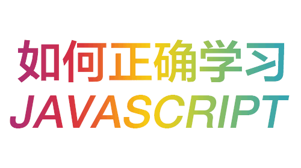

# 如何正确学习JavaScript

> 原文：[How to Learn JavaScript Properly]（2014-2-7）

[How to Learn JavaScript Properly]:(http://javascriptissexy.com/how-to-learn-JavaScript-properly/)

> 翻译：[Jaward华仔]

[Jaward华仔]:(http://www.crimx.com/2014/05/15/how-to-learn-javascript-properly/)



既然你找到这篇文章来，说明你是真心想学好JavaScript的。你没有想错，当今如果要开发现代网站或web应用（包括互联网创业），都要学会JavaScript。而面对泛滥的JavaScript在线学习资源，却是很难找到一份高效而实用的方法去学习这个“web时代的语言”。

有一点需要注意，几年前我们需要知道一个真正的服务器端语言（比如PHP，Rails，Java，Python 或者 Perl）去开发可扩展，动态的，数据库驱动的web应用，而现在只用JavaScript就可以实现了。

* 学习时长：6～8周
* 学习前提：中学水平，无需编程经验

## 更新（2014-1-7）

在Reddit上创建了一个学习小组

[January 2014， “Learn JavaScript” Study Group on Reddit]

[January 2014， “Learn JavaScript” Study Group on Reddit]:(http://www.reddit.com/r/learn_js_in_seattle/comments/1tziaa/new_study_group_starting_january_2014/)

## 不要这样学习JavaScript

不要一开始就埋头在成堆的JavaScript在线教程里 ，这是最糟糕的学习方法。或许在看过无数个教程后会有点成效，但这样不分层次结构地学习一个东西实在是十分低效，在实际用JavaScript建立网站或web应用时你还是会频繁的卡住。总的来说，这种学习方法会让人不知道如何将语言当做工具来使用——当做个人工具来用。

另外，也许有人会建议从尊敬的JavaScript教父Douglas Crockford写的《JavaScript语言精粹》开始学习JavaScript。然而，虽然Crockford先生对JavaScript无所不知，被誉为JavaScript世界的爱因斯坦，但他的《JavaScript语言精粹》并不适合初学者学习。这本书没有通透、清晰、明了的阐述JavaScript的核心概念。但对于更高级的学习路线，我倒会建议你看看Crockford先生的视频。

还有，不要只从Codecademy等网站学习JavaScript，因为即使知道怎么编写一大堆JavaScript代码小片段，还是不能学会怎么建立一个web应用程序。即便如此，在后面我还是会建议把Codecademy当做补充的学习资源。

## 本课程资源

更新：Reddit用户`d0gsbody`4月8号在Reddit上建立了一个学习小组。他和其他组员都非常积极和乐于助人。我建议你加入这个小组，他们会让你保持积极性且帮助你更好的学习JavaScript。毕竟独自折腾JavaScript还是有点难度的。链接：[Learning JS Properly – Study Group on Reddit]

[Learning JS Properly – Study Group on Reddit]:(http://www.reddit.com/r/learnjavascript/comments/1ceefw/learn_javascript_properly_omnibus_post/)

请在以下两本书中选一本，第一本比较适合有编程经验的人，而另一本则适合完全没有编程经验的初学者。我个人推荐第一本书，因为作者对各个知识点都阐述得非常好且涵盖了一些高级JavaScript知识点。但是，要看懂这本书你至少要对web开发有一定的基本了解。所以，如果你有一点点编程经验或者web开发经验（不一定是JavaScript），那就买这本书吧。

* 纸质版（英文） ：[Professional JavaScript for Web Developers]

[Professional JavaScript for Web Developers]:(http://www.amazon.cn/gp/product/1118026691/ref=as_li_qf_sp_asin_il_tl?ie=UTF8&camp=536&creative=3200&creativeASIN=1118026691&linkCode=as2&tag=book037-23)

* 纸质版（中文） ：[JavaScript高级程序设计(第3版)]

[JavaScript高级程序设计(第3版)]:(http://www.amazon.cn/gp/product/B007OQQVMY/ref=as_li_qf_sp_asin_tl?ie=UTF8&camp=536&creative=3200&creativeASIN=B007OQQVMY&linkCode=as2&tag=book037-23)

* Kindle版（英文）：[Professional JavaScript for Web Developers]
* Kindle版（中文）：[JavaScript高级程序设计(第3版)]

如果你没有编程经验，可以买这本：

* 纸质版（英文） ：[JavaScript: The Definitive Guide]

[JavaScript: The Definitive Guide]:(http://www.amazon.com/gp/product/0596805527/)

* 纸质版（中文） ：[JavaScript权威指南(第6版)]

[JavaScript权威指南(第6版)]:(http://www.amazon.cn/gp/product/B007VISQ1Y/ref=as_li_qf_sp_asin_il_tl?ie=UTF8&camp=536&creative=3200&creativeASIN=B007VISQ1Y&linkCode=as2&tag=book037-23)

* Kindle版（英文）：[JavaScript: The Definitive Guide]
* Kindle版（中文）：[JavaScript权威指南（原书第6版）]

免费注册[Stack Overflow]，这是一个编程领域的问答论坛。在这里提问题得到的回答比Codecademy要好，哪怕你的问题非常基础，看起来很傻（记住，从来没有愚蠢的问题）。

[Stack Overflow]:(http://stackoverflow.com/)

免费注册[Codecademy]，这是一个在线学习平台，你可以直接在浏览器里面写代码。

[Codecademy]:(http://www.codecademy.com/)

[JavaScriptIsSexy]上的一些博文，包括对象，闭包，变量的作用域和提升，函数等等。

[JavaScriptIsSexy]:(http://javascriptissexy.com/)

## JavaSctipt学习路线

完成整个课程大纲需要花上6~8周的时间，将学会完整的JavaScript语言（包括jQuery和一些HTML5）。如果你没有时间在6个星期里完成所有的课程（确实比较有挑战性），尽量不要超过8个星期。花的时间越长，掌握和记忆各种知识点的难度就越大。

## 1～2周(简介，数据类型，表达式和操作符)

* 如果你还不是很了解HTML和CSS，完成Codecademy上的[web基础]任务。

[web基础]:(http://www.codecademy.com/tracks/web)

* 阅读《JavaScript权威指南》或者《JavaScript高级程序设计》的前言和第1~2章。

* **十分重要**：在书中遇到的每个样例代码都要动手敲出来并且在火狐或Chrome浏览器控制台中跑起来、尽量蹂躏它（做各种试验）。也可以用[jsfiddle]，但不要用Safari浏览器。我建议用火狐搭配[Firebug插件]去测试和调试代码。浏览器控制台就是可以让你编写和运行JavaScript代码的地方。

[jsfiddle]:(http://jsfiddle.net/)

[Firebug插件]:(https://addons.mozilla.org/en-us/firefox/addon/firebug/)

* 完成Codecademy [JavaScript Track上]的`Introduction to JavaScript`部分。

[JavaScript Track上]:(http://www.codecademy.com/tracks/javascript)

* 阅读《JavaScript权威指南》第3~4章。或者阅读《JavaScript高级程序设计》第3~4章。你可以跳过`位操作`部分，在你的JavaScript生涯中一般不会用上这个。

再次说明，记得要不时停下来把书本的代码敲到浏览器控制台里（或者[JSFiddle]）做各种测试，可以改变几个变量或者把代码结构修改一番。

* 阅读《JavaScript权威指南》第5章。至于《JavaScript高级程序设计》则暂时没有阅读任务，因为前面已经把相关知识覆盖了。

* 完成Codecademy [JavaScript Track]上的2~5部分。

## 3~4周(对象，数组，函数，DOM，jQuery)

以下三选一：

* 阅读我的博文[JavaScript 对象详解].

[JavaScript 对象详解]:(http://javascriptissexy.com/javascript-objects-in-detail/)

* 阅读《JavaScript权威指南》第6章。

* 阅读《JavaScript高级程序设计》第6章。注意：只需要看“理解对象”（Understanding Objects）部分。

两本书会涉及更多的一些细节，但只要看完我的博文，你可以完全放心地跳过这些细节。

阅读《JavaScript权威指南》第7~8章或者《JavaScript高级程序设计》第5和7章。

此时，你应该花大量时间在浏览器控制台上写代码，测试if-else语句，for循环，数组，函数，对象等等。更重要的是，你要锻炼和掌握独立写代码，不用借助Codecademy。在Codecademy上做题时，每个任务对你来说应该都很简单，不需要点帮助和提示。如果你还卡在Codecademy上，继续回到浏览器上练习，这是最好的学习方法。就像詹姆斯年轻时在邻居的篮球场上练球，比尔盖茨在地下室里学习编程。

持续地练习，这一点点的进步积累起来效果会非常惊人。你要看到这个策略的价值，相信它是可行的，全心投入进去。

> Codecademy会造成已掌握的错觉。

使用Codecademy最大的问题是，它的提示和代码小片段会让人很容易就把答案做出来，造成一种已经掌握这个知识点的错觉。你可能一时看不出来，但这样做你的代码就不是独立完成的了。

但目前为止，Codecademy依然是学习编程的好帮手。特别是从一些基本的代码结构如if语句，for循环，函数和变量去指导你了解小项目和小应用的开发过程。

回到Codecademy完成JavaScript路线。做完6~8部分（数据结构做到Object 2）。

实现Codecademy上[Projects]路线的5个基础小项目（Basic Projects）。做完之后，你已不再需要Codecademy了。这是一件好事，因为自己做的越多，学得就越快，就能更好准备开始独立编程。

[Projects]:(http://www.codecademy.com/tracks/projects)

阅读《JavaScript权威指南》第13，15，16和19章。或者阅读《JavaScript高级程序设计》第8，9，10，11，13和14章。这本书没有涉及到jQuery，而Codecademy上的jQuery知识也覆盖得不够。可以看看jQuery的官方教程，免费的：http://try.jquery.com/

你也可以在《JavaScript权威指南》第19章了解更多的jQuery知识。

完成全部的jQuery教程 http://try.jquery.com/ 。

## JavaScript终极编辑器：WebStorm

* 在你实现第一个项目之前，如果打算以后做JavaScript开发者或者经常用到JavaScript，最好现在就去下载[WebStorm]的试用版。这里可以学习怎么使用WebStorm（专门为这个课程写的）。毋庸置疑，WebStorm是JavaScript编程最好的编辑器（或IDE）。30天试用后要付$49.00，但作为JavaScript开发者，这应该是除了买书以外最明智的投资了。

[WebStorm]:(http://www.jetbrains.com/webstorm/)

* 确保在WebStorm中启用JSHint。JSHint是一个检查JavaScript代码错误和潜在问题的工具，强制你的团队按照规范写代码。用WebStorm最爽的地方是JSHint会自动在错误的代码下显示红线，就像文字处理程序中的拼写检查。JSHint会显示一切的代码错误（包括HTML），促使你养成良好的习惯，成为更好的JavaScript程序员。**这很重要**，当你真正意识到WebStrom和JSHint对你的巨大帮助时，你会回来感谢我的。

* 此外，WebStorm是一个世界级，专业人员使用的IDE，用来编写专业的JavaScript web应用，所以你以后会经常用到它。它还结合了Node.js，Git和其它JavaScript框架，所以即使你成为了明星级的JavaScript开发者，你还是会用到它的。除非以后出现了更多的JavaScript IDE。

公平起见，我在这里提一下[Sublime Text 2]，这是仅次于WebStorm的JavaScript编辑器。它的功能不及WebStorm丰富和完整（即使添加了一堆插件）。做小修改的时候我会用到Sublime Text 2，它支持很多语言，包括JavaScript，但我不会用它来构建完整的JavaScript Web应用。

[Sublime Text 2]:(http://www.sublimetext.com/2)

## 第一个项目-动态问答应用

此时，你已经掌握了足够的知识去建立一个稳固的，可维护的web应用。在做完我为你设计的这个应用之前不要看后面的章节。如果你卡住了，去Stack Overflow提问并且把书上相关的内容重新看一遍直到完全理解这些概念。

接下来开始建立一个JavaScript问答应用（还会用到HTML和CSS），功能如下：

* 这是一套单选测试题，完成之后会显示用户的成绩。
* 问答应用可以产生任意多的问题，每个问题可以有任意多的选项。
* 在最后的页面显示用户的成绩。这个页面只显示成绩，所以要把最后一个问题去掉。
* 用数组存所有的问题。每个问题包括它的选项和正确答案，都封装成一个对象。问题数组看起来应该是这样：

```javascript
// 这里只演示一个问题，你要把所有问题都添加进去
var allQuestions = [{
    question: "Who is Prime Minister of the United Kingdom?",
    choices: [
        "David Cameron",
        "Gordon Brown",
        "Winston Churchill",
        "Tony Blair"],
    correctAnswer: 0
    }
];
```

* 当用户点击“Next”时，使用document.getElementById或jQuery动态的添加下一个问题，并且移去当前问题。在这个版本里“Next”是唯一的导航按钮。
* 你可以在本文下方评论求助，最好是去Stack Overflow提问，在那里会有及时而准确的回答。

## 5～6周(正则表达式，Window对象，事件，jQuery)

阅读《JavaScript权威指南》第10，14，17，20章。

或者阅读《JavaScript高级程序设计》第20，23章。

记得要把样例代码敲到浏览器控制台上，尽可能蹂躏它，做各种测试，直到完全理解它是怎么工作，它能干些什么。

此时，你用起JavaScript来应该很顺手，有点像武林高手要出山了。但你还不能成为高手，你要把新学到的知识反复使用，不停的学习和提升。

升级之前做的问答应用

* 添加客户端数据验证：保证用户回答了当前问题才能进入下个问题。
* 添加“Back”按钮，允许用户返回修改答案。最多可以返回到第一个问题。注意对于用户回答过的问题，选择按钮要显示被选中。这样用户就无需重新回答已经答过的问题。
* 用jQuery添加动画（淡出当前问题，淡入下个问题）
* 在IE8和IE9下测试，修改bug，这里应该会有得你忙了。 ;D
* 把问题导出JSON文件
* 添加用户认证，允许用户登陆，把用户认证信息保存在`本地存储`（local storage，HTML5浏览器存储）。
* 使用cookies记住用户，当用户再次登陆时显示“欢迎`用户名`回来”。

## 7周，可延长到8周(类，继承，HTML5)

阅读《JavaScript权威指南》第9，18，21，22章。

或者阅读我的博文[JavaScript面向对象必知必会]

[JavaScript面向对象必知必会]:(http://javascriptissexy.com/oop-in-javascript-what-you-need-to-know/)

或者阅读《JavaScript高级程序设计》第6，16，22，24章，第6章只读“创建对象”（Object Creation）和“继承”（Inheritance）部分。注意：这部分是本课程中技术性强度最大的阅读，要根据自身的状况考虑要不要全部读完。你至少要知道原型模式（Prototype Pattern），工厂模式（Factory Pattern）和原型继承（Prototypal Inheritance），其它的不作要求。

继续升级你的问答应用：

* 页面布局使用[Twitter Bootstrap]，把问答的元素弄得看起来专业一些。而作为额外奖励，用Twitter Bootstrap的[标签控件]（译者注：原文地址失效，已改）显示问题，每个标签显示一个问题。

[Twitter Bootstrap]:(http://twitter.github.com/bootstrap/)

[标签控件]:(http://getbootstrap.com/2.3.2/components.html#navs)

* 学习Handlebars.js，将Handlebars.js模板用在问答应用上。你的JavaScript代码中不应该再出现HTML代码了。我们的问答应用现在越来越高级啦。

* 记录参加问答的用户成绩，展示用户在问答应用中与其他用户的排名比较。

在学完Backbone.js和Node.js后，你会用这两种最新的JavaScript框架重构问答应用的代码，使之变成复杂的单页面现代web应用。你还要把用户的认证信息和成绩保存在MongoDB数据库上。

接下来：构思一个项目，趁热打铁迅速的去开发。卡住的时候参考《JavaScript权威指南》或者《JavaScript高级程序设计》。当然，还要成为Stack Overflow的活跃用户，多问问题，也要尽量回答其它人的提问。

## 继续提升

* [精通backbone.js]

[精通backbone.js]:(http://javascriptissexy.com/learn-backbone-js-completely/)

* [中高级JavaScript进阶]

[中高级JavaScript进阶]:(http://javascriptissexy.com/learn-intermediate-and-advanced-javascript/)

* [不侧漏精通Node.js]

[不侧漏精通Node.js]:(http://www.crimx.com//2014/05/22/learn-node-js-completely-and-with-confidence/)

* Meteor.js入门（即将出炉）

* 三个最好的JavaScript前端框架（即将出炉）

## 一些鼓励的话

祝你学习顺利，永不放弃！当你做不下去觉得自己很蠢的时候（你会时不时这么想的），请记住，世界各地的其他初学者，甚至是有经验的程序员，也会不时产生这种想法的。

如果你是完全的初学者，特别是过了青少年时期的人，开始写代码的时候也许很困难。年轻人无所畏惧，也没有什么负担，他们可以花大量的时间在喜欢的东西上。所以各种挑战对他们来说也不过是短暂的障碍罢了。

但过了青少年期后你会希望快速的见到成效。因为你没有这么多的时间去花上几个小时就为了搞清楚一些细节的东西。但这些东西你必须深入去理解它，不要因此沮丧，坚持完成课程的任务，把bug都找出来，直到你完全理解。当你到达胜利的彼岸时，你会知道这一切都是值得的，你会发现编程非常有趣而且在上面花的时间都会得到可观的回报。

一个人必须去感受和领悟构建程序带来的强烈快感。当你一步步的掌握知识点，一点点的将程序搭建起来时，就会对自己产生激励与肯定，带来十分美妙的满足感。

总有一天你会意识到之前忍受的所有困难都是值得的。因为你将要成为一名光荣的程序员，你也清楚作为JavaScript开发者，你的前途一片光明。就像在你之前成千上万的程序员一样，你打败了最难的bug，你没有退步，你没有放手，你没有找任何借口让自己放弃。

当你学有所成的时候，放心的将你的成果分享给我们吧，哪怕是个微不足道的，小到显微镜都看不到的小项目。
