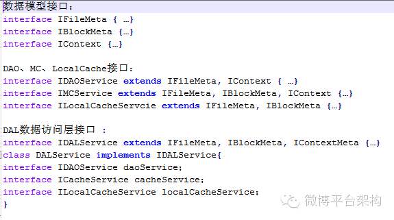

# 使用2-3法则设计分布式数据访问层

> 来源：http://www.infoq.com/cn/articles/2-3-priciple-dal

> 编者按】《博文共赏》是InfoQ中文站新推出的一个专栏，精选来自国内外技术社区和个人博客上的技术文章，让更多的读者朋友受益，本栏目转载的内容都经过原作者授权。文章推荐可以发送邮件到editors@cn.infoq.com。

## 引言

如今移动互联网行业呈爆发式发展，随着业务用户规模和业务逻辑趋向复杂，后端系统的开发和维护变得越来越困难，目前业界涌现出各种各样的技术文章介绍分布式缓存设计、分布式数据库设计、负载均衡、HA策略等等，这些都是支撑分布式数据访问层的基石，不过，本文将从另一个角度探讨分布式数据访问层 (Data Access Layer)的框架设计。

本文要介绍的是2-3法则（2个维度，3个原则）在分布式DAL框架设计中的指导作用，两者共同完成DAL层封装，主要分为两点：1）从水平与垂直维度正交分析业务系统设计；2）定义3条必须遵守的设计原则，最重要的是DAL层从水平维度抽象数据访问策略模型，即个3原则中的第3条。

本文最后一节，对分布式数据访问框架做了探讨，提出了两种实现思路。

## 分布式DAL解决的问题

在分布式系统中，每一台服务器都需要访问本地缓存、分布式MC缓存、分布式后台数据库，对于同一个业务模块，随着业务变复杂，需要定义越来越多的数据Model，按照一定的规则存储在本地缓存、分布式缓存以及后台数据库中。

目前，业界的数据访问层定位于应用程序与持久化数据库之间，比如淘宝的TDDL、IBatis Sharding等，主要完成数据的分库分表、读写分离等，本文的数据存储涵盖缓存、数据库、文件系统，现有的数据库DAL中间件、Redis客户端、MC客户端将作为本文的水平维度的Adaptor，主要解决的问题：

1. 数据访问在水平数据存储维度的一致性问题。
1. 快速增加数据Model的能力。
1. 优雅、清晰、模块化的数据访问层代码。

## 两个维度抽象设计

对于上节的问题，下面列举了水平和垂直维度抽象思考的例子。

假设水平维度：

1. 部分热数据存储在本地缓存，本文使用EhCache。
1. 部分热数据存储在前端缓存，本文使用MC。
1. 全量数据存储在数据库缓存，本文使用MySQL。

假设垂直维度：

1. 数据模型FileMeta，需要同时存储在LocalCache、Redis和MySQL中。
1. 数据模型BlockMeta，需要存储在LocalCache、MC中。
1. 数据模型Context，需要存储在MC、MySQL中。

按照上面的分析，我们画出系统两个维度正交设计图，如下：

## Composition 而不是Inheritance

我们可以想到垂直维度定义N = 3个数据模型接口，水平维度定义N = 3个分层接口，但是水平维度和垂直维度是什么关系呢？

在本文的设计中，对问题做了进一步思考，水平维度的接口全部由垂直维度的数据模型接口组合（Composition）而成，完成所有业务只需要定义N + M + 1个接口，而不是N * M + 1个接口，多余的那个是DAL接口，完成数据访问层封装工作，第一节例子中的接口定义见下图：

## 设计原则

上节主要介绍了接口设计，这里说一下实现，数据模型类非常简单，只要MC Client、TDDL、EhCache在不同层完成相应接口实现，最重要的是DAL实现类，需要完成水平各个维度的策略存储，比如对一个Model，顺序写入MC和MySQL，根据业务实践经验，总结出3条设计原则：

1. 每一个数据模型都有CRUD方法，即数据操作的增删改查，对于MC或者LocalCache来说，增加操作和修改操作可能是一致的，这种情况也必须严格定义CRUD方法。
1. DAL层封装所有的数据访问，保证数据的一致性存储和可靠性，DAL层的实现调用ILocalCacheService、IMCService、IDAOService，根据不同数据模型的存储策略，分别去调用缓存和数据库服务，数据模型如果仅存在MySQL或者MC，也需要在DAL层做封装，这样虽然对开发效率有一定影响，但是整体开发和维护成本降低很多。
1. DAL实现抽象出一个DALContext和一个Executor，对于不同的数据模型，配置出不同的DALContext，比如顺序存储在MC和MySQL或者同步写入MC异步写入MySQL，DAL也需要负责出错处理、水平维度的容灾切换等。

## 分布式数据访问框架

对于互联网后端应用来说，最主要的功能就是处理数据，对DAL层的探索与优化是非常有价值的，基于本文提出的2-3法则，感兴趣的读者可以构建一个DAL开源项目，有两种思路。

第一种思路是：

1. 定义数据模型以及存储配置策略规范，可以使用类似protobuf的规范。
1. 根据业务定义的数据模型和存储配置策略，生成业务代码。
1. 开发者在此基础上扩充完善业务代码。

第二种思路是：

1. 定义数据模型以及存储配置策略规范，可以使用类似protobuf的规范。
1. 开发DAL中间件（容器），根据业务定义的数据模型和存储配置策略，运行时完成所有的数据访问操作代理。

第一种相对容易，第二种比较复杂，读者可以自己选择其中一种。

本文首发于“微博平台架构”微信公众号，发布时有少量的文字润色和调整。

## 关于作者

卫向军（@卫向军_微博），毕业于北京邮电大学，现任微博平台架构师，先后在微软、金山云、新浪微博从事技术研发工作，专注于系统架构设计、音视频通讯系统、分布式文件系统和数据挖掘等领域。

感谢臧秀涛对本文的审校。
